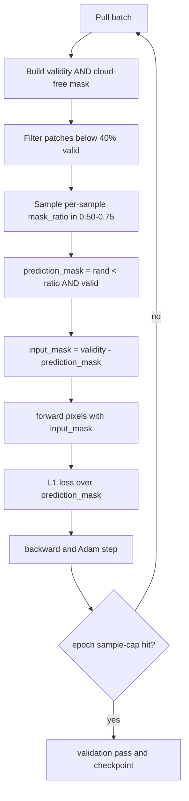
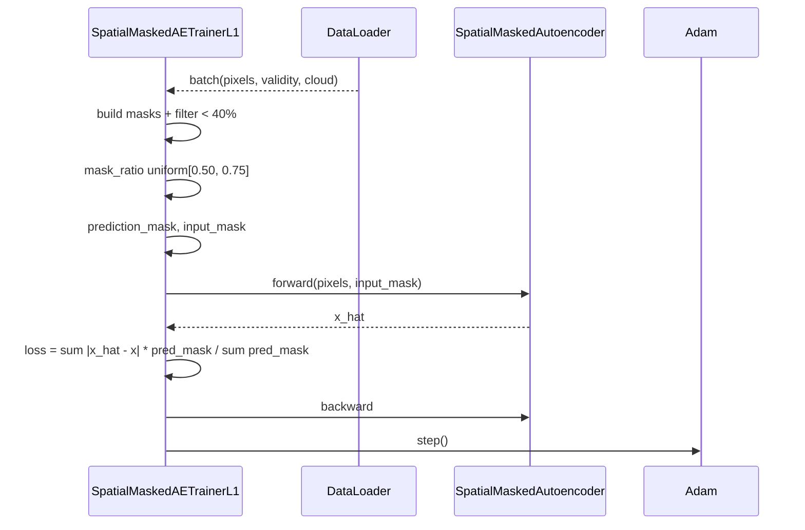

# 4.4 `SpatialMaskedAutoencoderTrainerL1Loss` — $L_1$ + larger mask

[`spatial_masked_autoencoder_trainer_l1_loss.py`](../../app/foundation_models/trainers/spatial_masked_autoencoder_trainer_l1_loss.py)

This trainer is the pivotal move from $L_2$ to $L_1$, the inflection point in the catalog. Everything afterward uses $L_1$ in some form.

## 4.4.1 What the code does

Two changes vs §4.3:

1. **Mask ratio is sampled uniformly in $[0.50, 0.75]$** ([`spatial_masked_autoencoder_trainer_l1_loss.py:105`](../../app/foundation_models/trainers/spatial_masked_autoencoder_trainer_l1_loss.py#L105)) — the model now reconstructs the majority of pixels from a quarter to a half of the patch.
2. **Loss uses absolute error** ([`spatial_masked_autoencoder_trainer_l1_loss.py:118`](../../app/foundation_models/trainers/spatial_masked_autoencoder_trainer_l1_loss.py#L118)):

$$\mathcal{L}_1 = \frac{\sum |\hat{x} - x| \cdot m^\text{pred}}{\sum m^\text{pred}}.$$

Everything else — `_build_mask`, `_filter_batch`, the per-batch loop — is shared with §4.3.

## 4.4.2 Theory in depth: $L_1$ vs $L_2$

The gradient story is the whole story.

- $L_2$ gradient: $\partial_{\hat{x}}(\hat{x}-x)^2 = 2(\hat{x}-x)$. Magnitude grows **linearly with residual**.
- $L_1$ gradient: $\partial_{\hat{x}}|\hat{x}-x| = \text{sign}(\hat{x}-x)$. Magnitude is **constant in residual size**.

Consequences for anomaly detection:

1. **Outlier robustness.** A 30 K outlier under $L_2$ produces 30× the gradient of a typical 1 K residual; the optimizer rebalances weights to fit it. Under $L_1$, the outlier contributes one unit of gradient just like every other residual — it does not pull the model toward learning it.
2. **Median vs mean estimator.** The minimizer of $\sum (y - c)^2$ over a constant $c$ is the mean of $y$. The minimizer of $\sum |y - c|$ is the median. Medians are robust to outliers; means are not. A pixel reconstructor trained with $L_1$ is implicitly a conditional median predictor of "what should this pixel be given its neighbours"; $L_2$ trains a conditional mean predictor. Conditional medians are what we want for anomaly detection because they ignore the few large-residual outliers we expect to find at inference.
3. **Heavy-tailed residual distribution.** Real HSI data has a heavy-tailed residual distribution (cloud edges, sensor glitches, real anomalies). $L_2$ over-weights the tail; $L_1$ does not.

### Why a larger mask?

$L_1$ on $[0.13, 0.25]$ masking is too easy. The model can satisfy the constant-magnitude $L_1$ gradient by learning an essentially-local interpolator. Pushing the mask ratio to $[0.50, 0.75]$ forces the model to extrapolate from a small visible neighbourhood. The conjunction "$L_1$ + heavy masking" is what produces a useful background model.

Per-MAE-paper intuition (He et al., 2022): high mask ratios remove the "shortcut" — a 25%-masked image is basically a denoising task and can be solved by local smoothing; a 75%-masked image is genuinely a reconstruction problem that demands holistic understanding.

## 4.4.3 Worked numerical example: $L_1$ vs $L_2$ on an outlier

Five training residuals $r = [0.2, -0.1, 0.3, 0.0, 8.0]$ (the last is an anomaly we don't want learned).

- $L_2$ gradient sum on $\hat{x}$: $2(0.2) + 2(-0.1) + 2(0.3) + 0 + 2(8.0) = 17.0$. The outlier contributes $16$ of the $17$ — it dominates.
- $L_1$ gradient sum: $1 + (-1) + 1 + 0 + 1 = 2$. The outlier contributes one unit out of two — its influence is bounded.

The ratio of outlier-gradient to total under $L_2$ is $94\%$; under $L_1$ it is $50\%$. After a few epochs the $L_2$ model has effectively learned to predict 8.0 at that pixel; the $L_1$ model has barely moved on it.

## 4.4.4 Worked numerical example: one $L_1$ Adam step

Take a held-out target pixel with $x = 305, \hat{x} = 303$. With $N_\text{pred} = 2$ in this micro-batch:

$$\frac{\partial \mathcal{L}_1}{\partial \hat{x}} = \frac{\text{sign}(\hat{x} - x)}{N_\text{pred}} = \frac{-1}{2} = -0.5.$$

Adam step direction is sign of gradient, so $\hat{x}$ moves by $+\eta = +10^{-3}$ — toward 305. The same calculation under $L_2$ would have produced a gradient of $2(-2)/2 = -2$, but the Adam step magnitude would still be $\eta$ (because Adam normalizes by the second moment). The difference between $L_1$ and $L_2$ is **not visible in a single step**; it is visible in the cumulative pull of the outlier across thousands of steps. $L_2$ keeps yanking; $L_1$ does not.

## 4.4.5 Loop topology

## 4.4.6 Interaction sequence

