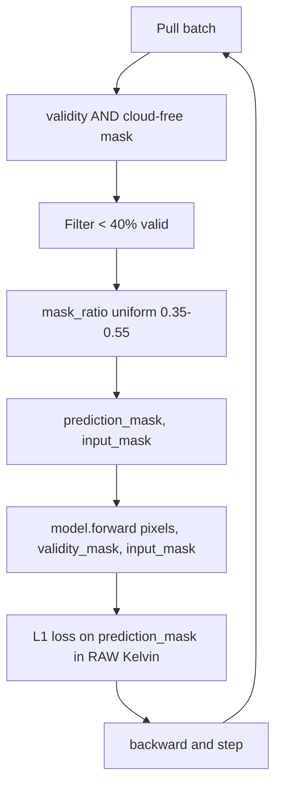
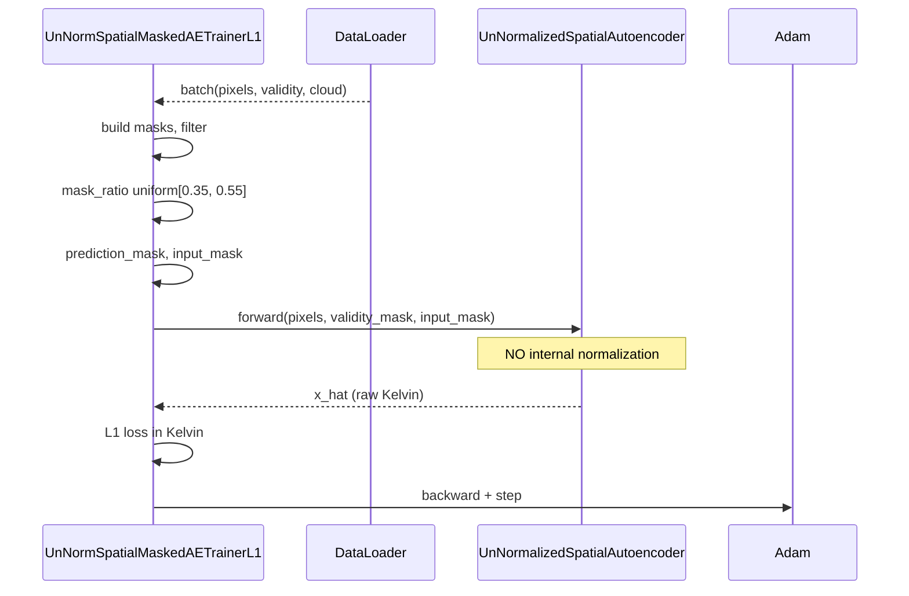

# 4.5 `UnNormalizedSpatialMaskedAutoencoderTrainerL1Loss` — raw temperature space

[`spatial_masked_autoencoder_trainer_l1_loss_unnormalized.py`](../../app/foundation_models/trainers/spatial_masked_autoencoder_trainer_l1_loss_unnormalized.py)

This trainer answers a specific question: what if we want the loss number itself to mean Kelvin? Every other model in the catalog bakes normalization into `forward()` so the loss is implicitly on $z$-scores or de-normalized values; this one keeps everything in raw units.

Per the project memory `project_model_normalization.md`, this is the **only** architecture among the seven that genuinely operates in raw units end to end.

## 4.5.1 What the code does

`build_model()` at [`spatial_masked_autoencoder_trainer_l1_loss_unnormalized.py:31`](../../app/foundation_models/trainers/spatial_masked_autoencoder_trainer_l1_loss_unnormalized.py#L31) instantiates `UnNormalizedSpatialAutoencoder`. No `pixel_mean`/`pixel_std` is loaded, even if the stats file exists. The model carries no normalization layer.

`compute_loss()` at [`spatial_masked_autoencoder_trainer_l1_loss_unnormalized.py:69`](../../app/foundation_models/trainers/spatial_masked_autoencoder_trainer_l1_loss_unnormalized.py#L69) uses mask ratios in $[0.35, 0.55]$ by default and passes **two explicit mask channels** to the model:

```python
x_hat, _ = model(pixels, validity_mask=mask, input_mask=input_mask)
```

The model uses `validity_mask` to gate convolutions (zero invalid pixels) and `input_mask` to also gate prediction targets. Loss is $L_1$ on the prediction mask:

$$\mathcal{L} = \frac{\sum |\hat{T} - T| \cdot m^\text{pred}}{\sum m^\text{pred}}.$$

## 4.5.2 Theory in plain language: where normalization enters the gradient

When stats are baked into `forward()`, the network internally computes $z = (x - \mu)/\sigma$, runs encoder/decoder in $z$-space, emits $\hat{z}$, and de-normalizes via $\hat{x} = \hat{z}\sigma + \mu$. The loss is on $\hat{x}$, but the model's *parameters* see gradients backpropagated through the de-norm.

The de-norm is a scalar multiply by $\sigma$. So $\partial \mathcal{L}/\partial \hat{z} = \partial \mathcal{L}/\partial \hat{x} \cdot \sigma$. With $\sigma \approx 10$ K for thermal data, the gradient on the network's internal output is **10× larger** than the gradient on the physical-space output. This is not bad per se — Adam normalizes the magnitude anyway — but it means the loss number you see (in $z$-units or in K) does not have a clean correspondence with the gradient the network's internals actually experience.

The unnormalized variant skips all of this. Gradients are computed on temperature residuals directly:

$$\partial \mathcal{L}/\partial \hat{x} = \text{sign}(\hat{x} - x) / N_\text{pred}.$$

No $\sigma$ amplification. The loss number means physical degrees.

### Why the explicit input + validity mask channels?

Without normalization the model has no learned $(\mu, \sigma)$ to fall back on for "what should an invalid pixel look like". So `UnNormalizedSpatialAutoencoder` receives both masks as input channels and uses them to (a) zero out invalid input pixels and (b) tell the network which pixels it is supposed to predict vs. observe. This is more information than the normalized variants give the model.

## 4.5.3 Practical consequence: interpretable loss

Reading `val_loss: 1.8` in the trainer log:

- For **this** trainer, that means "average 1.8 K reconstruction error on held-out pixels". You can compare this to sensor noise floor (~0.5 K for Landsat 9 TIRS) and decide whether the model is close to noise-limited.
- For a normalized trainer, `val_loss: 0.4` is unitless and you must multiply by some $\sigma$ to interpret. Worse, the $\sigma$ depends on which population stats were baked in, so two checkpoints from different training runs cannot have their losses directly compared.

This auditability is the main reason the unnormalized variant exists.

## 4.5.4 Worked example: where normalization enters the loss

Suppose pixel-stats $\mu = 290, \sigma = 10$. A pixel $x = 305$, prediction $\hat{x} = 303$.

- **Normalized variant**: model emits $\hat{z} \approx 1.3$ in normalized space; wrapper de-normalizes to $303$; loss is $|303-305|=2$ K. Gradient on $\hat{z}$: $\partial \mathcal{L}/\partial \hat{z} = \text{sign}(\hat{x}-x) \cdot \sigma / N_\text{pred} = -10$ (for $N_\text{pred}=1$).
- **Unnormalized variant**: $\hat{x}$ is the raw output; loss is $|\hat{x}-x|=2$ K; gradient on $\hat{x}$ is $\text{sign}(\hat{x}-x) = -1$. No $\sigma$ amplification.

Both train. The unnormalized form is preferred when you want the loss to mean physical degrees and the training dynamics to not implicitly depend on the dataset-wide $\sigma$.

## 4.5.5 Worked example: cross-distribution finetune

Say the model is trained on Landsat 9 thermal data with population $(\mu, \sigma) = (290, 10)$ K. Now you want to finetune on HotSat which has a different distribution and arrives in DN, not K.

- **Normalized variant**: the baked-in $(290, 10)$ is wrong for HotSat. You must use the `pixel_stats_override` hook at inference (see §4.9) or rebuild the model. Finetuning will still work but the first few epochs have a heavily mis-calibrated starting point.
- **Unnormalized variant**: nothing to override. The model operates directly on raw inputs. Finetuning starts cleanly from "the same backbone but different input distribution"; the network adapts its first conv weights to absorb the distribution shift.

This is why the unnormalized variant is the architecture cited as the right answer to the AVIRIS-NG / HotSat onboarding problem in `project_aviris_hotsat_onboarding.md`.

## 4.5.6 Loop topology



## 4.5.7 Interaction sequence


