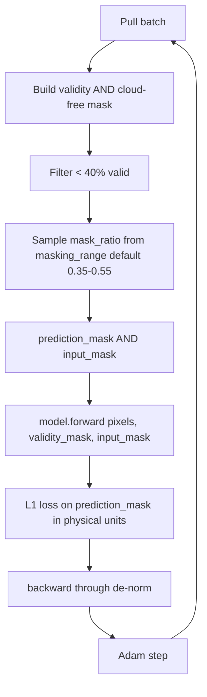
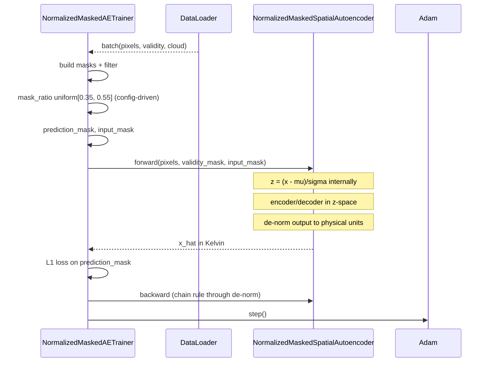

# 4.6 `NormalizedMaskedAutoencoderTrainer` — explicit mask channels, normalized

[`normalized_masked_autoencoder_trainer.py`](../../app/foundation_models/trainers/normalized_masked_autoencoder_trainer.py)

This is the "production middle ground" trainer: same $L_1$-on-prediction-mask objective as §4.5 but with normalization baked back into the model. The model accepts explicit `validity_mask` and `input_mask` channels so the network's first convolution does not have to learn to handle nodata implicitly.

## 4.6.1 What the code does

`build_model()` at [`normalized_masked_autoencoder_trainer.py:31`](../../app/foundation_models/trainers/normalized_masked_autoencoder_trainer.py#L31) builds `NormalizedMaskedSpatialAutoencoder` with per-band $(\mu, \sigma)$ baked in. Normalization is internal to `forward()`.

`compute_loss()` at [`normalized_masked_autoencoder_trainer.py:69`](../../app/foundation_models/trainers/normalized_masked_autoencoder_trainer.py#L69) reads `masking_range` from the model config (default $(0.35, 0.55)$, [`training_config.py:64`](../../app/models/training/training_config.py#L64)). It supplies both `validity_mask` and `input_mask` as channels:

```python
x_hat, _ = model(pixels, validity_mask=mask, input_mask=input_mask)
loss = ((x_hat - pixels).abs() * prediction_mask).sum() / prediction_mask.sum().clamp(min=1)
```

Same $L_1$-on-prediction-mask formulation as §4.4/§4.5. The differences from §4.5 are:

1. **Normalization is on**. Loss arithmetic is in physical units (model de-normalizes output), but internal activations live in $z$-space.
2. **Mask range is config-driven**, defaulting to $[0.35, 0.55]$ — a middle band between §4.3's $[0.13, 0.25]$ and §4.4's $[0.50, 0.75]$.
3. **Explicit mask channels** match the unnormalized variant's interface, even though the model itself normalizes inputs.

## 4.6.2 Theory in plain language: per-band normalization

The "normalized" architectures use per-band $(\mu, \sigma)$. For Landsat 9 TIRS with $C=2$ bands:

$$z_{c} = \frac{x_c - \mu_c}{\sigma_c}, \qquad c \in \{1, 2\}.$$

Why per-band? Because TIRS bands 10 and 11 have different absolute calibrations, slightly different responsivities, and (importantly for HSI generalization) the same trainer can be reused on multi-band sensors where each band has its own physically meaningful scale.

The loss is still in physical space (model de-normalizes its output via $\hat{x} = \hat{z}\sigma + \mu$), but inside the network the activations live near $\mathcal{N}(0,1)$, which keeps gradients well-scaled across the deep encoder/decoder. Without per-band normalization the first conv layer would see inputs spanning ~280–320 K and produce activations of order $10^2$, which makes downstream BatchNorms and learning-rate tuning much more sensitive.

### Per-patch vs per-population normalization

The MAE paper observed that **per-patch normalization** of *targets* (not inputs) helps a lot. The intuition: a patch's mean brightness is mostly absorbed by neighbours, so asking the model to predict the residual from per-patch mean is more learnable than asking it to predict absolute Kelvin. Allotrope's normalized trainer uses *per-population* stats on inputs, not per-patch stats on targets — this is one degree weaker than the original MAE recipe. The trade-off: stable cross-scene comparison at the cost of slightly harder optimization.

### Why explicit mask channels even when normalized?

So that the same trainer interface can be reused across normalized and unnormalized variants. It also gives the model a stronger inductive bias: it knows which pixels were synthetically masked, so it does not try to learn "fill invalid" and "fill predicted" with the same mechanism.

## 4.6.3 Worked numerical example: per-patch normalization arithmetic

Suppose a patch has pixels $[290, 295, 305, 300]$ and the population stats are $\mu = 297.5, \sigma = 5.59$.

1. Inside `forward()`: $z = (x - \mu)/\sigma = [-1.34, -0.45, 1.34, 0.45]$.
2. Encoder/decoder operate in $z$-space, produce $\hat{z} = [-1.20, -0.50, 1.30, 0.50]$.
3. De-norm: $\hat{x} = \hat{z}\sigma + \mu = [290.79, 294.71, 304.77, 300.29]$.
4. Suppose pred_mask selects indices $\{2, 3\}$. $L_1$ loss = $(|304.77 - 305| + |300.29 - 300|)/2 = (0.23 + 0.29)/2 = 0.26$ K.

The loss is in Kelvin, but the network's internal arithmetic is unit-free.

### Gradient with de-normalization

$\partial \mathcal{L}/\partial \hat{x}_2 = \text{sign}(\hat{x}_2 - x_2)/2 = -0.5$.

The chain rule through the de-norm $\hat{x} = \hat{z}\sigma + \mu$ gives $\partial \hat{x}/\partial \hat{z} = \sigma = 5.59$, so

$$\partial \mathcal{L}/\partial \hat{z}_2 = -0.5 \cdot 5.59 = -2.795.$$

This is the gradient flowing back into the decoder's pre-denorm output. Comparing to §4.5: there, the same loss number 0.23 K on pixel 2 would have produced a gradient of $-0.5$ on the decoder output. The normalized variant therefore sees gradients $\sigma$-times larger on its internal output. Adam normalizes magnitudes, so this does not destabilize learning, but it does change the effective sensitivity of internal layers.

## 4.6.4 One Adam step under $L_1$ with normalization

Same setup as above. Adam (first step from zero history) moves $\hat{z}_2$ by $-\eta \cdot \text{sign}(\partial \mathcal{L}/\partial \hat{z}_2) = +\eta$. With $\eta = 10^{-3}$, $\hat{z}_2$ increases by $10^{-3}$, which corresponds to $\hat{x}_2$ increasing by $\sigma \cdot 10^{-3} = 5.59 \times 10^{-3}$ K. Compared to §4.5 unnormalized: same step would have moved $\hat{x}_2$ by $10^{-3}$ K directly.

So **for the same Adam LR, the normalized variant has effectively $\sigma$× faster physical-space movement on its outputs**. If you want loss-curve trajectories comparable across normalized and unnormalized, you would either (a) scale the unnormalized LR by $\sigma$, or (b) accept that the normalized variant trains faster but its loss numbers do not mean K directly.

## 4.6.5 Loop topology



## 4.6.6 Interaction sequence


