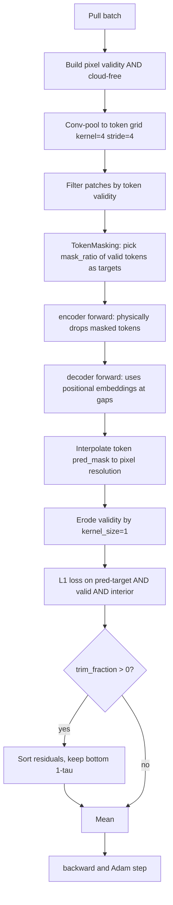
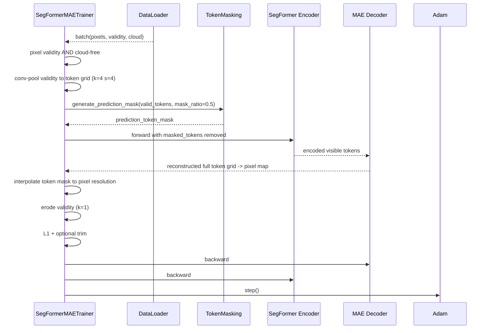
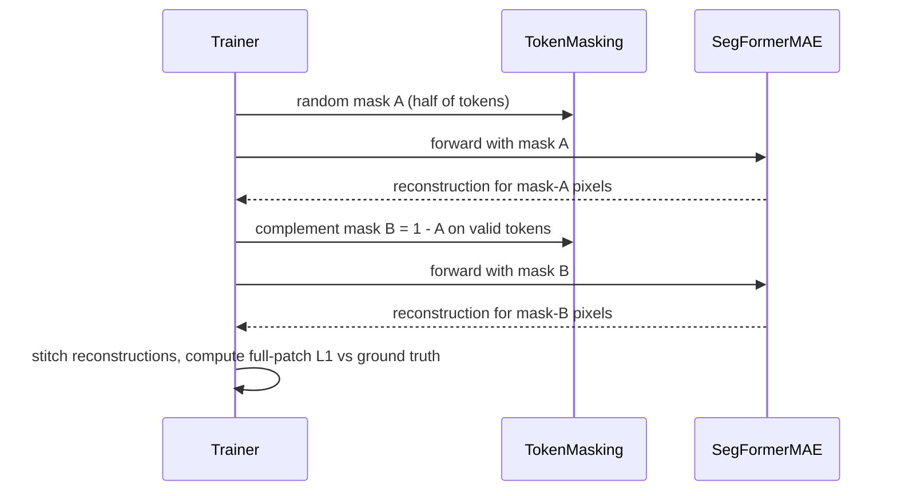

# 4.7 `SegFormerMAETrainer` — true token removal

[`segformer_mae_trainer.py`](../../app/foundation_models/trainers/segformer_mae_trainer.py)

This is the first trainer that does **true MAE-style masking** — masked tokens are physically removed from the transformer's input sequence, not merely flagged via a channel.

## 4.7.1 What the code does

The trainer encodes the MAE training recipe for SegFormer:

1. Build pixel validity mask (validity $\wedge$ cloud-free).
2. Convert pixel validity to **token validity** using the same kernel/stride as Stage 1's `OverlapPatchEmbedding`: `kernel=4, stride=4, padding=0` ([`segformer_mae_trainer.py:35`](../../app/foundation_models/trainers/segformer_mae_trainer.py#L35)). A token is valid iff its $4 \times 4$ receptive field is all valid pixels.
3. From valid tokens, randomly select `mask_ratio` (default 0.5) as prediction targets via `TokenMasking.generate_prediction_mask` ([`segformer_mae_trainer.py:111`](../../app/foundation_models/trainers/segformer_mae_trainer.py#L111)).
4. Forward pass: the encoder **physically removes** those tokens from the sequence ([`segformer_mae_trainer.py:183`](../../app/foundation_models/trainers/segformer_mae_trainer.py#L183)). The decoder then has access to encoded visible tokens + learned mask embeddings at the removed positions.
5. Convert the token-level pred mask back to pixel resolution via nearest-neighbor `interpolate` ([`segformer_mae_trainer.py:141`](../../app/foundation_models/trainers/segformer_mae_trainer.py#L141)).
6. **Erode the validity mask** by `kernel_size=1` to exclude border pixels whose OPE receptive field overlaps invalid regions ([`segformer_mae_trainer.py:191`](../../app/foundation_models/trainers/segformer_mae_trainer.py#L191)).
7. $L_1$ loss only at pixels that are (pred-target $\wedge$ valid $\wedge$ interior).
8. Optional **trimmed loss** ([`segformer_mae_trainer.py:205`](../../app/foundation_models/trainers/segformer_mae_trainer.py#L205)): sort per-pixel errors and keep only the bottom $(1-\tau)$ fraction.

Validation at [`segformer_mae_trainer.py:252`](../../app/foundation_models/trainers/segformer_mae_trainer.py#L252) is a **two-pass complementary random masking**: a random 50% of tokens is masked in pass 1, the complement in pass 2, and each pixel is reconstructed from the pass where its token was hidden. This matches the inference regime and avoids the model evaluating against pixels it directly saw.

## 4.7.2 Theory in plain language: pixel-mask vs token-removal

Pixel-level masking (§4.3–§4.6) only hides values; the encoder still sees the *position* via the validity-mask channel and can in principle leak information through neighbouring convolutions (CNNs aggregate via overlapping receptive fields). MAE-style **token removal** is strictly stronger:

- The masked tokens are physically deleted from the transformer's input sequence.
- The encoder allocates zero representational capacity to them — it does not even know they existed at that position, only that there is a gap.
- The decoder receives learned positional embeddings at the gaps and must hallucinate the missing tokens from the visible encoded set + positions alone.

This matters for the encoder's quality. In MAE the entire point is that the encoder becomes a strong representation extractor *because* it has been trained to encode just 50% of the tokens richly enough that the decoder can reconstruct the rest. CNN pixel-masking trains the encoder to denoise; transformer token-removal trains it to compress + reason.

## 4.7.3 Why erode the validity mask?

The OPE convolution at the input has $4 \times 4$ kernel. A boundary pixel near the edge of a valid region has neighbours that are invalid. After the convolution, its token's content is a mix of valid input + nodata. Including that token's reconstruction in the loss would punish the model for not perfectly modelling the nodata-leak — which it can't, and shouldn't try to.

Eroding by `kernel_size=1` excludes a one-pixel border around invalid regions from the loss. The kernel size 1 is small because the receptive field at this stage is still tight; at inference time the inferencer uses a larger erosion (default 15) because the model's effective receptive field by the time output is produced spans multiple stages.

## 4.7.4 Why trimmed loss?

If the training set contains anomalies (which it does — there is no clean "background only" dataset for thermal), an honest $L_1$ on all pixels will still teach the model to reconstruct them partially. Trimmed loss is the safety net:

$$\mathcal{L}_\text{trim} = \frac{1}{\lfloor (1-\tau) N \rfloor} \sum_{i=1}^{\lfloor (1-\tau) N \rfloor} \text{sort}(|\hat{x}_i - x_i|)_i.$$

Sort the per-pixel errors ascending; drop the top $\tau$ fraction; average the rest. The model never receives gradient from its $\tau$-worst predictions, which are statistically the anomalies it should be failing to reconstruct.

This is robust statistics applied at the loss level: it transforms the objective from "reconstruct everything" into "reconstruct the modal background".

## 4.7.5 Two-pass complementary validation

Random masking at validation would couple validation to a particular random draw and make val numbers noisy. Two-pass complementary masking:

- Pass 1: mask half the tokens. Reconstruct. Record reconstructions for the masked half.
- Pass 2: mask the other half. Reconstruct. Record reconstructions for that half.
- Every pixel is now reconstructed from a pass where its token was hidden, exactly matching inference. Combine into a single full-patch reconstruction; compute $L_1$ vs ground truth.

This also exactly matches the inference regime described in §5 — at inference the model is run with multiple complementary random masks and the per-pixel residuals are averaged. So validation loss is a direct proxy for inference-time error.

## 4.7.6 Worked example: pixel → token mask → loss mask

Take a $16 \times 16$ patch. Stage 1 has stride 4, so the token grid is $4 \times 4 = 16$ tokens. Suppose `mask_ratio = 0.5` and all 16 tokens are valid. `generate_prediction_mask` picks 8 random tokens as targets. After `interpolate` to $16 \times 16$, those 8 tokens become $8 \times (4 \times 4) = 128$ "prediction pixels" out of 256.

If 6 boundary pixels are eroded out, the loss is averaged over $128 - 6 = 122$ pixels. With per-pixel $L_1$ errors of mean 0.6 K and a single 12 K outlier, plain mean = $(0.6 \cdot 121 + 12)/122 \approx 0.69$ K. With `trim_fraction = 0.05`, we drop the top 6 errors, including the 12 K outlier, and the mean settles back to $\approx 0.60$ K — the training signal no longer chases that pixel.

### What if anomalies aren't actually outliers?

If $\tau$ is too high, the model is trained on the "easy" 95% and never learns the upper tail of normal variability (e.g. snow boundaries, sun-glint). Too low and outliers leak through. The default is small (`trim_fraction = 0.05`) precisely because thermal anomalies are rare; for spectrally-busy hyperspectral data (HotSat-class), $\tau$ would need re-tuning.

## 4.7.7 Loop topology

## 4.7.8 Interaction sequence

### Validation pass (two complementary masks)

