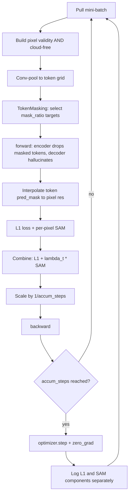
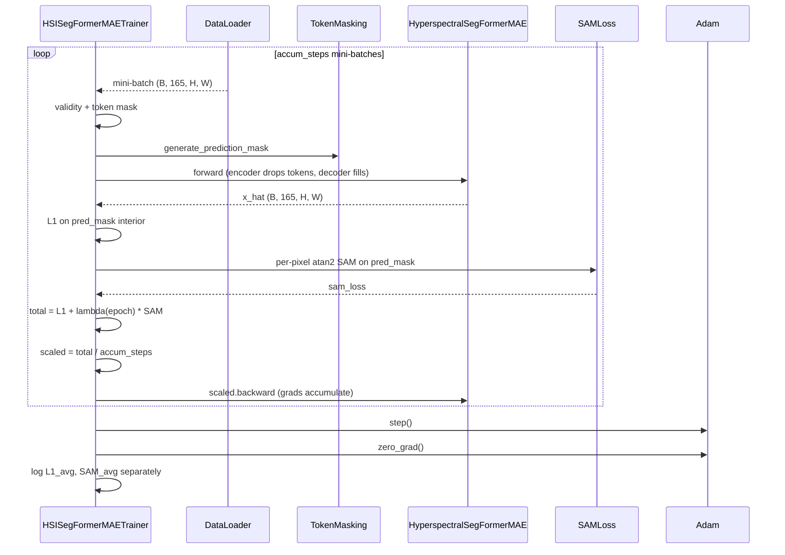

# 4.8 `HyperspectralSegFormerMAETrainer` — L1 + SAM, gradient accumulation

[`hyperspectral_segformer_mae_trainer.py`](../../app/foundation_models/trainers/hyperspectral_segformer_mae_trainer.py)

This is the trainer with the most moving parts. It extends §4.7 to hyperspectral data (165 bands for PRISMA-class sensors), adds a spectral-angle loss term, and exposes gradient accumulation to handle the MPS memory ceiling.

## 4.8.1 What the code does

Five substantive differences vs §4.7:

1. **Different shard keys.** Validity comes from `validity_cube.npy` band 0 ([`hyperspectral_segformer_mae_trainer.py:159`](../../app/foundation_models/trainers/hyperspectral_segformer_mae_trainer.py#L159)); pixels from `pixels.npy` of shape `(B, 165, H, W)`.
2. **Spectral compression** is internal to `HyperspectralSegFormerMAE` (learned MNF). The trainer doesn't see compressed tokens; it only sees pixel-space inputs and outputs in the full 165-band space.
3. **Combined L1 + SAM loss** ([`hyperspectral_segformer_mae_trainer.py:251`](../../app/foundation_models/trainers/hyperspectral_segformer_mae_trainer.py#L251)):

   $$\mathcal{L}_\text{total} = \mathcal{L}_1 + \lambda(t) \cdot \mathcal{L}_\text{SAM}$$

   where $\lambda(t) = \lambda_\max \cdot \min(1, t / T_\text{ramp})$ ramps linearly over `sam_ramp_epochs` ([`hyperspectral_segformer_mae_trainer.py:206`](../../app/foundation_models/trainers/hyperspectral_segformer_mae_trainer.py#L206)). Early epochs are pure $L_1$; SAM fades in.
4. **Gradient accumulation** ([`hyperspectral_segformer_mae_trainer.py:109`](../../app/foundation_models/trainers/hyperspectral_segformer_mae_trainer.py#L109)): if `gradient_accumulation_steps > 1`, the trainer overrides `_run_train_pass` to accumulate scaled gradients over $N$ mini-batches before stepping the optimizer. This is the device-aware-batching escape hatch — on MPS with 16 GB you cannot fit a useful batch of 165-band patches, so effective batch size is reconstructed via accumulation.
5. **Per-epoch component logging** ([`hyperspectral_segformer_mae_trainer.py:51`](../../app/foundation_models/trainers/hyperspectral_segformer_mae_trainer.py#L51)) tracks $L_1$ and SAM separately. Useful for diagnosing whether SAM is dominating the gradient as $\lambda$ ramps in.

## 4.8.2 Theory in plain language: SAM (Spectral Angle Mapper)

**SAM** measures the angle between two spectral vectors. For pixel $i$ with target spectrum $\mathbf{x}_i \in \mathbb{R}^{165}$ and prediction $\hat{\mathbf{x}}_i$:

$$\text{SAM}(\hat{\mathbf{x}}_i, \mathbf{x}_i) = \arccos\!\left(\frac{\hat{\mathbf{x}}_i \cdot \mathbf{x}_i}{\|\hat{\mathbf{x}}_i\| \, \|\mathbf{x}_i\|}\right).$$

It is **scale-invariant**: doubling the predicted intensity changes magnitude but not angle. So $L_1$ pins **magnitude**, SAM pins **shape** of the spectrum. The two are complementary:

- Pure-$L_1$ models can drift toward over-smoothed spectra that have the right average brightness but flat or noisy shape.
- Pure-SAM models can reconstruct shape perfectly but with wrong brightness (since angles are invariant to scaling).
- Combined, the model is forced to get both right.

The trainer's actual implementation in `SAMLoss` uses an `atan2` formulation (referenced in `_per_pixel_sam` at [`hyperspectral_segformer_mae_trainer.py:277`](../../app/foundation_models/trainers/hyperspectral_segformer_mae_trainer.py#L277)) because $\arccos$ has unbounded gradient at $\pm 1$ (where the angle is 0 or $\pi$, the most common cases at convergence). `atan2` is smooth there.

### Why ramp $\lambda$?

Early in training $\hat{\mathbf{x}}$ is nearly random noise. Its angle to $\mathbf{x}$ is essentially uniformly distributed in $[0, \pi]$, and so the SAM gradient is high-variance noise. Letting $L_1$ get the spectra into the right ballpark first, then phasing in SAM, gives stabler optimization.

The linear ramp $\lambda(t) = \lambda_\max \cdot \min(1, t / T_\text{ramp})$ is the simplest schedule that does this. After $T_\text{ramp}$ epochs the ramp is done and the loss is the steady-state $\mathcal{L}_1 + \lambda_\max \cdot \mathcal{L}_\text{SAM}$.

## 4.8.3 Why per-component logging matters

The numerical magnitude of $L_1$ and $\lambda \cdot$ SAM are typically not comparable. $L_1$ for 165 bands averages over physical units; SAM is in radians and rarely exceeds 0.1. If you only see the combined loss, a small SAM contribution looks invisible — but during the ramp it may still be exerting useful gradient pressure.

Logging both separately answers questions like:

- Is SAM actively decreasing once it ramps in, or did $L_1$ already pin both magnitude and shape so SAM has nothing left to optimize?
- Is one component oscillating while the other monotonically decreases? (That would indicate $\lambda$ is too high.)

## 4.8.4 Worked numerical example: $L_1$ vs SAM on a 3-band spectrum

Take target $\mathbf{x} = [10, 20, 30]$, prediction $\hat{\mathbf{x}} = [12, 22, 28]$.

- $L_1$ per-band: $|12-10|+|22-20|+|28-30| = 2+2+2 = 6$, mean $= 2.0$ across bands.
- SAM: $\hat{\mathbf{x}} \cdot \mathbf{x} = 120 + 440 + 840 = 1400$. $\|\hat{\mathbf{x}}\| = \sqrt{144+484+784} = \sqrt{1412} \approx 37.58$. $\|\mathbf{x}\| = \sqrt{100+400+900} = \sqrt{1400} \approx 37.42$. $\cos\theta = 1400/(37.58 \cdot 37.42) \approx 0.9979$. $\theta \approx 0.065$ rad $\approx 3.7°$.

Now scale the prediction: $\hat{\mathbf{x}}' = [24, 44, 56] = 2\hat{\mathbf{x}}$.

- $L_1$ explodes: mean per-band error $|24-10|+|44-20|+|56-30| = 14+24+26 = 64$, mean $\approx 21.3$.
- SAM is **unchanged** at 3.7° — angle is invariant to scaling.

This is the cleanest demonstration of why both are needed: $L_1$ catches the magnitude drift; SAM does not.

### Combined loss across ramp

With $\lambda_\max = 1.0$ ramped over 20 epochs:

- Epoch 0: $\lambda = 0$, total $= 2.0$ (pure $L_1$).
- Epoch 10: $\lambda = 0.5$, total $= 2.0 + 0.5 \cdot 0.065 \approx 2.033$.
- Epoch 20+: $\lambda = 1.0$, total $= 2.0 + 0.065 = 2.065$.

The SAM contribution remains $\ll L_1$ in magnitude. This is exactly why component logging is necessary — you cannot tell from the combined loss alone whether SAM is exerting any pressure.

## 4.8.5 Gradient accumulation arithmetic

Suppose `batch_size = 4`, `gradient_accumulation_steps = 8`. Effective batch is 32. Each mini-batch backprops `loss / 8`. After 8 mini-batches, the accumulated gradient is

$$\sum_{i=1}^{8} \nabla \frac{\mathcal{L}_i}{8} = \frac{1}{8}\sum_i \nabla \mathcal{L}_i$$

which is identical to the gradient of the mean loss over a 32-sample batch. The optimizer then steps once. This preserves the meaning of `learning_rate` — without the `/8` scaling, gradients would be 8× larger and the LR would implicitly become 8× larger too.

### Step-by-step accumulation example

Suppose three mini-batches have losses $\mathcal{L}_1 = 0.6, \mathcal{L}_2 = 0.7, \mathcal{L}_3 = 0.5$, with `gradient_accumulation_steps = 3`:

| Mini-batch | Operation | After |
|---|---|---|
| 1 | scaled = 0.6/3 = 0.2; backward; **no step** | grads accumulated: $\nabla \mathcal{L}_1 / 3$ |
| 2 | scaled = 0.7/3 = 0.233; backward; **no step** | grads accumulated: $(\nabla \mathcal{L}_1 + \nabla \mathcal{L}_2)/3$ |
| 3 | scaled = 0.5/3 = 0.166; backward; **step + zero_grad** | grads = $(\nabla \mathcal{L}_1 + \nabla \mathcal{L}_2 + \nabla \mathcal{L}_3)/3$; weights updated |

Three mini-batches, one optimizer step. The accumulated gradient is the average gradient over the effective 3× larger batch. This is mathematically equivalent (modulo BatchNorm differences) to having processed all three mini-batches as one batch.

### Why does this matter on MPS?

A 16 GB unified memory M-series Mac running a 165-band SegFormer can fit maybe 4 patches of $128 \times 128$ at FP32 before OOM. To get the optimization stability of a batch-size-32 training run, you accumulate over 8 steps. The cost is wall-clock — 8× the forwards per optimizer step — but the convergence trajectory matches what a 32-GB CUDA box would produce in one step.

## 4.8.6 Loop topology

## 4.8.7 Interaction sequence (one effective batch via accumulation)

