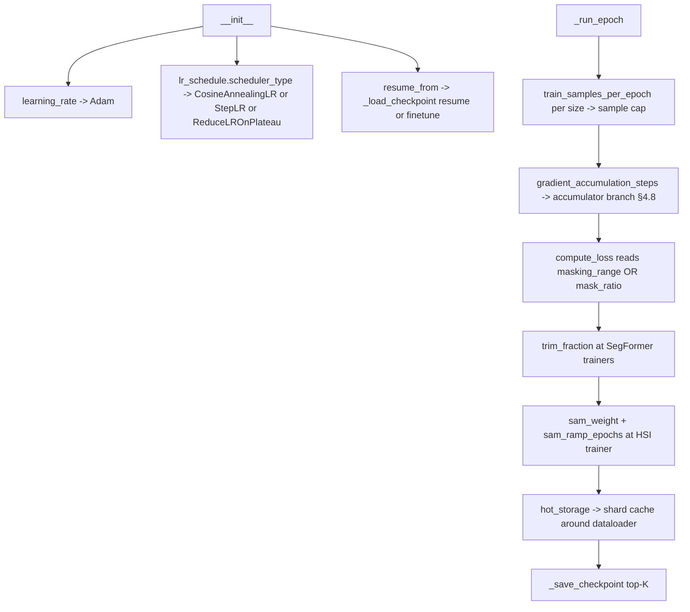
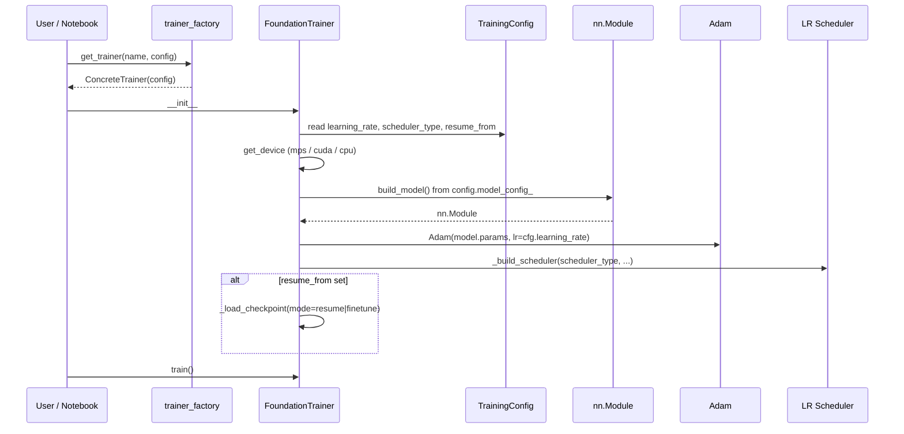

# 4.9 Training-side config notes

This section pulls together the config surface that the trainers read from. There are two pydantic models in play:

- [`TrainingConfig`](../../app/models/training/training_config.py) — the substantive knobs trainers consume.
- [`InferenceConfig`](../../app/models/training/inference_config.py) — owns inference-time overrides that *imply* training-time decisions.

## 4.9.1 What `InferenceConfig` reveals about training

[`app/models/training/inference_config.py`](../../app/models/training/inference_config.py) does not configure training directly, but two of its fields are tightly coupled to choices made at training time:

- **`pixel_stats_override`** ([`inference_config.py:104`](../../app/models/training/inference_config.py#L104)) — at inference, per-scene $(\mu, \sigma)$ can be supplied to re-purpose a model trained on one distribution (e.g. Landsat Kelvin) for another (e.g. HotSat DN). The fact that this hook *exists* implies the corresponding training-time decision: the trainer bakes population stats into the checkpoint, and the inferencer is responsible for overriding when distributions don't match. Equivalently, if your model is the unnormalized variant from §4.5, this override is irrelevant — there is nothing to override.
- **`erosion_kernel_size`** ([`inference_config.py:125`](../../app/models/training/inference_config.py#L125), default 15) — at inference, the same border-erosion idea from training §4.7 is reused, but with a larger kernel (15 vs training's 1). The training-time erosion only excludes a one-pixel border because the loss is evaluated immediately after the OPE stage. At inference, the model's output reflects the full multi-stage receptive field, so a larger kernel is needed to exclude pixels whose effective dependency reaches into nodata.

## 4.9.2 What `TrainingConfig` exposes

The substantive training knobs in [`training_config.py`](../../app/models/training/training_config.py):

| Field | Trainers that read it | Purpose |
|---|---|---|
| `mask_ratio` | SegFormer trainers (§4.7, §4.8) | scalar; fraction of valid tokens used as prediction targets |
| `masking_range` | spatial masked variants (§4.4, §4.5, §4.6) | `(low, high)` tuple; per-sample mask ratio uniform in this range |
| `trim_fraction` | §4.7, §4.8 | fraction of worst per-pixel residuals to drop before averaging |
| `sam_weight` | §4.8 only | $\lambda_\max$ for the SAM ramp |
| `sam_ramp_epochs` | §4.8 only | $T_\text{ramp}$ |
| `gradient_accumulation_steps` (on `DataConfig`) | §4.8 (overrides loop) | how many mini-batches to accumulate before one optimizer step |
| `lr_schedule.scheduler_type` | all | one of `cosine`, `step`, `plateau` |
| `lr_schedule.step_size` | step / plateau | step interval or plateau patience |
| `lr_schedule.step_gamma` | step / plateau | multiplicative decay |
| `hot_storage` | all | local-disk shard cache config (path, eviction policy) |
| `train_samples_per_epoch` | all | per-patch-size dict of sample caps |
| `learning_rate` | all | Adam LR |
| `num_epochs` | all | total epochs to train |
| `resume_from` | all | path to a `.pt` checkpoint; resume vs finetune mode |

## 4.9.3 The hot-storage shard cache

Training shards live on S3. Reading shards repeatedly from S3 wastes network bandwidth and adds latency variance to the training loop. The `hot_storage` config tells the trainer to:

1. Cache shards on local disk as they are first read.
2. Subsequent epochs read from local disk.
3. When local disk fills, evict the least-recently-used shards.

This is implemented in `_train_with_hot_storage` in the base class. For a 5-epoch training run on 500 GB of shards, hot storage means the second through fifth epochs read from local SSD at GB/s instead of from S3 at MB/s.

## 4.9.4 Patch-size-keyed dataloaders

Allotrope trains on multiple patch sizes per epoch (e.g. 64, 128, 256). Each size has:

- Its own dataloader (different shard fileset).
- Its own per-epoch sample cap (`train_samples_per_epoch[size]`).
- Its own validation loop and its own entry in `val_losses` dict.

The trainer iterates over patch sizes within each epoch. The average validation loss (used for scheduler step and checkpoint ranking) is taken across all sizes. Multi-size training is what gives the foundation models robustness to inference-time patch-size choice — a model trained only on 128 px patches has unpredictable behaviour at 256 px.

## 4.9.5 Resume vs finetune

`_load_checkpoint()` supports two modes:

- **`resume`**: restore weights, optimizer state, scheduler state, epoch counter. Training continues exactly where it left off. Use for crash recovery or for re-running an interrupted training job.
- **`finetune`**: restore weights only. Re-initialize optimizer, scheduler, epoch. Use when porting a Landsat model to HotSat, or when re-running the same architecture against a different patch-size mix.

The distinction matters because optimizer state (Adam's running first/second moments) is **trained for the previous data distribution**. Resuming on a new distribution with old moments leads to instability for the first few hundred steps. Finetune mode avoids that by starting Adam fresh.

## 4.9.6 Loop topology: where each config knob enters

## 4.9.7 Interaction sequence: how configs flow at startup

