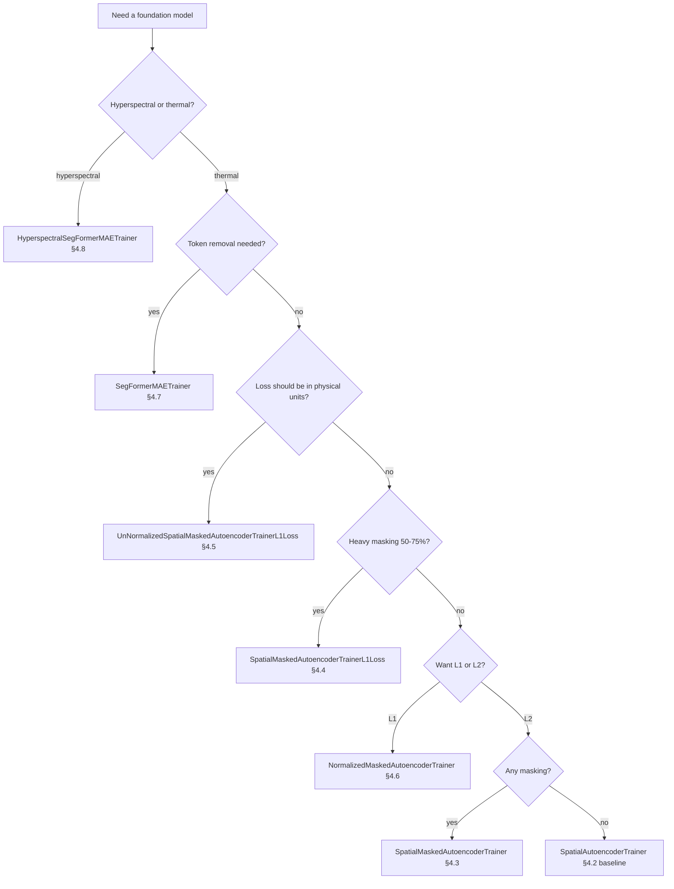
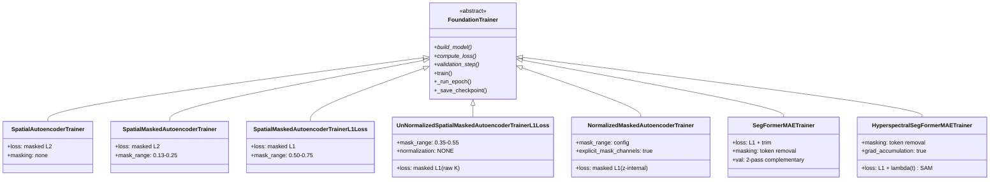

# 4.10 Summary table

The seven trainers in one view, plus the invariants they all share.

## 4.10.1 Per-trainer differences

| Trainer | Loss | Masking style | Mask range | Normalized? | Notable extras |
|---|---|---|---|---|---|
| [`SpatialAutoencoderTrainer`](02_spatial_autoencoder_trainer.md) | $L_2$ | none (validity only) | — | yes (if stats) | plain AE baseline |
| [`SpatialMaskedAutoencoderTrainer`](03_spatial_masked_autoencoder_trainer.md) | $L_2$ | random pixel | $[0.13, 0.25]$ | yes (if stats) | mild masking |
| [`SpatialMaskedAutoencoderTrainerL1Loss`](04_spatial_masked_autoencoder_trainer_l1.md) | $L_1$ | random pixel | $[0.50, 0.75]$ | yes (if stats) | heavy masking |
| [`UnNormalizedSpatialMaskedAutoencoderTrainerL1Loss`](05_unnormalized_l1_trainer.md) | $L_1$ | random pixel | $[0.35, 0.55]$ | **no** | raw Kelvin loss |
| [`NormalizedMaskedAutoencoderTrainer`](06_normalized_masked_autoencoder_trainer.md) | $L_1$ | random pixel | config-driven, default $[0.35, 0.55]$ | yes | explicit mask channels |
| [`SegFormerMAETrainer`](07_segformer_mae_trainer.md) | $L_1$ (optional trim) | **token removal** | `mask_ratio` (default 0.5) | yes (if stats) | two-pass random val, eroded mask |
| [`HyperspectralSegFormerMAETrainer`](08_hyperspectral_segformer_mae_trainer.md) | $L_1 + \lambda(t)\,\text{SAM}$ | token removal | `mask_ratio` (default 0.5) | yes (per-band) | SAM ramp, gradient accumulation |

## 4.10.2 Shared invariants

All seven trainers share:

- **Optimizer**: Adam, no SGD path.
- **Schedulers**: `cosine` / `step` / `plateau`, configured via `TrainingConfig.lr_schedule`.
- **Patch filtering**: `MIN_VALID_PIXEL_FRACTION = 0.4` discards mostly-invalid patches.
- **Sample-capped epochs**: `train_samples_per_epoch[size]` counts only surviving patches.
- **Per-batch re-weighting**: `total_loss += loss.item() * num_kept`, then epoch mean is sample-weighted.
- **Top-$K$ checkpoint retention**: cleaned by `avg_val_loss`.
- **Optional W&B logging** and **S3 → local hot-storage shard caching**.
- **Resume vs finetune** modes on checkpoint reload.
- **Multi-patch-size training** within each epoch.

## 4.10.3 Decision tree — which trainer for which task?

## 4.10.4 Class hierarchy

## 4.10.5 Themes across the chapter

1. **Masked reconstruction** as a self-supervised pretext task. The model never sees ground-truth anomaly labels; it only sees pixels and validity masks and is asked to fill in what the validity mask (or a synthetic prediction mask) hides.
2. **$L_2 \to L_1$** is the dominant evolution. $L_1$ is robust to outliers; outliers are exactly the anomalies we want to detect at inference, so we do not want to teach the model to fit them at training time.
3. **Where normalization lives**. Most concrete models bake input normalization into `forward()`; the `_unnormalized` variant deliberately does not. The loss is therefore sometimes computed in $z$-score space (numerically) and sometimes in raw physical space, and this changes both what the loss number *means* and how the gradient scales through the network.
4. **Filtering and masking arithmetic**. Patches with too many invalid pixels are dropped. Invalid pixels in surviving patches are zeroed before the forward pass. Loss is averaged only over the cells we actually want the model to predict.
5. **Token removal vs pixel masking** is the architectural axis: the four spatial trainers use pixel-channel masking; the two SegFormer trainers physically remove tokens. Token removal gives a stronger encoder; pixel masking is simpler and works for CNNs.
6. **Gradient accumulation as the device-aware-batching escape hatch**. For the 165-band hyperspectral trainer on MPS, accumulation is what lets a 16 GB Mac match the optimization trajectory of a CUDA box.
