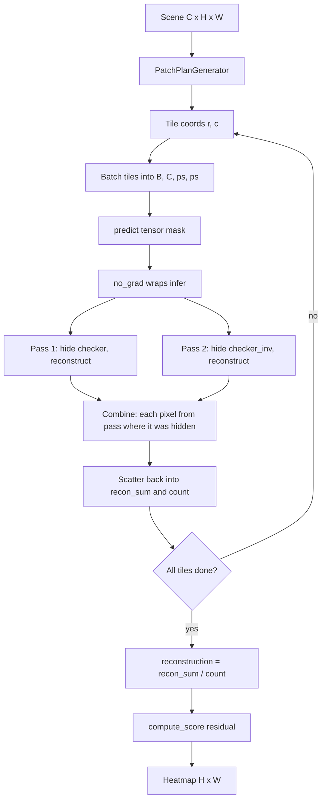
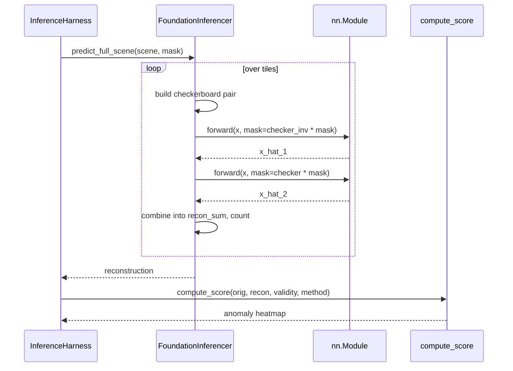

# 5.1 The Inferencer Abstraction

Training (Chapter 4) optimizes a reconstruction model end-to-end against
masked or checkerboard objectives. Inference reuses the same masking
tricks, but with weights frozen and gradients disabled, and additionally
has to *reassemble* full scenes from overlapping patches and *score* the
residual. Section 5.1 covers the abstract base that every concrete
inferencer in Allotrope sits on top of.

## The contract

All concrete inferencers descend from `FoundationInferencer`
([foundation_inferencer.py:21](../../app/abstract_classes/foundation_inferencer.py#L21)).
The class is a thin three-method contract plus a small amount of shared
plumbing.

- `build_model()` — instantiate the `nn.Module` from
  `config.model_config_`
  ([foundation_inferencer.py:53](../../app/abstract_classes/foundation_inferencer.py#L53)).
  Each subclass implements this for its own architecture.
- `infer(tensor, mask)` — model-specific forward logic on a batch of
  patches already on-device
  ([foundation_inferencer.py:58](../../app/abstract_classes/foundation_inferencer.py#L58)).
  This is where the two-pass masking lives.
- `predict(tensor, mask)` — public entry point; moves inputs to device
  and wraps `infer()` in `torch.no_grad()`
  ([foundation_inferencer.py:74](../../app/abstract_classes/foundation_inferencer.py#L74)).

Subclasses additionally implement `predict_full_scene(scene, mask)`,
which is *not* on the base class because the tiling policy varies (the
CNN inferencers iterate one patch at a time, the SegFormer inferencers
batch). Section 5.2 — 5.6 walk through each.

## What the constructor does

`__init__`
([foundation_inferencer.py:34](../../app/abstract_classes/foundation_inferencer.py#L34))
performs three things in order:

1. **Device selection.** If `config.device` is set explicitly, use it;
   otherwise call `get_device()` which picks CUDA when available, then
   MPS on Mac, then CPU.
2. **Model construction and transfer.** Call the subclass
   `build_model()` and move the result to `self.device` with `.to()`.
3. **Checkpoint load + eval mode.** `_load_weights(path)`
   ([foundation_inferencer.py:95](../../app/abstract_classes/foundation_inferencer.py#L95))
   uses `torch.load(path, map_location=self.device, weights_only=False)`
   and reads the `model_state_dict` key. The final step is
   `self.model.eval()`.

That final line is load-bearing. `eval()` switches every `nn.Dropout`
off and every `nn.BatchNorm*` to its inference-statistics path (running
mean and variance from training, no batch statistics). Forgetting
`eval()` makes the forward pass non-deterministic — on a 1024×1024 scene
with thousands of overlapping tiles, the variance in dropout-perturbed
predictions reads as noise in the residual map and can completely mask
genuine anomalies.

## Two safety rails: `no_grad` and `eval`

`predict()` wraps the subclass `infer()` in `torch.no_grad()`. This
disables autograd's graph construction; activations are not stored for
backward, which is the dominant memory cost. A reconstruction model
that fits on the GPU at training batch size 4 typically fits at
inference batch size 32 or 64 on the same card.

The two rails are independent:

- `eval()` controls module behavior (dropout, BN).
- `no_grad()` controls autograd machinery (graph storage).

You need both. `eval()` without `no_grad()` runs but allocates needless
buffers. `no_grad()` without `eval()` is silently wrong — dropout
remains active and you get stochastic outputs.

## How inference differs from training

| Concern               | Training                                  | Inference                                                  |
|-----------------------|-------------------------------------------|------------------------------------------------------------|
| Gradients             | `loss.backward()` every step              | `torch.no_grad()` everywhere                               |
| Mode flag             | `model.train()` — dropout/BN active       | `model.eval()` — dropout off, BN frozen                    |
| Masking               | random 50% of tokens/cells per sample     | deterministic checkerboard OR random + complementary pair  |
| Data shape            | one patch per dataloader sample           | the *whole scene* tiled into overlapping patches           |
| Output                | scalar loss                               | per-pixel reconstruction stitched back to scene resolution |
| Memory                | activations stored for backward           | only forward activations, far smaller                      |
| Batch effect          | shuffled across scenes                    | contiguous tiles from one scene; batched for GPU only      |

## The factory

Concrete subclasses are dispatched through `get_inferencer()`
([inferencer_factory.py:36](../../app/foundation_models/inferencers/inferencer_factory.py#L36))
which holds a `FoundationModelName → class` registry
([inferencer_factory.py:27](../../app/foundation_models/inferencers/inferencer_factory.py#L27)).
Adding a new model is literally one line in `_REGISTRY`. The factory is
the only place the action layer touches; the rest of the inference
machinery is polymorphic against `FoundationInferencer`.

## Pipeline overview

## Harness, inferencer, model, scorer

## Why this layering matters

The base class isolates *three concerns that must always be correct*
(device, no_grad, eval) so that subclasses only have to think about the
*one concern that genuinely varies* (the masking convention). Empirically,
the most common source of wrong-looking residuals in Allotrope's
benchmarks has been forgetting `eval()` on a one-off experimental
inferencer; pinning it on the base eliminates that class of bug.
