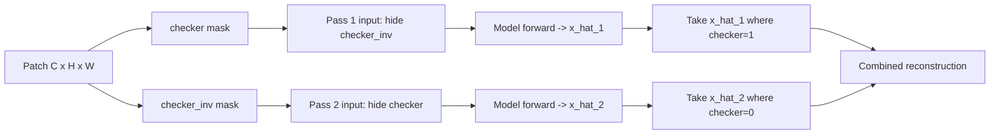

# 5.2 `SpatialAutoencoderInferencer` — checkerboard CNN reconstruction

File: [spatial_autoencoder_inferencer.py](../../app/foundation_models/inferencers/spatial_autoencoder_inferencer.py).

This is the original CNN reconstruction inferencer. It runs the
`SpatialAutoencoder` architecture against an input patch, hides half the
pixels in a deterministic checkerboard pattern, lets the model fill in
the missing cells, then does it a second time with the opposite half
masked. The final per-pixel reconstruction is assembled so that no
pixel was ever predicted from itself.

## What the code does

### `build_model()`

`build_model()`
([spatial_autoencoder_inferencer.py:30](../../app/foundation_models/inferencers/spatial_autoencoder_inferencer.py#L30))
constructs a `SpatialAutoencoder` from `SpatialAutoencoderConfig`. It
threads per-band `pixel_mean` / `pixel_std` into the model so the first
layer can normalise inputs before they hit the encoder. Stats come from
one of two sources in priority order:

1. `config.pixel_stats_override` (in-memory; used for sensors whose
   native units differ from what the checkpoint was trained on — e.g.
   feeding HotSat digital numbers into a model trained on Landsat
   Kelvin).
2. `config.pixel_stats_path` — a JSON file sitting next to the
   checkpoint with `{"mean": [...], "std": [...]}` keys.

### `_build_checkerboard(h, w, invert)`

`_build_checkerboard`
([spatial_autoencoder_inferencer.py:60](../../app/foundation_models/inferencers/spatial_autoencoder_inferencer.py#L60))
builds a $(1,1,H,W)$ mask by integer-flooring pixel indices to a *cell*
of size `config.checkerboard_cell_size`, then taking $(r + c) \bmod 2$.
For `cell_size=2` the resulting pattern is a true 2×2 checkerboard
(pairs of rows and columns share a cell index), not a per-pixel one. An
8×8 example:

```
0 0 1 1 0 0 1 1
0 0 1 1 0 0 1 1
1 1 0 0 1 1 0 0
1 1 0 0 1 1 0 0
0 0 1 1 0 0 1 1
0 0 1 1 0 0 1 1
1 1 0 0 1 1 0 0
1 1 0 0 1 1 0 0
```

Cell size matters. A single-pixel checker is *too easy* — a CNN
interpolates the missing pixel from its four neighbors essentially for
free and the residual is uniformly small. A too-large cell (say 16 on a
64-px patch) deletes so much context that the reconstruction is
hallucinated globally and the residual no longer reflects local
anomalies. `cell_size=2` to `cell_size=4` is the empirical sweet spot
for thermal patches in Allotrope.

### `infer(tensor, mask)`

`infer`
([spatial_autoencoder_inferencer.py:91](../../app/foundation_models/inferencers/spatial_autoencoder_inferencer.py#L91))
runs **two forward passes** through the model with complementary
checker masks:

```python
checker = self._build_checkerboard(h, w, invert=False)
checker_inv = 1 - checker

mask_1 = checker_inv * mask         # null where checker=1
x_hat_1, _ = self.model(tensor, mask=mask_1)

mask_2 = checker * mask             # null where checker=0
x_hat_2, _ = self.model(tensor, mask=mask_2)

reconstruction = x_hat_1 * checker + x_hat_2 * checker_inv
reconstruction = reconstruction * mask
```

The combine line at
[spatial_autoencoder_inferencer.py:126](../../app/foundation_models/inferencers/spatial_autoencoder_inferencer.py#L126)
is the invariant of the whole scheme: pixel $i$'s value in `reconstruction`
comes from the pass where pixel $i$ was *nulled*. Therefore no pixel is
reconstructed from itself, which would defeat anomaly detection.

### `predict_full_scene(scene, mask)`

`predict_full_scene`
([spatial_autoencoder_inferencer.py:133](../../app/foundation_models/inferencers/spatial_autoencoder_inferencer.py#L133))
implements the sliding-window strategy:

1. Build a `PatchRequest` with size `ps × ps` and stride
   `config.stride or ps // 2`
   ([spatial_autoencoder_inferencer.py:158](../../app/foundation_models/inferencers/spatial_autoencoder_inferencer.py#L158)).
2. Iterate every $(r, c)$ from the plan, run the two-pass `predict`,
   accumulate reconstructions into `recon_sum` and weights (the
   per-pixel validity mask) into `count`.
3. Divide by `count` everywhere it is non-zero
   ([spatial_autoencoder_inferencer.py:180](../../app/foundation_models/inferencers/spatial_autoencoder_inferencer.py#L180)).

`count` is per-pixel — when the stride is less than the patch size, the
central pixels of the scene receive several reconstructions and the
average is more robust; edge pixels that fall in only one tile receive
one reconstruction. This is the *overlap blending*.

This inferencer iterates one patch at a time (no batching). For the
small `SpatialAutoencoder` the per-call kernel-launch overhead is the
binding factor, and a Python loop over tiles is acceptable. The
SegFormer inferencer in §5.5 batches because each forward call is
much more expensive.

## Theory in plain language

A reconstruction autoencoder asks: "given context $x_{\setminus i}$,
can you predict the missing pixel $x_i$?". For anomaly detection we
want prediction to be *hard* for anomalous content — the model picks up
the *normal* manifold during training, then fails on novelty at test
time, and the failure (the residual) is the anomaly signal.

If we hand the model the full input and ask for a reconstruction, a CNN
with enough capacity will copy its input verbatim. Residual is near
zero everywhere, anomalies are invisible. The fix is to *mask the
target before measuring it*. The two-pass checkerboard guarantees three
properties:

1. **Every pixel is masked exactly once.** Pass 1 hides
   `checker_inv`; pass 2 hides `checker`. The union is the whole patch.
2. **Every pixel is predicted from its visible neighbors only.** Roughly
   50% of the patch is visible to the encoder on each pass, all of it
   from cells of the *opposite* checker color.
3. **No information leak.** Pass 1 and pass 2 are independent forward
   passes, so the prediction at pixel $i$ never sees $x_i$.

### Why overlap

The CNN is translation-equivariant but not perfectly so at patch
boundaries — the receptive field at a corner pixel covers less context
than at the center, and the reconstruction is therefore noisier near
borders. Overlapping tiles by `ps - stride` pixels means most pixels
land in the center of at least one tile, and the average over
overlapping reconstructions cancels the per-tile boundary noise.

### Why two complementary passes

There is no shortcut. A single pass cannot cover every pixel without
leaking information from a pixel to its own prediction (the model has
no way to know which pixel is "the target" if it is given all of
them). Two passes with complementary masks is the *minimum* number that
gives every pixel a context-only prediction. More passes (random
ensembles) trade compute for variance reduction; two is the practical
default.

## Worked numerical example

Scene: 1024×1024 single-channel cube. `patch_size = 64`,
`overlap = 16`, so `stride = 64 - 16 = 48`. The number of patch starts
along one axis is

$$ N_{\text{axis}} = \left\lfloor \frac{1024 - 64}{48} \right\rfloor + 1 = \left\lfloor 20.0 \right\rfloor + 1 = 21. $$

Plus an additional clipped patch covering the right or bottom edge
where the regular grid misses (handled by `PatchPlanGenerator`). Total
tile count is therefore approximately

$$ N_{\text{tiles}} \approx 21 \times 21 = 441. $$

For each tile the CNN does two forward passes, so the GPU sees
$441 \times 2 = 882$ forward passes total. With a 4-channel patch and
fp32, each $(1, 4, 64, 64)$ input is $4 \cdot 64 \cdot 64 \cdot 4 = 65{,}536$
bytes — trivial.

### Per-pixel coverage count

A pixel at scene coordinate $(i, j)$ is covered by every tile whose top
edge $r$ satisfies $r \le i < r + 64$ and similarly for column. Stride
is 48, so the number of tile starts that capture a single pixel is
typically

$$ \left\lceil 64 / 48 \right\rceil = 2 $$

per axis, giving $2 \times 2 = 4$ overlapping tiles for an interior
pixel. Pixels on the boundary fall in fewer tiles (down to 1 in the
corners). `count` records this exactly.

### Reconstruction-level averaging trace

Pick a single interior pixel $(i, j) = (512, 512)$ with validity 1. It
falls in tiles whose top-left $(r, c)$ are $\{(464, 464), (464, 512),
(512, 464), (512, 512)\}$ — four tiles. After running `predict` on all
four, `recon_sum[:, 512, 512]` is the sum of the four per-tile
reconstructions at that pixel, `count[:, 512, 512] = 4`, and the final
reconstruction is

$$ \bar{\hat x}(:, 512, 512) = \tfrac{1}{4}\sum_{k=1}^{4} \hat x^{(k)}(:, 512, 512). $$

### Residual at one pixel

With $C = 4$ thermal bands, $x(:, i, j) = [298.1, 297.9, 298.3, 298.0]$
K and $\hat x(:, i, j) = [297.7, 298.0, 298.4, 297.9]$ K, the L1 score is

$$ L_1(i, j) = \tfrac{1}{4}\big(|0.4| + |-0.1| + |-0.1| + |0.1|\big) = 0.175 \text{ K}. $$

The MSE score is

$$ \text{MSE}(i, j) = \tfrac{1}{4}\big(0.16 + 0.01 + 0.01 + 0.01\big) = 0.0475 \text{ K}^2. $$

## Two-pass complementary mask diagram



A 4×4 patch with `cell_size = 1` produces these two complementary
masks (1 = kept visible, 0 = hidden for prediction):

```
Pass 1 keep (checker):     Pass 2 keep (checker_inv):
  1 0 1 0                    0 1 0 1
  0 1 0 1                    1 0 1 0
  1 0 1 0                    0 1 0 1
  0 1 0 1                    1 0 1 0
```

The output reconstruction takes pixel $(0, 0)$ from pass 1 (because
pass 1 hid that cell — keep was 0 there — wait, this is where the
convention matters). Read the convention carefully in
[spatial_autoencoder_inferencer.py:126](../../app/foundation_models/inferencers/spatial_autoencoder_inferencer.py#L126):
the combine line is `x_hat_1 * checker + x_hat_2 * checker_inv`. In
pass 1, `mask_1 = checker_inv * mask` was fed to the model, meaning
checker=1 cells were *hidden*. So `x_hat_1 * checker` picks up the
predictions for the cells that were hidden in pass 1 — the correct
no-self-prediction property.

`MaskedSpatialAutoencoderInferencer` (§5.3) uses the opposite literal
convention with the same logical result; see that section for the
reconciliation.
