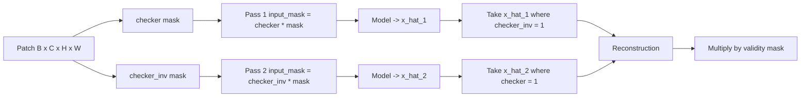

# 5.3 `MaskedSpatialAutoencoderInferencer` — same scheme, unnormalised target

File: [masked_spatial_autoencoder_inferencer.py](../../app/foundation_models/inferencers/masked_spatial_autoencoder_inferencer.py).

This is the L1-loss, unnormalised sibling of §5.2. The masking
machinery is identical; the only differences are the underlying model
class and the forward signature.

## What the code does

### `build_model()`

`build_model()`
([masked_spatial_autoencoder_inferencer.py:30](../../app/foundation_models/inferencers/masked_spatial_autoencoder_inferencer.py#L30))
constructs an `UnNormalizedSpatialAutoencoder` from
`SpatialMaskedAutoEncoderConfig`. Unlike the version in §5.2 it does
**not** thread `pixel_mean` / `pixel_std` into the model — this model
expects already-normalised inputs (or unnormalised L1 training, hence
the name). The action layer is responsible for matching what the
checkpoint was trained on.

### `_build_checkerboard(h, w, invert)`

Byte-for-byte identical to §5.2
([masked_spatial_autoencoder_inferencer.py:39](../../app/foundation_models/inferencers/masked_spatial_autoencoder_inferencer.py#L39)).
Cell size is `config.checkerboard_cell_size`, the pattern is
$(r+c)\bmod 2$ after integer-flooring by `cell`.

### `infer(tensor, mask)`

`infer`
([masked_spatial_autoencoder_inferencer.py:70](../../app/foundation_models/inferencers/masked_spatial_autoencoder_inferencer.py#L70))
runs two forward passes. The forward signature differs: instead of a
single `mask` argument, the model takes both `validity_mask` (sensor
validity) and `input_mask` (checkerboard ∩ validity):

```python
x_hat_1, _ = self.model(tensor, validity_mask=mask, input_mask=checker * mask)
x_hat_2, _ = self.model(tensor, validity_mask=mask, input_mask=checker_inv * mask)
reconstruction = x_hat_1 * checker_inv + x_hat_2 * checker
reconstruction = reconstruction * mask
```

[masked_spatial_autoencoder_inferencer.py:105](../../app/foundation_models/inferencers/masked_spatial_autoencoder_inferencer.py#L105)
is the combine line.

### Convention reconciliation with §5.2

The literal text of the combine line in this file is

```python
reconstruction = x_hat_1 * checker_inv + x_hat_2 * checker
```

versus §5.2's

```python
reconstruction = x_hat_1 * checker + x_hat_2 * checker_inv
```

These look opposite, and they *are* opposite when read literally — but
they produce the same logical reconstruction because the **input
masking convention also flips**. In §5.2 the inputs are
`mask_1 = checker_inv * mask` (pass 1 hides where checker=1), so
`x_hat_1 * checker` picks the pixels that were hidden. Here the inputs
are `input_mask = checker * mask` (pass 1 hides where checker=0, i.e.
where `checker_inv = 1`), so `x_hat_1 * checker_inv` picks the pixels
that were hidden. Logically both files arrive at: *each pixel's value
comes from the pass where its cell was hidden*. The textbook rule from
§5.4 makes this explicit; both files implement it correctly.

### `predict_full_scene(scene, mask)`

The sliding-window stitcher
([masked_spatial_autoencoder_inferencer.py:112](../../app/foundation_models/inferencers/masked_spatial_autoencoder_inferencer.py#L112))
is structurally identical to §5.2: build a `PatchRequest` with
`patch_size`, `stride = config.stride or ps // 2`, iterate every
$(r, c)$ from the plan, run `predict`, scatter into `recon_sum` and
`count`, divide. No batching, no validity-fraction filtering, no
erosion — this inferencer trusts the input cube and the forward path.

## Theory in plain language

The training objective for the L1 / unnormalised masked autoencoder is

$$ \mathcal{L} = \frac{1}{|M|}\sum_{(i,j)\in M} |x(i,j) - \hat x(i,j)| $$

where $M$ is the set of masked positions. Because L1 is robust to
outliers, the trained model is more conservative than the MSE-trained
twin — it predicts the median, not the mean, of the conditional
distribution $p(x_i \mid x_{\setminus i})$. At inference this gives a
slightly sharper anomaly signal on heavy-tailed sensor noise (most
notably on PRISMA atmospheric haze edges).

The two-pass invariant is the same as §5.2: every pixel is masked
exactly once, predicted from $\sim 50\%$ visible neighbors, with no
information leakage. The mathematics doesn't depend on the loss; it
depends only on the masking strategy.

## Worked numerical example

Reuse the §5.2 example: 1024×1024 scene, `patch_size = 64`,
`overlap = 16`, `stride = 48`. Tile count ≈ 441, forward passes ≈ 882.

For one pixel covered by 4 overlapping tiles, the reconstruction is
the per-tile average:

$$ \bar{\hat x}(:, i, j) = \frac{1}{\sum_k m_k(i,j)}\sum_{k=1}^{4} m_k(i,j) \cdot \hat x^{(k)}(:, i, j) $$

where $m_k(i, j)$ is the validity of pixel $(i, j)$ inside tile $k$.
For an interior pixel with full validity, $m_k = 1$ for all four tiles
and the sum is 4.

Pretend the four tile predictions for pixel $(512, 512)$ on a 4-band
patch are

| Tile | $\hat x_1$ | $\hat x_2$ | $\hat x_3$ | $\hat x_4$ |
|------|------------|------------|------------|------------|
| 1    | 0.402      | 0.398      | 0.405      | 0.401      |
| 2    | 0.404      | 0.397      | 0.403      | 0.400      |
| 3    | 0.401      | 0.399      | 0.404      | 0.402      |
| 4    | 0.403      | 0.398      | 0.402      | 0.399      |

The averaged reconstruction is $(0.4025, 0.3980, 0.4035, 0.4005)$. If
the true $x(:, 512, 512) = (0.40, 0.40, 0.40, 0.40)$, the L1 residual is

$$ \tfrac{1}{4}(|0.0025| + |-0.0020| + |0.0035| + |0.0005|) = 0.002125. $$

A tile-by-tile L1 residual would have been roughly $0.003$ on each
individual prediction; averaging four tiles tightens the residual by a
factor of $\sqrt 4 = 2$ for the part that is uncorrelated tile-to-tile
noise, which is the bulk of the boundary error.

## Two-pass complementary mask diagram



A 4×4 patch with `cell_size = 1` and the input-mask convention used in
this file (the model *sees* what's inside `input_mask`):

```
Pass 1 input (checker visible):   Pass 2 input (checker_inv visible):
  1 0 1 0                            0 1 0 1
  0 1 0 1                            1 0 1 0
  1 0 1 0                            0 1 0 1
  0 1 0 1                            1 0 1 0
```

Output pixel $(0, 0)$ comes from pass 1 — because pass 1 hid that cell
(checker_inv = 1 there) so its prediction at $(0, 0)$ is from context.
The combine line `x_hat_1 * checker_inv + x_hat_2 * checker` reads
exactly this rule.
