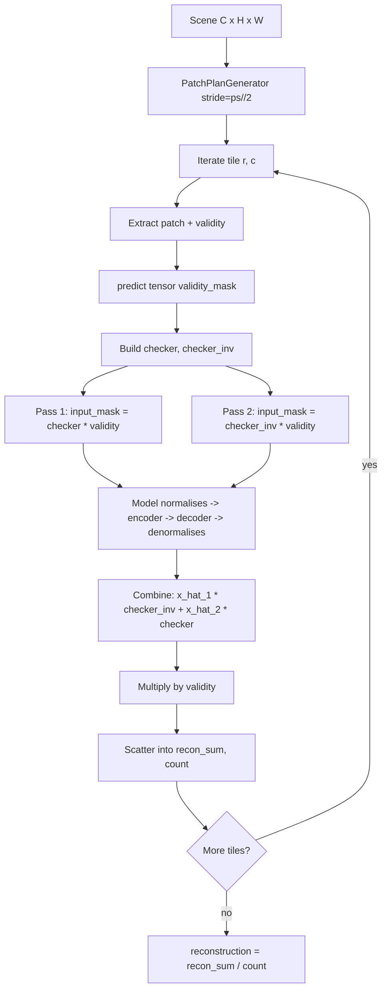
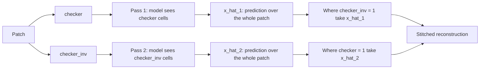

# 5.4 `NormalizedMaskedAutoencoderInferencer` — 3-channel head

File: [normalized_masked_autoencoder_inferencer.py](../../app/foundation_models/inferencers/normalized_masked_autoencoder_inferencer.py).

This inferencer is the bridge between §5.3 (unnormalised L1) and the
SegFormer family in §5.5 — it uses the same two-pass checkerboard
strategy as §5.3 but on the `NormalizedMaskedSpatialAutoencoder`
architecture, which bakes per-band normalisation into its first layer
and accepts a 3-channel input head (normalised pixels, validity_mask,
input_mask).

## What the code does

### `build_model()`

`build_model()`
([normalized_masked_autoencoder_inferencer.py:28](../../app/foundation_models/inferencers/normalized_masked_autoencoder_inferencer.py#L28))
constructs a `NormalizedMaskedSpatialAutoencoder` from
`NormalizedMaskedAutoEncoderConfig`. As in §5.2 it threads `pixel_mean`
and `pixel_std` into the model from `pixel_stats_override` or
`pixel_stats_path` so that the first layer normalises inputs before
the encoder. The model expects raw reflectance / temperature units —
normalisation is *inside* the model now.

### `_build_checkerboard(h, w, invert)`

Identical to §5.2 and §5.3:
$(r + c) \bmod 2$ after integer-flooring by `cell_size`. See
[normalized_masked_autoencoder_inferencer.py:57](../../app/foundation_models/inferencers/normalized_masked_autoencoder_inferencer.py#L57).

### `infer(tensor, mask)`

The forward signature accepts `(tensor, validity_mask, input_mask)`:

```python
x_hat_1, _ = self.model(tensor, validity_mask=mask, input_mask=checker * mask)
x_hat_2, _ = self.model(tensor, validity_mask=mask, input_mask=checker_inv * mask)
reconstruction = x_hat_1 * checker_inv + x_hat_2 * checker
reconstruction = reconstruction * mask
```

[normalized_masked_autoencoder_inferencer.py:74](../../app/foundation_models/inferencers/normalized_masked_autoencoder_inferencer.py#L74)
through
[normalized_masked_autoencoder_inferencer.py:99](../../app/foundation_models/inferencers/normalized_masked_autoencoder_inferencer.py#L99)
is the body. The masking convention is the same as §5.3; the comment
at
[normalized_masked_autoencoder_inferencer.py:94](../../app/foundation_models/inferencers/normalized_masked_autoencoder_inferencer.py#L94)
makes the rule explicit:

> Pass 1 hid `checker_inv` cells → use `x_hat_1` for those.

This is the canonical mental model for every two-pass inferencer in
the repo. The §5.2 file's literal combine line and §5.3 / §5.4's
literal combine line look opposite, but each one selects "the pass
where this cell was hidden". Whenever there is confusion, fall back to
that one sentence.

### `predict_full_scene(scene, mask)`

`predict_full_scene`
([normalized_masked_autoencoder_inferencer.py:103](../../app/foundation_models/inferencers/normalized_masked_autoencoder_inferencer.py#L103))
is structurally identical to §5.2 and §5.3 — sliding window with stride
`config.stride or ps // 2`, per-pixel-validity weighting in `count`,
final division. No batching, no erosion, no validity-fraction filter.

## Why this architecture exists

The 3-channel head is the engineering predecessor to the SegFormer
family. It lets the model see the validity and input masks as
*additional channels*, which is the only general way to tell a
convolutional architecture "treat these pixels as missing, not zero".
Without it, masking by multiplying input by zero produces a hard
discontinuity that the early conv layers see as a sharp edge — they
learn to interpolate across the edge, which is what we want, but they
also tend to learn the spurious "edge = mask" feature. Feeding the
mask as a channel eliminates that ambiguity.

## Theory in plain language

The reconstruction objective is

$$ \mathcal{L}(\theta) = \mathbb{E}_{x \sim p_{\text{normal}}} \mathbb{E}_{M} \frac{1}{|M|}\sum_{(i,j) \in M} |x(i,j) - f_\theta(x_{\bar M}; M)(i,j)| $$

where $M$ is a random mask drawn from the 50% Bernoulli (or
checkerboard during inference) distribution, $x_{\bar M}$ is the
input with masked positions zeroed, and the network $f_\theta$ also
gets the mask itself as input. At inference the only difference is the
mask becomes deterministic (the two-pass checkerboard pair) and the
two reconstructions are stitched.

### Why bake normalisation inside

For multi-sensor deployments where the same checkpoint is reused
across cubes whose reflectance distributions differ slightly,
hard-coding the training-time $(\mu, \sigma)$ inside the model is the
right default. When a new sensor arrives with a meaningfully different
distribution, `pixel_stats_override` lets the action layer override
the baked-in stats *for this run only*, without touching the
checkpoint. See `PixelStatsOverride` for the canonical use case
(HotSat digital numbers fed into the Kelvin-baked thermal model).

## Worked numerical example

Reuse the canonical 1024×1024 scene, `patch_size = 64`,
`overlap = 16`, `stride = 48`. Tile count ≈ 441; two forward passes
per tile gives ≈ 882. Same arithmetic as §5.2.

Suppose the model is trained on a 6-band hyperspectral cube with
$\mu = [0.10, 0.12, 0.15, 0.18, 0.20, 0.22]$ and
$\sigma = [0.02, 0.02, 0.03, 0.03, 0.03, 0.03]$. A patch with raw
values $x(:, 32, 32) = (0.11, 0.13, 0.17, 0.20, 0.22, 0.24)$ enters
the model and is normalised internally to

$$ z = \frac{x - \mu}{\sigma} = (0.5, 0.5, 0.667, 0.667, 0.667, 0.667). $$

The encoder operates in $z$-space. The decoder predicts in $z$-space,
and the model's last layer denormalises back: $\hat x = \hat z \sigma + \mu$.
Residuals are taken in the original units — important, because the
downstream `compute_score` (§5.8) assumes the reconstruction is in the
same units as `original`.

## Pipeline for this inferencer



## Two-pass complementary mask diagram


