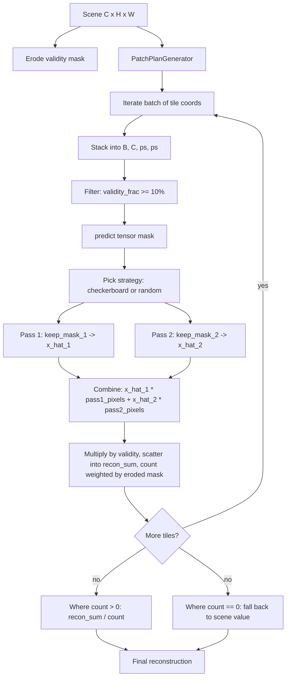

# 5.5 `SegFormerMAEInferencer` — token-masked transformer

File: [segformer_mae_inferencer.py](../../app/foundation_models/inferencers/segformer_mae_inferencer.py).

This is the transformer-based inferencer. The SegFormer encoder treats
the input patch as a sequence of tokens, and masking happens at the
*token* level rather than the *pixel* level. The inferencer wraps the
two-pass scheme around the token grid, batches tiles for throughput,
erodes the validity mask to suppress boundary artefacts, and falls
back to the original scene value at pixels with zero coverage.

## What the code does

### Stage-1 patch embedding

SegFormer's first stage uses a non-overlapping 4×4 patch embed
(`STAGE1_KERNEL_SIZE = STAGE1_STRIDE = 4`,
[segformer_mae_inferencer.py:41](../../app/foundation_models/inferencers/segformer_mae_inferencer.py#L41)).
A 64×64 image patch therefore turns into a $16 \times 16 = 256$-token
sequence. Masking happens *at the token level*. A token corresponds to
a $4 \times 4$ pixel cell; masking a token means hiding all 16 of its
pixels.

### `build_model()`

`build_model()`
([segformer_mae_inferencer.py:48](../../app/foundation_models/inferencers/segformer_mae_inferencer.py#L48))
constructs a `SegFormerMAE` from `SegFormerMAEConfig`. As elsewhere,
`pixel_mean` / `pixel_std` flow in from
`pixel_stats_override` or `pixel_stats_path`. `drop_rate` is hard-coded
to 0.0 at inference — even though `eval()` already disables dropout,
explicitly setting it to zero in the config makes the inference graph
identical to a "no dropout" model in case any custom layer reads the
config directly.

### Masking strategy: checkerboard vs random

Two masking strategies are supported via `config.masking_strategy`
([segformer_mae_inferencer.py:202](../../app/foundation_models/inferencers/segformer_mae_inferencer.py#L202)):

- **checkerboard** — deterministic, alternating tokens with cell size
  `checkerboard_cell_size`. Helpers:
  `_checkerboard_keep_mask`
  ([segformer_mae_inferencer.py:84](../../app/foundation_models/inferencers/segformer_mae_inferencer.py#L84))
  and `TokenMasking.checkerboard_token_mask`.
- **random** — a single Bernoulli(0.5) sample drawn per call and used
  as pass 1's visible tokens; pass 2 uses its complement
  (`_build_random_keep_mask`
  [segformer_mae_inferencer.py:140](../../app/foundation_models/inferencers/segformer_mae_inferencer.py#L140)).
  This avoids the systematic grid artefact that token-aligned
  checkerboards otherwise produce at 4×4 boundaries.

`_token_mask_to_pixel_mask`
([segformer_mae_inferencer.py:133](../../app/foundation_models/inferencers/segformer_mae_inferencer.py#L133))
nearest-neighbour upsamples the $(B, N)$ token mask back to
$(B, 1, H, W)$ for the recombination step.

### The forward sequence

The forward sequence in `infer()`
([segformer_mae_inferencer.py:177](../../app/foundation_models/inferencers/segformer_mae_inferencer.py#L177)):

1. Decide strategy → build `keep_mask_1, keep_mask_2` and the pair of
   pixel-space *target* masks `pass1_pixels`, `pass2_pixels`.
2. `x_hat_1 = self.model(tensor, mask=mask, keep_mask=keep_mask_1)`.
3. `x_hat_2 = self.model(tensor, mask=mask, keep_mask=keep_mask_2)`.
4. Combine: `recon = x_hat_1 * pass1_pixels + x_hat_2 * pass2_pixels`
   ([segformer_mae_inferencer.py:246](../../app/foundation_models/inferencers/segformer_mae_inferencer.py#L246)).
5. Zero invalid pixels.

`pass1_pixels` is set to 1 at pixels whose token was *masked* in pass 1
(so `1 - rand_mask` for random, `1 - checker` for checkerboard). The
combine line therefore always reads "take pass 1's prediction at
pixels that pass 1 had to predict".

### `predict_full_scene` extras

`predict_full_scene`
([segformer_mae_inferencer.py:253](../../app/foundation_models/inferencers/segformer_mae_inferencer.py#L253))
is materially richer than its CNN counterpart:

- **Mask erosion.** Before tiling, the scene-wide validity mask is
  shrunk by `TokenMasking.erode_mask` with
  `config.erosion_kernel_size`
  ([segformer_mae_inferencer.py:281](../../app/foundation_models/inferencers/segformer_mae_inferencer.py#L281)).
  This suppresses reconstructions in the receptive-field overlap with
  invalid pixels — a token sitting next to an invalid region has
  context that includes the zero-fill, and its reconstruction is
  unreliable.
- **Batching.** Patches are stacked into a $(B, C, ps, ps)$ tensor of
  size `config.inference_batch_size`
  ([segformer_mae_inferencer.py:305](../../app/foundation_models/inferencers/segformer_mae_inferencer.py#L305)),
  giving meaningful GPU throughput on the transformer.
- **Validity-fraction filtering.** Patches with `< 10%` valid pixels
  (`MIN_VALID_FRACTION`,
  [segformer_mae_inferencer.py:302](../../app/foundation_models/inferencers/segformer_mae_inferencer.py#L302))
  are skipped entirely. The model never trained on them and produces
  noise there.
- **Fallback at coverage gaps.** If `count == 0` at a pixel after all
  tiles, the *original* scene value is returned
  ([segformer_mae_inferencer.py:340](../../app/foundation_models/inferencers/segformer_mae_inferencer.py#L340))
  so the residual is exactly zero and no false detection appears.
  Compare to §5.2 which returns `recon_sum` (zero where uncovered) —
  that's fine for the CNN inferencer because every pixel is always
  covered, but the SegFormer inferencer's validity filter can produce
  uncovered pixels at the patch level, so the fallback matters.

## Theory in plain language

A masked autoencoder asks the encoder to operate on a *subset* of
visible tokens; the decoder is responsible for hallucinating the rest.
At inference there are three legal choices:

1. **Full-image pass** (no masking) — fast, but reconstruction is
   nearly identity (anomalies become invisible). Allotrope does not
   use this for autoencoder-style models.
2. **Deterministic masking** — checkerboard, fixed seed. Reproducible
   but biases the residual at token-grid boundaries.
3. **Many-mask ensembling** — run $k$ random masks and average the
   reconstructions. The two-pass *complementary* random scheme used
   here is the minimal version of this: $k = 2$, with the guarantee
   that every token is predicted exactly once.

The choice of two complementary passes is the sweet spot — it is the
*minimum* number of forward passes that gives every pixel a pure
out-of-context prediction without averaging variance into the residual.

### Why erosion

A token's receptive field after the encoder spans more than its native
$4 \times 4$ pixels (self-attention is global to the patch; effective
receptive field after the full encoder is the whole patch). A token
near an invalid region has $0$-valued tokens in its attention context.
The decoder will tend to bias its reconstruction toward zero at those
positions. Eroding the validity mask before scoring drops those
boundary pixels from the final heatmap. `erosion_kernel_size` is
typically set to the stage-1 receptive field plus a small margin.

### Why a validity-fraction filter

During training, the data loader discarded patches with fewer than 40%
valid pixels — the model literally never optimised on
mostly-invalid inputs. Running inference on a mostly-invalid patch
gives garbage; the 10% threshold in the inferencer is intentionally
laxer than training (40%) because we want to keep coverage at the
scene level. Anything in $[10\%, 40\%]$ is "trusted out of necessity"
and any pixel that ends up with no coverage falls back to identity.

## Worked numerical example

Same 1024×1024 scene, `patch_size = 64`, `stride = 48`, so
$\approx 441$ tiles. With `inference_batch_size = 32`, the GPU sees
$\lceil 441 / 32 \rceil = 14$ batches per pass, $14 \times 2 = 28$
forward passes through the transformer.

Token math: 64-px patch with `STAGE1_STRIDE = 4` gives
$16 \times 16 = 256$ tokens. The two-pass random scheme always
processes all 256 tokens — half are visible (`keep_mask = 1`), half
are masked. Encoder cost scales with the *visible* count, which in
either pass is $\sim 128$ tokens.

### Per-pixel residual under random masking

For a single pixel $(i, j)$ that falls under three overlapping tiles
after validity filtering and erosion, `recon_sum[:, i, j]` is the sum
of three reconstructions and `count[:, i, j]` is 3 (assuming eroded
validity is 1 at all three positions). The averaged reconstruction is

$$ \bar{\hat x}(:, i, j) = \frac{1}{3}\sum_{k=1}^{3} \hat x^{(k)}(:, i, j). $$

### Erosion sketch

Suppose `erosion_kernel_size = 5`. Then any valid pixel within 2 pixels
of an invalid pixel is dropped before scoring. If the scene has a
diagonal cloud edge, the eroded validity loses a 2-pixel strip on the
inside of the cloud. Pixels in that strip still receive a
reconstruction (they fell inside several tiles), but their `count`
contribution is 0 — they don't get averaged, and at the end they fall
back to `scene` value. Effective residual: zero there. Score map: zero
there.

## Inference pipeline



## Two-pass complementary mask diagram (token level)

```mermaid
flowchart LR
    A[Patch 64x64] --> B[16x16 token grid]
    B --> C[Random Bernoulli mask m on N=256 tokens]
    C --> D[keep_mask_1 = 1 - valid * (1-m)]
    C --> E[keep_mask_2 = 1 - valid * m]
    D --> F[Pass 1 forward -> x_hat_1]
    E --> G[Pass 2 forward -> x_hat_2]
    F --> H[pass1_pixels = upsample 1-m to pixels]
    G --> I[pass2_pixels = upsample m to pixels]
    H --> J[recon = x_hat_1 * pass1_pixels + x_hat_2 * pass2_pixels]
    I --> J
```

A 4×4 token grid with one Bernoulli draw and its complement
(1 = visible to encoder in that pass):

```
Pass 1 visible:        Pass 2 visible:
  1 0 1 1                0 1 0 0
  0 1 0 1                1 0 1 0
  1 1 0 0                0 0 1 1
  0 1 1 0                1 0 0 1
```

Output for token $(0, 0)$ comes from pass 2 (which had to predict it,
because pass 1 saw it). Output for token $(0, 1)$ comes from pass 1.
Every token gets exactly one out-of-context prediction.
