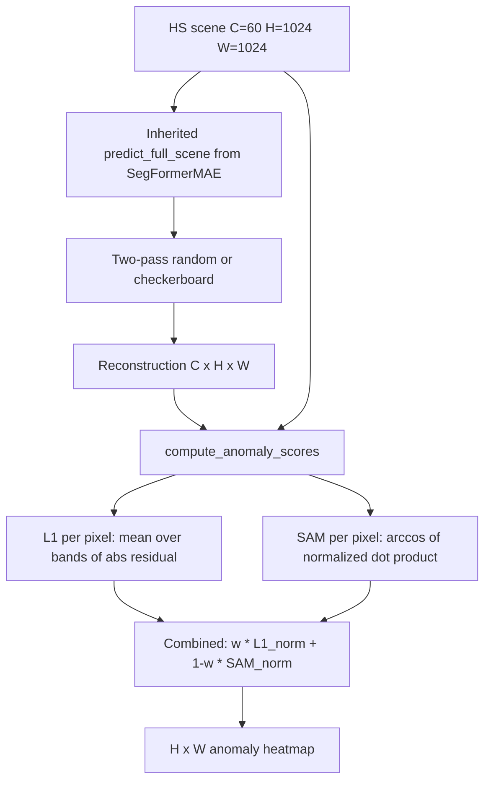
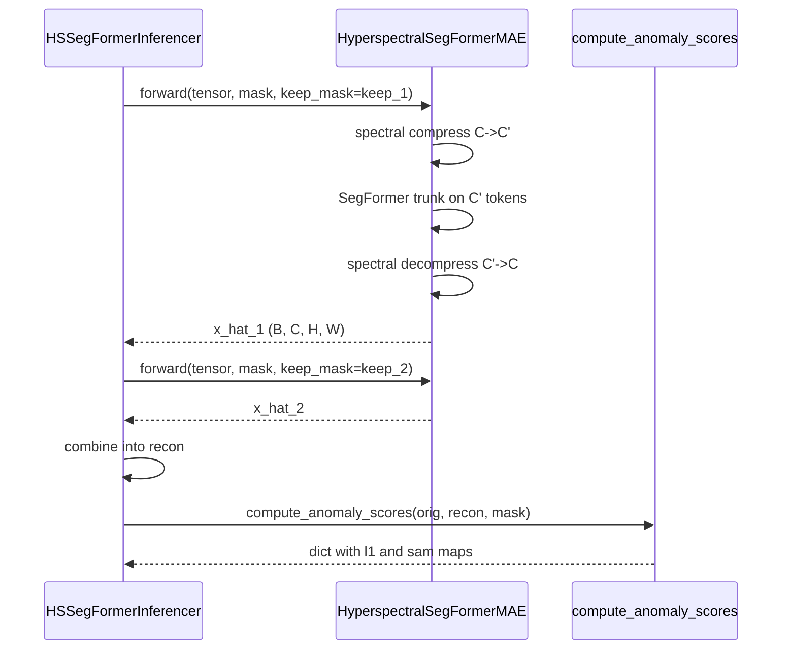

# 5.6 `HyperspectralSegFormerMAEInferencer` — spectral residuals

File: [hyperspectral_segformer_mae_inferencer.py](../../app/foundation_models/inferencers/hyperspectral_segformer_mae_inferencer.py).

This inferencer is the hyperspectral specialization of §5.5. It
subclasses `SegFormerMAEInferencer` and overrides exactly two things:
`build_model()` to construct the spectral-compressed architecture, and
adds `compute_anomaly_scores()` for the dual L1 + SAM scoring. All
two-pass masking, sliding window, mask erosion, batching, validity
filtering, and fallback logic are inherited verbatim from §5.5.

## What the code does

### `build_model()`

`build_model()`
([hyperspectral_segformer_mae_inferencer.py:39](../../app/foundation_models/inferencers/hyperspectral_segformer_mae_inferencer.py#L39))
constructs a `HyperspectralSegFormerMAE` from
`HyperspectralSegFormerMAEConfig`. Compared to §5.5 it adds a
*spectral compressor* on the encoder side and a *spectral
decompressor* on the decoder side, around the SegFormer trunk. The
compressor projects `in_channels` (often 60–224 hyperspectral bands)
down to `compressed_channels` (often 16–32) before the trunk sees
them; the decompressor inverts the projection at the end.

Per-band `pixel_mean` / `pixel_std` flow in from
`pixel_stats_override` or `pixel_stats_path` exactly as in §5.5, but
the lists are now per-band over the full spectral dimension — e.g.
60 floats each for a 60-band PRISMA cube.

### Inherited inference protocol

The whole forward / scene-tiling protocol — two-pass random or
checkerboard token masking, batched tile processing, erosion, validity
fraction filter, fallback — comes from `SegFormerMAEInferencer`. The
only difference in practice is the channel dimension: $C$ is now
"number of spectral bands", which can be tens to hundreds, instead of
one or four.

### `compute_anomaly_scores`

`compute_anomaly_scores`
([hyperspectral_segformer_mae_inferencer.py:78](../../app/foundation_models/inferencers/hyperspectral_segformer_mae_inferencer.py#L78))
returns *both* an L1 and a SAM (spectral angle) map per pixel:

$$ L_1(i, j) = \frac{1}{C} \sum_{c=1}^{C} |x_c - \hat x_c|, $$

$$ \text{SAM}(i, j) = \arccos\!\left(\frac{\sum_c x_c \hat x_c}{\sqrt{\sum_c x_c^2} \cdot \sqrt{\sum_c \hat x_c^2} + \varepsilon}\right). $$

The function accepts $(C, H, W)$ or $(B, C, H, W)$, broadcasts the
validity mask to the band axis, takes the dot product and norms only
over valid pixels, clamps cosine to $[-1, 1]$ before `arccos`, and
zeros invalid pixels in the output. Returns a dict
`{"l1": ..., "sam": ...}`.

## Theory in plain language

L1 captures *magnitude* error of the residual spectrum. SAM captures
*shape* error of the spectrum. They are largely independent — a pixel
that is anomalously bright but spectrally similar to its neighbors has
large L1 but small SAM; a pixel that is the same brightness as its
neighbors but with a chemically different absorption profile has small
L1 but large SAM. The combined score in §5.8 is the convex
combination, normalized to the scene-valid maxima.

For single-band thermal cubes SAM is degenerate ($\arccos$ of $\pm 1$
gives $0$ or $\pi$ depending on sign of the dot product); the
action-handler capabilities table is what guards the user from
selecting it for thermal. The hyperspectral inferencer always offers
both.

### Why a spectral compressor

A vanilla SegFormer trunk has stage-1 conv with `in_channels` input
filters. With $C = 224$ bands the first stage alone is roughly
$224 \times 32 \times 4 \times 4 = 114{,}688$ multiplies per token,
which dominates the budget. A linear compressor of
$224 \to 32$ runs once at the input (parameters
$224 \times 32 = 7{,}168$, much cheaper than letting stage-1 do it)
and lets the rest of the trunk run on the standard 32-channel head.
The decompressor at the output is symmetric. Loss is computed against
the *uncompressed* target, so the network has to learn to project to a
spectral subspace that preserves reconstruction error in the original
band space.

### Why dual scoring

L1 and SAM each fail on a class of anomaly:

| Anomaly type             | L1 picks it up? | SAM picks it up? |
|--------------------------|-----------------|------------------|
| Bright-but-same-spectrum | yes             | no               |
| Same-magnitude-but-shape | no              | yes              |
| Both                     | yes             | yes              |

Reporting only one is asymmetric — you would miss a chemistry-driven
anomaly with no brightness signature (e.g. methane plume against a
similarly bright background) by using L1 alone. The dual return lets
the action layer pick the right scoring method per scene, or combine
them.

## Worked numerical example

Take a 1024×1024 hyperspectral scene with $C = 60$ bands. After
two-pass inference we have a stitched reconstruction $\hat x$ of the
same shape.

### Per-pixel L1

For one pixel $(i, j)$ with
$x(:, i, j) = [0.42, 0.41, \dots]$ (60 values) and
$\hat x(:, i, j) = [0.40, 0.43, \dots]$, the L1 score is

$$ L_1(i, j) = \frac{1}{60} \sum_{c=1}^{60} |x_c - \hat x_c|. $$

For uniformly $\pm 0.02$ deviations this is $0.02$.

### Per-pixel SAM

Same pixel, dot product $\sum_c x_c \hat x_c$. If
$\lVert x \rVert = \sqrt{60} \cdot 0.41$ and
$\lVert \hat x \rVert \approx \lVert x \rVert$, and the deviations are
*purely magnitude* (same shape, the residual is a constant scaling),
then $\cos\theta \approx 1$ and $\text{SAM} \approx 0$.

If instead some bands flipped sign of deviation (genuine shape
change), $\cos\theta < 1$ and SAM grows. Concretely if half the bands
deviated $+0.02$ and the other half $-0.02$, the L1 is still $0.02$ but

$$ \sum_c x_c \hat x_c = \sum_c x_c (x_c + \delta_c) = \lVert x \rVert^2 + \sum_c x_c \delta_c $$

and the second term is roughly zero (positive and negative deviations
cancel), so $\cos\theta \approx \lVert x \rVert / \lVert \hat x \rVert$.
If the norms are nearly equal, $\cos\theta \approx 1$ — but if there's
slight imbalance, say $\lVert \hat x \rVert / \lVert x \rVert = 1.01$,
then $\cos\theta \approx 0.99$ and $\text{SAM} = \arccos(0.99) \approx 0.141$ rad.

L1 and SAM thus carry *independent* information.

### Combined score arithmetic

Compute the two maps over the whole scene, normalise each by its
valid-pixel max:

$$ \tilde L_1 = \frac{L_1}{\max_{\text{valid}} L_1}, \quad \tilde{\text{SAM}} = \frac{\text{SAM}}{\max_{\text{valid}} \text{SAM}}, $$

then form

$$ S = w \tilde L_1 + (1 - w) \tilde{\text{SAM}}, \quad w = 0.5. $$

Both terms are in $[0, 1]$ on the same scale.

## Pipeline

## Sequence: inferencer to scorer

