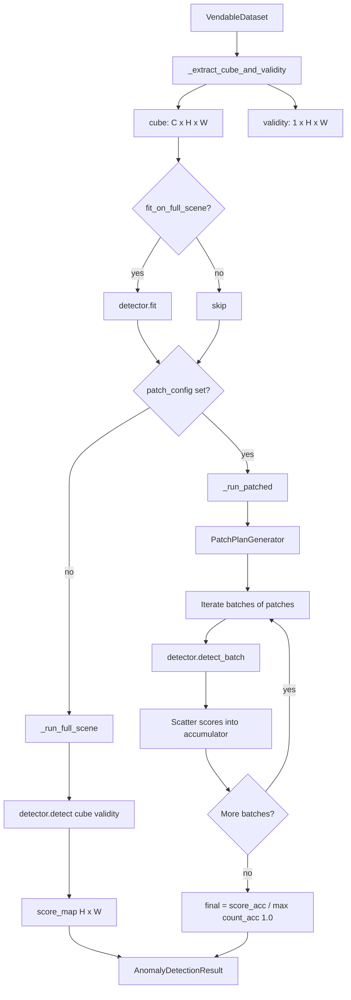
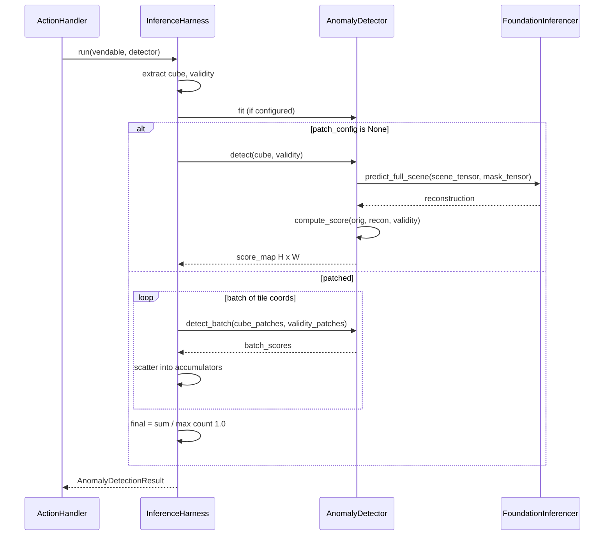

# 5.7 The Inference Harness

File: [inference_harness.py](../../app/utils/anomaly_detection/inference_harness.py).

The foundation-model inferencers in §5.2 — 5.6 are PyTorch-tensor APIs.
The `InferenceHarness`
([inference_harness.py:33](../../app/utils/anomaly_detection/inference_harness.py#L33))
is the *framework-agnostic* wrapper that any `AnomalyDetector` (not
just foundation models — also MNF, RX, statistical detectors) plugs
into. It works entirely in numpy and sits between the Allotrope action
layer and the detectors.

## What the code does

### `__init__`

Stores the `InferenceHarnessConfig` and instantiates a
`PatchPlanGenerator`. The config carries patch dimensions, stride,
batch size, and `fit_on_full_scene` — a flag for statistical detectors
that need to estimate scene-level statistics before scoring.

### `run(vendable, detector)`

`run()`
([inference_harness.py:47](../../app/utils/anomaly_detection/inference_harness.py#L47))
is the entry point:

1. `_extract_cube_and_validity(vendable)`
   ([inference_harness.py:62](../../app/utils/anomaly_detection/inference_harness.py#L62))
   pulls the right cube key off a `VendableHyperspectralDataset`,
   `VendableEnmapHyperspectralDataset`, or `VendableThermalDataset`.
   Type-dispatch lives here so the rest of the harness sees a single
   `(C, H, W)` cube plus a `(1, H, W)` validity mask.
2. If `config.fit_on_full_scene`, call `detector.fit()` once. Useful
   for statistical detectors — RX needs the mean and covariance of the
   scene, MNF needs the noise model fitted on the full scene.
3. Dispatch to `_run_full_scene` if no patch config, otherwise
   `_run_patched`.

### `_run_full_scene`

Single call to `detector.detect(cube, validity)`; returns its
`(H, W)` score map wrapped in an `AnomalyDetectionResult`. The detector
is responsible for any internal tiling.

### `_run_patched`

`_run_patched`
([inference_harness.py:89](../../app/utils/anomaly_detection/inference_harness.py#L89))
is where the harness does its own *score-map-level* overlap averaging,
separate from the per-pixel *reconstruction-level* averaging done
inside the foundation inferencers:

- `score_accumulator` and `count_accumulator` are $H \times W$ float
  arrays
  ([inference_harness.py:100](../../app/utils/anomaly_detection/inference_harness.py#L100)).
- For each batch of `(r, c)` patch coordinates, slice
  `cube_patches` and `validity_patches`, call `detector.detect_batch`,
  then add the returned per-pixel scores into the accumulators at the
  right slice.
- Final score = `score_accumulator / count_accumulator`, with `count`
  clamped to at least 1
  ([inference_harness.py:128](../../app/utils/anomaly_detection/inference_harness.py#L128)).

### Score-level vs reconstruction-level averaging

This is the most important conceptual distinction in §5.7. Both
averaging schemes exist in the codebase, at different layers, and they
average different quantities.

**Reconstruction-level averaging** (inside the foundation inferencer):

$$ \bar{\hat x}(:, i, j) = \frac{\sum_k m_k(i, j) \cdot \hat x^{(k)}(:, i, j)}{\sum_k m_k(i, j)} $$

where $\hat x^{(k)}$ is the per-tile reconstruction and $m_k(i, j)$ is
the per-pixel validity inside tile $k$. The residual is then taken
once between the original cube and this averaged reconstruction.

**Score-level averaging** (inside the harness, for non-foundation
detectors):

$$ \bar s(i, j) = \frac{\sum_k s^{(k)}(i, j)}{\sum_k 1} $$

where $s^{(k)}$ is the per-tile score map. Weight per overlapping
tile is uniformly 1.0; there is no per-pixel validity weighting.

Both are correct, on different quantities. Reconstruction-level
averaging makes sense when downstream you take a residual: averaging
several reconstructions then subtracting from the original is
*linear*, so this is equivalent to averaging the per-tile residuals.
Score-level averaging is what you want when the detector's output is
already a non-linear function of the cube (e.g. RX produces
Mahalanobis distance, which doesn't average linearly with the
reconstruction).

Concretely: for foundation models, both happen. The inferencer
averages reconstructions, then the action handler calls
`compute_score` once on the averaged reconstruction. For RX / MNF, the
harness averages scores directly because the detector emits scores not
reconstructions.

### Coverage policy difference

The harness uses *uniform* weight 1.0 per overlapping patch, while the
foundation inferencers weight by the *per-pixel validity mask*. Both
are correct because they operate on different quantities (residual
vs. score), but the distinction is worth understanding when debugging
boundary artefacts. A near-edge pixel that is partly invalid in some
tiles will receive a *down-weighted* contribution at the
reconstruction level inside the foundation inferencer, and a *full*
contribution at the score level inside the harness. The harness's
final clamp `count_accumulator = max(count_accumulator, 1.0)` exists
purely to avoid division by zero at uncovered pixels.

## Pipeline

## Sequence: harness orchestrating a foundation detector

## Worked numerical example

Consider a 1024×1024 scene, `patch_height = patch_width = 256`,
`stride = 128`, `batch_size = 8`. Patch starts along one axis:

$$ \lfloor (1024 - 256) / 128 \rfloor + 1 = 7. $$

Total tiles: $7 \times 7 = 49$. Number of batches:
$\lceil 49 / 8 \rceil = 7$ — six full batches of 8 plus one batch of
1.

For an interior pixel $(512, 512)$ falling inside
$\lceil 256 / 128 \rceil = 2$ horizontal and 2 vertical tile starts —
4 overlapping tiles. After the harness loop:

- `score_accumulator[512, 512] = s^{(1)} + s^{(2)} + s^{(3)} + s^{(4)}`
- `count_accumulator[512, 512] = 4`
- Final $s(512, 512) = (\text{sum}) / 4$.

For an edge pixel $(0, 0)$ falling inside exactly 1 tile:

- `score_accumulator[0, 0] = s^{(1)}`
- `count_accumulator[0, 0] = 1`
- Final $s(0, 0) = s^{(1)}$.

For a pixel outside any tile coverage (shouldn't happen if the patch
plan covers the scene; defensive code path):

- `count_accumulator[?, ?] = 0` → clamped to 1
- `score_accumulator[?, ?] = 0`
- Final $s = 0$ — no false detection.

## Why the harness layer exists at all

The foundation inferencers know how to reconstruct. They do not know
how to score, how to fit a covariance, how to walk over the cube
shapes of three different vendable types, or how the action layer
wants the result packaged. The harness is the orchestrator — it knows
all of that, in numpy, and delegates the math to whichever detector
plugged in. Adding a new detector (foundation model or classical)
means writing an `AnomalyDetector` subclass and registering it; the
harness picks it up unchanged.
