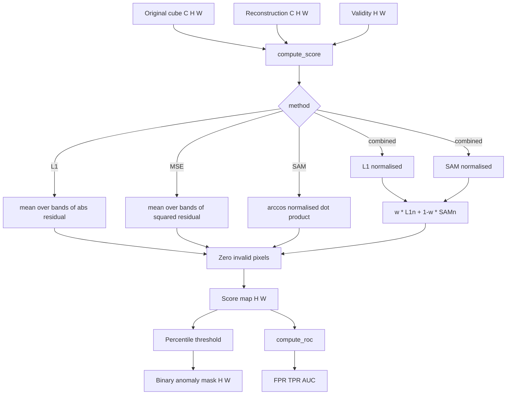
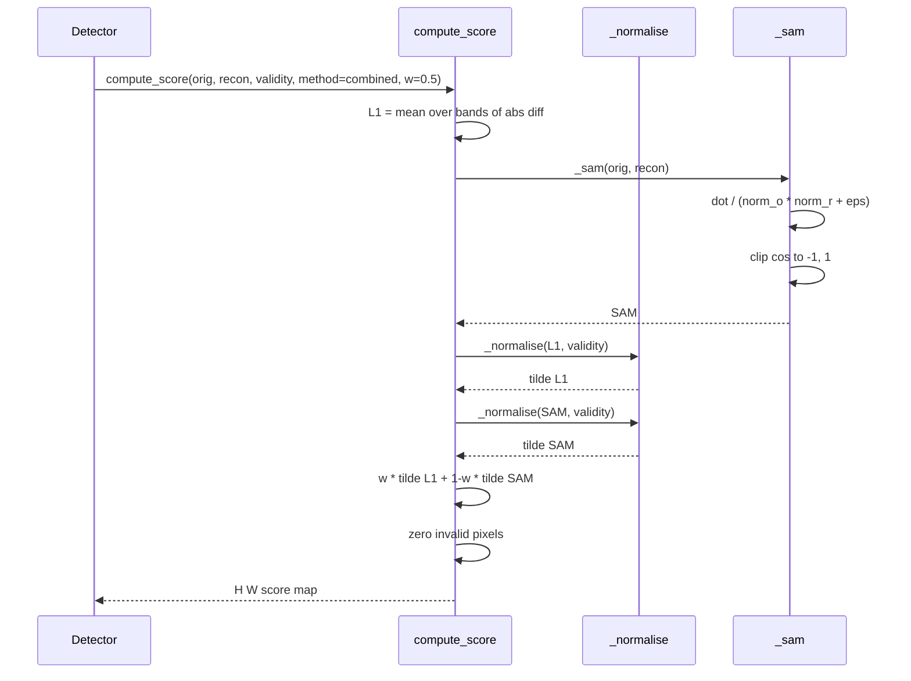

# 5.8 Scoring — Residual → Anomaly Map

File: [scoring.py](../../app/utils/anomaly_detection/scoring.py).

The reconstruction inferencers in §5.2 — 5.6 produce a per-pixel
$\hat x$ the same shape as the input cube. The scoring module turns the
pair $(x, \hat x)$ into a single $(H, W)$ anomaly heatmap. This is the
canonical residual-to-score function used by the anomaly detection
action handler for *any* reconstruction-based foundation model.

## What the code does

### `compute_score`

`compute_score(original, reconstruction, validity, method, *, combined_weight)`
([scoring.py:41](../../app/utils/anomaly_detection/scoring.py#L41))
is the entry point. Four methods:

| Method     | Formula                                                                                       | When to use                          |
|------------|-----------------------------------------------------------------------------------------------|--------------------------------------|
| `L1`       | $\text{mean}_c \lvert x_c - \hat x_c \rvert$                                                  | Any number of bands; default thermal |
| `MSE`      | $\text{mean}_c (x_c - \hat x_c)^2$                                                            | Match MSE-loss training              |
| `SAM`      | $\arccos\!\left(\dfrac{x \cdot \hat x}{\lVert x \rVert \, \lVert \hat x \rVert}\right)$       | Multi-band only; spectral shape      |
| `combined` | $w \cdot \tilde L_1 + (1 - w) \cdot \tilde{\text{SAM}}$, each normalised to its valid-pixel max | Default for Indradhanu (HS SegFormer-MAE) |

### `_sam`

`_sam`
([scoring.py:95](../../app/utils/anomaly_detection/scoring.py#L95))
implements the dot-product form with `eps = 1e-8` to prevent zero-norm
explosions, and clips $\cos$ to $[-1, 1]$ before `arccos`. Without the
clip, tiny floating-point overshoots produce NaN from `arccos(1.0001)`,
which silently propagate downstream.

### `_normalise`

`_normalise`
([scoring.py:106](../../app/utils/anomaly_detection/scoring.py#L106))
divides by the max over *valid* pixels only. This is essential — when
the scene has masked-off regions (clouds, off-swath, no-data), those
pixels would otherwise have score 0 and the max would include them
without affecting the result, but if a single border pixel had a
spurious infinity (it cannot, but defensively), normalising over the
full array would collapse the rest of the score map. Valid-pixel-only
normalisation also makes the threshold conventions sensible (top 1%
of *valid* pixels, not top 1% of-the-tensor-including-padding).

### `compute_roc`

`compute_roc`
([scoring.py:120](../../app/utils/anomaly_detection/scoring.py#L120))
ties scores to a ground-truth binary mask. It sweeps up to 256
percentile-spaced thresholds, computes TPR / FPR at each, and returns a
trapezoidal-rule AUC. The thresholds are *percentiles of the score
over valid pixels* (lines 154 — 157), not linearly spaced — score
distributions are heavy-tailed so percentile spacing gives much better
resolution near the operating point.

### Validity zeroing

`compute_score` zeros every output pixel where `validity == 0`
([scoring.py:91](../../app/utils/anomaly_detection/scoring.py#L91))
so downstream code can safely percentile-rank without filtering.
Without this, invalid pixels would carry whatever garbage value the
residual produced (often large because the reconstruction is
unreliable in invalid regions) and dominate the ranking.

## Theory in plain language

### Why L1 over MSE

L1 is the median residual, MSE is the mean residual. For
anomaly-detection-via-reconstruction we care about *outlier
sensitivity*, which is exactly opposite to the usual MSE motivation.
L1 down-weights extreme deviations relative to MSE, which sounds bad
but is actually right here — a single pixel with a 10× deviation
shouldn't outshout 100 pixels with 2× deviations.

### Why SAM in addition

The L1 / MSE residual is a *magnitude* signal. SAM is a *shape*
signal. A spectral anomaly that has the same per-band brightness as
normal but with a different absorption profile (a chemistry-driven
anomaly: methane, oil, an unusual material) has small L1 but large
SAM. The opposite is also true: a bright cloud has large L1 but small
SAM. Reporting both lets the operator decide which kind of anomaly
matters.

### Why combined and why $w = 0.5$

Both L1 and SAM are non-negative scores. Normalising each by its
valid-pixel max puts them on the same $[0, 1]$ scale. The convex
combination $w \tilde L_1 + (1 - w) \tilde{\text{SAM}}$ is a heuristic
hedge: $w = 0.5$ says "I have no reason to trust one over the other".
At $w = 0$ this reduces to SAM, at $w = 1$ to L1. Allotrope keeps
$w = 0.5$ as the default for the hyperspectral SegFormer-MAE
(Indradhanu) because that model was trained on an L1 + SAM combined
loss, so the test-time scoring matches the training objective.

### Why percentile thresholding, not fixed

A fixed threshold $\tau = 0.05$ in the score units is impossible to
defend across scenes — a clean lake scene has typical residuals around
$0.01$ and a fire-affected scene has typical residuals around $0.1$;
the same threshold would flag everything in the second scene and
nothing in the first. A percentile threshold says "top 1% of pixels
in *this* scene are anomalies" — it adapts to the scene's own score
distribution, which is what an operator would do by eye.

## Worked numerical example

Take a 1024×1024 hyperspectral scene with $C = 60$ bands. After
two-pass inference we have a stitched reconstruction $\hat x$ of the
same shape.

### Per-pixel L1

For one pixel $(i, j)$ with $x(:, i, j) = [0.42, 0.41, \dots]$ and
$\hat x(:, i, j) = [0.40, 0.43, \dots]$, the L1 score is

$$ L_1(i, j) = \frac{1}{60} \sum_{c=1}^{60} |x_c - \hat x_c|. $$

For uniformly $\pm 0.02$ deviations this is $0.02$.

### Per-pixel MSE

Same input. MSE is

$$ \text{MSE}(i, j) = \frac{1}{60} \sum_{c=1}^{60} (x_c - \hat x_c)^2 = (0.02)^2 = 0.0004. $$

Different units, different scale — comparing $L_1$ and MSE across
detectors requires normalisation, which is why the combined score
normalises before mixing.

### Per-pixel SAM

Same pixel, dot product $\sum_c x_c \hat x_c$. If
$\lVert x \rVert = \sqrt{60} \cdot 0.41$ and
$\lVert \hat x \rVert \approx \lVert x \rVert$, and deviations are
purely magnitude (same shape), $\cos\theta \approx 1$ and
$\text{SAM} \approx 0$. If some bands flipped sign of deviation
(shape change), $\cos\theta < 1$ and SAM grows. SAM and L1 carry
*independent* information.

### Combined score

Compute the two maps over the whole scene, normalise each by its
valid-pixel max:

$$ \tilde L_1 = \frac{L_1}{\max_{\text{valid}} L_1}, \quad \tilde{\text{SAM}} = \frac{\text{SAM}}{\max_{\text{valid}} \text{SAM}}, $$

and form $0.5 \cdot \tilde L_1 + 0.5 \cdot \tilde{\text{SAM}}$. Both
in $[0, 1]$ on the same scale.

Numerical: suppose $\max_{\text{valid}} L_1 = 0.08$ and
$\max_{\text{valid}} \text{SAM} = 0.4$ rad over the whole scene. The
pixel above with $L_1 = 0.02$ and $\text{SAM} = 0.141$ has
$\tilde L_1 = 0.25$, $\tilde{\text{SAM}} = 0.353$, and combined
$0.5 \cdot 0.25 + 0.5 \cdot 0.353 = 0.301$.

### Percentile thresholding

Anomalies are by definition rare. A common convention is "top 1% of
valid pixels are anomalies", i.e. threshold at the 99th percentile of
the score map over valid pixels:

$$ \tau = \mathrm{percentile}_{99}\big(\text{score}[\text{valid}]\big). $$

Pixels with $\text{score}(i, j) > \tau$ are flagged. If our
1024×1024 scene has $\approx 10^6$ valid pixels, this surfaces the
top $\approx 10^4$ candidates — a manageable shortlist.

Trace the calculation:

- Sort the $10^6$ valid scores.
- The 99th percentile is the score at rank $0.99 \cdot 10^6 = 990{,}000$.
- $\tau$ is the value at that rank.
- All $10{,}000$ pixels above $\tau$ are flagged.

`compute_roc` automates the *sweep* of $\tau$ for ROC/AUC, but for
production scoring a single percentile cut is what the UI shows. The
sweep uses up to 256 thresholds — line 155:

```python
n_pts = min(max_thresholds, max(20, s.size // 10000 + 64))
qs = np.linspace(0.0, 100.0, n_pts)
ths = np.percentile(s, qs)
```

For $10^6$ pixels this gives $\min(256, \max(20, 164)) = 164$
thresholds, evenly spaced in percentile space.

### AUC arithmetic

The ROC curve is a step function of (FPR, TPR) over thresholds.
`compute_roc` anchors the curve at $(0, 0)$ and $(1, 1)$, sorts by
FPR, and integrates with `np.trapezoid`. A random detector gives
AUC = 0.5; a perfect one gives AUC = 1.0.

### Map invariants

`compute_score` zeros every output pixel where `validity == 0`. Two
consequences:

- Downstream percentile computations can use `np.percentile` directly
  on the full array if invalid pixels are also masked out before
  `percentile`, or use `np.percentile(score[valid], ...)` to be safe.
  The codebase uses the latter convention.
- Mean/standard-deviation summaries of the score map should always
  restrict to valid pixels; otherwise the zeros from invalid pixels
  bias the statistics downward.

## Pipeline



## Sequence


