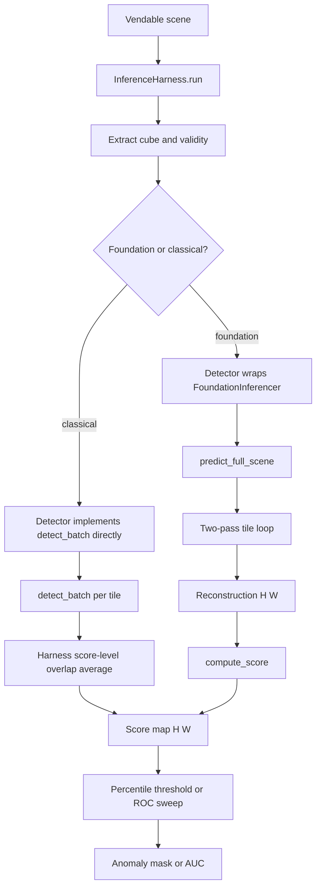
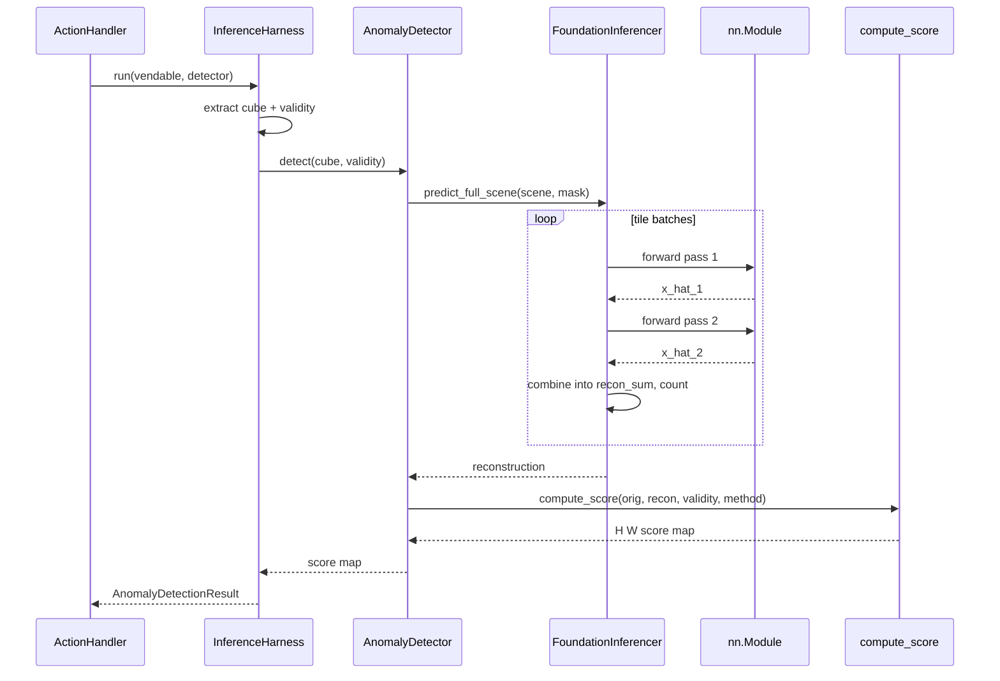
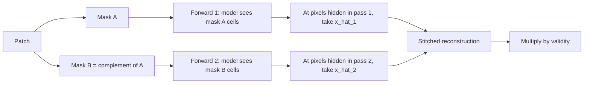

# 5.9 Summary

Inference in Allotrope is a layered orchestration. Each layer owns a
single concern, and the layers compose top-down: action handler →
harness → inferencer → model → scorer.

## The layering

- The **base inferencer**
  ([foundation_inferencer.py:21](../../app/abstract_classes/foundation_inferencer.py#L21))
  owns device, `eval()`, and `no_grad()`. These three are global
  invariants — getting one wrong silently corrupts every downstream
  result, so they live exactly once on the base class.

- **Concrete inferencers** own the two-pass masking convention
  appropriate to their architecture:
  - Pixel checkerboard for the CNN-style autoencoders (§5.2, §5.3, §5.4).
  - Token checkerboard or complementary random masks for the
    SegFormer-MAE family (§5.5, §5.6).

  Every inferencer follows the same rule: *each pixel's value in the
  final reconstruction comes from the pass where that pixel (or its
  token) was hidden*. The literal combine line in code looks different
  across files because the input-masking convention also varies, but
  the logical rule is identical.

- **`predict_full_scene`** in each inferencer turns a patch-batch
  model into a full-resolution reconstruction by sliding a window,
  optionally eroding the validity mask (§5.5), filtering low-coverage
  tiles, and overlap-averaging at the reconstruction level.

- **`InferenceHarness`**
  ([inference_harness.py:33](../../app/utils/anomaly_detection/inference_harness.py#L33))
  wraps a generic `AnomalyDetector` (foundation or classical) in
  framework-agnostic numpy code. For non-foundation detectors it does
  its own score-level overlap averaging.

- **`compute_score`**
  ([scoring.py:41](../../app/utils/anomaly_detection/scoring.py#L41))
  converts the dense reconstruction into a single $(H, W)$ anomaly
  heatmap with a method chosen per sensor: L1 / MSE for thermal, SAM
  or combined for hyperspectral.

## The invariants

Every pixel in the final heatmap satisfies four properties:

1. **Predicted from context only.** No pixel is reconstructed from
   itself — the two-pass complementary-mask scheme guarantees this on
   every concrete inferencer.
2. **Averaged across overlapping tiles.** Boundary noise is reduced by
   $\sqrt{k}$ where $k$ is the per-pixel coverage count (typically
   $k = 4$ for interior pixels at $\text{stride} = \text{ps} / 2$).
3. **Normalised against the scene's own valid-pixel statistics.**
   `_normalise` divides by the max over valid pixels; combined scoring
   mixes two normalised maps. No cross-scene threshold is hard-coded.
4. **Validity-zeroed.** Invalid pixels are 0 in the output, so
   percentile and ROC computations don't need to filter beforehand.

The result is ready for a percentile cut (top 1% of valid pixels) or
an ROC sweep against ground truth.

## End-to-end pipeline

## Sequence: full inference call

## Two-pass complementary masking (canonical rule)

The one-sentence rule: each pixel's value comes from the pass where it
was hidden. Every two-pass inferencer in the repo implements exactly
this, regardless of how the literal combine line is written.

## What's next

Chapter 6 covers the classical detectors (MNF compression, RX) that
also plug into the `InferenceHarness` but produce scores directly,
without a reconstruction step.
