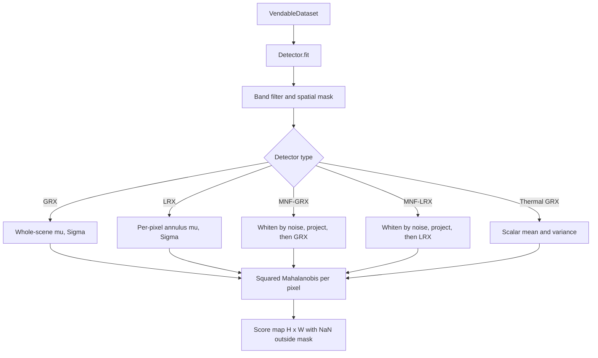
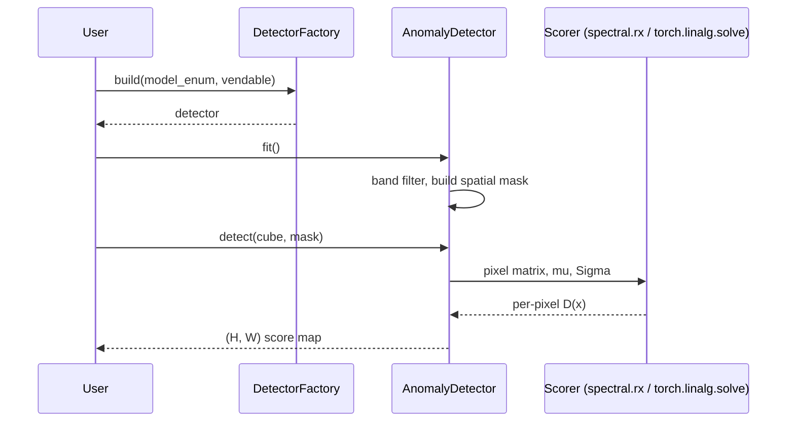

# 6.1 The RX statistic — the engine inside every classical detector

Every non-deep-learning anomaly detector that ships in Allotrope is, at
its mathematical core, the same one-line formula evaluated in a
different feature space. That formula is the **Reed-Xiaoli (RX)
statistic**, and this section derives it three ways, places it in its
statistical context, and explains why so much of the surrounding code
is preoccupied with conditioning the covariance matrix.

The detectors that consume this statistic live under
[`app/detectors/`](../../app/detectors/). They all subclass the abstract
contract at
[anomaly_detector.py](../../app/abstract_classes/anomaly_detector.py):

```python
class AnomalyDetector(ABC):
    def __init__(self, vendable: VendableDataset): ...
    @abstractmethod
    def detect(self, cube, validity_mask=None) -> np.ndarray: ...
    def detect_batch(self, cubes, validity_masks=None) -> np.ndarray: ...
    def fit(self, **kwargs) -> None: ...
```

A detector is constructed with a `VendableDataset` (a Pydantic-modelled
view of one scene, see Chapter 2) and emits a per-pixel anomaly score
map shaped `(H, W)`, with `NaN` outside the valid swath. Higher score
means more anomalous. The factory at
[detector_factory.py:17](../../app/utils/anomaly_detection/detector_factory.py#L17)
maps an `ADModel` enum value to the corresponding class.

## 6.1.1 The cast of characters

| Detector | File | Idea in one line |
| --- | --- | --- |
| `GlobalRXDetector` | [global_rx_detector.py](../../app/detectors/global_rx_detector.py) | Mahalanobis distance against the whole scene |
| `LocalRXDetector` | [local_rx_detector.py](../../app/detectors/local_rx_detector.py) | Mahalanobis against an annulus around each pixel |
| `MNFCompressionDetector` | [mnf_compression_detector.py](../../app/detectors/mnf_compression_detector.py) | Whiten noise, keep top-k SNR components, then GRX |
| `MNFCompressionLRXDetector` | [mnf_compression_lrx_detector.py](../../app/detectors/mnf_compression_lrx_detector.py) | MNF compress, then LRX |
| `ThermalGRXDetector` | [thermal_grx_detector.py](../../app/detectors/thermal_grx_detector.py) | One-band GRX, reduces to squared z-score |
| `StatisticalEnsembler` | [statistical_ensembler.py](../../app/detectors/statistical_ensembler.py) | CDF-normalise GRX and LRX, fuse |
| `B10AdaptiveCloudMasker` | [b10_adaptive_cloud_masker.py](../../app/statistical_models/b10_adaptive_cloud_masker.py) | 5-component GMM on Landsat B10 brightness temperature |
| `match_pixels` (SAM) | [spectral_match/sam.py](../../app/spectral_match/sam.py) | Spectral Angle Mapper top-K against USGS splib07 |

## 6.1.2 The formula

Given a length-$B$ pixel spectrum $x \in \mathbb{R}^B$ and a background
distribution with mean $\mu$ and covariance $\Sigma$, the **RX detector**
statistic is

$$
D(x) \;=\; (x - \mu)^{\top}\,\Sigma^{-1}\,(x - \mu).
$$

This is the squared **Mahalanobis distance** from $x$ to $\mu$ under the
metric induced by $\Sigma^{-1}$.

## 6.1.3 Three equivalent readings

### Geometric reading

Eigendecompose the covariance $\Sigma = U\Lambda U^{\top}$ with
$\Lambda = \mathrm{diag}(\lambda_1, \ldots, \lambda_B)$. Then
$\Sigma^{-1} = U\Lambda^{-1}U^{\top}$, and writing $y = \Lambda^{-1/2}
U^{\top}(x-\mu)$,

$$
D(x) \;=\; (x-\mu)^{\top}U\Lambda^{-1}U^{\top}(x-\mu) \;=\; \|y\|_2^2.
$$

So the RX score is **ordinary squared Euclidean distance** in a
coordinate system where the background cloud has been rotated to its
principal axes and each axis rescaled so its variance is 1. Pixels
that are far from the cloud in any direction score high. Crucially,
directions in which the background varies a lot ($\lambda_i$ large) get
*down-weighted*, while directions in which the background never varies
($\lambda_i$ small) become very sensitive.

### Statistical reading — chi-squared

Suppose the background is multivariate Gaussian
$x \sim \mathcal{N}(\mu, \Sigma)$. Then $\Sigma^{-1/2}(x-\mu) \sim
\mathcal{N}(0, I_B)$, and the squared norm of a $B$-dimensional standard
normal is by definition a chi-squared random variable with $B$ degrees
of freedom:

$$
D(x) \;\sim\; \chi^2_B.
$$

This is the **calibration knob**. Pick a desired false-alarm rate
$\alpha$ (say $0.01$), look up the chi-squared quantile
$\tau = F^{-1}_{\chi^2_B}(1-\alpha)$, and flag pixels with
$D(x) > \tau$. For $B=10$ bands and $\alpha=0.01$, $\tau \approx 23.21$;
for $B=1$ (thermal), $\tau \approx 6.63$.

### Likelihood-ratio reading — GLRT

Consider testing
$H_0\!: x \sim \mathcal{N}(\mu, \Sigma)$
against
$H_1\!: x \sim \mathcal{N}(\mu + s, \Sigma)$ for some unknown
signal $s$. The log likelihood ratio for a given $s$ is

$$
\log\frac{p_1(x)}{p_0(x)} \;=\; s^{\top}\Sigma^{-1}(x-\mu) - \tfrac{1}{2} s^{\top}\Sigma^{-1} s.
$$

Maximising over $s$ (the generalised LRT) gives the maximum-likelihood
$\hat s = x - \mu$, and substituting back collapses the test to

$$
2\log\frac{p_1(x)}{p_0(x)} \;=\; (x-\mu)^{\top}\Sigma^{-1}(x-\mu) \;=\; D(x).
$$

Under the Gaussian background assumption, RX is therefore the
**uniformly most powerful invariant detector** of the form
"Gaussian plus unknown additive signal" — no quadratic statistic can do
strictly better.

## 6.1.4 Why the whole catalogue is just different $(\mu, \Sigma)$

Every concrete detector in Allotrope is RX with a different choice of
$(\mu, \Sigma)$ and a different feature space:

| Detector | $\mu$ | $\Sigma$ | Where computed |
| --- | --- | --- | --- |
| GRX | scene mean | scene covariance | once, in `spectral.rx` |
| LRX | annulus mean per pixel | annulus covariance per pixel | inside sliding window |
| MNF-GRX | mean in compressed space | covariance in compressed space | after MNF projection |
| MNF-LRX | annulus mean in MNF space | annulus covariance in MNF space | inside sliding window in MNF space |
| Thermal GRX | scalar mean temperature | scalar variance | closed form (z-score) |

The rest of this chapter is a tour of these choices — what feature
space, what window, what regularisation, what fusion — and the rest of
the surrounding code (band filtering, validity masks, GPU batching,
destriping, MNF whitening) exists to make $(\mu, \Sigma)$
well-conditioned enough that the inverse does not blow up.

## 6.1.5 Why we need to be careful — the conditioning problem

For $\Sigma^{-1}$ to behave, the empirical covariance $\hat\Sigma$ has
to be non-singular. The classical rule of thumb is **at least $10B$
samples for $B$ bands**; the GRX detector logs a warning when that
ratio drops below 10 at
[global_rx_detector.py:145](../../app/detectors/global_rx_detector.py#L145).
Three pathologies routinely break this assumption in real HSI scenes.

1. **Dead or noisy bands.** Bands with mostly invalid pixels make
   $\hat\Sigma$ nearly rank-deficient because they contribute a row/column
   of zeros after centring. Allotrope filters them in two stages
   (the next section).
2. **Off-swath pixels.** Pixels outside the imaging swath read as
   sentinel or `NaN`. Including them poisons $\hat\mu$ and $\hat\Sigma$.
   Each detector builds a spatial validity mask that only keeps pixels
   where a configurable fraction (default 95%) of surviving bands are
   valid.
3. **Striping or sensor noise.** Stripes are not anomalies, but RX will
   happily flag them — they are large, repeatable deviations from $\mu$.
   The ensembler optionally pipes the cube through `CombinedDestriper`
   before scoring, and MNF compresses away the high-noise components
   entirely.

The standard remedy when $\hat\Sigma$ is still ill-conditioned is
**diagonal loading** (Tikhonov / ridge regularisation):

$$
\hat\Sigma_\lambda \;=\; \hat\Sigma + \lambda I,
$$

with $\lambda$ small and positive (LRX uses $\lambda = 10^{-3}$ at
[local_rx_detector.py:108](../../app/detectors/local_rx_detector.py#L108)).
This shifts every eigenvalue by $\lambda$, bounds the largest
inverse-eigenvalue at $1/\lambda$, and is equivalent to imposing a
small isotropic noise floor on the background.

## 6.1.6 Pipeline overview





That is the entire intellectual content of the chapter. The next twelve
sections walk each implementation in turn.
