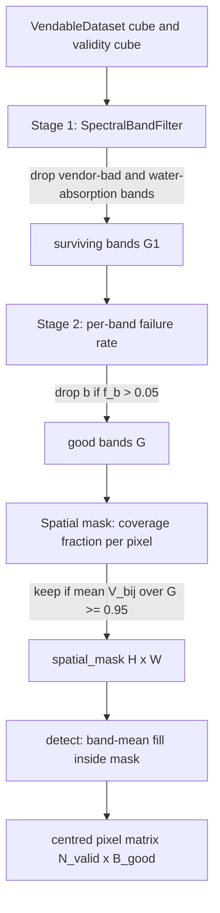

# 6.2 Shared preprocessing — band filter and spatial mask

Four of the five classical detectors (GRX, LRX, MNF-GRX, MNF-LRX) share
a near-identical `fit()` routine that turns a `VendableDataset` into
three artefacts used by `detect()`:

- `self._good_indices` — the indices of bands that survived filtering.
- `self._good_wavelengths` — their centre wavelengths (kept for
  logging and for resampling SAM libraries).
- `self._spatial_mask` — an `(H, W)` boolean array of pixels worth
  scoring.

The thermal detector skips most of this because it only has one band.
This section explains the two filtering stages, the spatial mask, and
the band-mean fill that happens at score time.

## 6.2.1 Stage 1 — wavelength and flag filter

[`SpectralBandFilter`](../../app/utils/data_transformations/spectral_band_filter.py)
drops any band whose vendor metadata flags it as bad — for PRISMA this
includes the SWIR overlap region and a few permanently dead detectors —
and any band whose centre wavelength falls inside a known atmospheric
water-absorption window (typically near 1.38, 1.87 µm). See
[global_rx_detector.py:79-84](../../app/detectors/global_rx_detector.py#L79).

The filter is sensor-aware: PRISMA, EnMAP, AVIRIS-NG, and Landsat each
carry their own band-flag table inside their `Vendable` Pydantic
models. The same code path is used downstream by foundation-model
trainers, so the band index space the detectors operate in is exactly
the band index space the neural models see.

## 6.2.2 Stage 2 — per-pixel failure rate

Vendor flags catch *systemic* bad bands. They miss bands that are
nominally good but happen to be nearly empty in this scene — e.g. a
band where most pixels saturated under unusual illumination. Stage 2
patches that hole by measuring, for each surviving band $b$, the
fraction of "any-band-valid" pixels at which $b$ specifically reads
invalid:

$$
f_b \;=\; 1 \;-\; \frac{|\{(i,j)\,:\, V_{b,i,j}=1 \text{ and any band valid at } (i,j)\}|}{|\{(i,j)\,:\, \text{any band valid}\}|}.
$$

Bands with $f_b > 0.05$ are dropped
([global_rx_detector.py:94-105](../../app/detectors/global_rx_detector.py#L94)).
The threshold is conservative; in practice this stage typically prunes
between 0 and 5 additional bands per PRISMA scene.

## 6.2.3 The spatial mask — coverage fraction

After the band set is fixed, each pixel needs to qualify spatially. A
pixel $(i, j)$ enters the mask iff

$$
\frac{1}{|G|}\sum_{b \in G} V_{b,i,j} \;\ge\; \tau_{\text{cov}},
$$

where $G$ is the set of surviving bands and $\tau_{\text{cov}}$ defaults
to $0.95$. The strict alternative `min_band_coverage=1.0` requires every
surviving band to be valid; relaxing it to 0.95 recovers tens of
thousands of edge pixels at the cost of a few band-mean fills
([global_rx_detector.py:121-134](../../app/detectors/global_rx_detector.py#L121)).

You will sometimes want $\tau_{\text{cov}} = 1.0$. The classic case is a
swath-edge cloud-shadow strip where 5 % of bands at every pixel are
dropouts of the same banding. Then a 0.95 mask quietly admits a stripe,
which the band-mean fill paints over but does not remove from the
covariance estimate; the strict mask is safer.

## 6.2.4 Band-mean fill in `detect()`

Inside the spatial mask, a small number of pixels may still be missing
a particular band. At score time, those entries are replaced by the
band's scene-wide mean
([global_rx_detector.py:186-210](../../app/detectors/global_rx_detector.py#L186)).
The pixel's centred value for that band is then exactly zero, and so it
contributes zero to $D(x) = \sum_b\sum_{b'} (x-\mu)_b
(\Sigma^{-1})_{bb'}(x-\mu)_{b'}$ for any term that touches it. A
missing band therefore cannot fake an anomaly — at worst the score is
underestimated.

## 6.2.5 Filter pipeline diagram

The order matters: band filtering must come before the spatial mask,
because the coverage fraction is computed over the surviving bands. If
you mask spatially first, a poorly-flagged band will pull the mask
inward and you lose valid scene area for no reason.

## 6.2.6 What this preprocessing does **not** do

- **Atmospheric correction.** The detectors operate on whatever
  reflectance / radiance the `Vendable` returns. If your scene is
  TOA reflectance and you wanted BOA, that's an upstream concern.
- **Destriping.** The single optional destriping path is in
  `StatisticalEnsembler` (section 6.8). MNF achieves a similar effect
  implicitly by isolating noise into the discarded components.
- **Cloud masking.** Clouds will absolutely flag in any RX variant.
  Apply `B10AdaptiveCloudMasker` (section 6.9) upstream if clouds are
  the dominant anomaly population in your scene.

The preprocessing exists for one purpose: to hand the RX core a
well-conditioned pixel matrix. With that in hand, the next section
walks the simplest detector that uses it — global RX.
