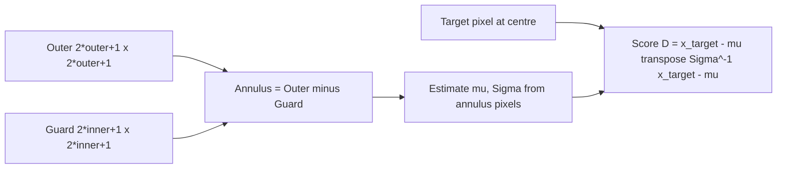

# 6.4 Local RX — `LocalRXDetector`

`LocalRXDetector` is GRX's local cousin. Instead of one global
$(\hat\mu, \hat\Sigma)$, it estimates them in a sliding **annular**
window around each target pixel: an outer square minus an inner *guard*
square. The detector is by far the most expensive in the catalogue and
also, on most real scenes, the most useful — because real backgrounds
are emphatically not stationary on a global scale.

## 6.4.1 What the code does

Source:
[local_rx_detector.py](../../app/detectors/local_rx_detector.py).

- `fit()` ([local_rx_detector.py:133](../../app/detectors/local_rx_detector.py#L133))
  performs exactly the same two-stage band filter and spatial mask as
  GRX (section 6.2). The local statistics are computed on the fly in
  `detect()`; nothing scene-wide is precomputed.
- `detect()` ([local_rx_detector.py:203](../../app/detectors/local_rx_detector.py#L203))
  is where the interesting work happens. For each pixel $(r, c)$:
  1. Build an **outer square** of half-size `outer_window` (default 25)
     and a **guard square** of half-size `inner_window` (default 5).
     The annulus is outer minus guard.
  2. Collect the spatially valid pixels in the annulus, yielding
     `X_bg ∈ R^{n_bg × B_good}`.
  3. If `n_bg < min_bg` (default $B+1$), skip — the local covariance
     is too rank-deficient to invert reliably.
  4. Batch the pixel together with up to `batch_size` others, ship to
     GPU (CUDA, MPS, or CPU), compute $\hat\mu$ and
     $\hat\Sigma + \lambda I$, solve $\Sigma\, s = (x - \hat\mu)$ via
     `torch.linalg.solve`, and return the score $s^{\top}(x - \hat\mu)$
     ([local_rx_detector.py:75-117](../../app/detectors/local_rx_detector.py#L75)).
- A `stride > 1` option subsamples the grid and bilinearly interpolates
  the score map back to full resolution
  ([local_rx_detector.py:443](../../app/detectors/local_rx_detector.py#L443)).
  Useful when the outer window is large and you can tolerate a
  smoother score map.

### The padded-batch trick

Every annulus has a different `n_bg` depending on how many pixels in
the surrounding box are spatially valid. Torch prefers fixed-shape
tensors. The code pads each annulus to
$\text{max\_bg} = (2\,\text{outer}+1)^2 - (2\,\text{inner}+1)^2$
and uses a length mask to zero out the padding before summing. This
turns the per-pixel covariance estimation into a single batched
matmul, which is the only reason LRX runs at acceptable speed at all.

### Why diagonal-loading is non-negotiable here

In GRX, $N$ is large (millions of pixels) and $B$ is at most a few
hundred, so $N \gg 10B$ and $\hat\Sigma$ is well-conditioned even
without a ridge. In LRX, $n_{\text{bg}}$ is at most a few thousand and
often only a few hundred. For PRISMA with $\sim 165$ surviving bands,
a 25-radius annulus gives $\sim 2300$ pixels — about 14 samples per
band, just above the rule of thumb but with the smallest covariance
eigenvalues uncomfortably close to zero. The ridge
$\lambda = 10^{-3} I$ at
[local_rx_detector.py:108](../../app/detectors/local_rx_detector.py#L108)
puts a hard floor on the smallest eigenvalue and prevents
$\Sigma^{-1}$ from amplifying noise into a spurious anomaly score.

## 6.4.2 Theory in plain language

LRX assumes the background is **locally stationary**: in any small
patch, the spectra look like one Gaussian. This is a much more
reasonable assumption than GRX's global one — a forest pixel is now
compared against its forest neighbours, not against ocean. The cost is
three-fold:

- $n_{\text{bg}}$ is small, often only a few hundred. With $B = 150+$
  bands raw, $\hat\Sigma$ is badly conditioned and the ridge $\lambda I$
  becomes essential.
- Edges of swath, cloud edges, and shorelines have heterogeneous
  annuli — half forest, half ocean — and LRX over-flags there because
  the local "background" includes two materials.
- Compute is roughly $O(H \cdot W \cdot B^2)$; without MNF compression
  it is the slowest detector in the pack.

### The guard window — why a hole in the middle?

The guard region exists so that a real anomaly that spans a few pixels
does not contaminate its own background statistics. If the target is a
3×3 hot pixel cluster and `inner_window = 5`, none of the target leaks
into $\hat\mu$ or $\hat\Sigma$, and the detector retains its full
sensitivity. Without a guard, the centre target pixel pulls its own
mean toward itself and depresses its own score — the same masking
effect we saw in GRX's 4-pixel example.

The default guard of 5 pixels handles anomalies up to about 11×11.
For larger objects (industrial plumes, large algal blooms) you would
widen `inner_window`; for the smallest possible targets you can drop
it to 1.

## 6.4.3 LRX window geometry



ASCII figure for a $1\times 1$ target at $(r, c) = (10, 10)$ with
`outer_window = 4` and `inner_window = 1`. `O` = outer-annulus pixel
(used as background), `G` = guard pixel (excluded), `*` = target.

```
col:      6 7 8 9 10 11 12 13 14
row  6 :  O O O O O  O  O  O  O
row  7 :  O O O O O  O  O  O  O
row  8 :  O O O O O  O  O  O  O
row  9 :  O O O G G  G  O  O  O
row 10 :  O O O G *  G  O  O  O
row 11 :  O O O G G  G  O  O  O
row 12 :  O O O O O  O  O  O  O
row 13 :  O O O O O  O  O  O  O
row 14 :  O O O O O  O  O  O  O
```

Counts: outer square $9 \times 9 = 81$, guard square $3 \times 3 = 9$,
annulus $= 72$. With `min_bg = B + 1`, the pixel can be scored as long
as 72 minus the off-swath pixels exceeds $B + 1$.

For LRX on raw PRISMA (~165 surviving bands) you need an outer window
of at least 15 just to clear the $10B$ rule of thumb:
$(31^2 - 11^2) = 840$. The default outer window of 25 gives 2304
background pixels, plenty for stable covariance.

## 6.4.4 Worked numerical example — LRX on a 1-D line

Local RX is hard to compute by hand at full dimensionality, but you can
see the masking-effect cure clearly in a one-band, 1-D example.

Take a row of 11 thermal pixels (°C):

```
[20, 21, 19, 20, 21, 80, 20, 19, 21, 20, 20]
```

Position 5 (zero-indexed) is the anomaly. We compute LRX at position 5
with `outer = 4` and `inner = 1`, so the annulus is positions 1, 2, 3
and 7, 8, 9.

Annulus values: `[21, 19, 20, 19, 21, 20]`. Mean
$\hat\mu \approx 20.0$, variance (with $n-1=5$)

$$
\hat\sigma^2 = \tfrac{1}{5}\sum (x_i - 20)^2 = \tfrac{1}{5}(1 + 1 + 0 + 1 + 1 + 0) = 0.8.
$$

LRX score at position 5:

$$
D = \frac{(80 - 20)^2}{0.8} = \frac{3600}{0.8} = 4500.
$$

Compare to **GRX** on the same row (mean $\approx 25.5$,
variance $\approx 322.6$):

$$
D_{\text{GRX}} = \frac{(80 - 25.5)^2}{322.6} \approx \frac{2970.25}{322.6} \approx 9.21.
$$

LRX scores the same pixel **about 500× higher**. That ratio is
representative: localising the background nullifies the masking effect
because the suspect pixel is excluded from its own statistics by the
guard window, and the remaining background is genuinely homogeneous.

## 6.4.5 Failure modes

- **Heterogeneous annulus.** Near shorelines, swath edges, or cloud
  fringes, the annulus straddles two land-cover classes. The local
  covariance becomes bimodal, the local mean lands between the modes,
  and *every* pixel in either mode scores anomalously. Visually this
  shows up as a rim of "anomaly" along boundaries. The MNF-LRX
  variant in section 6.6 partially fixes this by reducing to the
  few-component subspace where the bimodality is less severe.
- **Small annulus, high $B$.** If `outer_window` is set too small
  (e.g. 10) on a 165-band cube, $n_{\text{bg}} = 21^2 - 11^2 = 320$,
  barely $2B$, and the covariance inverse is dominated by the ridge.
  Increase `outer_window` or compress with MNF first.
- **`stride > 1`.** Bilinear interpolation blurs sharp single-pixel
  anomalies. Acceptable for diffuse anomalies, undesirable for
  point sources.
- **GPU memory.** The padded-batch tensor is
  `batch × max_bg × B_good × 4 bytes`. On a 165-band PRISMA scene
  with `batch_size = 512` and `max_bg = 2304`, that is about 750 MB
  per dimension; the matmul peak is several GB. The detector adapts
  `batch_size` to MPS limits on Apple Silicon — see the GPU notes in
  the trainer documentation.

LRX is the strongest of the raw-spectrum classical detectors. The next
sections introduce MNF, which is what you reach for when raw LRX is
either too slow or too noise-dominated to be useful.
