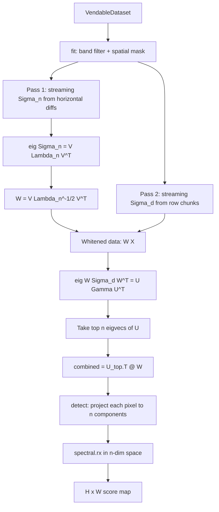

# 6.5 MNF compression + GRX — `MNFCompressionDetector`

MNF stands for **Minimum Noise Fraction**. It is to hyperspectral data
roughly what PCA is to natural images, with one crucial difference: PCA
maximises **data variance**, MNF maximises **signal-to-noise ratio**.
The `MNFCompressionDetector` is GRX run on a low-dimensional MNF
projection of the cube; the projection is chosen so that the retained
components are exactly the ones with highest SNR.

## 6.5.1 What the code does

Source:
[mnf_compression_detector.py](../../app/detectors/mnf_compression_detector.py).

- `fit()` ([mnf_compression_detector.py:70](../../app/detectors/mnf_compression_detector.py#L70))
  proceeds in four sub-stages:
  - Stage 1+2 band filtering and spatial mask, identical to GRX
    (section 6.2).
  - **Streaming noise covariance** from horizontal shift-differences,
    in one pass over row chunks
    ([mnf_compression_detector.py:349](../../app/detectors/mnf_compression_detector.py#L349)).
    The assumption is that horizontally adjacent pixels share signal
    but have independent noise, so the covariance of
    $d_{i,j} = x_{i,j+1} - x_{i,j}$ is $2 \Sigma_n$. We divide by 2 to
    recover $\hat\Sigma_n$
    ([mnf_compression_detector.py:422](../../app/detectors/mnf_compression_detector.py#L422)).
  - **MNF transform** via eigendecomposition of the *noise-whitened*
    data covariance
    ([mnf_compression_detector.py:424](../../app/detectors/mnf_compression_detector.py#L424)):
    eigendecompose $\hat\Sigma_n$, form $W = V \Lambda_n^{-1/2}
    V^{\top}$, whiten the data, eigendecompose the whitened data
    covariance, sort eigenvalues descending. The composed matrix
    `combined = eigvecs[:n].T @ whiten` is stored as
    `self._mnf_components`
    ([mnf_compression_detector.py:509](../../app/detectors/mnf_compression_detector.py#L509)).
- `detect()` ([mnf_compression_detector.py:195](../../app/detectors/mnf_compression_detector.py#L195))
  projects each row chunk into the `n_components`-dimensional MNF
  space, then feeds the projected pixels to `spectral.rx`.

### Numerical notes

- **SVD vs `eigh`.** The code uses `numpy.linalg.eigh` on the symmetric
  positive-definite matrices $\hat\Sigma_n$ and the whitened
  $\hat\Sigma_d$. `eigh` is equivalent to running SVD on a centred data
  matrix and reading off $\Sigma = U S^2 U^{\top}$; for the symmetric
  case it is faster and more accurate. Either path is acceptable
  numerically.
- **Whitening matrix.** With $\hat\Sigma_n = V \Lambda_n V^{\top}$, the
  whitener is $W = V \Lambda_n^{-1/2} V^{\top}$. Note this is the
  *symmetric* square root; the asymmetric form $W = \Lambda_n^{-1/2}
  V^{\top}$ also whitens, but the symmetric form preserves orthogonal
  geometry in the whitened space, which is what we want when we
  subsequently eigendecompose the whitened data covariance.
- **Streaming pass.** Memory peaks at a single row chunk, not the full
  cube. The accumulators are `float64`. A 1000×1000×165 cube weighs
  about 660 MB as `float32`; the streaming pass keeps peak memory below
  100 MB in practice.

## 6.5.2 Pipeline diagram



## 6.5.3 Theory in plain language

### Why noise-whiten before PCA?

PCA picks directions of maximum **data variance**. But a band with huge
sensor noise and no signal has high variance too — PCA will gladly
retain it. MNF instead picks directions of maximum **data variance
relative to noise variance**, i.e. maximum SNR. The trick is a two-step
diagonalisation. Define the noise covariance $\Sigma_n$ and the data
covariance $\Sigma_d$ (data = signal + noise, hence
$\Sigma_d = \Sigma_s + \Sigma_n$ under independence).

1. **Whiten noise.** Find $W$ such that $W \Sigma_n W^{\top} = I$. With
   $\Sigma_n = V \Lambda_n V^{\top}$, take
   $W = V \Lambda_n^{-1/2} V^{\top}$.
2. **Eigendecompose in whitened space.** In whitened coordinates the
   data covariance becomes $W \Sigma_d W^{\top}$. Eigendecompose:
   $W \Sigma_d W^{\top} = U \Gamma U^{\top}$. The eigenvalues
   $\gamma_i$ in $\Gamma$ are now SNR ratios:
   $\gamma_i \approx 1 + \mathrm{SNR}_i$. Sort descending; the largest
   $\gamma_i$ correspond to the most signal-rich directions.
3. **Full MNF transform.** $T = U^{\top} W$. Keep the top $k$ rows.

### Why this matters for RX

Running GRX on $T x$ instead of on $x$ has three benefits:

- **Well-conditioned $\Sigma$.** At $k = 10 \ll B$, the covariance of
  the projected data has at most 10 eigenvalues; with $N = 10^6$
  pixels you have $N \gg 10k$ by a huge margin, and the ridge becomes
  unnecessary.
- **Noise rejection.** The discarded components are precisely the ones
  whose data variance is mostly noise. Stripes, sensor banding, and
  per-detector offsets typically live in those low-SNR components and
  vanish from the score map.
- **Speed.** A $10 \times 10$ matrix inverse is ~1000× cheaper than a
  $165 \times 165$ one.

The cost is that you lose any spectral signature whose energy is
*entirely* in the discarded high-noise bands — but for almost every
real anomaly class, the high-SNR top-$k$ components retain enough of
the signal to flag the pixel anyway.

### Why horizontal differences for noise?

The classical MNF noise estimator (Green et al. 1988) assumes the
signal is spatially smooth: nearby pixels have similar reflectance.
Their difference is therefore dominated by *noise*. Concretely:

$$
\mathrm{Var}(x_{i,j+1} - x_{i,j}) = \mathrm{Var}(s_{i,j+1} - s_{i,j}) + 2\Sigma_n,
$$

and the first term is small when the signal is locally smooth. Allotrope
uses only the horizontal direction; some implementations average
horizontal and vertical to reduce sensitivity to one-direction
striping. Horizontal-only is intentional here because PRISMA's stripe
direction is along-track, so vertical differences would absorb
across-track stripe energy *into* the noise estimate, which would
defeat the purpose.

## 6.5.4 Worked example — MNF on a 2-band toy

Take a 4-pixel, 2-band scene where band 2 is signal+noise and noise is
uncorrelated across bands.

Raw pixels (rows = pixels):

```
[[10, 20],
 [12, 22],
 [11, 19],
 [13, 21]]
```

By inspection $\hat\mu_d = [11.5, 20.5]$ and the centred matrix is

```
[[-1.5, -0.5],
 [ 0.5,  1.5],
 [-0.5, -1.5],
 [ 1.5,  0.5]]
```

Data covariance ($n-1 = 3$ denominator):

$$
\Sigma_d = \tfrac{1}{3}\begin{bmatrix}5 & 3\\ 3 & 5\end{bmatrix} \approx \begin{bmatrix}1.67 & 1.0\\ 1.0 & 1.67\end{bmatrix}.
$$

Pretend horizontal first-differences gave us this diagonal noise
covariance (band 2 is twice as noisy as band 1):

$$
\Sigma_n = \begin{bmatrix}1 & 0\\ 0 & 4\end{bmatrix}.
$$

**Step 1 — whiten noise.** Already diagonal, so $W = \mathrm{diag}(1, 1/2)$.

**Step 2 — data covariance in whitened space:**

$$
W \Sigma_d W^{\top} = \begin{bmatrix}1 & 0\\ 0 & 1/2\end{bmatrix}\begin{bmatrix}1.67 & 1.0\\ 1.0 & 1.67\end{bmatrix}\begin{bmatrix}1 & 0\\ 0 & 1/2\end{bmatrix} = \begin{bmatrix}1.67 & 0.5\\ 0.5 & 0.42\end{bmatrix}.
$$

**Step 3 — eigendecompose.** Characteristic equation:

$$
(1.67 - \gamma)(0.42 - \gamma) - 0.25 = 0
\;\Rightarrow\; \gamma^2 - 2.09\gamma + (0.70 - 0.25) = 0.
$$

So
$\gamma = \tfrac{2.09 \pm \sqrt{4.37 - 1.80}}{2} = \tfrac{2.09 \pm 1.60}{2}$,
giving $\gamma_1 \approx 1.85$ and $\gamma_2 \approx 0.24$. These are the
**SNR eigenvalues**, sorted descending. With `n_components = 1` we keep
the first eigenvector $u_1$ — solving $(W \Sigma_d W^{\top} - 1.85 I)
u_1 = 0$ yields (after normalisation) $u_1 \approx [0.97, 0.25]^{\top}$.

**Step 4 — the MNF projection vector:**

$$
T = u_1^{\top} W = \begin{bmatrix}0.97 & 0.25\end{bmatrix}\begin{bmatrix}1 & 0\\ 0 & 0.5\end{bmatrix} = \begin{bmatrix}0.97 & 0.125\end{bmatrix}.
$$

Every pixel is now reduced to a single scalar
$T\,x = 0.97 x_1 + 0.125 x_2$ that maximises SNR. GRX in that
one-dimensional space is exactly the squared z-score of $T x$ about its
mean — equivalent to the thermal detector in section 6.7.

### Sanity check — projected pixel values

```
T x1 = 0.97*10 + 0.125*20 = 12.2
T x2 = 0.97*12 + 0.125*22 = 14.39
T x3 = 0.97*11 + 0.125*19 = 13.05
T x4 = 0.97*13 + 0.125*21 = 15.23
```

Projected mean $\approx 13.72$, projected variance $\approx 1.83$. GRX
in this 1-D space gives scores $0.85, 0.30, 0.24, 1.22$ — small for
all four pixels, because none of them is anomalous in this toy.

## 6.5.5 Choosing `n_components`

In practice you pick $k$ in two ways:

- **By cumulative SNR.** Compute the eigenvalues $\gamma_i$, plot a
  "scree" curve, pick $k$ where the curve elbows. For PRISMA you
  typically see a sharp elbow at $k \approx 10-15$.
- **By heuristic.** Use a fixed $k = 10$ regardless. This is what most
  Allotrope configs do, and on every sensor we have tested the top 10
  components capture all spectrally-resolvable anomaly classes we
  care about.

Setting $k$ too small loses anomaly classes that live in lower-SNR
components (e.g. narrow gas absorption features). Setting $k$ too
large brings the noise problem back. The default is conservative — go
up to 15-20 if you suspect you are missing a class.

The next section reuses the exact same MNF transform but feeds the
compressed cube to LRX rather than GRX.
