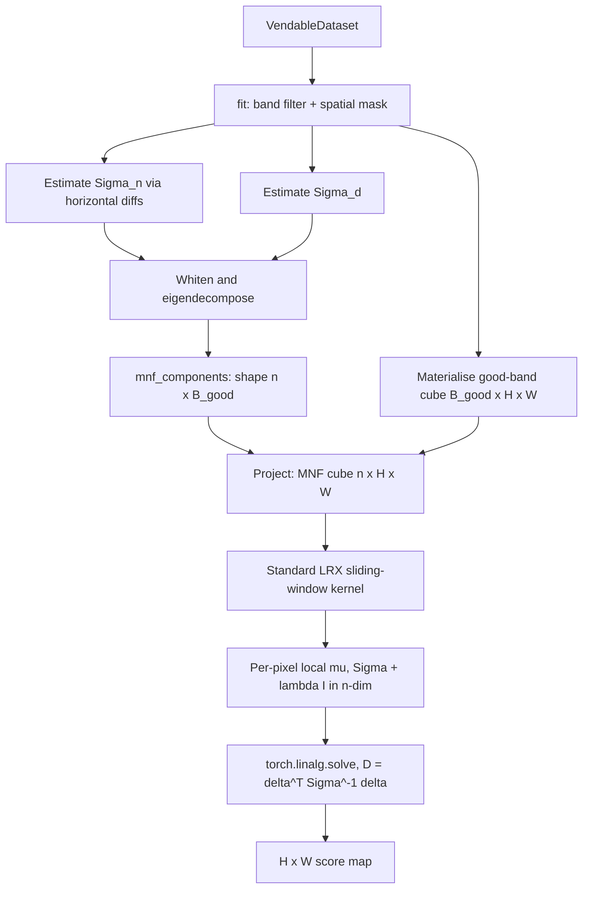

# 6.6 MNF compression + LRX — `MNFCompressionLRXDetector`

This detector is the combination Allotrope reaches for first on
hyperspectral scenes where stripes or sensor noise dominate the raw
LRX score map. Same MNF projection as section 6.5, but instead of
feeding the compressed pixels to global RX, the code builds an
`(n_components, H, W)` MNF cube and runs the standard annulus-based
LRX on it.

## 6.6.1 What the code does

Source:
[mnf_compression_lrx_detector.py](../../app/detectors/mnf_compression_lrx_detector.py).

- `fit()` runs the band filter, builds the spatial mask, estimates
  $\hat\Sigma_n$ and the MNF projection — same as
  `MNFCompressionDetector`. The one structural difference is that it
  materialises the full good-band cube in `fit()`
  ([mnf_compression_lrx_detector.py:200-213](../../app/detectors/mnf_compression_lrx_detector.py#L200))
  rather than streaming, because it predates the chunked refactor. On
  AVIRIS-NG that path peaks at several GB — see "memory caveat"
  below.
- `detect()` projects the good-band cube to MNF space, producing an
  `(n_components, H, W)` array. It then runs the standard LRX kernel
  ([mnf_compression_lrx_detector.py:291-298](../../app/detectors/mnf_compression_lrx_detector.py#L291))
  with `outer_window`, `inner_window`, `min_bg`, and ridge $\lambda I$
  parameters, exactly as section 6.4 describes.

### Memory caveat

The `fit()` path on this detector keeps the full
`float32 × good_bands × H × W` cube in memory. For a 1000×1000×165
PRISMA scene that is roughly 660 MB; for a 6000×800×425 AVIRIS-NG
scene it is more like 8 GB. The detector pre-dates the streaming pass
in `MNFCompressionDetector`; the cube is loaded once and projected
inside `detect()` rather than projected on-the-fly. If you are
running this on AVIRIS-NG inside a container with tight memory
limits, you have three options: (a) downsample bands further, (b)
crop the scene first, or (c) port the streaming projection pattern
from `MNFCompressionDetector` over to this file. (c) is on the
roadmap; (a) and (b) are easy workarounds today.

## 6.6.2 Pipeline diagram

## 6.6.3 Why this combination is so effective

Plain LRX on raw bands struggles because:

1. The local annulus rarely contains enough samples to estimate a
   full $B \times B$ covariance robustly.
2. Sensor stripes and noise are present *uniformly* in the annulus
   and in the target, so they often cancel — but only partially, and
   the residual stripe energy still flags as anomaly along stripe
   columns.

MNF compression fixes both problems at the source:

1. $B$ drops from ~165 to typically 10. With a default outer window of
   25, $n_{\text{bg}} \approx 2300$ is now 230× the dimensionality, so
   the local covariance is comfortably non-singular and the ridge
   becomes more a regulariser than a survival mechanism.
2. The stripe-and-noise directions are in the discarded MNF
   components. The retained components carry signal SNR, so the local
   covariance is estimated cleanly and any genuine anomaly stands out.

The combination keeps the *localised background* virtue of LRX while
removing its *small-sample, high-noise* failure mode. On a typical
PRISMA scene, MNF-LRX is the detector with the highest top-K precision
among classical methods.

## 6.6.4 Tuning differences vs raw LRX

Because the dimensionality is dramatically smaller, you can — and
should — re-tune the window sizes:

- **Outer window.** A smaller outer (e.g. 12-15) is now viable. The
  annulus only needs to clear $\sim 10 k = 100$ samples instead of
  $1650$, so $(25^2 - 11^2)/2 \approx 500$ pixels is fine.
- **Inner window.** Same logic as raw LRX — set just larger than the
  expected anomaly footprint.
- **`min_bg`.** Drop from $B+1$ to $k+1$ — i.e. about 11. This lets
  the detector score pixels nearer swath edges.
- **`ridge`.** $\lambda = 10^{-3}$ is still a safe default; you can
  often drop it to $10^{-5}$.

These parameters are tuned per-scene in practice; the defaults shipped
in `MNFCompressionLRXDetector` aim at PRISMA with $k = 10$.

## 6.6.5 Worked numerical example — score the same toy as section 6.4

Take the 1-D thermal-row example from section 6.4 and pretend the
"MNF-projected" representation is the same 1-D array (MNF on a single
band is a no-op). Then MNF-LRX is identical to raw LRX at position 5:

$$
D = \frac{(80 - 20)^2}{0.8} = 4500.
$$

The point of the toy is that the score is unchanged when MNF reduces
to identity. The benefit of MNF-LRX shows up in the multi-band case,
where the *background's apparent local variance shrinks* in the MNF
subspace because stripe and noise energy have been discarded. To make
this concrete, imagine the same 11-pixel row but with each pixel a
$B=3$ spectrum where bands 2 and 3 are pure noise of variance 100. The
raw-LRX annulus covariance is roughly
$\mathrm{diag}(0.8, 100, 100)$, so the inverse is
$\mathrm{diag}(1.25, 0.01, 0.01)$, and the score collapses to the
band-1 z-score because the other two bands' inverse weights are
negligible — so RX *happens* to recover the right answer. But if the
suspect pixel also has a stripe offset of $+30$ in band 2, you would
get:

$$
D_{\text{raw}} = 1.25 \cdot 60^2 + 0.01 \cdot 30^2 + 0.01 \cdot 0^2 = 4500 + 9 + 0 = 4509,
$$

versus a benign neighbour that also has the same band-2 stripe offset:

$$
D_{\text{raw,benign}} = 1.25 \cdot 0^2 + 0.01 \cdot 30^2 + 0.01 \cdot 0^2 = 9.
$$

The signal-to-stripe ratio in the score map is $4509/9 \approx 500$,
identical to the pure-band-1 case. So in this toy, even raw LRX is
robust to single-band stripes because the inverse-covariance kills
them. The MNF benefit becomes decisive when there are *correlated*
stripes across many bands (sensor cross-talk, common-mode offset), in
which case the raw $\Sigma^{-1}$ does not kill the stripe direction and
the score collapses; MNF projects orthogonally to the stripe direction
*before* RX and the score recovers.

## 6.6.6 When to prefer this over the standalone MNF detector

- **MNF-GRX (section 6.5)** is faster and simpler; reach for it when
  the scene is dominated by one homogeneous background and you mostly
  want noise rejection.
- **MNF-LRX (this section)** is slower and more memory-hungry; reach
  for it when the scene is heterogeneous (multiple land-cover
  classes), or when stripes survive global RX after MNF.

The ensembler in section 6.8 combines (MNF-)GRX and (MNF-)LRX via CDF
fusion, which is yet another way to hedge between these two regimes
without committing to one.
