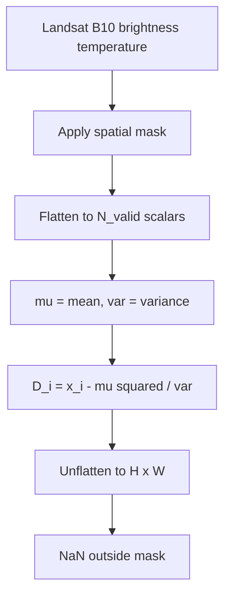

# 6.7 Thermal Global RX — `ThermalGRXDetector`

`ThermalGRXDetector` is the simplest detector in the catalogue. Landsat
B10 (and HotSAT, when onboarded) has a single thermal band, so band
filtering is skipped, MNF is meaningless, and the whole RX statistic
collapses to a one-line z-score formula.

## 6.7.1 What the code does

Source:
[thermal_grx_detector.py:63](../../app/detectors/thermal_grx_detector.py#L63).

For $C = 1$ the code short-circuits `spectral.rx` and computes the
scores in five lines:

```python
vals = pixels[:, 0]
mu = vals.mean()
var = vals.var()
rx_scores_flat = ((vals - mu) ** 2) / var
```

at [thermal_grx_detector.py:98-104](../../app/detectors/thermal_grx_detector.py#L98).
The spatial mask is still computed (off-swath pixels are excluded);
the band filter is a no-op because there is only one band.

### Why not use `spectral.rx`?

`spectral.rx` is written for the general $B$-band case. For $B = 1$ it
would solve a $1\times 1$ linear system, which is trivially the
reciprocal of the variance. The short-circuit avoids spinning up the
SciPy LU pipeline for one scalar division per pixel and is several
times faster for typical Landsat scenes.

## 6.7.2 Pipeline diagram



## 6.7.3 Theory in plain language

With $B = 1$, $\Sigma = \sigma^2$ is a scalar and $\Sigma^{-1} =
1/\sigma^2$. Therefore

$$
D(x) \;=\; \frac{(x - \mu)^2}{\sigma^2} \;=\; z^2,
$$

the squared z-score. Under the assumption that the background pixel
values follow $\mathcal{N}(\mu, \sigma^2)$, we have $D \sim \chi^2_1$.
A score of 4 is 2σ from the mean, a score of 9 is 3σ, a score of 16 is
4σ — that is the entire diagnostic vocabulary. The 99th percentile of
$\chi^2_1$ is $\approx 6.63$, so $D > 6.63$ corresponds to the
$3$σ band.

The detector therefore highlights both unusually **hot** and unusually
**cold** pixels equally. For wildfire detection you would post-filter
to keep only $x > \mu$; for cloud detection you do the opposite, but
the cloud masker in section 6.9 uses a Gaussian-mixture approach for
better separation.

## 6.7.4 Worked example

Five thermal pixels (°C): `[20, 21, 19, 22, 80]`. Compute mean and
variance:

$$
\mu = \frac{20 + 21 + 19 + 22 + 80}{5} = \frac{162}{5} = 32.4.
$$

$$
\sigma^2 = \frac{1}{5}\big((20-32.4)^2 + (21-32.4)^2 + (19-32.4)^2 + (22-32.4)^2 + (80-32.4)^2\big).
$$

Plugging in:

```
(20-32.4)^2 = 153.76
(21-32.4)^2 = 129.96
(19-32.4)^2 = 179.56
(22-32.4)^2 = 108.16
(80-32.4)^2 = 2265.76
sum         = 2837.2
sigma^2     = 567.44 (population variance)
```

(The code uses `vals.var()`, which is the *population* variance with
$N$ in the denominator, not $N-1$. For RX-style scoring the
distinction matters only when $N$ is tiny.) Scores:

$$
D = \frac{(x - 32.4)^2}{567.44} \approx [0.27, 0.23, 0.32, 0.19, 3.99].
$$

The 80 °C pixel scores ~4.0 — about $2$σ. Note how the presence of the
outlier inflates $\sigma^2$ and depresses its own score — the
**outlier-contamination-of-the-background** problem we saw in GRX, now
in 1-D. MNF cannot help here because there is nothing to whiten; what
*does* help is:

- **Robust statistics.** Replace $\mu, \sigma^2$ with the median and
  the MAD. The 80 pixel then sits at 60+ MAD-units. Not used in
  Allotrope because the GMM-based cloud masker (section 6.9) is more
  capable.
- **The adaptive cloud masker.** Fit a 5-component GMM, identify cloud
  clusters, exclude them from the background — and *then* run thermal
  GRX on the remaining pixels.
- **A second variant.** Compute $\mu, \sigma^2$ on a pre-masked set
  (after the cloud masker has run) and score the original cube against
  *that* background.

## 6.7.5 Second worked example — without the outlier

Drop the outlier from the previous example. Pixels: `[20, 21, 19,
22]`. Mean $= 20.5$, population variance $= 1.25$.

$$
D = \frac{(x - 20.5)^2}{1.25} = [0.20, 0.20, 1.80, 1.80].
$$

Now bring the outlier back as a test pixel scored against this
background:

$$
D(80) = \frac{(80 - 20.5)^2}{1.25} = \frac{3540.25}{1.25} = 2832.2.
$$

Compare to the in-set score of 3.99 from the previous example. That
factor-of-700 swing is the entire reason robust background estimation
matters in thermal anomaly detection — and the entire reason the cloud
masker exists.

## 6.7.6 Calibration table

| Score $D$ | z = $\sqrt D$ | Percentile under $\chi^2_1$ |
| --- | --- | --- |
| 1.00 | 1.0σ | 68.3% |
| 2.71 | 1.6σ | 90.0% |
| 3.84 | 2.0σ | 95.0% |
| 6.63 | 2.6σ | 99.0% |
| 10.83 | 3.3σ | 99.9% |
| 15.14 | 3.9σ | 99.99% |
| 19.51 | 4.4σ | 99.999% |

Looking up your threshold in this table is the fastest way to set a
false-alarm rate. Just keep in mind that the calibration assumes the
background pixels follow $\mathcal{N}(\mu, \sigma^2)$ — if your scene
includes a long tail of cold cloud or hot fire, $\sigma^2$ is inflated
and the table is no longer accurate. That is exactly when you should
mask first.
