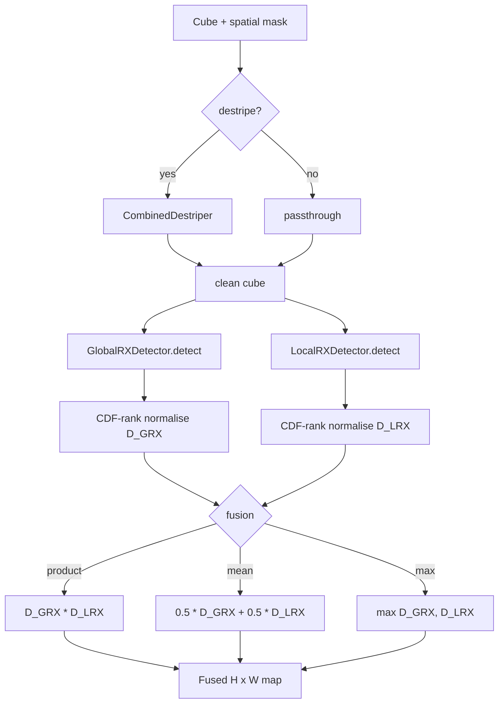

# 6.8 The Statistical Ensembler — `StatisticalEnsembler`

The ensembler is not a new detector; it is a fusion of two existing
ones. It runs GRX and LRX on the same scene (optionally after a
destriping pass), CDF-normalises their score maps, and combines them
with one of three rules — product, mean, or maximum. The result is a
single anomaly map that benefits from both detectors' strengths and
fewer of either's weaknesses.

## 6.8.1 What the code does

Source:
[statistical_ensembler.py](../../app/detectors/statistical_ensembler.py).

In `detect()`:

1. **Optional destriping.** If `destripe=True`, apply
   `CombinedDestriper` to the cube
   ([statistical_ensembler.py:131-144](../../app/detectors/statistical_ensembler.py#L131))
   before either detector sees it. The destriper is a row-wise + 2-D
   moving-average regression that removes additive across-track stripes;
   it is described in Chapter 2's preprocessing notes.
2. **GRX on the (de)striped cube.** Standard
   `GlobalRXDetector.detect()`.
3. **LRX on the same cube.** Standard `LocalRXDetector.detect()`.
4. **CDF normalise** both maps over the shared validity mask
   ([ensemble_rx_result.py:19](../../app/models/anomaly_detection/ensemble_rx_result.py#L19)):

   $$
   \tilde D(x) = \frac{\mathrm{rank}\,D(x) - 1}{N - 1} \in [0, 1].
   $$

   In words: replace each pixel's score with its empirical CDF value
   over the set of valid pixels. The pixel with the largest raw score
   gets $\tilde D = 1$; the smallest gets $\tilde D = 0$. After
   normalisation the two maps live on a common, scale-free scale.
5. **Fuse** with one of three strategies
   ([ensemble_rx_result.py:34](../../app/models/anomaly_detection/ensemble_rx_result.py#L34)):
   - **product**: $\tilde D_{\text{GRX}} \cdot \tilde D_{\text{LRX}}$
     — conservative (must look anomalous to both).
   - **maximum**: $\max(\tilde D_{\text{GRX}}, \tilde D_{\text{LRX}})$
     — liberal (either detector is enough).
   - **mean**: $\tfrac{1}{2}(\tilde D_{\text{GRX}} + \tilde D_{\text{LRX}})$
     — in the middle.
6. Return the product fusion by default.

## 6.8.2 Ensembler pipeline

## 6.8.3 Theory — why CDF-ranks?

The raw GRX score is on a $\chi^2_B$ scale; the raw LRX score is *also*
on a $\chi^2_B$ scale but with a *different effective* $B$ because the
local covariance is rank-bounded by $n_{\text{bg}}$. Their absolute
magnitudes therefore don't align.

The CDF-rank normalisation
$\tilde D = (\text{rank} - 1)/(N - 1)$ is the **probability integral
transform**: regardless of the original distribution, $\tilde D$ is
uniform on $[0, 1]$ over the valid pixels. After applying it to both
maps:

- The two normalised maps live on a common, scale-free scale.
- Each pixel has a pair of values $(\tilde D_{\text{GRX}},
  \tilde D_{\text{LRX}})$ which together define an empirical
  joint distribution on $[0, 1]^2$ — a **copula** of the two
  detectors. The fusion rules are operations on that copula.

### Why product is the AND-rule

$\tilde D_{\text{GRX}} \cdot \tilde D_{\text{LRX}}$ is large only when
*both* normalised scores are large. A pixel in the top 10% of GRX and
the top 10% of LRX gets a product of $\sim 0.81$; a pixel in the top
10% of GRX but the median of LRX gets $\sim 0.45$. So the product
rewards mutual confidence and penalises disagreement. In probability
terms, if you assumed GRX and LRX were independent uniforms on $[0,1]$,
$\tilde D_{\text{GRX}} \cdot \tilde D_{\text{LRX}}$ would have its own
distribution close to a Beta — but the *interpretation* as "must be
anomalous to both" is what makes the product the default.

### Why maximum is the OR-rule

$\max(\tilde D_{\text{GRX}}, \tilde D_{\text{LRX}})$ is large if
*either* detector flags the pixel. This is the right rule when the two
detectors are detecting genuinely different anomaly classes — e.g. GRX
catches scene-scale large objects while LRX catches local point
sources — and you don't want to miss either.

### Why mean is the compromise

The mean has the highest correlation with each individual detector and
the lowest variance among the three rules. It is the safe default when
you can't decide.

## 6.8.4 Theory — why GRX and LRX make different errors

The two detectors fail in opposite ways:

- **GRX misses local anomalies in heterogeneous scenes.** A hot pixel
  in a desert is "ordinary" at scene scale because the desert is full
  of warm pixels. LRX catches it because its local annulus is uniformly
  warm and the hot target stands out.
- **LRX misses scene-scale anomalies.** A basin-wide haze covering
  $1000 \times 1000$ pixels is "ordinary" at every local annulus
  because every annulus is hazy too. GRX catches it because the haze
  shifts the whole-scene mean away from the unaffected pixels.

Multiplying their CDF ranks is therefore a **complementary error
covariance** trick: each detector's blind spot is the other's strong
suit, so when both agree, the agreement is strong evidence.

## 6.8.5 Worked example — CDF fusion by hand

Imagine 5 pixels with raw scores:

| pixel | $D_{\text{GRX}}$ | $D_{\text{LRX}}$ |
| --- | --- | --- |
| A | 12.0 | 200 |
| B |  5.0 |  10 |
| C |  3.0 |   5 |
| D | 20.0 |  50 |
| E |  8.0 | 500 |

Rank each column ascending (1 = smallest):

| pixel | rank GRX | rank LRX | $\tilde D_{\text{GRX}}$ | $\tilde D_{\text{LRX}}$ |
| --- | --- | --- | --- | --- |
| A | 4 | 4 | 0.75 | 0.75 |
| B | 2 | 2 | 0.25 | 0.25 |
| C | 1 | 1 | 0.00 | 0.00 |
| D | 5 | 3 | 1.00 | 0.50 |
| E | 3 | 5 | 0.50 | 1.00 |

Now compute each fusion:

| pixel | product | mean | max |
| --- | --- | --- | --- |
| A | 0.56 | 0.75 | 0.75 |
| B | 0.06 | 0.25 | 0.25 |
| C | 0.00 | 0.00 | 0.00 |
| D | 0.50 | 0.75 | 1.00 |
| E | 0.50 | 0.75 | 1.00 |

Pixel A — "top 25% in both" — wins under the **product** rule
(score 0.56). Pixels D and E — each top of one detector, middle of the
other — tie A or beat A under **max** and **mean** but lose under
**product**. That is exactly the desired behaviour: product is the
high-precision rule; max is the high-recall rule.

## 6.8.6 Edge cases and gotchas

- **Ties in ranks.** `numpy.argsort`-based ranks break ties by stable
  position, not average rank. With many tied scores (e.g. clipped at a
  saturation value), this can produce artefacts. In practice the raw
  scores are continuous floats and ties are vanishingly rare.
- **Different validity masks.** GRX and LRX agree on the spatial mask
  by construction in the ensembler — both detectors are configured
  from the same `VendableDataset`. If you build two detectors with
  different `min_band_coverage`, fuse them at your own risk.
- **Destriping is destructive.** Once you destripe, the raw scene is
  gone. If you suspect the destriper of removing real signal, run the
  ensembler twice with and without and compare.
- **`product` near zero.** A pixel with $\tilde D_{\text{LRX}} = 0$
  (LRX skipped it because the annulus was too sparse) will have
  product $= 0$ regardless of $\tilde D_{\text{GRX}}$. Inspect skipped
  pixels separately.

The ensembler is the default classical detector for production
Allotrope runs. The next sections cover the auxiliary models — cloud
masker, SAM, background stats, scoring residuals — that surround it.
