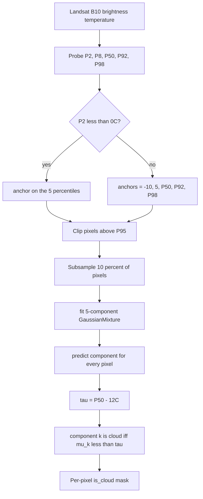

# 6.9 B10 Adaptive Cloud Masker — `B10AdaptiveCloudMasker`

This is not an anomaly detector. It is the **mask producer** that runs
upstream of thermal RX (and is also useful upstream of hyperspectral
RX, since clouds often look like anomalies). It fits a 5-component
Gaussian Mixture Model to Landsat B10 brightness-temperature values
expressed in Celsius and assigns "cloud" status to GMM components
whose learned mean is more than 12 °C colder than the scene median.

## 6.9.1 What the code does

Source:
[b10_adaptive_cloud_masker.py](../../app/statistical_models/b10_adaptive_cloud_masker.py).

1. `configure()` ([line 46](../../app/statistical_models/b10_adaptive_cloud_masker.py#L46))
   sets the percentile probes (`[2, 8, 50, 92, 98]`), the freeze
   threshold (`0 °C`), and the sampling ratio (default 0.1).
2. `train()` ([line 56](../../app/statistical_models/b10_adaptive_cloud_masker.py#L56)):
   - Probe the scene at percentiles 2 / 8 / 50 / 92 / 98 to
     characterise its temperature distribution.
   - Clip pixels above the 95th percentile to keep hot anomalies from
     poisoning the cloud means
     ([line 81](../../app/statistical_models/b10_adaptive_cloud_masker.py#L81)).
   - Pick GMM means-initialisation **anchors** adaptively:
     - If P2 is below 0 °C: clouds are obviously present; anchor on
       the 5 probed percentiles directly.
     - Otherwise: force two cold anchors at $-10 °C$ (ice cloud) and
       $5 °C$ (warm cloud) plus the P50, P92, P98 of the scene
       ([line 94-102](../../app/statistical_models/b10_adaptive_cloud_masker.py#L94)).
   - Sample 10% of training pixels uniformly, fit
     `sklearn.mixture.GaussianMixture` with `n_components=5`,
     `means_init=anchors`, and a fixed random seed.
3. `predict()` ([line 121](../../app/statistical_models/b10_adaptive_cloud_masker.py#L121))
   computes a **dynamic threshold** $\tau = \text{P50} - 12\,°C$ and
   labels a GMM component as "cloud" if its learned mean falls below
   $\tau$ ([line 141-143](../../app/statistical_models/b10_adaptive_cloud_masker.py#L141)).
   Any pixel assigned to a cloud component (via
   `argmax_k \gamma_k(x)`) gets `is_cloud = True`.

## 6.9.2 Pipeline diagram

## 6.9.3 Theory — Gaussian Mixture Models in plain language

A GMM models a 1-D distribution as a weighted sum of Gaussians:

$$
p(x) \;=\; \sum_{k=1}^{K} \pi_k \, \mathcal{N}(x \mid \mu_k, \sigma_k^2), \qquad \sum_{k=1}^{K} \pi_k = 1.
$$

For Landsat B10 brightness temperatures the typical scene contains
several thermal "populations": cold cloud tops near $-30 °C$, warm
clouds near $5 °C$, cool ground near $10-15 °C$, warm ground near
$25 °C$, hot ground above $30 °C$. Five components is enough to
represent each of these as a separate Gaussian.

### Expectation-Maximisation (EM)

Fitting is by iterative EM:

- **E-step.** Compute the **responsibilities** $\gamma_{ik}$ — the
  posterior probability that pixel $x_i$ belongs to component $k$:

  $$
  \gamma_{ik} \;=\; \frac{\pi_k \, \mathcal{N}(x_i \mid \mu_k, \sigma_k^2)}{\sum_{j=1}^{K} \pi_j \, \mathcal{N}(x_i \mid \mu_j, \sigma_j^2)}.
  $$

- **M-step.** Re-estimate the parameters using the responsibilities as
  soft cluster assignments:

  $$
  N_k = \sum_i \gamma_{ik}, \quad \pi_k = \frac{N_k}{N}, \quad \mu_k = \frac{1}{N_k}\sum_i \gamma_{ik} x_i, \quad \sigma_k^2 = \frac{1}{N_k}\sum_i \gamma_{ik}(x_i - \mu_k)^2.
  $$

Iterate until the parameters stop moving. The hard cluster assignment
used by `predict()` is then $\hat k_i = \arg\max_k \gamma_{ik}$.

### Why initialisation matters

EM is a local optimiser: bad initial means lead to bad local optima. A
default `KMeans` initialisation often collapses two cloud components
into one and gives the cold tail to a single overlarge cluster. The
adaptive anchor logic in `train()` exists exactly to avoid that
failure mode:

- If the scene has obvious clouds (P2 < 0 °C), the 5 percentiles give
  five well-separated anchors and EM converges in a few iterations.
- If the scene is *cloud-free*, the percentile-anchoring would collapse
  to five anchors within a narrow temperature band, and EM would
  produce five overlapping ground clusters. Forcing two anchors at
  $-10 °C$ and $5 °C$ creates "phantom" cloud components: EM either
  finds clouds (a few exist) or assigns nearly-zero weight $\pi_k$ to
  those components. Either way, the predictor is well-calibrated.

## 6.9.4 The statistic and the threshold

- **Statistic.** Per-pixel GMM hard label
  $\hat k_i = \arg\max_k \gamma_{ik}$.
- **Threshold.** $\tau = \text{P50}_{\text{scene}} - 12\,°C$, applied
  to *component means*, not pixel values. So whether a pixel is
  "cloud" depends on which component owns it, and whether that
  component's centroid is more than 12 °C colder than the scene
  median.

The 12 °C number is empirical, chosen from inspecting many Landsat
scenes. It is large enough that warm ground variation never crosses
it, but tight enough that mid-altitude clouds at 0–10 °C in a 25 °C
scene get flagged.

## 6.9.5 Worked example — fitting 2 components by hand

A full 5-component EM is hard to compute by hand, but a 2-component fit
on a tiny dataset illustrates the dynamics. Take 6 pixels (°C):
`[-10, -8, 20, 22, 25, 23]`. Initialise $\mu_1 = -10$, $\mu_2 = 20$,
$\sigma_1^2 = \sigma_2^2 = 1$, $\pi_1 = \pi_2 = 0.5$.

**E-step.** For each pixel compute
$\gamma_{i,1} = \pi_1 \mathcal{N}(x_i | \mu_1, \sigma_1^2) / \text{denom}$.
For $x_1 = -10$, $\mathcal{N}(x_1 | -10, 1) = 0.399$ and
$\mathcal{N}(x_1 | 20, 1) \approx e^{-450} \approx 0$, so
$\gamma_{1,1} \approx 1$. By symmetry $\gamma_{2,1} \approx 1$,
$\gamma_{3,1} \approx 0$, …, $\gamma_{6,1} \approx 0$.

**M-step.**

$$
N_1 = 2,\; \mu_1 = \frac{-10 - 8}{2} = -9,\; \sigma_1^2 = \frac{1 + 1}{2} = 1.
$$

$$
N_2 = 4,\; \mu_2 = \frac{20 + 22 + 25 + 23}{4} = 22.5,\; \sigma_2^2 = \frac{6.25 + 0.25 + 6.25 + 0.25}{4} = 3.25.
$$

EM has converged in one iteration because the initial separation was
already correct.

Now apply the rule: scene P50 is $\approx 21$ °C, $\tau = 21 - 12 = 9$
°C. Component 1 mean is $-9 °C < 9$ → cloud. Component 2 mean is
$22.5 °C > 9$ → ground. The two cold pixels are masked.

## 6.9.6 Why "adaptive" — the dynamic threshold

A fixed threshold (e.g. "any pixel below 0 °C is cloud") fails on:

- **Cold deserts at night.** Ground can be below 0 °C; you would
  flag everything.
- **Tropical scenes with low clouds at 15 °C.** A fixed-0 threshold
  misses them entirely.

By tying $\tau$ to the scene's own median, the masker adapts to climate
zone, time of day, and season. A tropical scene with P50 = 30 °C gets
$\tau = 18 °C$; an Antarctic scene with P50 = $-20 °C$ gets
$\tau = -32 °C$. In each case, only components whose mean is *unusually
cold relative to that scene* get flagged.

## 6.9.7 When to use it

- **Always** upstream of `ThermalGRXDetector` on Landsat B10. Without
  it, thermal RX flags every cloud and you get a useless score map.
- **Often** upstream of hyperspectral RX too, because cold clouds
  appear as very bright shortwave reflectors and dominate the score
  map otherwise.
- **Rarely** as a standalone output. The mask is an input to other
  detectors, not a finished product.
