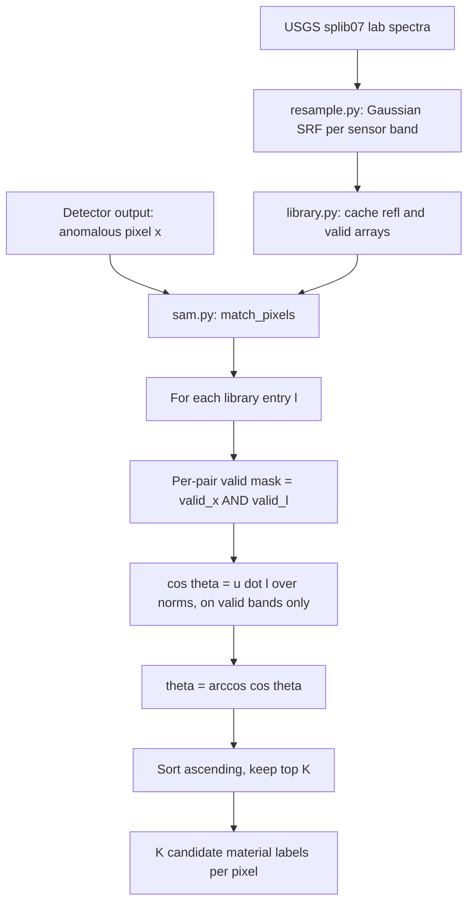

# 6.10 Spectral Match — SAM against USGS splib07

The `spectral_match/` package is not an anomaly detector. It answers
the follow-up question after a detector flags a pixel: *what material
is that pixel?* The reference library is the USGS spectral library
`splib07`, resampled per-sensor to each instrument's band centres and
full-width-half-maximum (FWHM) values. The matching algorithm is the
**Spectral Angle Mapper** (SAM).

## 6.10.1 What the code does

Three files do the work:

- [resample.py](../../app/spectral_match/resample.py) Gaussian-resamples
  a lab spectrum onto a sensor's $(\lambda_i, \mathrm{FWHM}_i)$ grid.
  For each target band $i$, build the Gaussian spectral response
  function
  $w_j = \exp(-(\lambda_j^{\text{lib}} - \lambda_i)^2 / 2\sigma_i^2)$
  with $\sigma_i = \mathrm{FWHM}_i / (2\sqrt{2\ln 2})$, integrate over
  $\pm 3\sigma$ of the library samples, and NaN out bands where the
  library's wavelength coverage is insufficient.
- [library.py](../../app/spectral_match/library.py) builds and caches
  the per-sensor resampled library, storing `(refl, valid)` arrays
  for each splib07 entry.
- [sam.py](../../app/spectral_match/sam.py) does the top-K matching
  with a pattern-bucketed optimisation described in its module
  docstring.

## 6.10.2 SAM — the angle-as-distance idea

The **Spectral Angle Mapper** measures similarity between two spectra
$u, l \in \mathbb{R}^B$ as the angle between them in $B$-space:

$$
\theta(u, l) \;=\; \arccos\!\left(\frac{\langle u, l \rangle}{\|u\| \, \|l\|}\right).
$$

### Why an angle, not a distance?

- **Invariant to multiplicative scaling.** A dark and a bright sample
  of the same material have $\theta = 0$ because they point in the same
  direction in $\mathbb{R}^B$. This is the central reason SAM is
  preferred over Euclidean distance for material identification:
  illumination, shadowing, slope-aspect effects, and partial mixing
  change the *magnitude* of a spectrum but not (much) its
  *direction*.
- **Symmetric.** $\theta(u, l) = \theta(l, u)$.
- **Bounded.** $\theta \in [0, \pi/2]$ for non-negative reflectances.
- **Per-pair masking.** In Allotrope, $\langle \cdot, \cdot \rangle$
  and $\| \cdot \|$ are computed only over bands valid in *both* the
  unknown pixel and the library entry
  ([sam.py:185-204](../../app/spectral_match/sam.py#L185)). Library
  entries with insufficient overlap are simply skipped for that pixel.

### Why this is just cosine distance in disguise

SAM is the arc-cosine of cosine similarity. For two unit-normalised
spectra $\hat u, \hat l$, $\cos\theta = \hat u \cdot \hat l$, which is
the dot product on the unit sphere. So SAM is the geodesic distance on
the sphere of all positive-orthant unit vectors. This puts it in the
same family as cosine similarity in NLP embeddings; the
"spectral" name is more about lineage than mathematics.

## 6.10.3 SAM pipeline diagram

## 6.10.4 Worked example — SAM by hand

Two 4-band spectra:

$$
u = [0.20, 0.30, 0.40, 0.50],\qquad l = [0.10, 0.15, 0.20, 0.25].
$$

These are scalar multiples ($l = 0.5\,u$). Compute:

- $\langle u, l \rangle = 0.20\cdot 0.10 + 0.30\cdot 0.15 + 0.40\cdot 0.20 + 0.50\cdot 0.25 = 0.02 + 0.045 + 0.08 + 0.125 = 0.27$.
- $\|u\| = \sqrt{0.04 + 0.09 + 0.16 + 0.25} = \sqrt{0.54} \approx 0.7348$.
- $\|l\| = \sqrt{0.01 + 0.0225 + 0.04 + 0.0625} = \sqrt{0.135} \approx 0.3674$.
- $\cos\theta = 0.27 / (0.7348 \cdot 0.3674) \approx 0.27 / 0.2700 = 1.0$.
- $\theta = \arccos(1.0) = 0°$.

Exactly zero degrees — they are the same direction in $\mathbb{R}^4$.

### A small perturbation

Now perturb $l$ to $l' = [0.10, 0.15, 0.21, 0.24]$ — a tiny shift in
bands 3 and 4. Recompute:

- $\langle u, l' \rangle = 0.02 + 0.045 + 0.084 + 0.120 = 0.269$.
- $\|l'\| = \sqrt{0.01 + 0.0225 + 0.0441 + 0.0576} = \sqrt{0.1342} \approx 0.3664$.
- $\cos\theta = 0.269 / (0.7348 \cdot 0.3664) \approx 0.269 / 0.2692 \approx 0.9993$.
- $\theta = \arccos(0.9993) \approx 0.0374\,\text{rad} \approx 2.14°$.

A 2° SAM is a strong match. Library entries within 3–5° of an unknown
pixel are typically returned as top-K candidates.

### A larger perturbation

Try $l'' = [0.10, 0.30, 0.10, 0.30]$ — same average reflectance as $l$,
but a totally different shape:

- $\langle u, l'' \rangle = 0.02 + 0.09 + 0.04 + 0.15 = 0.30$.
- $\|l''\| = \sqrt{0.01 + 0.09 + 0.01 + 0.09} = \sqrt{0.20} \approx 0.4472$.
- $\cos\theta = 0.30 / (0.7348 \cdot 0.4472) \approx 0.30 / 0.3285 \approx 0.9132$.
- $\theta \approx \arccos(0.9132) \approx 0.420\,\text{rad} \approx 24°$.

A 24° SAM is a clear mismatch. The two spectra have the same total
energy but very different shapes, and SAM correctly puts them far
apart on the angular scale.

## 6.10.5 The top-K matcher

The matcher
[sam.py:76](../../app/spectral_match/sam.py#L76) returns the K smallest
angles per pixel together with the library indices. For a typical
splib07 cache of ~2400 entries and a scene of $10^6$ valid pixels, the
brute-force cost is $2.4 \times 10^9$ dot products. The implementation
buckets library entries by their per-band validity pattern, so any
pixel-library pair with mismatching validity is skipped without
computation. In practice this gives a 5–10× speedup on PRISMA, where
nearly all library entries have similar validity patterns.

## 6.10.6 What SAM does **not** do

- **Quantify abundance.** SAM is a *similarity* metric, not an
  unmixing algorithm. A pixel that is 50% vegetation and 50% bare
  soil might match either material at a moderate angle — SAM cannot
  tell you the proportions. For abundance, use NNLS, FCLS, or
  similar.
- **Account for atmospheric effects.** If the unknown pixel is in TOA
  reflectance and the library is in BOA reflectance, SAM will report
  spurious mismatches on water-absorption bands. The Allotrope
  resampler NaN's those bands, which is a partial fix.
- **Rank by confidence.** A 2° match is "strong" by convention, but
  there is no probability associated with that number. The top-K
  output is a ranked list, not a calibrated distribution. If you need
  a probability, post-process the angles into a softmax distribution
  using an empirical temperature.

SAM is the right tool for the question *"my detector flagged this
pixel; what is it most like in our library?"* It is the wrong tool
for the question *"how anomalous is this pixel?"* — that is what the
detectors of this chapter are for.
