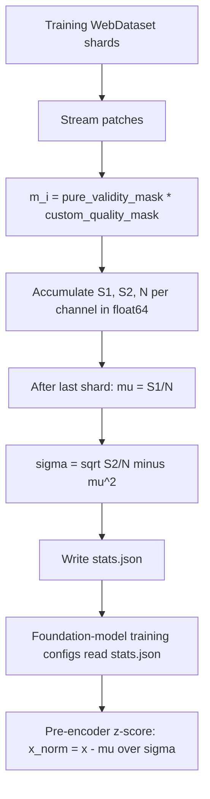

# 6.11 Background statistics — `landsat_thermal_stats.py`

[background_stats/landsat_thermal_stats.py](../../app/background_stats/landsat_thermal_stats.py)
is the offline script that produces the per-channel `mean` and `std`
used by neural-network normalisation layers (and as a sanity baseline
for thermal RX). It streams a WebDataset of training patches and
accumulates running sums, then emits a JSON consumed by the
foundation-model training configs.

It is included in this chapter because — like RX — it is built on the
same two-pass / one-pass moments machinery, and understanding it makes
explicit what "z-scoring" means everywhere else.

## 6.11.1 What the script does

The script streams a WebDataset of training patches and accumulates,
per channel,

$$
S_1^{(c)} = \sum_i m_i\,x_i^{(c)}, \qquad S_2^{(c)} = \sum_i m_i\,(x_i^{(c)})^2, \qquad N^{(c)} = \sum_i m_i,
$$

where $m_i$ is the combined `pure_validity_mask *
custom_quality_mask`. At the end, at
[landsat_thermal_stats.py:98-101](../../app/background_stats/landsat_thermal_stats.py#L98):

$$
\mu^{(c)} = \frac{S_1^{(c)}}{N^{(c)}}, \qquad \sigma^{(c)} = \sqrt{\frac{S_2^{(c)}}{N^{(c)}} - \big(\mu^{(c)}\big)^2}.
$$

This is the textbook one-pass mean / variance formula
($\mathrm{Var}(X) = \mathbb{E}[X^2] - \mathbb{E}[X]^2$). The
accumulators are `float64`; the input pixels are `float32`. Validity
masks are folded directly into the weighting, so invalid pixels
contribute exactly zero — they never bias the mean nor the variance.

## 6.11.2 Pipeline diagram



## 6.11.3 Why one-pass and not Welford

Welford's online algorithm is more numerically stable than the
two-moment one-pass formula, especially when the variance is very
small relative to the mean. Allotrope deliberately uses the simpler
formula because:

- The values are **brightness temperatures in a bounded range**, e.g.
  $[200, 350]$ K. The squared values are at most $\sim 1.2 \times
  10^5$, well within `float64` precision even for billions of
  samples.
- The accumulators are `float64`; the input is `float32`. The 53-bit
  mantissa of `float64` can hold sums up to $\sim 9 \times 10^{15}$
  without rounding error, which corresponds to $\sim 7 \times 10^{10}$
  samples at the typical pixel scale. Real training sets are at most
  $10^{10}$ pixels, well below the limit.
- The simpler code is easier to verify and runs faster (one
  multiplication and two adds per pixel vs Welford's running mean
  update).

The file's docstring notes this trade-off was a deliberate
simplification; if you ever extend the script to handle radiance with
wider dynamic range (say AVIRIS-NG raw), switch to Welford.

## 6.11.4 What the output JSON looks like

The JSON has one entry per channel:

```json
{
  "Landsat9_B10": {
    "n_samples": 421398520,
    "mean": 287.451,
    "std": 14.823
  }
}
```

That JSON is loaded by the foundation-model training configs (Chapter
4) and used to z-score thermal inputs before they reach the encoder.
The same JSON is also useful as a sanity baseline for thermal RX: if
your scene-local mean and std deviate substantially from the
population $\mu$ and $\sigma$ here, the scene is unusual enough that
you probably want the adaptive cloud masker upstream.

## 6.11.5 Worked example — one-pass on 5 numbers

Take the 5 thermal pixels from section 6.7: `[20, 21, 19, 22, 80]`.
All have $m_i = 1$.

```
S1 = 20 + 21 + 19 + 22 + 80 = 162
S2 = 400 + 441 + 361 + 484 + 6400 = 8086
N  = 5
mu = 162 / 5 = 32.4
S2/N - mu^2 = 8086/5 - 32.4^2 = 1617.2 - 1049.76 = 567.44
sigma = sqrt(567.44) approx 23.82
```

Matches the variance we computed manually in section 6.7. Good. Now
mask out the outlier ($m_5 = 0$):

```
S1 = 20 + 21 + 19 + 22 = 82
S2 = 400 + 441 + 361 + 484 = 1686
N  = 4
mu = 82 / 4 = 20.5
S2/N - mu^2 = 1686/4 - 20.5^2 = 421.5 - 420.25 = 1.25
sigma = sqrt(1.25) approx 1.118
```

Same answer as section 6.7's "without the outlier" example. This is
exactly the value the foundation models would learn for the
population $(\mu, \sigma)$ when the cloud masker has filtered the
training stream upstream — and the reason you really want the cloud
masker to run.

## 6.11.6 Practical concerns

- **Validity masks must be honest.** If a sensor returns "valid"
  for pixels that are actually saturated, those pixels contaminate
  the running sums. The `custom_quality_mask` exists to layer
  Allotrope's own quality criteria on top of the vendor's
  `pure_validity_mask`.
- **Shard order does not matter.** Sums are associative, so the
  result is identical regardless of which shard streams first.
  Useful for reproducibility.
- **Re-run on schema changes.** If you add or remove channels (e.g.
  onboard HotSAT), re-run this script and regenerate the JSON.
  Training configs assume the JSON has an entry for every input
  channel.
