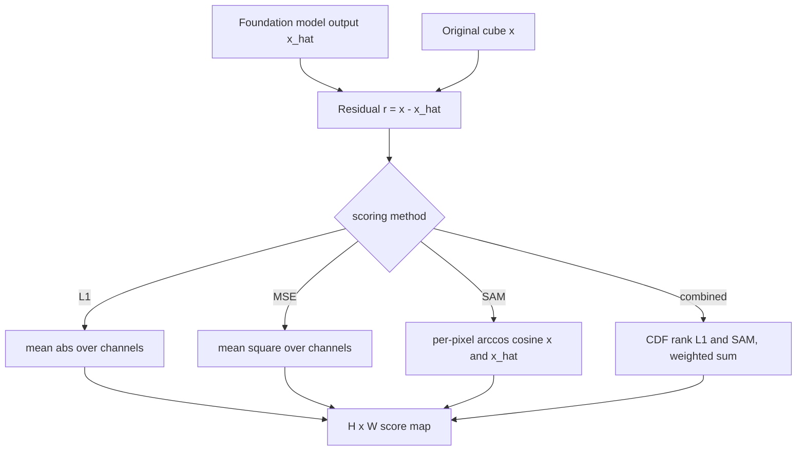

# 6.12 Scoring residuals — `scoring.py`

[utils/anomaly_detection/scoring.py](../../app/utils/anomaly_detection/scoring.py)
is the bridge between **foundation-model** detectors (autoencoders, see
Chapter 3) and the classical world. It turns a reconstruction
residual $r = x - \hat x$ into a per-pixel anomaly score using the same
mathematical primitives (L1, MSE, SAM) we have already met. Four
methods are exposed at
[scoring.py:74-87](../../app/utils/anomaly_detection/scoring.py#L74).

## 6.12.1 What the code does

For a pixel cube $x \in \mathbb{R}^{C \times H \times W}$ and a
reconstruction $\hat x$, the four scoring functions are:

- **L1.**
  $$
  s(i, j) \;=\; \frac{1}{C}\sum_{c=1}^{C} \big|r_{c,i,j}\big|, \qquad r_{c,i,j} = x_{c,i,j} - \hat x_{c,i,j}.
  $$
- **MSE.**
  $$
  s(i, j) \;=\; \frac{1}{C}\sum_{c=1}^{C} r_{c,i,j}^2.
  $$
- **SAM.** The same formula as section 6.10, applied per pixel
  between the observed and reconstructed spectra:
  $$
  s(i, j) \;=\; \arccos\!\left(\frac{\langle x_{:,i,j}, \hat x_{:,i,j} \rangle}{\|x_{:,i,j}\| \, \|\hat x_{:,i,j}\|}\right).
  $$
- **combined.** A weighted convex sum of CDF-normalised L1 and SAM:
  $$
  s_{\text{combined}}(i, j) \;=\; w \cdot \widetilde{\text{L1}}(i, j) + (1 - w) \cdot \widetilde{\text{SAM}}(i, j),
  $$
  with each component normalised to $[0, 1]$ over valid pixels using
  the same rank-CDF transform as the ensembler.

## 6.12.2 Pipeline diagram

## 6.12.3 Theory in plain language

These are the **same operators** classical detectors lean on; the only
difference is where the reference reconstruction $\hat x$ comes from.

- In an **autoencoder** $\hat x$ is the neural reconstruction. A pixel
  is anomalous if the model cannot reconstruct it well — the assumption
  being that the model has learned the manifold of "normal" pixels and
  cannot extrapolate.
- In **MNF-GRX**, $\hat x$ is implicitly $\hat\mu$ (the background
  Gaussian mean) and the metric is Mahalanobis, not L1.
- In **MAE/masked autoencoders**, $\hat x$ is the inpainting of masked
  patches conditioned on visible patches; the residual on the masked
  patches is the anomaly signal.

The choice of L1 vs MSE vs SAM follows from what kind of anomaly you
expect:

- **L1** (mean absolute residual) is the workhorse. It is robust to
  occasional large residuals (it does not square them), so a single
  bad band does not dominate the score.
- **MSE** emphasises large residuals quadratically. Useful when
  anomalies are expected to produce big residuals on a few bands;
  noisy when many bands have small but non-zero residuals.
- **SAM** asks "is the *shape* of the reconstructed spectrum wrong?"
  not "is the *magnitude* wrong?". It is the right metric when the
  model learned reflectance shapes well but is occasionally off on
  scale (e.g. illumination drift between training and test).
- **combined** is the safe default: fuse L1 (magnitude-sensitive) and
  SAM (shape-sensitive) via CDF-rank fusion, exactly as the
  ensembler does for GRX+LRX.

## 6.12.4 Worked example — three residuals, three methods

Take a single pixel with three bands. Original $x = [0.30, 0.40, 0.50]$
and reconstruction $\hat x = [0.30, 0.40, 0.45]$. Residual:
$r = [0.0, 0.0, 0.05]$.

**L1.**

$$
s_{\text{L1}} = \tfrac{1}{3}(0 + 0 + 0.05) = 0.0167.
$$

**MSE.**

$$
s_{\text{MSE}} = \tfrac{1}{3}(0 + 0 + 0.0025) = 0.000833.
$$

**SAM.**

$$
\langle x, \hat x \rangle = 0.09 + 0.16 + 0.225 = 0.475.
$$

$$
\|x\| = \sqrt{0.09 + 0.16 + 0.25} = \sqrt{0.50} \approx 0.7071.
$$

$$
\|\hat x\| = \sqrt{0.09 + 0.16 + 0.2025} = \sqrt{0.4525} \approx 0.6727.
$$

$$
\cos\theta = 0.475 / (0.7071 \cdot 0.6727) \approx 0.475 / 0.4757 \approx 0.9986.
$$

$$
\theta = \arccos(0.9986) \approx 0.0529\,\text{rad} \approx 3.03°.
$$

So a 0.05 reconstruction error on one of three bands produces L1
$\approx 0.017$, MSE $\approx 8 \times 10^{-4}$, SAM $\approx 3°$. All
three flag the pixel as "off"; SAM is the most informative if you have
many comparable pixels and want to rank them, because the angular
units are interpretable on a $[0°, 90°]$ scale.

### Second worked variant — large magnitude offset, same shape

Now $x = [0.30, 0.40, 0.50]$ and $\hat x = [0.15, 0.20, 0.25]$ — same
shape, half the magnitude. Residual $r = [0.15, 0.20, 0.25]$.

**L1.** $s = 0.20$. Large — looks anomalous.

**MSE.** $s = 0.0383$. Large — looks anomalous.

**SAM.**

$$
\langle x, \hat x \rangle = 0.045 + 0.080 + 0.125 = 0.25.
$$

$$
\|\hat x\| = \sqrt{0.0225 + 0.04 + 0.0625} = \sqrt{0.125} = 0.3536.
$$

$$
\cos\theta = 0.25 / (0.7071 \cdot 0.3536) = 0.25 / 0.25 = 1.0.
$$

$$
\theta = 0°.
$$

The shape is identical, so SAM says "perfect match" while L1 and MSE
both flag a big residual. This is the classic SAM behaviour: it does
not care about magnitude, only direction. Which is the right answer
depends on the application — for material identification (section
6.10), magnitude invariance is exactly what you want; for anomaly
detection, it might mask a brightness-only anomaly.

The `combined` mode hedges by fusing L1 and SAM via CDF ranks, so a
pixel that fires *either* metric strongly ends up with a substantial
score.

## 6.12.5 Relation to classical RX

In the limit where $\hat x = \hat\mu$ (constant scene mean) and the
metric is L2 weighted by $\Sigma^{-1}$, the reconstruction-residual
score collapses exactly to RX:

$$
\|x - \hat\mu\|_{\Sigma^{-1}}^2 \;=\; (x - \hat\mu)^{\top}\Sigma^{-1}(x - \hat\mu) \;=\; D_{\text{RX}}(x).
$$

So classical RX is a special case of "residual scoring" where the
reconstruction is a constant (the scene mean) and the metric is
$\Sigma^{-1}$. A foundation-model autoencoder generalises this by
letting $\hat x$ be a function of the visible context — a learned,
spatially-varying mean — and reverting to a simpler metric (L1 / SAM)
because the conditioning is now in the model rather than in the
metric. The two approaches are points on the same axis.
