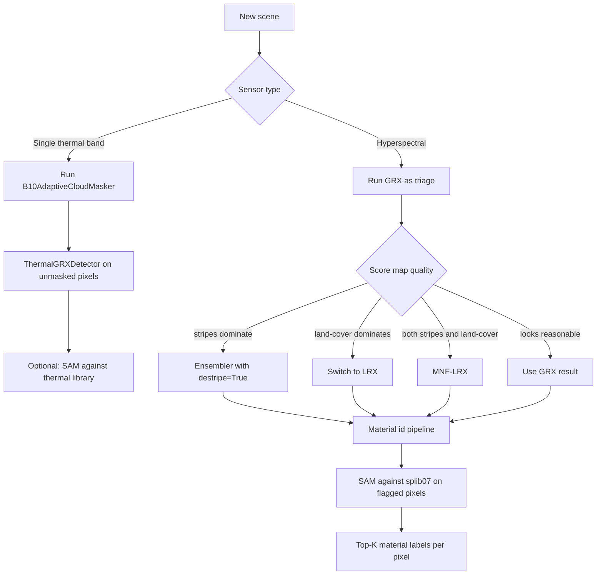

# 6.13 Putting it together — when to reach for which

This chapter has walked through five RX-family detectors, one
ensembler, one cloud masker, one spectral matcher, one background-stats
script, and one residual scorer. Each has a small set of conditions
under which it is the right tool. This final section consolidates
those into a decision table and an end-to-end flowchart.

## 6.13.1 Decision table — symptoms and remedies

| Symptom in the score map | Likely cause | Detector to try |
| --- | --- | --- |
| Whole regions of land cover flagged | Multimodal background defeats global Gaussian | LRX, MNF-LRX |
| Vertical / horizontal stripes flagged | Sensor banding | Ensembler with `destripe=True`, or MNF variants |
| Cloud edges flagged | Cold pixels next to warm | Mask clouds with `B10AdaptiveCloudMasker` first |
| Edges of swath flagged | Sparse annuli on LRX | Tighten the spatial mask (`min_band_coverage=1.0`) |
| Need a material label | RX/LRX don't identify | Run SAM against splib07 cache |
| Single-band thermal | No spectral covariance to invert | `ThermalGRXDetector` (z-score) |
| Suspect the model is the problem | Want to rank by *learned* normality | Use a foundation-model autoencoder + `scoring.py` |
| Score map is too noisy at single-pixel scale | Variance dominated by sensor noise | MNF variants, or destripe + ensembler |
| Anomalies span hundreds of pixels | LRX's local context is "all anomaly" | Prefer GRX or the ensembler with `fusion="max"` |
| Many false positives at land-water boundaries | LRX heterogeneous annulus | Increase `outer_window`; or mask water upstream |

## 6.13.2 End-to-end flowchart

## 6.13.3 The unifying principle

Every detector in this chapter reduces to one core operation — a
quadratic form

$$
(x - \mu)^{\top}\,\Sigma^{-1}\,(x - \mu)
$$

applied in *some* feature space (raw bands, MNF components, local
annulus, or single-band z). The variations across detectors are
choices on three axes:

1. **What feature space?** Raw bands (GRX, LRX), MNF-compressed
   bands (MNF-GRX, MNF-LRX), single thermal band (Thermal GRX), or
   neural-network-encoded latent (foundation models + `scoring.py`).
2. **What background sample?** The whole scene (GRX), a local
   annulus (LRX), a model-conditioned reconstruction (autoencoders).
3. **How to condition $\Sigma$?** No conditioning (GRX has enough
   samples), diagonal loading (LRX), discard low-SNR components
   (MNF), or trade $\Sigma^{-1}$ for an L1 / SAM metric (residual
   scoring).

The art is in picking the right combination. The code in
`app/detectors/` is the operational embodiment of that art, and the
preceding twelve sections of this chapter are the manual.

## 6.13.4 Recommended starting recipe

For a brand-new scene from a sensor you have not seen before:

1. Run `GlobalRXDetector` first — it is the cheapest, gives you a
   sanity check on band filtering and the spatial mask, and reveals
   whether stripes or land-cover are present.
2. If stripes show up: re-run with `StatisticalEnsembler(destripe=True)`
   or `MNFCompressionDetector`. Compare side by side.
3. If land-cover bleed shows up: re-run with `LocalRXDetector` and
   compare. If LRX is too noisy, run `MNFCompressionLRXDetector`.
4. Pick the cleanest of the four maps as your primary anomaly score.
5. For top-flagged pixels, run SAM against splib07 to get material
   labels.
6. If the scene is Landsat thermal: run `B10AdaptiveCloudMasker`
   first; everything downstream depends on it.

That recipe covers ~90% of operational use cases. The remaining ~10%
typically need either a foundation-model autoencoder (Chapter 3,
Chapter 4) or scene-specific tuning of the window sizes and ridge
parameters — but those are refinements on top of the same core
quadratic form, not departures from it.
