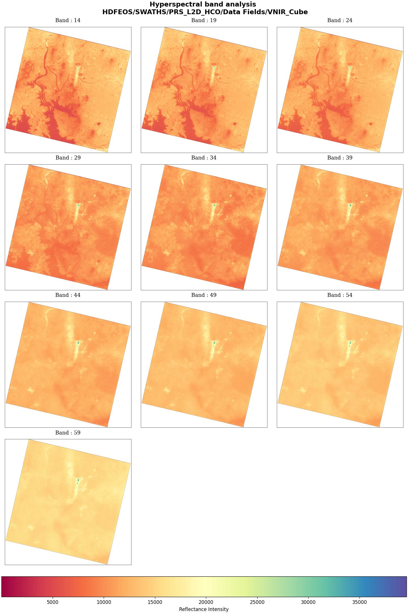
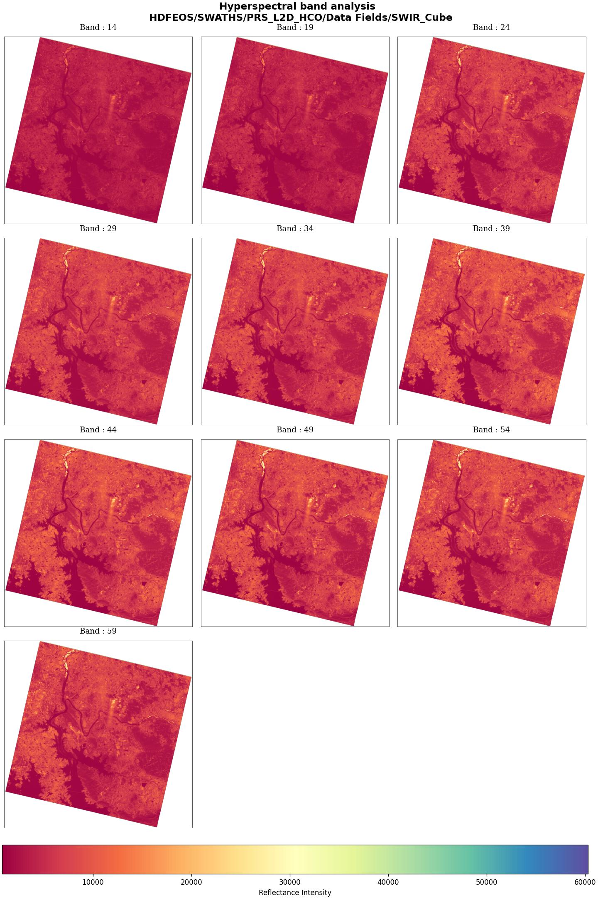
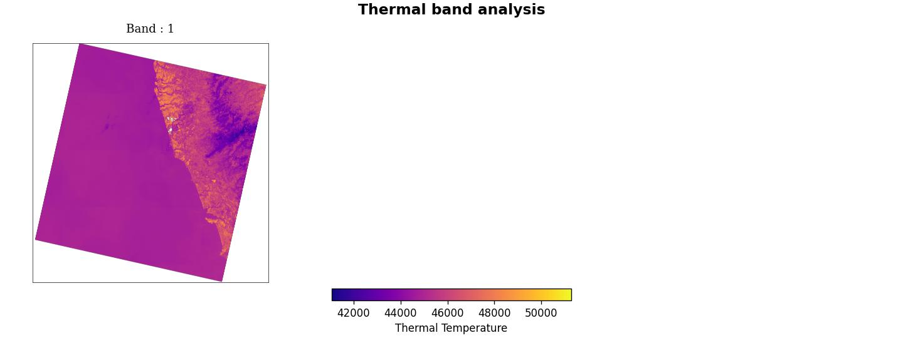

## Data Arrangement

In the case of PRISMA, a cube has dimensions arranged in a very specific manner. Out of the box, each cube has the dimensions

$$
H \times C \times Width
$$

Here, oddly the channels are in the middle. 

Dimension 0 is height also called the Along track dimension which is N-S. Dimension 2 is the cross track dimension which is E-W. Dimension 1 is the channel dimension. This is called the Band Interleaved by Line (BIL) format. Python for visualization expects a different format called the Band Interleaved by Pixel (BIP) format.Therefore, before visualization this has to be transformed into a 

$$
H \times W \times C
$$

### Handling Transformations

Moving between these formats will be crucial for visualization and training. Look up the section on image transformation to see how this is done.

### Basic Visualization
The basic idea will be to do a simple band level visualization first and then move on to more sophisticated things. We will visualize band by band and can specify a list o bands to visualize and the cube (SWIR or VNIR). The output should be a grid of images - with one image for each band.

The basic method will be to use the `BasicBandLevelVisualization` class in the `app.utils.visualization.basic_band_level_visualization` module.

A sample usage is as follows:
```python
    file_source_config = FileSourceConfig(
        source_path="raw_files/Hyper/PRS_L2D_STD_20231229050902_20231229050907_0001.he5"
    )
    basic_band_level_visualization = BasicBandLevelVisualization(file_source_config)
    basic_band_level_visualization.visualize_band(
        [1, 2, 3, 4, 5, 6, 7, 8, 9],
        "HDFEOS/SWATHS/PRS_L2D_HCO/Data Fields/VNIR_Cube",
        "sample_swir_multibands_1_10",
    )
```

Note that the dataset file name will have to be specified. This is slightly hacky way to do tit, but will suffice for the time being.

Sample visualizations are as follows:
<p align="center">
    
</p>
<p align="center">
    
</p>

### Thermal Band Visualization

The thermal band visualization for the sample file is as follows. Note that there is only one band in this case:
<p align="center">
    
</p>