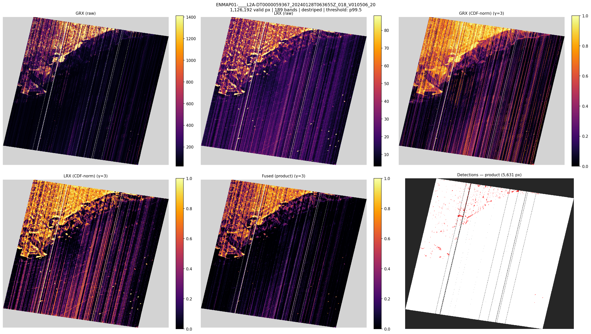
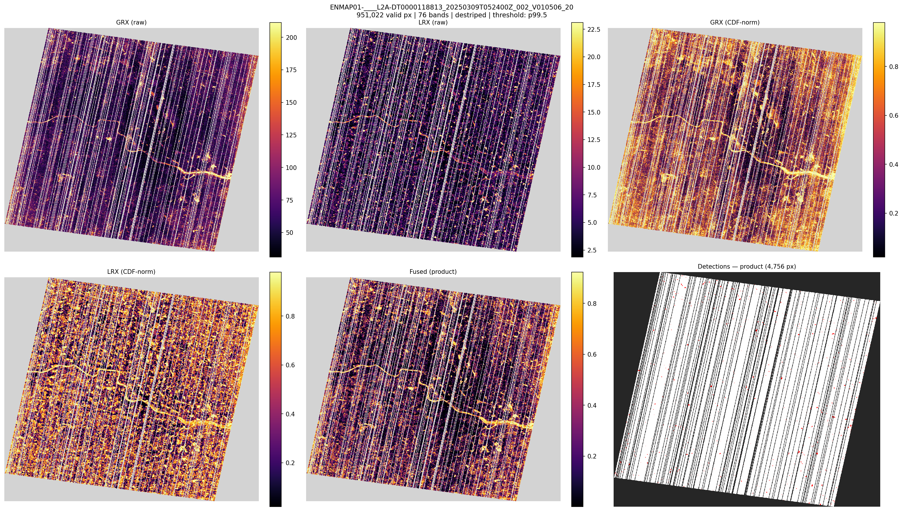
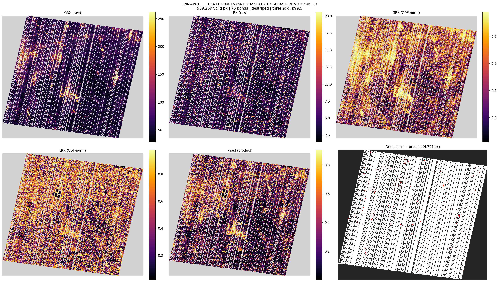
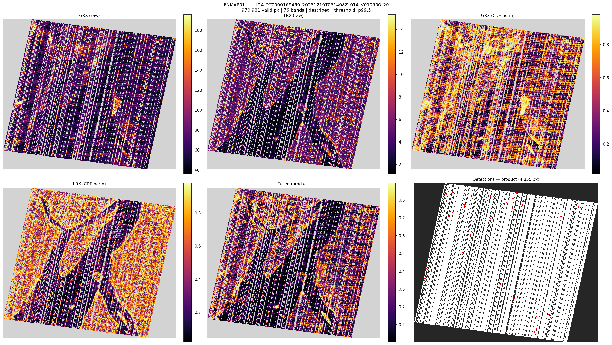
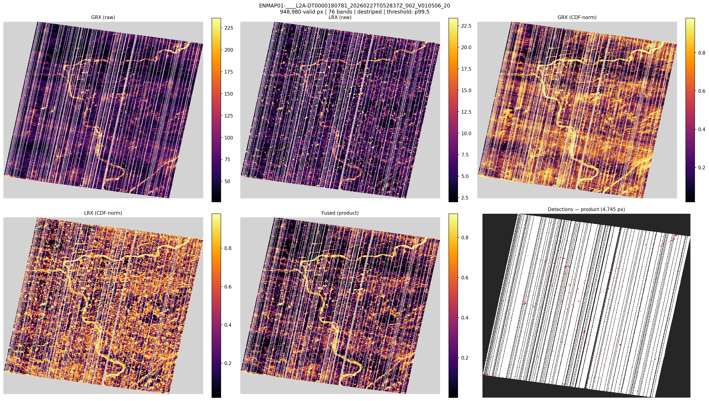

# ensemble-enmap-exp1: StatisticalEnsembler on EnMAP L2A

## Pipeline

EnMAP folder -> EnmapDatasetBuilder -> StatisticalEnsembler (CombinedDestriper -> GRX + LRX -> CDF-normalize -> fuse) -> anomaly detection at p99.5

- Band failure threshold: 0.01 (relaxed from 0.05 for EnMAP column defects)
- LRX: outer=25, inner=5, stride=2
- Detection percentile: 99.5
- Fusion strategies: product, maximum, mean

## Scene Overview

| Scene | Cube | Bands | Valid Px | Time (s) |
|---|---|---|---|---|
| ENMAP01-____L2A-DT0000059367_20240128T063655Z_018_ | 224x1179x1320 | 76 | 927,093 | 114.6 |
| ENMAP01-____L2A-DT0000118813_20250309T052400Z_002_ | 224x1174x1335 | 76 | 951,022 | 120.1 |
| ENMAP01-____L2A-DT0000157567_20251013T061429Z_019_ | 224x1174x1346 | 76 | 959,269 | 118.4 |
| ENMAP01-____L2A-DT0000169460_20251219T051408Z_014_ | 224x1175x1353 | 76 | 970,981 | 121.2 |
| ENMAP01-____L2A-DT0000180781_20260227T052837Z_002_ | 224x1173x1326 | 76 | 948,980 | 119.9 |

## GRX Score Statistics (destriped)

| Scene | Median | p99 | p99.5 | Max |
|---|---|---|---|---|
| ENMAP01-____L2A-DT0000059367_20240128T063655Z_018_ | 46.1277 | 471.3425 | 676.1776 | 16032.689 |
| ENMAP01-____L2A-DT0000118813_20250309T052400Z_002_ | 63.3467 | 268.9937 | 344.3075 | 11842.1961 |
| ENMAP01-____L2A-DT0000157567_20251013T061429Z_019_ | 57.0437 | 380.9321 | 567.5381 | 24426.1749 |
| ENMAP01-____L2A-DT0000169460_20251219T051408Z_014_ | 65.0518 | 247.8209 | 313.4818 | 34895.9762 |
| ENMAP01-____L2A-DT0000180781_20260227T052837Z_002_ | 60.8384 | 303.4358 | 382.6497 | 29010.9331 |

## LRX Score Statistics (destriped)

| Scene | Median | p99 | p99.5 | Max |
|---|---|---|---|---|
| ENMAP01-____L2A-DT0000059367_20240128T063655Z_018_ | 1.9074 | 21.0069 | 29.8166 | 8424.8857 |
| ENMAP01-____L2A-DT0000118813_20250309T052400Z_002_ | 4.5826 | 32.6976 | 46.074 | 3133.2524 |
| ENMAP01-____L2A-DT0000157567_20251013T061429Z_019_ | 4.0842 | 28.8049 | 40.2396 | 782.5182 |
| ENMAP01-____L2A-DT0000169460_20251219T051408Z_014_ | 4.1227 | 19.5978 | 25.0719 | 986.4122 |
| ENMAP01-____L2A-DT0000180781_20260227T052837Z_002_ | 5.0671 | 32.0156 | 44.5816 | 4079.8673 |

## Fused Score Statistics — product

| Scene | Median | p99 | p99.5 | Max |
|---|---|---|---|---|
| ENMAP01-____L2A-DT0000059367_20240128T063655Z_018_ | 0.1948 | 0.9629 | 0.9782 | 0.9999 |
| ENMAP01-____L2A-DT0000118813_20250309T052400Z_002_ | 0.2053 | 0.9575 | 0.9765 | 1.0 |
| ENMAP01-____L2A-DT0000157567_20251013T061429Z_019_ | 0.2056 | 0.9437 | 0.9659 | 1.0 |
| ENMAP01-____L2A-DT0000169460_20251219T051408Z_014_ | 0.2037 | 0.9366 | 0.9633 | 1.0 |
| ENMAP01-____L2A-DT0000180781_20260227T052837Z_002_ | 0.2054 | 0.9518 | 0.9723 | 1.0 |

## Fused Score Statistics — maximum

| Scene | Median | p99 | p99.5 | Max |
|---|---|---|---|---|
| ENMAP01-____L2A-DT0000059367_20240128T063655Z_018_ | 0.6074 | 0.9944 | 0.9973 | 1.0 |
| ENMAP01-____L2A-DT0000118813_20250309T052400Z_002_ | 0.6539 | 0.9942 | 0.9971 | 1.0 |
| ENMAP01-____L2A-DT0000157567_20251013T061429Z_019_ | 0.6542 | 0.9946 | 0.9973 | 1.0 |
| ENMAP01-____L2A-DT0000169460_20251219T051408Z_014_ | 0.6679 | 0.9946 | 0.9973 | 1.0 |
| ENMAP01-____L2A-DT0000180781_20260227T052837Z_002_ | 0.65 | 0.9944 | 0.9972 | 1.0 |

## Fused Score Statistics — mean

| Scene | Median | p99 | p99.5 | Max |
|---|---|---|---|---|
| ENMAP01-____L2A-DT0000059367_20240128T063655Z_018_ | 0.4675 | 0.9814 | 0.9891 | 1.0 |
| ENMAP01-____L2A-DT0000118813_20250309T052400Z_002_ | 0.4932 | 0.9786 | 0.9882 | 1.0 |
| ENMAP01-____L2A-DT0000157567_20251013T061429Z_019_ | 0.4941 | 0.9716 | 0.9829 | 1.0 |
| ENMAP01-____L2A-DT0000169460_20251219T051408Z_014_ | 0.497 | 0.968 | 0.9815 | 1.0 |
| ENMAP01-____L2A-DT0000180781_20260227T052837Z_002_ | 0.492 | 0.9757 | 0.9861 | 1.0 |

## Detection Counts (p99.5 threshold)

| Scene | Product | Maximum | Mean |
|---|---|---|---|
| ENMAP01-____L2A-DT0000059367_20240128T063655Z_018_ | 4,636 | 4,637 | 4,636 |
| ENMAP01-____L2A-DT0000118813_20250309T052400Z_002_ | 4,756 | 4,757 | 4,757 |
| ENMAP01-____L2A-DT0000157567_20251013T061429Z_019_ | 4,797 | 4,798 | 4,797 |
| ENMAP01-____L2A-DT0000169460_20251219T051408Z_014_ | 4,855 | 4,855 | 4,855 |
| ENMAP01-____L2A-DT0000180781_20260227T052837Z_002_ | 4,745 | 4,745 | 4,745 |

## Panels

### ENMAP01-____L2A-DT0000059367_20240128T063655Z_018_V010506_20

### ENMAP01-____L2A-DT0000118813_20250309T052400Z_002_V010506_20

### ENMAP01-____L2A-DT0000157567_20251013T061429Z_019_V010506_20

### ENMAP01-____L2A-DT0000169460_20251219T051408Z_014_V010506_20

### ENMAP01-____L2A-DT0000180781_20260227T052837Z_002_V010506_20

