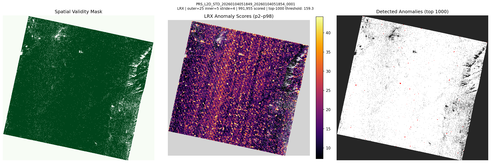
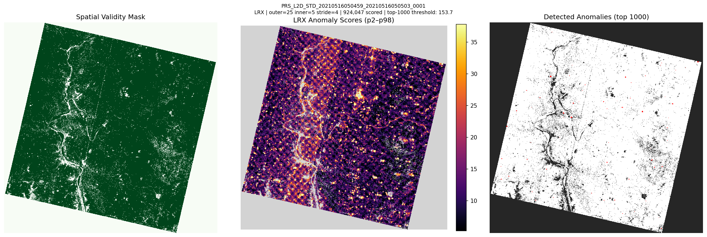
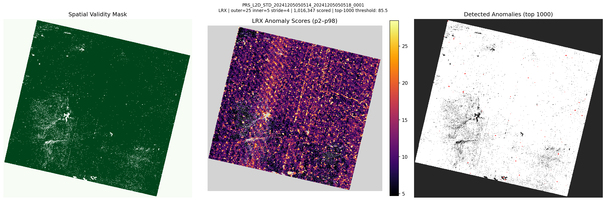
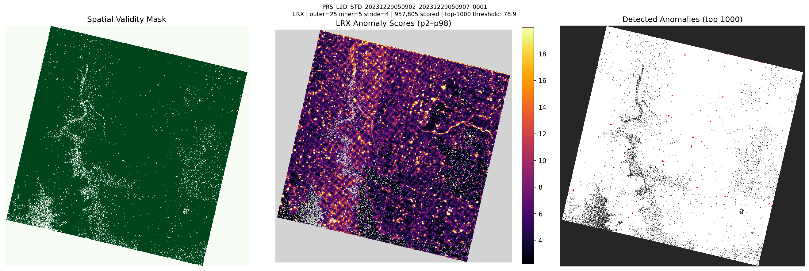
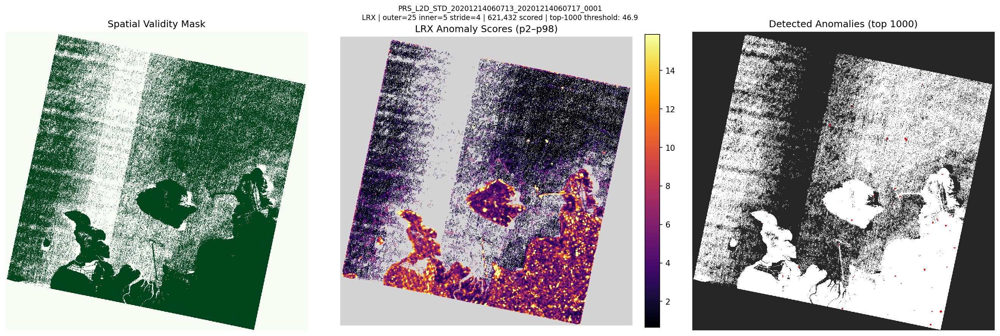

# lrx-had-exp2: Local RX on All 5 PRISMA Scenes (stride=4)

## Pipeline

HE5 → PrismaDatasetBuilder → CombinedDestriper (20 probes) → LocalRXDetector
Parameters: outer_window=25, inner_window=5, stride=4

| Scene | Bands | Scored Px | threshold | p2 | median | p98 | p99.9 | max | Detect (s) |
|---|---|---|---|---|---|---|---|---|---|
| PRS_L2D_STD_20260104051849_2026010405185 | 177 | 991,955 | 159.32 | 7.15 | 15.36 | 44.19 | 159.97 | 1200.8 | 80.0 |
| PRS_L2D_STD_20210516050459_2021051605050 | 174 | 924,047 | 153.72 | 5.23 | 11.48 | 37.79 | 158.21 | 1522.8 | 72.6 |
| PRS_L2D_STD_20241205050514_2024120505051 | 176 | 1,016,347 | 85.49 | 4.70 | 10.00 | 28.44 | 85.10 | 927.7 | 98.4 |
| PRS_L2D_STD_20231229050902_2023122905090 | 176 | 957,805 | 78.86 | 2.22 | 5.44 | 19.95 | 81.01 | 1559.3 | 77.4 |
| PRS_L2D_STD_20201214060713_2020121406071 | 124 | 621,432 | 46.9 | 0.65 | 2.76 | 15.87 | 59.92 | 2141.1 | 26.7 |

## Visualizations

### PRS_L2D_STD_20260104051849_20260104051854_0001

### PRS_L2D_STD_20210516050459_20210516050503_0001

### PRS_L2D_STD_20241205050514_20241205050518_0001

### PRS_L2D_STD_20231229050902_20231229050907_0001

### PRS_L2D_STD_20201214060713_20201214060717_0001

