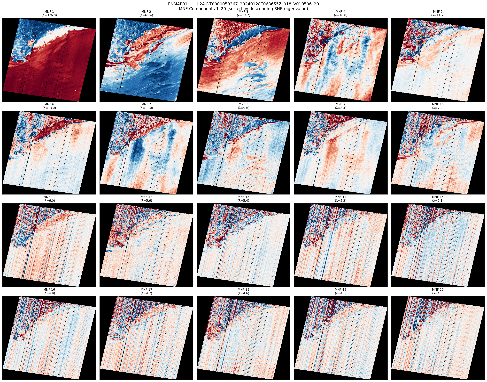
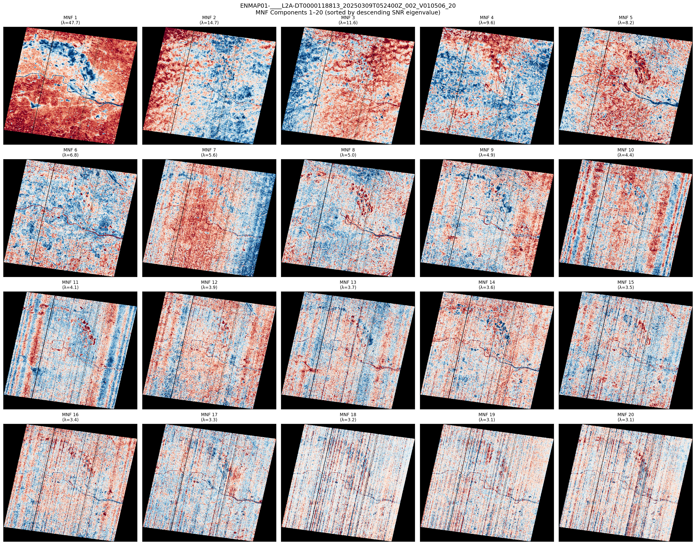
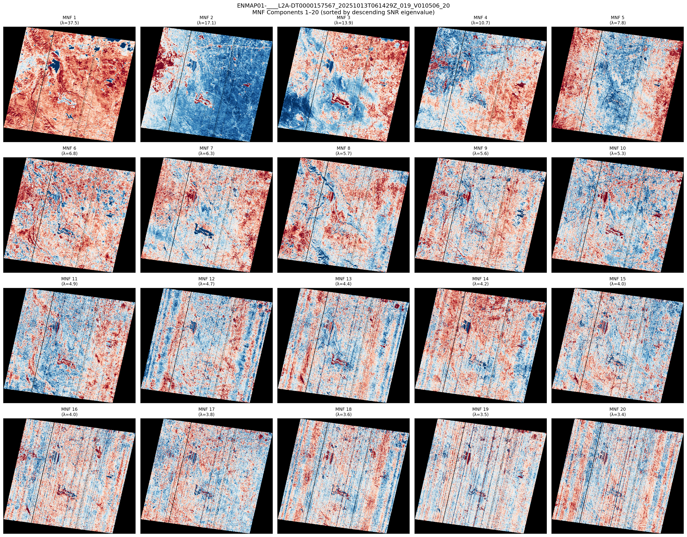
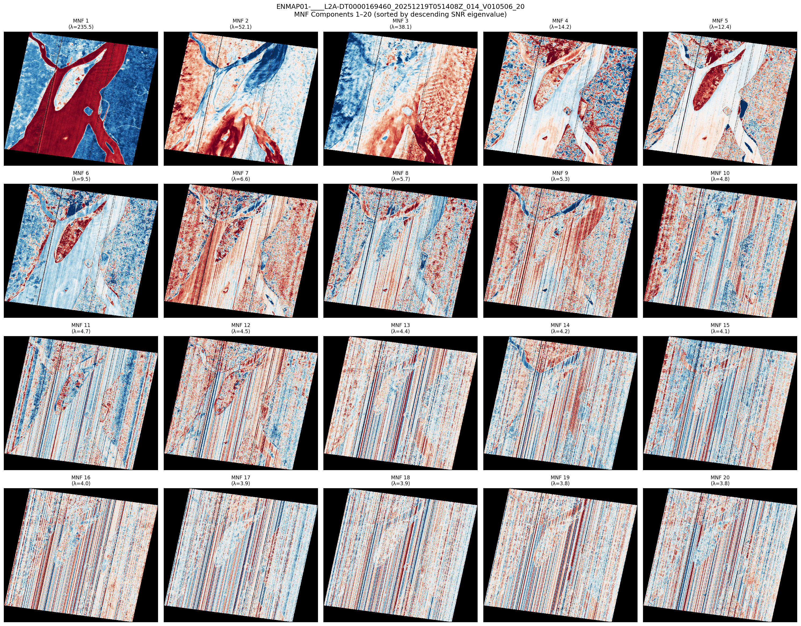
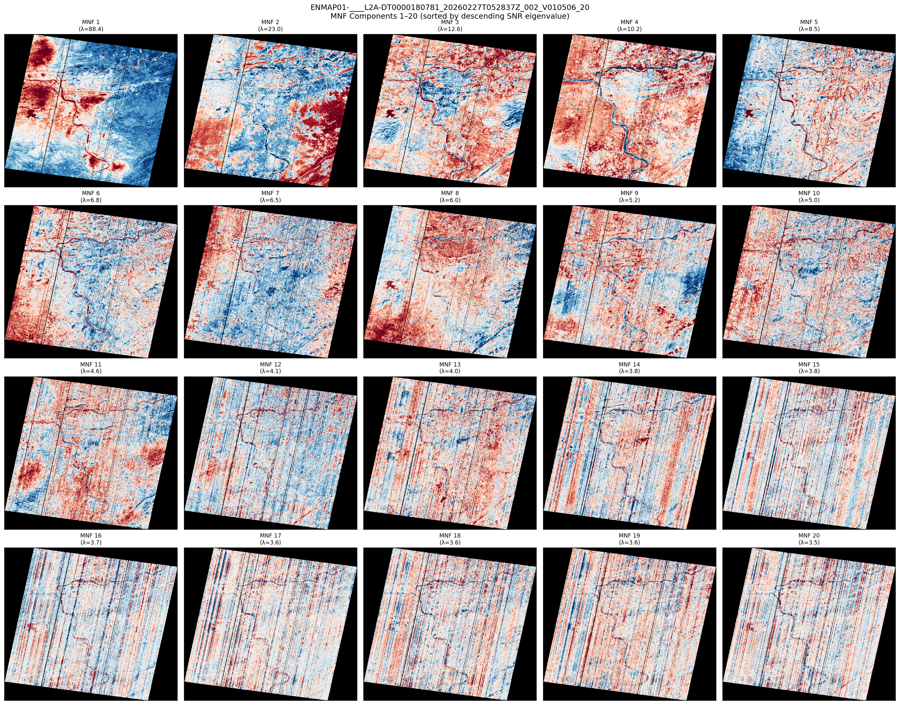

# mnf-enmap-components: MNF Component Mosaics for EnMAP

## Experiment

- **MNF components plotted:** 20
- **Band failure threshold:** 5%
- **Colormap:** RdBu_r (diverging), 2nd–98th percentile stretch
- **Purpose:** Identify which MNF components carry signal vs. striping/noise
- **Scenes processed:** 5

## Eigenvalue Spectra

### ENMAP01-____L2A-DT0000059367_20240128T063655Z_018_V010506_20
- Bands: 189, Components: 20
- Eigenvalues: [376.0, 61.4, 37.7, 18.8, 14.7, 13.0, 11.0, 9.6, 8.4, 7.2, 6.0, 5.6, 5.4, 5.2, 5.1, 4.9, 4.7, 4.6, 4.5, 4.3]

### ENMAP01-____L2A-DT0000118813_20250309T052400Z_002_V010506_20
- Bands: 189, Components: 20
- Eigenvalues: [47.7, 14.7, 11.6, 9.6, 8.2, 6.8, 5.6, 5.0, 4.9, 4.4, 4.1, 3.9, 3.7, 3.6, 3.5, 3.4, 3.3, 3.2, 3.1, 3.1]

### ENMAP01-____L2A-DT0000157567_20251013T061429Z_019_V010506_20
- Bands: 189, Components: 20
- Eigenvalues: [37.5, 17.1, 13.9, 10.7, 7.8, 6.8, 6.3, 5.7, 5.6, 5.3, 4.9, 4.7, 4.4, 4.2, 4.0, 4.0, 3.8, 3.6, 3.5, 3.4]

### ENMAP01-____L2A-DT0000169460_20251219T051408Z_014_V010506_20
- Bands: 188, Components: 20
- Eigenvalues: [235.5, 52.1, 38.1, 14.2, 12.4, 9.5, 6.6, 5.7, 5.3, 4.8, 4.7, 4.5, 4.4, 4.2, 4.1, 4.0, 3.9, 3.9, 3.8, 3.8]

### ENMAP01-____L2A-DT0000180781_20260227T052837Z_002_V010506_20
- Bands: 189, Components: 20
- Eigenvalues: [88.4, 23.0, 12.6, 10.2, 8.5, 6.8, 6.5, 6.0, 5.2, 5.0, 4.6, 4.1, 4.0, 3.8, 3.8, 3.7, 3.6, 3.6, 3.6, 3.5]

## Mosaics

### ENMAP01-____L2A-DT0000059367_20240128T063655Z_018_V010506_20

### ENMAP01-____L2A-DT0000118813_20250309T052400Z_002_V010506_20

### ENMAP01-____L2A-DT0000157567_20251013T061429Z_019_V010506_20

### ENMAP01-____L2A-DT0000169460_20251219T051408Z_014_V010506_20

### ENMAP01-____L2A-DT0000180781_20260227T052837Z_002_V010506_20

