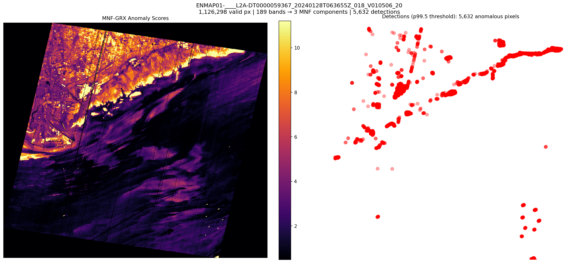
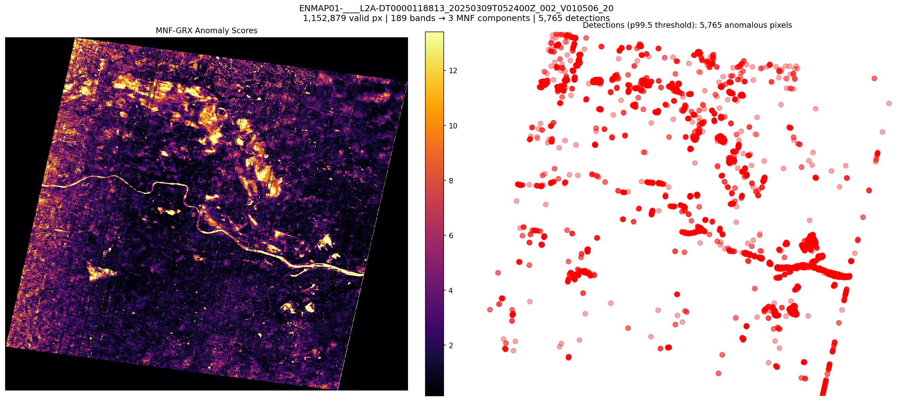
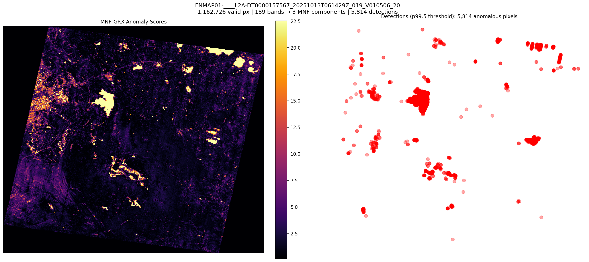
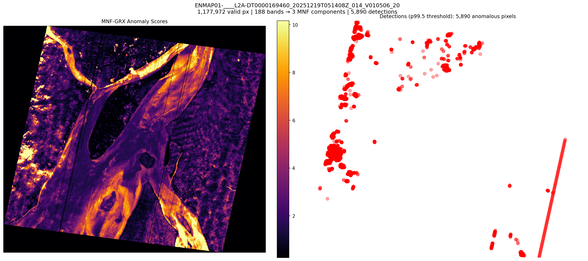
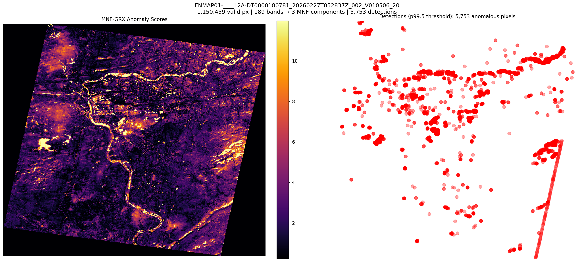

# mnf-enmap-detections: MNF-GRX Anomaly Detection on EnMAP

## Experiment

- **Detector:** MNFCompressionDetector (MNF → GRX)
- **MNF components:** 3
- **Band failure threshold:** 5%
- **Detection threshold:** p99.5
- **Scenes processed:** 5

## Results

| Scene | Bands | MNF | Valid Px | Detections | Threshold | Median | p99 | p99.5 | Max | Time (s) |
|---|---|---|---|---|---|---|---|---|---|---|
| ENMAP01-____L2A-DT0000059367_20240128T063655Z | 189 | 3 | 1,126,298 | 5,632 | 18.3233 | 1.7738 | 13.9436 | 18.3233 | 496.5346 | 14.4 |
| ENMAP01-____L2A-DT0000118813_20250309T052400Z | 189 | 3 | 1,152,879 | 5,765 | 20.6262 | 1.8784 | 16.7476 | 20.6262 | 589.6509 | 16.0 |
| ENMAP01-____L2A-DT0000157567_20251013T061429Z | 189 | 3 | 1,162,726 | 5,814 | 44.1575 | 1.4531 | 37.1539 | 44.1575 | 873.2635 | 15.4 |
| ENMAP01-____L2A-DT0000169460_20251219T051408Z | 188 | 3 | 1,177,972 | 5,890 | 15.0365 | 2.1037 | 11.9978 | 15.0365 | 200.4095 | 16.4 |
| ENMAP01-____L2A-DT0000180781_20260227T052837Z | 189 | 3 | 1,150,459 | 5,753 | 21.1653 | 2.1515 | 15.628 | 21.1653 | 363.0994 | 14.8 |

## Detection Overlays

### ENMAP01-____L2A-DT0000059367_20240128T063655Z_018_V010506_20
- Detections: 5,632
- GeoTIFF: [ENMAP01-____L2A-DT0000059367_20240128T063655Z_018_V010506_20260305T173243Z/anomaly_mnf_rx.tif](ENMAP01-____L2A-DT0000059367_20240128T063655Z_018_V010506_20260305T173243Z/anomaly_mnf_rx.tif)

### ENMAP01-____L2A-DT0000118813_20250309T052400Z_002_V010506_20
- Detections: 5,765
- GeoTIFF: [ENMAP01-____L2A-DT0000118813_20250309T052400Z_002_V010506_20260305T174411Z/anomaly_mnf_rx.tif](ENMAP01-____L2A-DT0000118813_20250309T052400Z_002_V010506_20260305T174411Z/anomaly_mnf_rx.tif)

### ENMAP01-____L2A-DT0000157567_20251013T061429Z_019_V010506_20
- Detections: 5,814
- GeoTIFF: [ENMAP01-____L2A-DT0000157567_20251013T061429Z_019_V010506_20260305T173019Z/anomaly_mnf_rx.tif](ENMAP01-____L2A-DT0000157567_20251013T061429Z_019_V010506_20260305T173019Z/anomaly_mnf_rx.tif)

### ENMAP01-____L2A-DT0000169460_20251219T051408Z_014_V010506_20
- Detections: 5,890
- GeoTIFF: [ENMAP01-____L2A-DT0000169460_20251219T051408Z_014_V010506_20260305T173714Z/anomaly_mnf_rx.tif](ENMAP01-____L2A-DT0000169460_20251219T051408Z_014_V010506_20260305T173714Z/anomaly_mnf_rx.tif)

### ENMAP01-____L2A-DT0000180781_20260227T052837Z_002_V010506_20
- Detections: 5,753
- GeoTIFF: [ENMAP01-____L2A-DT0000180781_20260227T052837Z_002_V010506_20260305T174233Z/anomaly_mnf_rx.tif](ENMAP01-____L2A-DT0000180781_20260227T052837Z_002_V010506_20260305T174233Z/anomaly_mnf_rx.tif)

