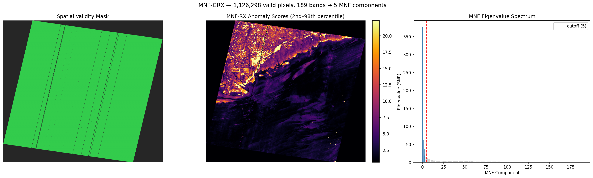
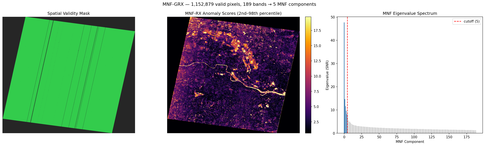
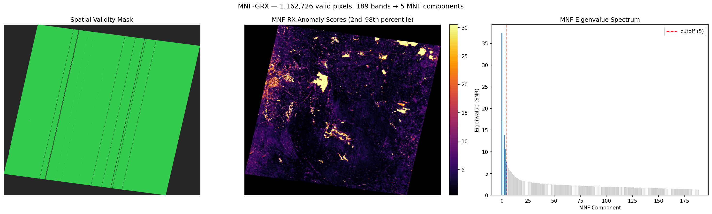
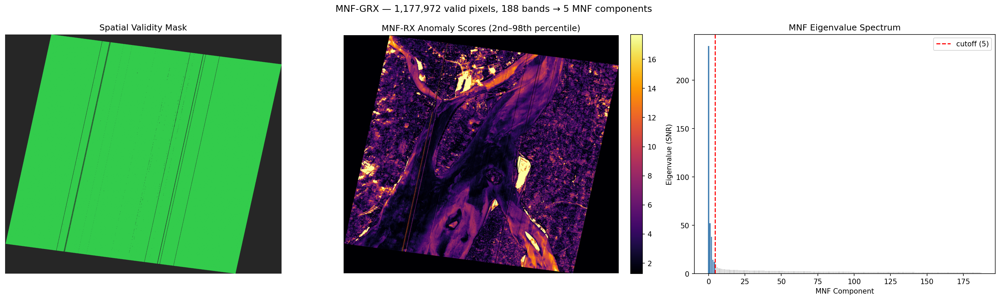
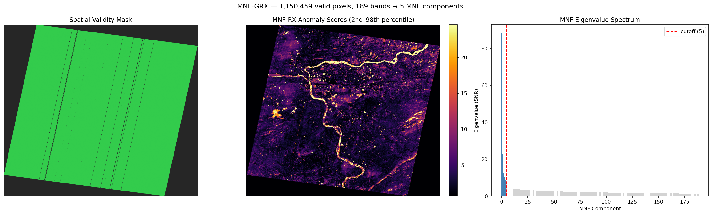

# mnf-enmap: MNF Compression + Global RX on EnMAP L2A

## Experiment

- **Detector:** MNFCompressionDetector (MNF → GRX)
- **MNF components:** 5
- **Band failure threshold:** 5%
- **Min band coverage:** 95%
- **Noise estimation:** spatial shift-difference (Green et al. 1988)
- **Scenes processed:** 5

## Results

| Scene | Cube | Bands (good/total) | MNF Comp. | Valid Pixels | Score Range | Median | p99 | Build (s) | Detect (s) |
|---|---|---|---|---|---|---|---|---|---|
| ENMAP01-____L2A-DT0000059367_20240128T063655Z_018_ | 224x1179x1320 | 189/224 | 5 | 1,126,298/1,556,280 | 0.0317–893.2459 | 2.2416 | 29.6498 | 4.3 | 6.72 |
| ENMAP01-____L2A-DT0000118813_20250309T052400Z_002_ | 224x1174x1335 | 189/224 | 5 | 1,152,879/1,567,290 | 0.0145–1005.6223 | 3.5802 | 26.8326 | 4.06 | 7.16 |
| ENMAP01-____L2A-DT0000157567_20251013T061429Z_019_ | 224x1174x1346 | 189/224 | 5 | 1,162,726/1,580,204 | 0.0115–3634.3442 | 2.6846 | 43.2991 | 4.31 | 7.66 |
| ENMAP01-____L2A-DT0000169460_20251219T051408Z_014_ | 224x1175x1353 | 188/224 | 5 | 1,177,972/1,589,775 | 0.0541–841.0412 | 3.8518 | 27.0977 | 4.26 | 6.48 |
| ENMAP01-____L2A-DT0000180781_20260227T052837Z_002_ | 224x1173x1326 | 189/224 | 5 | 1,150,459/1,555,398 | 0.0058–779.4268 | 3.2887 | 37.3753 | 4.17 | 7.84 |

## Visualizations

### ENMAP01-____L2A-DT0000059367_20240128T063655Z_018_V010506_20

### ENMAP01-____L2A-DT0000118813_20250309T052400Z_002_V010506_20

### ENMAP01-____L2A-DT0000157567_20251013T061429Z_019_V010506_20

### ENMAP01-____L2A-DT0000169460_20251219T051408Z_014_V010506_20

### ENMAP01-____L2A-DT0000180781_20260227T052837Z_002_V010506_20

