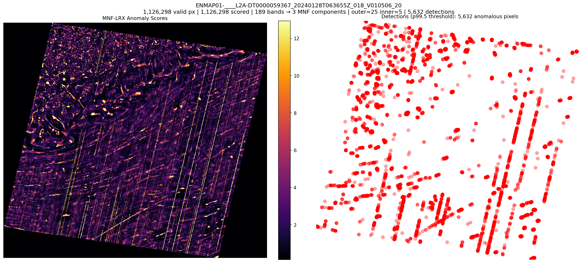
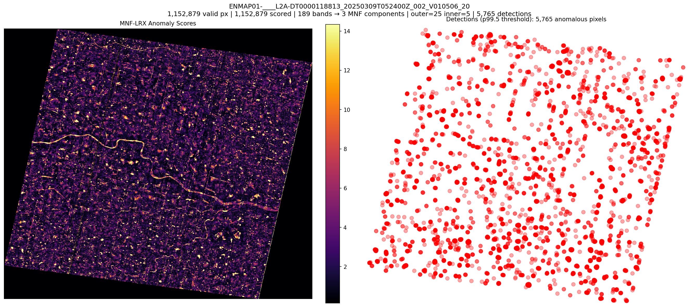
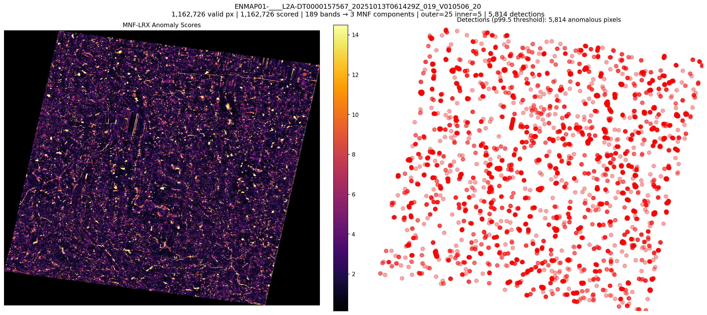
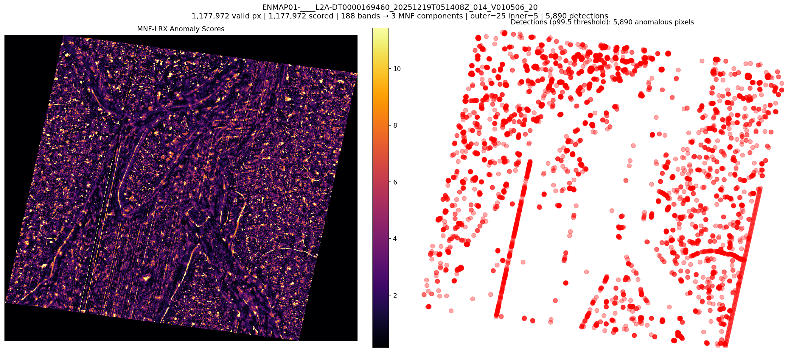
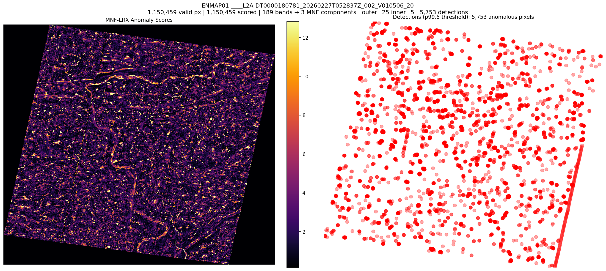

# mnf-lrx-enmap-detections: MNF-LRX Anomaly Detection on EnMAP

## Experiment

- **Detector:** MNFCompressionLRXDetector (MNF → LRX)
- **MNF components:** 3
- **LRX outer window:** 25
- **LRX inner window:** 5
- **Stride:** 1
- **Regularization:** 0.0001
- **Band failure threshold:** 5%
- **Detection threshold:** p99.5
- **Scenes processed:** 5

## Results

| Scene | Bands | MNF | Valid Px | Scored Px | Detections | Threshold | Median | p99 | p99.5 | Max | Time (s) |
|---|---|---|---|---|---|---|---|---|---|---|---|
| ENMAP01-____L2A-DT0000059367_20240128T063655Z | 189 | 3 | 1,126,298 | 1,126,298 | 5,632 | 23.4984 | 1.6031 | 18.321 | 23.4984 | 16960.3984 | 324.9 |
| ENMAP01-____L2A-DT0000118813_20250309T052400Z | 189 | 3 | 1,152,879 | 1,152,879 | 5,765 | 28.8623 | 1.8611 | 20.49 | 28.8623 | 1323.6626 | 339.0 |
| ENMAP01-____L2A-DT0000157567_20251013T061429Z | 189 | 3 | 1,162,726 | 1,162,726 | 5,814 | 29.055 | 1.7194 | 20.6865 | 29.055 | 2875.1912 | 323.5 |
| ENMAP01-____L2A-DT0000169460_20251219T051408Z | 188 | 3 | 1,177,972 | 1,177,972 | 5,890 | 20.516 | 1.8139 | 15.3917 | 20.516 | 771.0099 | 332.9 |
| ENMAP01-____L2A-DT0000180781_20260227T052837Z | 189 | 3 | 1,150,459 | 1,150,459 | 5,753 | 23.5243 | 1.7882 | 17.4267 | 23.5243 | 341.0227 | 326.0 |

## Detection Overlays

### ENMAP01-____L2A-DT0000059367_20240128T063655Z_018_V010506_20
- Detections: 5,632
- Scored pixels: 1,126,298
- GeoTIFF: [ENMAP01-____L2A-DT0000059367_20240128T063655Z_018_V010506_20260305T173243Z/anomaly_mnf_lrx.tif](ENMAP01-____L2A-DT0000059367_20240128T063655Z_018_V010506_20260305T173243Z/anomaly_mnf_lrx.tif)

### ENMAP01-____L2A-DT0000118813_20250309T052400Z_002_V010506_20
- Detections: 5,765
- Scored pixels: 1,152,879
- GeoTIFF: [ENMAP01-____L2A-DT0000118813_20250309T052400Z_002_V010506_20260305T174411Z/anomaly_mnf_lrx.tif](ENMAP01-____L2A-DT0000118813_20250309T052400Z_002_V010506_20260305T174411Z/anomaly_mnf_lrx.tif)

### ENMAP01-____L2A-DT0000157567_20251013T061429Z_019_V010506_20
- Detections: 5,814
- Scored pixels: 1,162,726
- GeoTIFF: [ENMAP01-____L2A-DT0000157567_20251013T061429Z_019_V010506_20260305T173019Z/anomaly_mnf_lrx.tif](ENMAP01-____L2A-DT0000157567_20251013T061429Z_019_V010506_20260305T173019Z/anomaly_mnf_lrx.tif)

### ENMAP01-____L2A-DT0000169460_20251219T051408Z_014_V010506_20
- Detections: 5,890
- Scored pixels: 1,177,972
- GeoTIFF: [ENMAP01-____L2A-DT0000169460_20251219T051408Z_014_V010506_20260305T173714Z/anomaly_mnf_lrx.tif](ENMAP01-____L2A-DT0000169460_20251219T051408Z_014_V010506_20260305T173714Z/anomaly_mnf_lrx.tif)

### ENMAP01-____L2A-DT0000180781_20260227T052837Z_002_V010506_20
- Detections: 5,753
- Scored pixels: 1,150,459
- GeoTIFF: [ENMAP01-____L2A-DT0000180781_20260227T052837Z_002_V010506_20260305T174233Z/anomaly_mnf_lrx.tif](ENMAP01-____L2A-DT0000180781_20260227T052837Z_002_V010506_20260305T174233Z/anomaly_mnf_lrx.tif)

