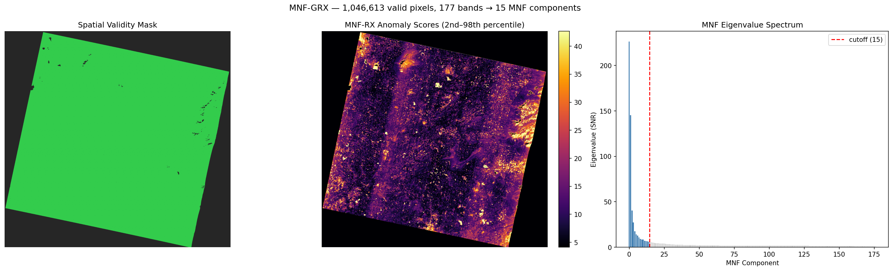
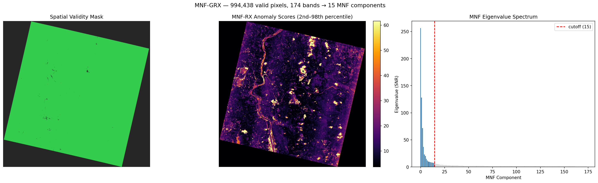
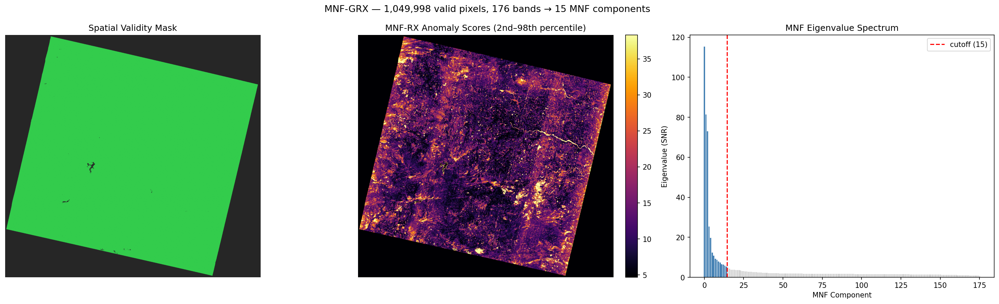
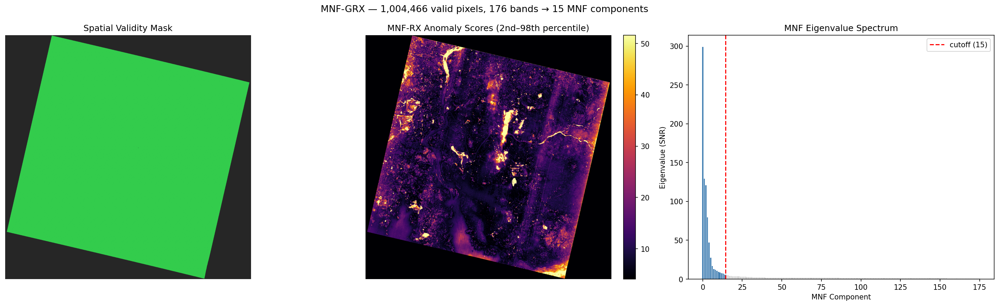
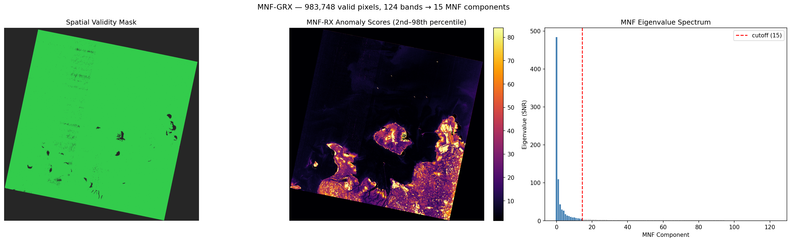

# mnf-prisma: MNF Compression + Global RX on PRISMA Test Payloads

## Experiment

- **Detector:** MNFCompressionDetector (MNF → GRX)
- **MNF components:** 15
- **Band failure threshold:** 5%
- **Min band coverage:** 95%
- **Noise estimation:** spatial shift-difference (Green et al. 1988)
- **Scenes processed:** 5

## Results

| Scene | Cube Shape | Bands (good/total) | MNF Comp. | Valid Pixels | Score Range | Median | p99 | Build (s) | Detect (s) |
|---|---|---|---|---|---|---|---|---|---|
| PRS_L2D_STD_20260104051849_2026010405185 | `(239, 1199, 1248)` | 177/239 | 15 | 1,046,613/1,496,352 | 1.6022–2470.4426 | 11.6924 | 55.5335 | 4.0 | 6.5 |
| PRS_L2D_STD_20210516050459_2021051605050 | `(239, 1202, 1210)` | 174/239 | 15 | 994,438/1,454,420 | 1.1547–5830.948 | 10.7711 | 93.8078 | 4.32 | 6.11 |
| PRS_L2D_STD_20241205050514_2024120505051 | `(239, 1216, 1280)` | 176/239 | 15 | 1,049,998/1,556,480 | 1.4406–8726.1549 | 12.2877 | 48.9846 | 4.45 | 5.84 |
| PRS_L2D_STD_20231229050902_2023122905090 | `(239, 1210, 1219)` | 176/239 | 15 | 1,004,466/1,474,990 | 0.9273–7908.6781 | 10.5155 | 79.153 | 5.54 | 5.73 |
| PRS_L2D_STD_20201214060713_2020121406071 | `(239, 1186, 1196)` | 124/239 | 15 | 983,748/1,418,456 | 0.4409–2412.3536 | 5.0269 | 120.9902 | 9.99 | 2.95 |

## Visualizations

### PRS_L2D_STD_20260104051849_2026010405185

### PRS_L2D_STD_20210516050459_2021051605050

### PRS_L2D_STD_20241205050514_2024120505051

### PRS_L2D_STD_20231229050902_2023122905090

### PRS_L2D_STD_20201214060713_2020121406071

