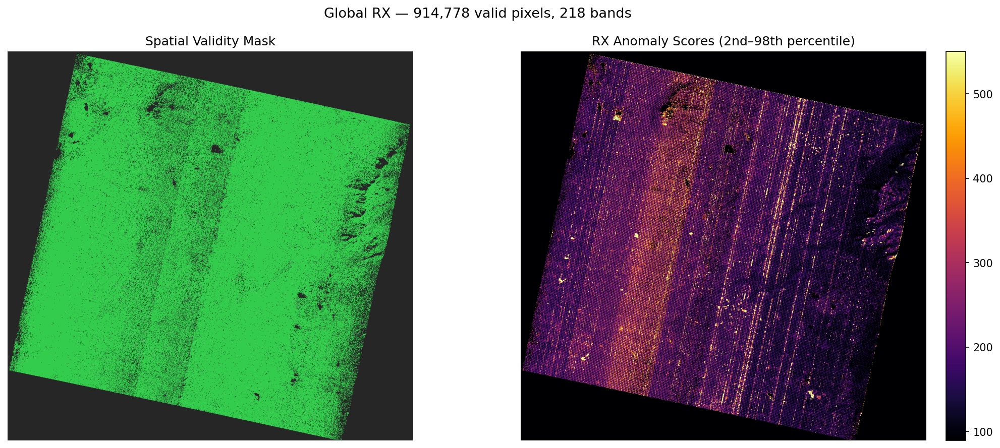
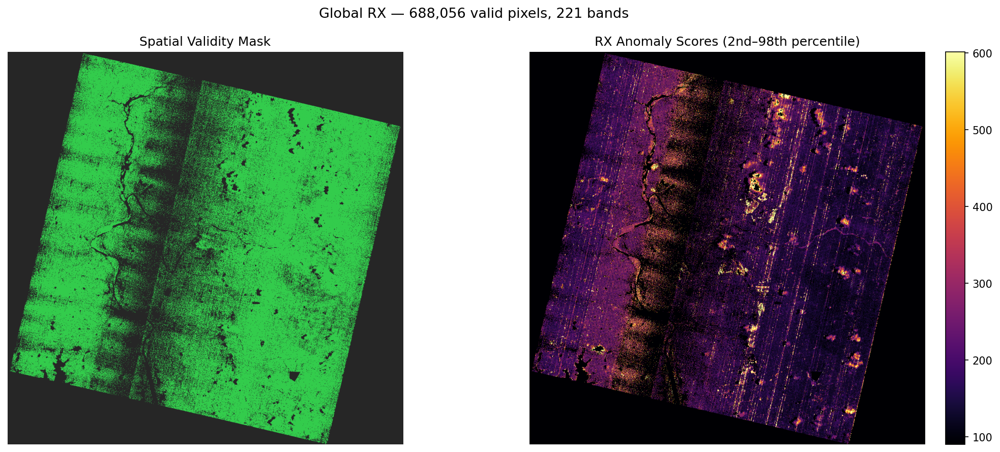
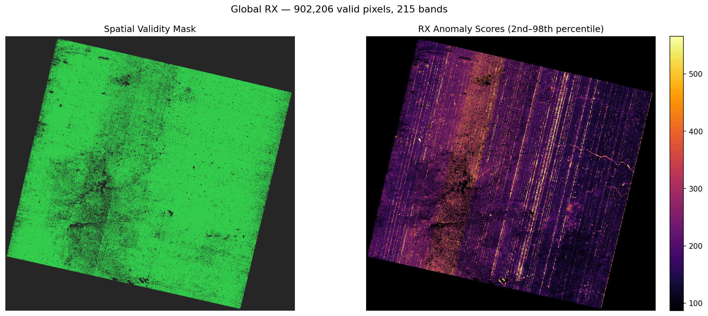
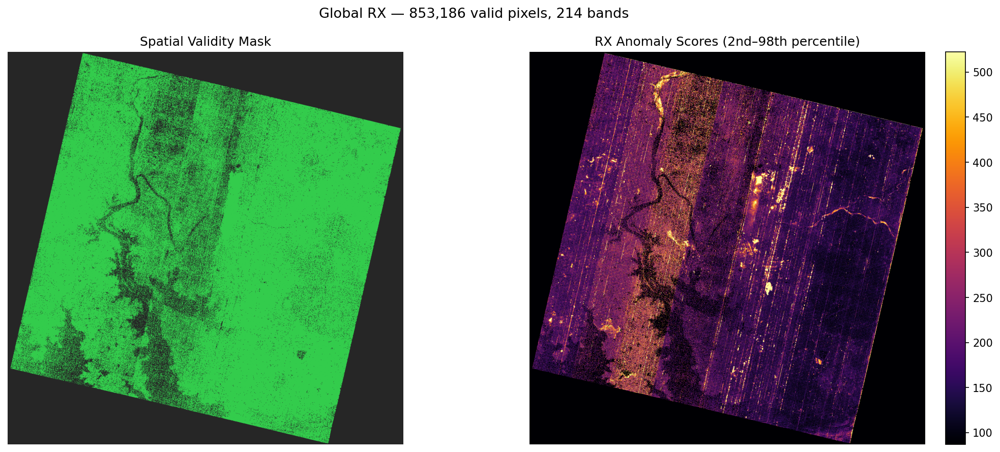
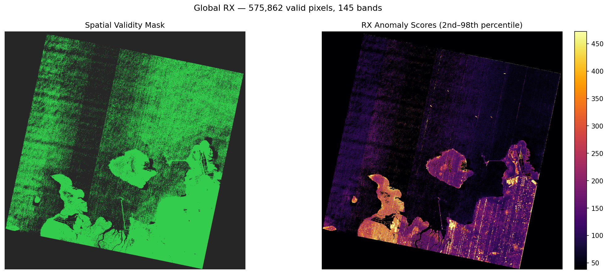

# rx-had-exp1: Global RX on PRISMA Test Payloads

## Experiment

- **Detector:** GlobalRXDetector (rx-had-v1)
- **Band failure threshold:** 5%
- **Spatial mask:** all surviving bands must be valid per pixel
- **Failure rate baseline:** pixels within valid swath only (geometric trim excluded)
- **Scenes processed:** 5

## Results

| Scene | Cube Shape | Bands (good/total) | Valid Pixels | Pixel:Band | Score Range | Median | Build (s) | Detect (s) |
|---|---|---|---|---|---|---|---|---|
| PRS_L2D_STD_20260104051849_2026010405185 | `(239, 1199, 1248)` | 218/239 | 914,778/1,496,352 | 4196.2 | 51.0323–157782.9336 | 180.9292 | 4.86 | 3.23 |
| PRS_L2D_STD_20210516050459_2021051605050 | `(239, 1202, 1210)` | 221/239 | 688,056/1,454,420 | 3113.4 | 53.0369–57752.248 | 181.0411 | 4.0 | 2.97 |
| PRS_L2D_STD_20241205050514_2024120505051 | `(239, 1216, 1280)` | 215/239 | 902,206/1,556,480 | 4196.3 | 51.8328–52267.1022 | 179.3113 | 4.77 | 3.77 |
| PRS_L2D_STD_20231229050902_2023122905090 | `(239, 1210, 1219)` | 214/239 | 853,186/1,474,990 | 3986.9 | 51.9868–183221.4789 | 181.5604 | 6.17 | 4.17 |
| PRS_L2D_STD_20201214060713_2020121406071 | `(239, 1186, 1196)` | 145/239 | 575,862/1,418,456 | 3971.5 | 19.8305–30133.75 | 110.1138 | 13.35 | 1.21 |

## Visualizations

### PRS_L2D_STD_20260104051849_2026010405185

### PRS_L2D_STD_20210516050459_2021051605050

### PRS_L2D_STD_20241205050514_2024120505051

### PRS_L2D_STD_20231229050902_2023122905090

### PRS_L2D_STD_20201214060713_2020121406071

