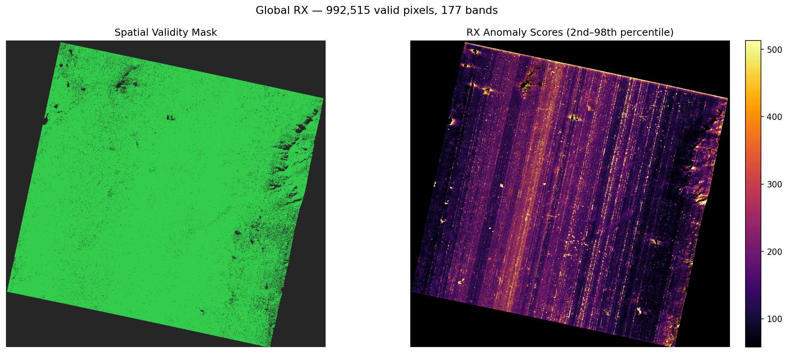
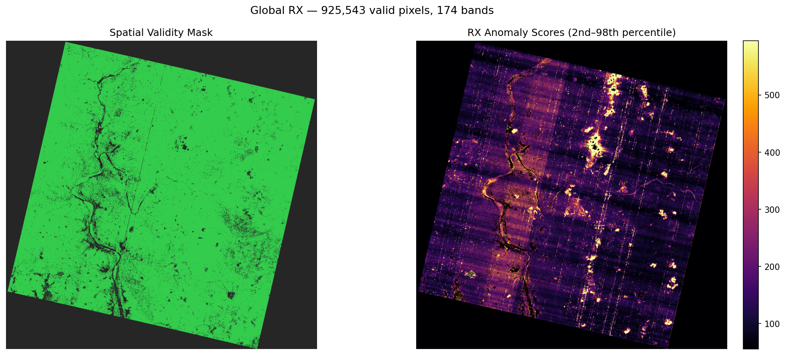
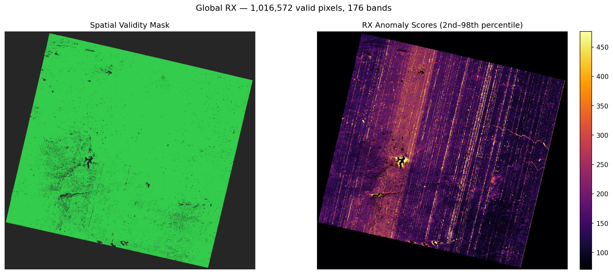
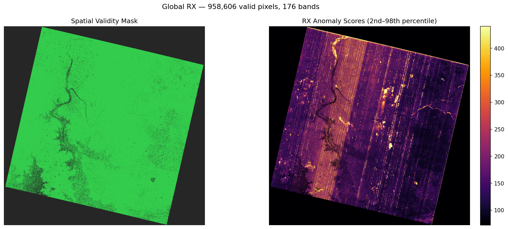
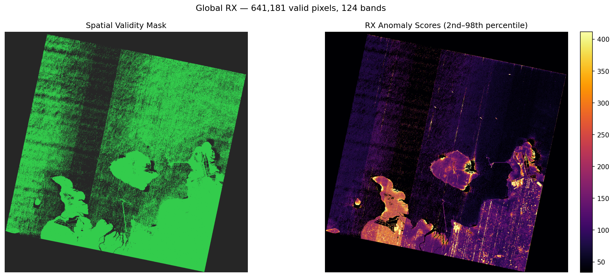

# rx-had-exp4: Destripe → Global RX — Detailed Per-Scene Report

## Pipeline

HE5 → PrismaDatasetBuilder → **CombinedDestriper** (FFT notch + MM with σ guard, fixed) → **GlobalRXDetector** (rx-had-v1)

---

## PRS_L2D_STD_20260104051849_20260104051854_0001

**Cube:** `(239, 1199, 1248)`  |  **Destripe:** 46.8s  |  **RX:** 5.2s  |  **Total:** 60.3s

### Band Filtering

| Stage | Dropped | Surviving |
|---|---|---|
| Input | — | 239 |
| 1a — validity flags | 5 | 234 |
| 1b — wavelength exclusion | 55 | 179 |
| 2 — pixel failure rate (>5%) | 2 | **177** |

Bands dropped in stage 2 (index, wavelength, failure rate):

- Band 0 — 21.9% failure
- Band 1 — 17.2% failure

### FFT Destriper

| Angle | Strength (σ) | Radial Preserve |
|---|---|---|
| 102.5° | 27.9σ | 2 |

### Moment Matching σ Guard

| Stage | Column-mean σ (rep band) |
|---|---|
| Original | 0.023867 |
| After FFT | 0.023205 |
| After MM | 0.014859 |

Moment-matching applied — σ change: -36.0%.

### Spatial Mask

- Valid pixels: **992,515** / 1,496,352
- Pixel-to-band ratio: 5607.4

### RX Score Distribution

| p2 | p25 | median | p75 | p98 | p99 | p99.9 | max |
|---|---|---|---|---|---|---|---|
| 58.0 | 104.6 | 143.5 | 199.7 | 513.2 | 743.0 | 2396.7 | 43911 |

- Outlier pixels above p99: **9,926**
- Outlier pixels above p99.9: **993**

### Per-Band Stripe Reduction

| Band | Wavelength | Label | σ before | σ after | Δ |
|---|---|---|---|---|---|
| 213 | 601.0nm | VNIR ~600nm | 0.021238 | 0.007649 | ↓64.0% |
| 164 | 998.9nm | boundary ~1000nm | 0.020307 | 0.013747 | ↓32.3% |
| 65 | 2002.1nm | SWIR ~2000nm | 0.052955 | 0.032349 | ↓38.9% |

---

## PRS_L2D_STD_20210516050459_20210516050503_0001

**Cube:** `(239, 1202, 1210)`  |  **Destripe:** 144.0s  |  **RX:** 6.3s  |  **Total:** 161.7s

### Band Filtering

| Stage | Dropped | Surviving |
|---|---|---|
| Input | — | 239 |
| 1a — validity flags | 5 | 234 |
| 1b — wavelength exclusion | 55 | 179 |
| 2 — pixel failure rate (>5%) | 5 | **174** |

Bands dropped in stage 2 (index, wavelength, failure rate):

- Band 0 — 77.9% failure
- Band 1 — 69.2% failure
- Band 2 — 59.0% failure
- Band 3 — 39.4% failure
- Band 4 — 14.0% failure

### FFT Destriper

| Angle | Strength (σ) | Radial Preserve |
|---|---|---|
| 103.0° | 9.5σ | 3 |
| 13.0° | 5.1σ | 3 |

### Moment Matching σ Guard

| Stage | Column-mean σ (rep band) |
|---|---|
| Original | 0.028804 |
| After FFT | 0.025703 |
| After MM | 0.023214 |

Moment-matching applied — σ change: -9.7%.

### Spatial Mask

- Valid pixels: **925,543** / 1,454,420
- Pixel-to-band ratio: 5319.2

### RX Score Distribution

| p2 | p25 | median | p75 | p98 | p99 | p99.9 | max |
|---|---|---|---|---|---|---|---|
| 55.4 | 93.3 | 127.3 | 186.6 | 595.1 | 887.8 | 3280.2 | 40191 |

- Outlier pixels above p99: **9,256**
- Outlier pixels above p99.9: **926**

### Per-Band Stripe Reduction

| Band | Wavelength | Label | σ before | σ after | Δ |
|---|---|---|---|---|---|
| 213 | 601.0nm | VNIR ~600nm | 0.017808 | 0.022573 | ↑26.8% |
| 164 | 998.9nm | boundary ~1000nm | 0.028366 | 0.037359 | ↑31.7% |
| 65 | 2002.1nm | SWIR ~2000nm | 0.031048 | 0.030151 | ↓2.9% |

---

## PRS_L2D_STD_20241205050514_20241205050518_0001

**Cube:** `(239, 1216, 1280)`  |  **Destripe:** 62.9s  |  **RX:** 9.4s  |  **Total:** 89.9s

### Band Filtering

| Stage | Dropped | Surviving |
|---|---|---|
| Input | — | 239 |
| 1a — validity flags | 5 | 234 |
| 1b — wavelength exclusion | 55 | 179 |
| 2 — pixel failure rate (>5%) | 3 | **176** |

Bands dropped in stage 2 (index, wavelength, failure rate):

- Band 0 — 25.6% failure
- Band 1 — 21.5% failure
- Band 2 — 7.8% failure

### FFT Destriper

| Angle | Strength (σ) | Radial Preserve |
|---|---|---|
| 103.5° | 2.3σ | 5 |

### Moment Matching σ Guard

| Stage | Column-mean σ (rep band) |
|---|---|
| Original | 0.007275 |
| After FFT | 0.007226 |
| After MM | 0.007226 |

σ guard fired — moment-matching skipped (would have increased σ).

### Spatial Mask

- Valid pixels: **1,016,572** / 1,556,480
- Pixel-to-band ratio: 5776.0

### RX Score Distribution

| p2 | p25 | median | p75 | p98 | p99 | p99.9 | max |
|---|---|---|---|---|---|---|---|
| 71.4 | 110.8 | 144.4 | 196.1 | 476.5 | 665.0 | 2169.0 | 47029 |

- Outlier pixels above p99: **10,166**
- Outlier pixels above p99.9: **1,017**

### Per-Band Stripe Reduction

| Band | Wavelength | Label | σ before | σ after | Δ |
|---|---|---|---|---|---|
| 213 | 601.0nm | VNIR ~600nm | 0.008137 | 0.007998 | ↓1.7% |
| 164 | 998.9nm | boundary ~1000nm | 0.007039 | 0.007002 | ↓0.5% |
| 65 | 2002.1nm | SWIR ~2000nm | 0.025465 | 0.024848 | ↓2.4% |

---

## PRS_L2D_STD_20231229050902_20231229050907_0001

**Cube:** `(239, 1210, 1219)`  |  **Destripe:** 71.8s  |  **RX:** 5.4s  |  **Total:** 96.8s

### Band Filtering

| Stage | Dropped | Surviving |
|---|---|---|
| Input | — | 239 |
| 1a — validity flags | 5 | 234 |
| 1b — wavelength exclusion | 55 | 179 |
| 2 — pixel failure rate (>5%) | 3 | **176** |

Bands dropped in stage 2 (index, wavelength, failure rate):

- Band 0 — 30.8% failure
- Band 1 — 25.6% failure
- Band 2 — 12.4% failure

### FFT Destriper

| Angle | Strength (σ) | Radial Preserve |
|---|---|---|
| 103.5° | 43.6σ | 2 |

### Moment Matching σ Guard

| Stage | Column-mean σ (rep band) |
|---|---|
| Original | 0.019227 |
| After FFT | 0.017976 |
| After MM | 0.017976 |

σ guard fired — moment-matching skipped (would have increased σ).

### Spatial Mask

- Valid pixels: **958,606** / 1,474,990
- Pixel-to-band ratio: 5446.6

### RX Score Distribution

| p2 | p25 | median | p75 | p98 | p99 | p99.9 | max |
|---|---|---|---|---|---|---|---|
| 72.3 | 112.9 | 147.0 | 199.3 | 440.7 | 558.8 | 1921.9 | 168219 |

- Outlier pixels above p99: **9,587**
- Outlier pixels above p99.9: **959**

### Per-Band Stripe Reduction

| Band | Wavelength | Label | σ before | σ after | Δ |
|---|---|---|---|---|---|
| 213 | 601.0nm | VNIR ~600nm | 0.005823 | 0.005718 | ↓1.8% |
| 164 | 998.9nm | boundary ~1000nm | 0.032226 | 0.031160 | ↓3.3% |
| 65 | 2002.1nm | SWIR ~2000nm | 0.018393 | 0.017170 | ↓6.6% |

---

## PRS_L2D_STD_20201214060713_20201214060717_0001

**Cube:** `(239, 1186, 1196)`  |  **Destripe:** 72.2s  |  **RX:** 2.4s  |  **Total:** 98.0s

### Band Filtering

| Stage | Dropped | Surviving |
|---|---|---|
| Input | — | 239 |
| 1a — validity flags | 5 | 234 |
| 1b — wavelength exclusion | 55 | 179 |
| 2 — pixel failure rate (>5%) | 55 | **124** |

Bands dropped in stage 2 (index, wavelength, failure rate):

- Band 0 — 42.8% failure
- Band 1 — 34.5% failure
- Band 2 — 29.2% failure
- Band 3 — 22.7% failure
- Band 4 — 20.2% failure
- Band 5 — 17.3% failure
- Band 6 — 17.6% failure
- Band 7 — 18.8% failure
- Band 8 — 15.2% failure
- Band 9 — 14.0% failure
- Band 10 — 11.4% failure
- Band 11 — 13.3% failure
- Band 12 — 13.8% failure
- Band 13 — 10.2% failure
- Band 14 — 8.7% failure
- Band 15 — 9.1% failure
- Band 16 — 9.1% failure
- Band 17 — 8.7% failure
- Band 18 — 8.0% failure
- Band 19 — 6.1% failure
- Band 20 — 6.2% failure
- Band 21 — 20.0% failure
- Band 22 — 16.2% failure
- Band 23 — 13.0% failure
- Band 24 — 12.5% failure
- Band 25 — 14.0% failure
- Band 26 — 10.3% failure
- Band 27 — 10.5% failure
- Band 28 — 10.3% failure
- Band 29 — 9.1% failure
- Band 30 — 8.4% failure
- Band 31 — 7.9% failure
- Band 32 — 7.5% failure
- Band 33 — 7.1% failure
- Band 34 — 7.9% failure
- Band 35 — 7.5% failure
- Band 36 — 6.6% failure
- Band 37 — 5.9% failure
- Band 38 — 5.6% failure
- Band 39 — 5.2% failure
- Band 40 — 5.9% failure
- Band 41 — 5.8% failure
- Band 57 — 9.1% failure
- Band 58 — 8.0% failure
- Band 59 — 8.7% failure
- Band 62 — 8.1% failure
- Band 63 — 23.8% failure
- Band 64 — 28.0% failure
- Band 65 — 20.9% failure
- Band 66 — 6.4% failure
- Band 67 — 6.2% failure
- Band 68 — 14.0% failure
- Band 69 — 24.2% failure
- Band 149 — 12.5% failure
- Band 152 — 66.9% failure

### FFT Destriper

| Angle | Strength (σ) | Radial Preserve |
|---|---|---|
| 101.6° | 25.2σ | 2 |
| 12.0° | 5.3σ | 3 |

### Moment Matching σ Guard

| Stage | Column-mean σ (rep band) |
|---|---|
| Original | 0.021075 |
| After FFT | 0.019898 |
| After MM | 0.019898 |

σ guard fired — moment-matching skipped (would have increased σ).

### Spatial Mask

- Valid pixels: **641,181** / 1,418,456
- Pixel-to-band ratio: 5170.8

### RX Score Distribution

| p2 | p25 | median | p75 | p98 | p99 | p99.9 | max |
|---|---|---|---|---|---|---|---|
| 33.6 | 63.8 | 93.5 | 138.8 | 411.7 | 539.7 | 1978.2 | 98103 |

- Outlier pixels above p99: **6,412**
- Outlier pixels above p99.9: **642**

### Per-Band Stripe Reduction

| Band | Wavelength | Label | σ before | σ after | Δ |
|---|---|---|---|---|---|
| 213 | 601.0nm | VNIR ~600nm | 0.009680 | 0.008774 | ↓9.4% |
| 164 | 998.9nm | boundary ~1000nm | 0.029942 | 0.027894 | ↓6.8% |
| 61 | 2036.3nm | SWIR ~2000nm | 0.020959 | 0.019845 | ↓5.3% |

---
