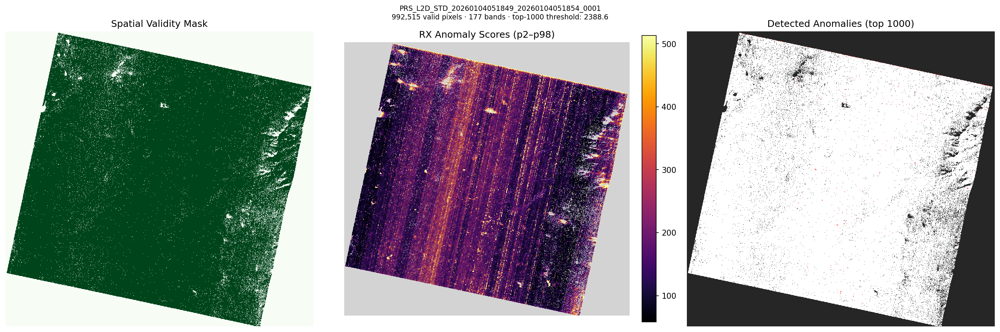
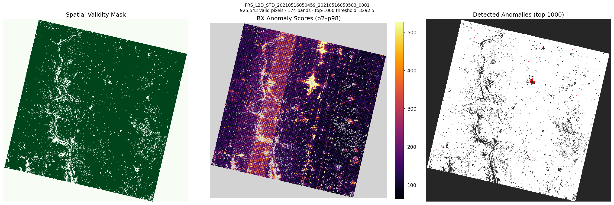
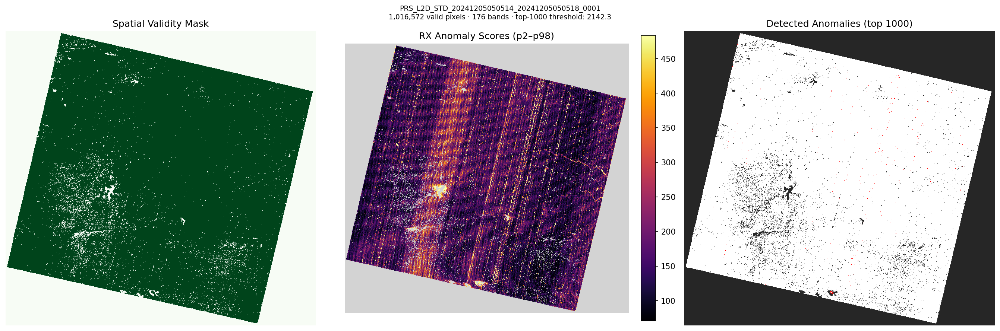
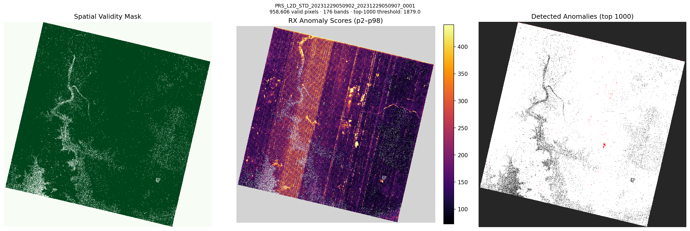
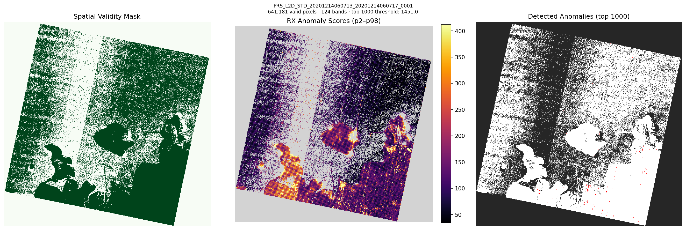

# rx-had-exp6: Top-1000 Anomaly Detection

## Pipeline

HE5 → PrismaDatasetBuilder → CombinedDestriper (20 probes: 10 VNIR + 10 SWIR) → GlobalRXDetector → top-1000 anomaly map

| Scene | Bands | Valid Px | Threshold score | p99 | Max | Anomalies |
|---|---|---|---|---|---|---|
| PRS_L2D_STD_20260104051849_2026010405185 | 177 | 992,515 | 2388.58 | 743.01 | 43910.83 | 1000 |
| PRS_L2D_STD_20210516050459_2021051605050 | 174 | 925,543 | 3292.5 | 807.85 | 51378.68 | 1000 |
| PRS_L2D_STD_20241205050514_2024120505051 | 176 | 1,016,572 | 2142.28 | 681.75 | 38637.16 | 1000 |
| PRS_L2D_STD_20231229050902_2023122905090 | 176 | 958,606 | 1878.99 | 558.77 | 168219.19 | 1000 |
| PRS_L2D_STD_20201214060713_2020121406071 | 124 | 641,181 | 1451.03 | 539.76 | 98103.33 | 1000 |

## Visualizations

### PRS_L2D_STD_20260104051849_20260104051854_0001

### PRS_L2D_STD_20210516050459_20210516050503_0001

### PRS_L2D_STD_20241205050514_20241205050518_0001

### PRS_L2D_STD_20231229050902_20231229050907_0001

### PRS_L2D_STD_20201214060713_20201214060717_0001

