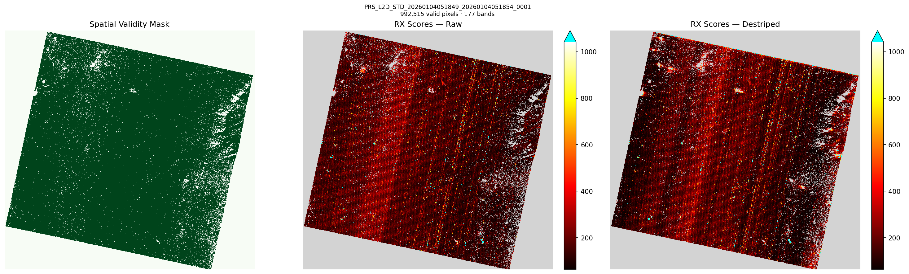
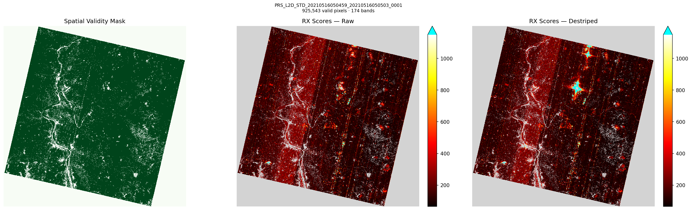
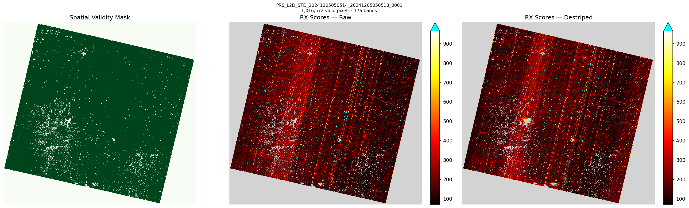
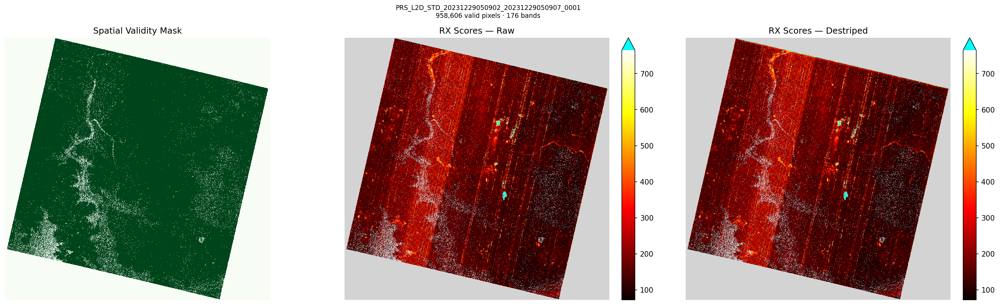
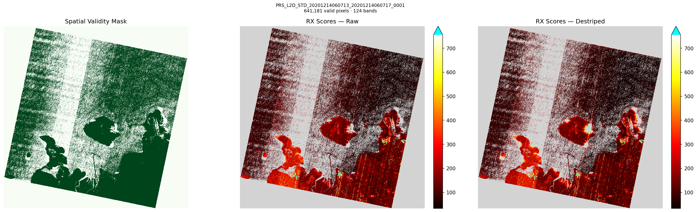
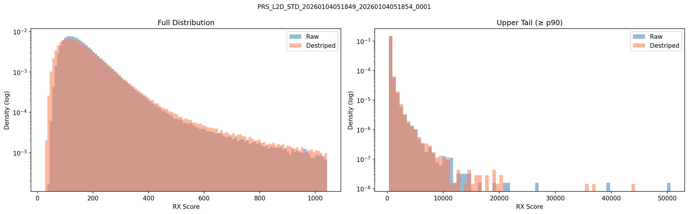
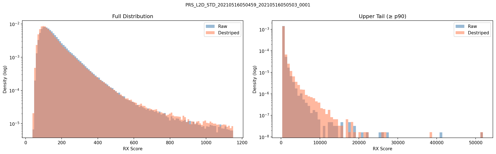
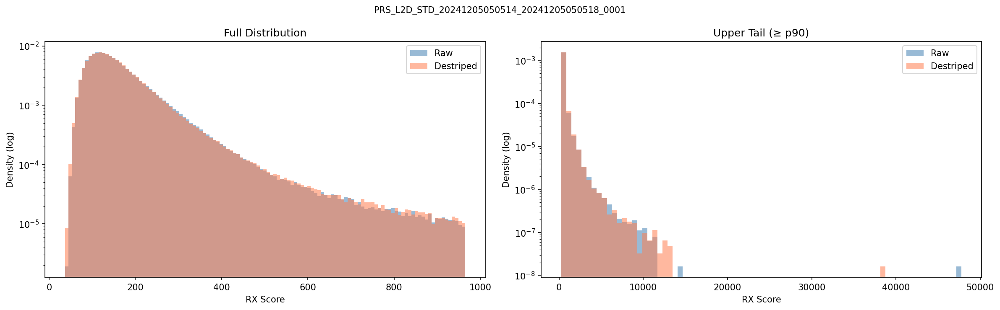
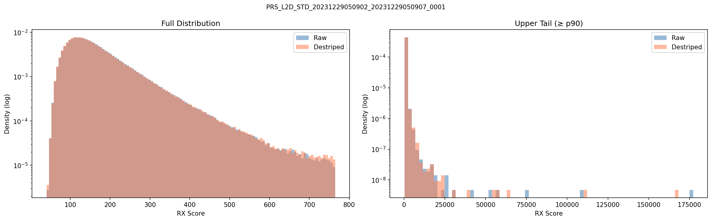
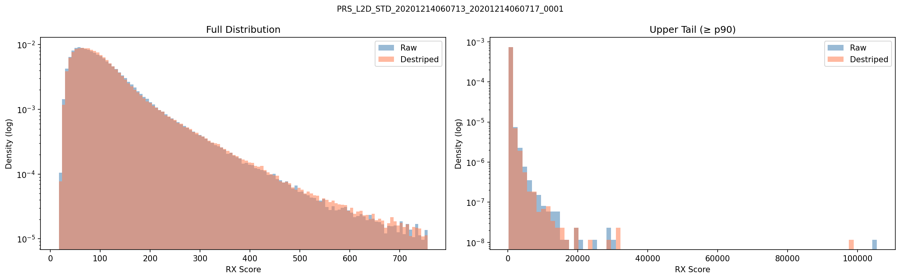

# rx-had-exp7: Raw vs Destriped Global RX Score Distributions

## Pipeline

HE5 → PrismaDatasetBuilder → GlobalRXDetector (raw cube) **vs** CombinedDestriper → GlobalRXDetector (destriped cube)

Band selection (fit) is shared — only the cube fed to `detect()` differs.

## Comparison Table

| Scene | Bands | Valid Px | Raw Mean | Raw Std | Raw p99 | Raw Max | Des Mean | Des Std | Des p99 | Des Max |
|---|---|---|---|---|---|---|---|---|---|---|
| PRS_L2D_STD_20260104051849_2026010405185 | 177 | 992,515 | 177.0 | 193.5 | 664.57 | 50603.4 | 177.0 | 213.05 | 743.01 | 43910.83 |
| PRS_L2D_STD_20210516050459_2021051605050 | 174 | 925,543 | 174.0 | 207.52 | 679.19 | 51847.53 | 174.0 | 271.95 | 807.85 | 51378.68 |
| PRS_L2D_STD_20241205050514_2024120505051 | 176 | 1,016,572 | 176.0 | 178.38 | 661.08 | 47761.81 | 176.0 | 177.58 | 681.75 | 38637.16 |
| PRS_L2D_STD_20231229050902_2023122905090 | 176 | 958,606 | 176.12 | 299.46 | 539.52 | 177208.85 | 176.08 | 294.28 | 558.77 | 168219.19 |
| PRS_L2D_STD_20201214060713_2020121406071 | 124 | 641,181 | 124.0 | 232.79 | 530.85 | 105539.04 | 124.0 | 218.2 | 539.76 | 98103.33 |

## Percentile Breakdown

| Scene | Mode | p25 | p50 | p75 | p90 | p95 | p99 | p99.9 | Max |
|---|---|---|---|---|---|---|---|---|---|
| PRS_L2D_STD_20260104051849_202 | Raw | 112.57 | 146.54 | 197.23 | 268.38 | 333.36 | 664.57 | 2160.69 | 50603.4 |
| | Destriped | 104.6 | 143.48 | 199.68 | 277.58 | 351.16 | 743.01 | 2396.71 | 43910.83 |
| PRS_L2D_STD_20210516050459_202 | Raw | 104.68 | 138.07 | 193.49 | 278.5 | 353.1 | 679.19 | 2322.99 | 51847.53 |
| | Destriped | 97.64 | 129.75 | 185.91 | 275.48 | 357.8 | 807.85 | 3423.81 | 51378.68 |
| PRS_L2D_STD_20241205050514_202 | Raw | 110.9 | 144.78 | 196.45 | 271.88 | 340.28 | 661.08 | 2199.36 | 47761.81 |
| | Destriped | 110.91 | 144.7 | 195.57 | 269.94 | 341.48 | 681.75 | 2127.58 | 38637.16 |
| PRS_L2D_STD_20231229050902_202 | Raw | 113.74 | 148.3 | 200.42 | 273.24 | 334.57 | 539.52 | 1892.27 | 177208.85 |
| | Destriped | 112.87 | 147.03 | 199.33 | 273.37 | 336.4 | 558.77 | 1921.87 | 168219.19 |
| PRS_L2D_STD_20201214060713_202 | Raw | 62.4 | 93.29 | 140.36 | 214.98 | 287.87 | 530.85 | 2088.54 | 105539.04 |
| | Destriped | 63.75 | 93.51 | 138.81 | 216.95 | 292.56 | 539.76 | 1977.87 | 98103.33 |

## Anomaly Maps

### PRS_L2D_STD_20260104051849_20260104051854_0001

### PRS_L2D_STD_20210516050459_20210516050503_0001

### PRS_L2D_STD_20241205050514_20241205050518_0001

### PRS_L2D_STD_20231229050902_20231229050907_0001

### PRS_L2D_STD_20201214060713_20201214060717_0001

## Histograms

### PRS_L2D_STD_20260104051849_20260104051854_0001

### PRS_L2D_STD_20210516050459_20210516050503_0001

### PRS_L2D_STD_20241205050514_20241205050518_0001

### PRS_L2D_STD_20231229050902_20231229050907_0001

### PRS_L2D_STD_20201214060713_20201214060717_0001

