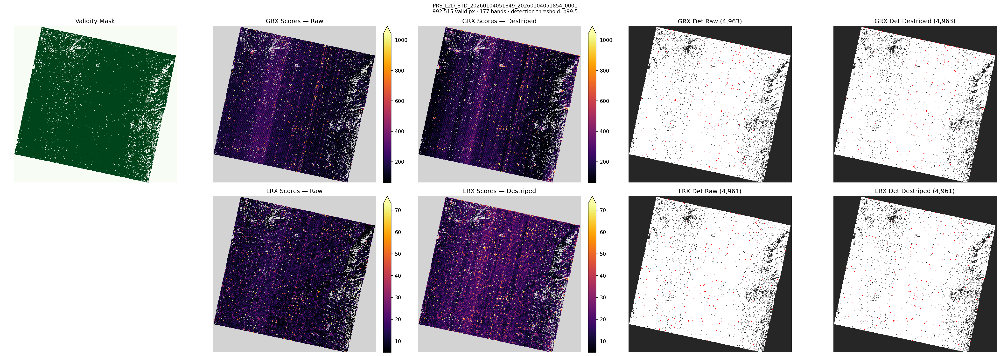
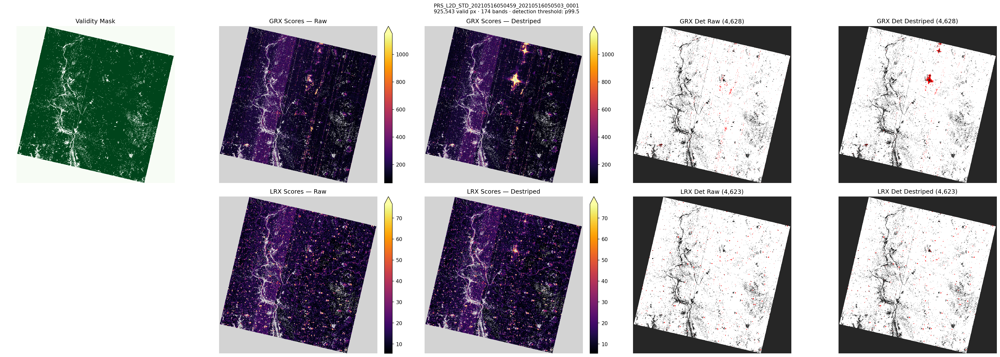
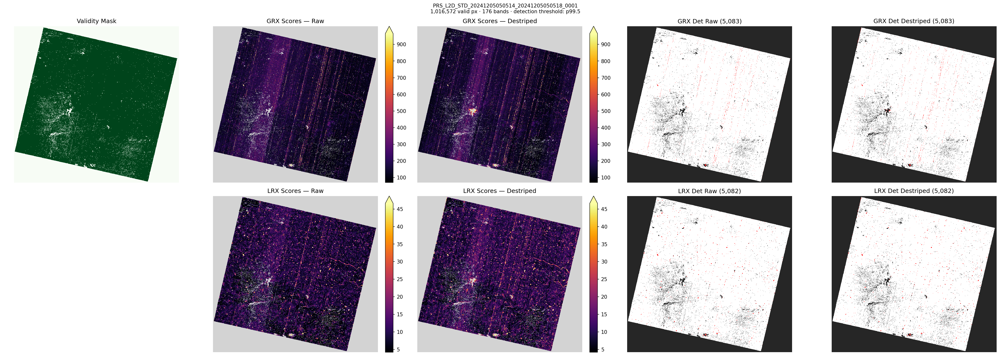
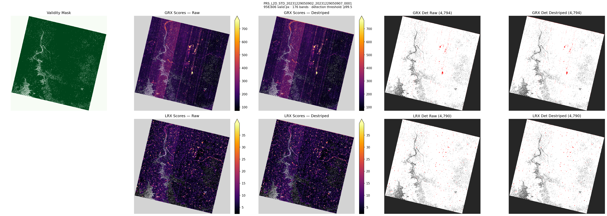
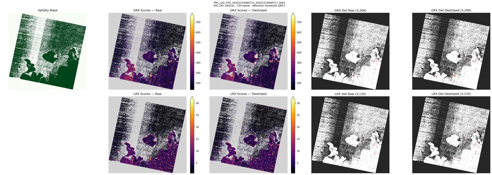

# rx-had-exp8: GRX + LRX — Raw vs Destriped with Detection Maps

## Pipeline

HE5 → PrismaDatasetBuilder → {raw, CombinedDestriper} → {GlobalRXDetector, LocalRXDetector(outer=25, inner=5, stride=2)} → score maps + detection at p99.5

Score maps use shared vmin/vmax per detector (raw+destriped combined p2–p99.5, inferno cmap).

## GRX Comparison

| Scene | Bands | Valid Px | Raw Median | Raw p99.5 | Raw Max | Des Median | Des p99.5 | Des Max |
|---|---|---|---|---|---|---|---|---|
| PRS_L2D_STD_20260104051849_2026010405185 | 177 | 992,515 | 146.54 | 978.32 | 50603.4 | 143.48 | 1099.96 | 43910.83 |
| PRS_L2D_STD_20210516050459_2021051605050 | 174 | 925,543 | 138.07 | 1016.15 | 51847.53 | 129.75 | 1304.56 | 51378.68 |
| PRS_L2D_STD_20241205050514_2024120505051 | 176 | 1,016,572 | 144.78 | 951.1 | 47761.81 | 144.7 | 977.76 | 38637.16 |
| PRS_L2D_STD_20231229050902_2023122905090 | 176 | 958,606 | 148.3 | 738.86 | 177208.85 | 147.03 | 789.45 | 168219.19 |
| PRS_L2D_STD_20201214060713_2020121406071 | 124 | 641,181 | 93.29 | 765.68 | 105539.04 | 93.51 | 746.27 | 98103.33 |

## LRX Comparison

| Scene | Raw Median | Raw p99.5 | Raw Max | Des Median | Des p99.5 | Des Max |
|---|---|---|---|---|---|---|
| PRS_L2D_STD_20260104051849_2026010405185 | 9.99 | 61.62 | 5043.53 | 15.14 | 81.27 | 5077.6 |
| PRS_L2D_STD_20210516050459_2021051605050 | 11.72 | 81.03 | 4515.28 | 11.36 | 72.82 | 3429.7 |
| PRS_L2D_STD_20241205050514_2024120505051 | 8.46 | 44.11 | 926.7 | 9.85 | 48.85 | 795.29 |
| PRS_L2D_STD_20231229050902_2023122905090 | 5.4 | 40.43 | 2933.42 | 5.34 | 39.31 | 2622.74 |
| PRS_L2D_STD_20201214060713_2020121406071 | 2.32 | 32.78 | 21101.17 | 2.73 | 29.89 | 6537.53 |

## Detection Counts (p99.5 threshold)

| Scene | GRX Raw | GRX Des | LRX Raw | LRX Des |
|---|---|---|---|---|
| PRS_L2D_STD_20260104051849_2026010405185 | 4,963 | 4,963 | 4,961 | 4,961 |
| PRS_L2D_STD_20210516050459_2021051605050 | 4,628 | 4,628 | 4,623 | 4,623 |
| PRS_L2D_STD_20241205050514_2024120505051 | 5,083 | 5,083 | 5,082 | 5,082 |
| PRS_L2D_STD_20231229050902_2023122905090 | 4,794 | 4,794 | 4,790 | 4,790 |
| PRS_L2D_STD_20201214060713_2020121406071 | 3,206 | 3,206 | 3,135 | 3,135 |

## Panels

### PRS_L2D_STD_20260104051849_20260104051854_0001

### PRS_L2D_STD_20210516050459_20210516050503_0001

### PRS_L2D_STD_20241205050514_20241205050518_0001

### PRS_L2D_STD_20231229050902_20231229050907_0001

### PRS_L2D_STD_20201214060713_20201214060717_0001

