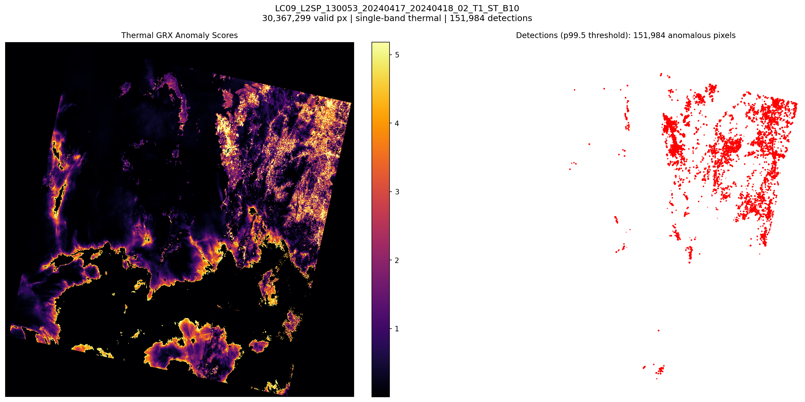
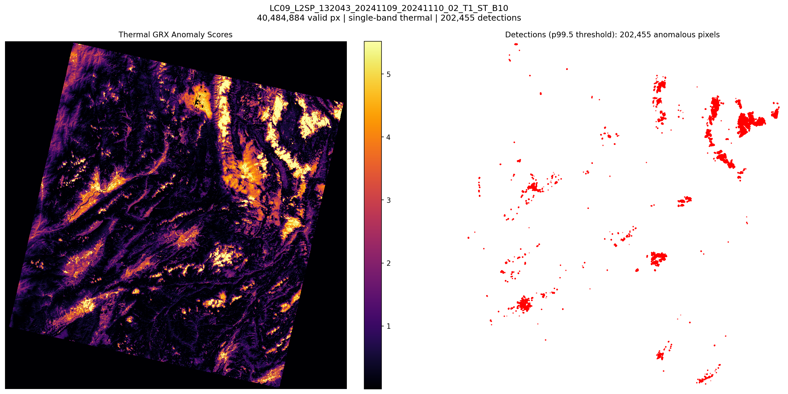
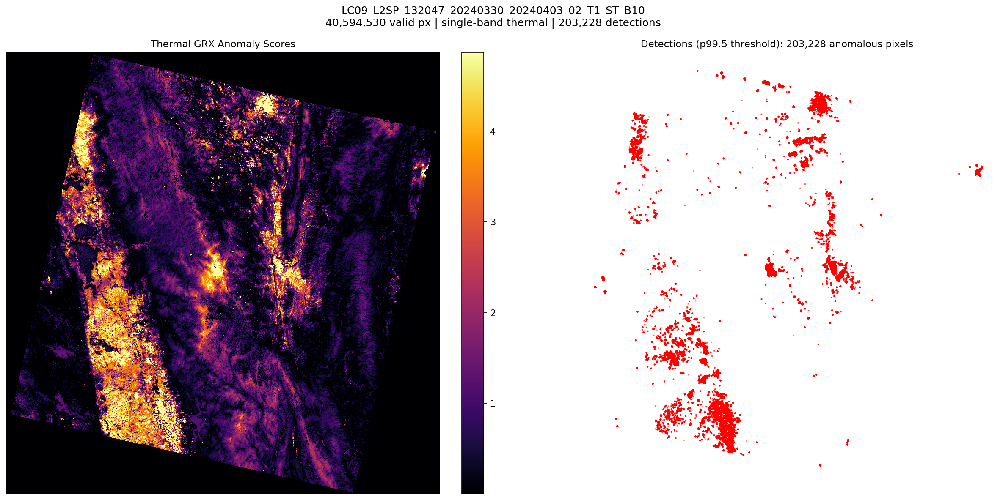
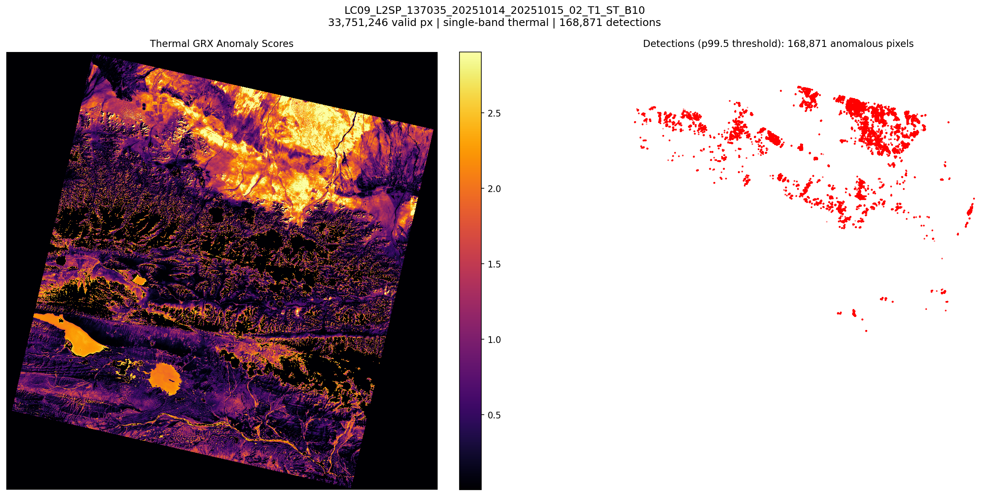
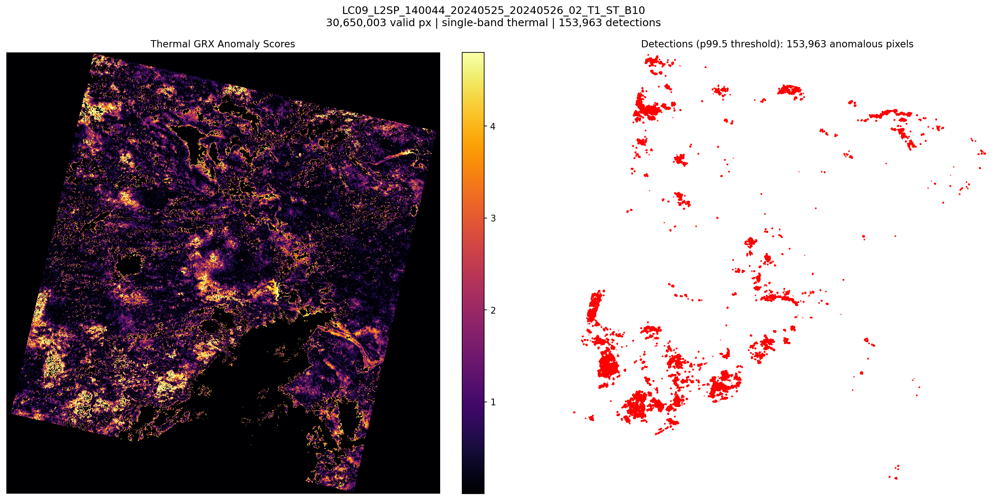
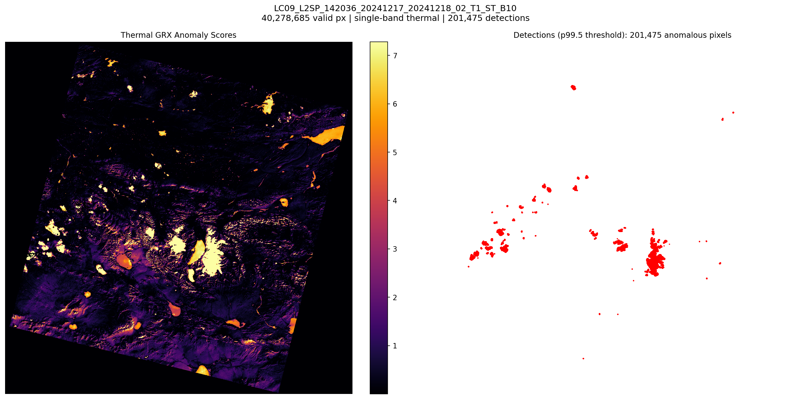
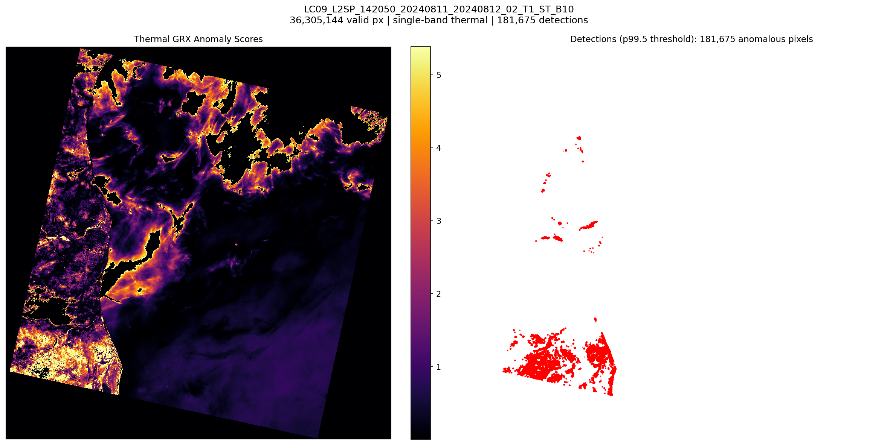
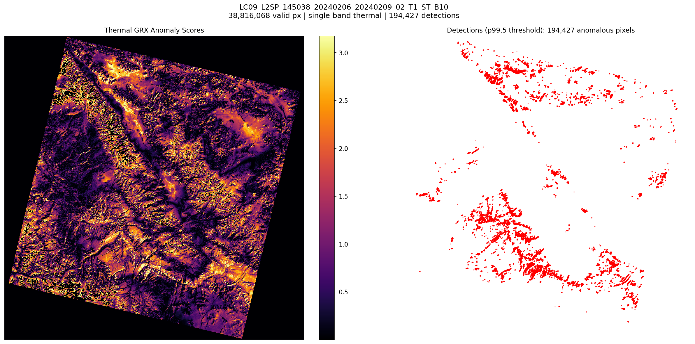
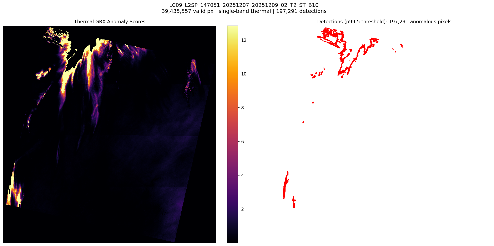
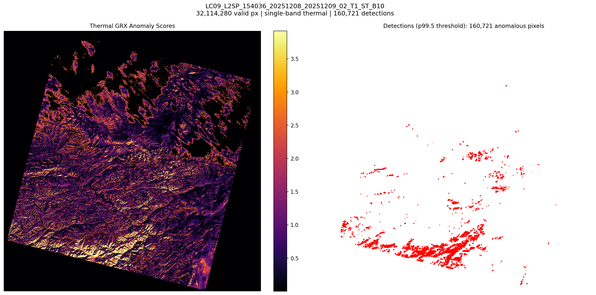

# thermal-grx-landsat: Thermal GRX Anomaly Detection on Landsat 9

## Experiment

- **Detector:** ThermalGRXDetector (single-band GRX)
- **Detection threshold:** p99.5
- **Scenes processed:** 10

## Results

| Scene | Shape | Valid Px | Detections | Threshold | Median | p99 | p99.5 | Max | Time (s) |
|---|---|---|---|---|---|---|---|---|---|
| LC09_L2SP_130053_20240417_20240418_02_T1_ST_B10 | 1x7741x7591 | 30,367,299 | 151,984 | 7.9173 | 0.2326 | 6.2796 | 7.9173 | 18.9204 | 125.1 |
| LC09_L2SP_132043_20241109_20241110_02_T1_ST_B10 | 1x7791x7651 | 40,484,884 | 202,455 | 7.0601 | 0.3851 | 6.4398 | 7.0601 | 27.1763 | 192.6 |
| LC09_L2SP_132047_20240330_20240403_02_T1_ST_B10 | 1x7801x7651 | 40,594,530 | 203,228 | 6.3221 | 0.5487 | 5.5621 | 6.3221 | 143.6488 | 200.7 |
| LC09_L2SP_137035_20251014_20251015_02_T1_ST_B10 | 1x7791x7661 | 33,751,246 | 168,871 | 3.3295 | 0.7868 | 3.1294 | 3.3295 | 6.6585 | 162.1 |
| LC09_L2SP_140044_20240525_20240526_02_T1_ST_B10 | 1x7801x7661 | 30,650,003 | 153,963 | 5.8322 | 0.4464 | 5.2181 | 5.8322 | 6.7841 | 149.3 |
| LC09_L2SP_142036_20241217_20241218_02_T1_ST_B10 | 1x7881x7751 | 40,278,685 | 201,475 | 24.2553 | 0.2079 | 16.153 | 24.2553 | 87.651 | 184.1 |
| LC09_L2SP_142050_20240811_20240812_02_T1_ST_B10 | 1x7751x7601 | 36,305,144 | 181,675 | 7.1097 | 0.4624 | 5.8901 | 7.1097 | 9.7438 | 160.0 |
| LC09_L2SP_145038_20240206_20240209_02_T1_ST_B10 | 1x7831x7711 | 38,816,068 | 194,427 | 3.5606 | 0.7761 | 3.3706 | 3.5606 | 14.2458 | 178.7 |
| LC09_L2SP_147051_20251207_20251209_02_T2_ST_B10 | 1x7791x7641 | 39,435,557 | 197,291 | 31.1179 | 0.1393 | 21.5352 | 31.1179 | 49.5927 | 175.9 |
| LC09_L2SP_154036_20251208_20251209_02_T1_ST_B10 | 1x7901x7791 | 32,114,280 | 160,721 | 5.6489 | 0.6713 | 4.8355 | 5.6489 | 11.4303 | 163.1 |

## Detection Overlays

### LC09_L2SP_130053_20240417_20240418_02_T1_ST_B10
- Detections: 151,984
- GeoTIFF: [LC09_L2SP_130053_20240417_20240418_02_T1_ST_B10/anomaly_thermal_grx.tif](LC09_L2SP_130053_20240417_20240418_02_T1_ST_B10/anomaly_thermal_grx.tif)

### LC09_L2SP_132043_20241109_20241110_02_T1_ST_B10
- Detections: 202,455
- GeoTIFF: [LC09_L2SP_132043_20241109_20241110_02_T1_ST_B10/anomaly_thermal_grx.tif](LC09_L2SP_132043_20241109_20241110_02_T1_ST_B10/anomaly_thermal_grx.tif)

### LC09_L2SP_132047_20240330_20240403_02_T1_ST_B10
- Detections: 203,228
- GeoTIFF: [LC09_L2SP_132047_20240330_20240403_02_T1_ST_B10/anomaly_thermal_grx.tif](LC09_L2SP_132047_20240330_20240403_02_T1_ST_B10/anomaly_thermal_grx.tif)

### LC09_L2SP_137035_20251014_20251015_02_T1_ST_B10
- Detections: 168,871
- GeoTIFF: [LC09_L2SP_137035_20251014_20251015_02_T1_ST_B10/anomaly_thermal_grx.tif](LC09_L2SP_137035_20251014_20251015_02_T1_ST_B10/anomaly_thermal_grx.tif)

### LC09_L2SP_140044_20240525_20240526_02_T1_ST_B10
- Detections: 153,963
- GeoTIFF: [LC09_L2SP_140044_20240525_20240526_02_T1_ST_B10/anomaly_thermal_grx.tif](LC09_L2SP_140044_20240525_20240526_02_T1_ST_B10/anomaly_thermal_grx.tif)

### LC09_L2SP_142036_20241217_20241218_02_T1_ST_B10
- Detections: 201,475
- GeoTIFF: [LC09_L2SP_142036_20241217_20241218_02_T1_ST_B10/anomaly_thermal_grx.tif](LC09_L2SP_142036_20241217_20241218_02_T1_ST_B10/anomaly_thermal_grx.tif)

### LC09_L2SP_142050_20240811_20240812_02_T1_ST_B10
- Detections: 181,675
- GeoTIFF: [LC09_L2SP_142050_20240811_20240812_02_T1_ST_B10/anomaly_thermal_grx.tif](LC09_L2SP_142050_20240811_20240812_02_T1_ST_B10/anomaly_thermal_grx.tif)

### LC09_L2SP_145038_20240206_20240209_02_T1_ST_B10
- Detections: 194,427
- GeoTIFF: [LC09_L2SP_145038_20240206_20240209_02_T1_ST_B10/anomaly_thermal_grx.tif](LC09_L2SP_145038_20240206_20240209_02_T1_ST_B10/anomaly_thermal_grx.tif)

### LC09_L2SP_147051_20251207_20251209_02_T2_ST_B10
- Detections: 197,291
- GeoTIFF: [LC09_L2SP_147051_20251207_20251209_02_T2_ST_B10/anomaly_thermal_grx.tif](LC09_L2SP_147051_20251207_20251209_02_T2_ST_B10/anomaly_thermal_grx.tif)

### LC09_L2SP_154036_20251208_20251209_02_T1_ST_B10
- Detections: 160,721
- GeoTIFF: [LC09_L2SP_154036_20251208_20251209_02_T1_ST_B10/anomaly_thermal_grx.tif](LC09_L2SP_154036_20251208_20251209_02_T1_ST_B10/anomaly_thermal_grx.tif)

