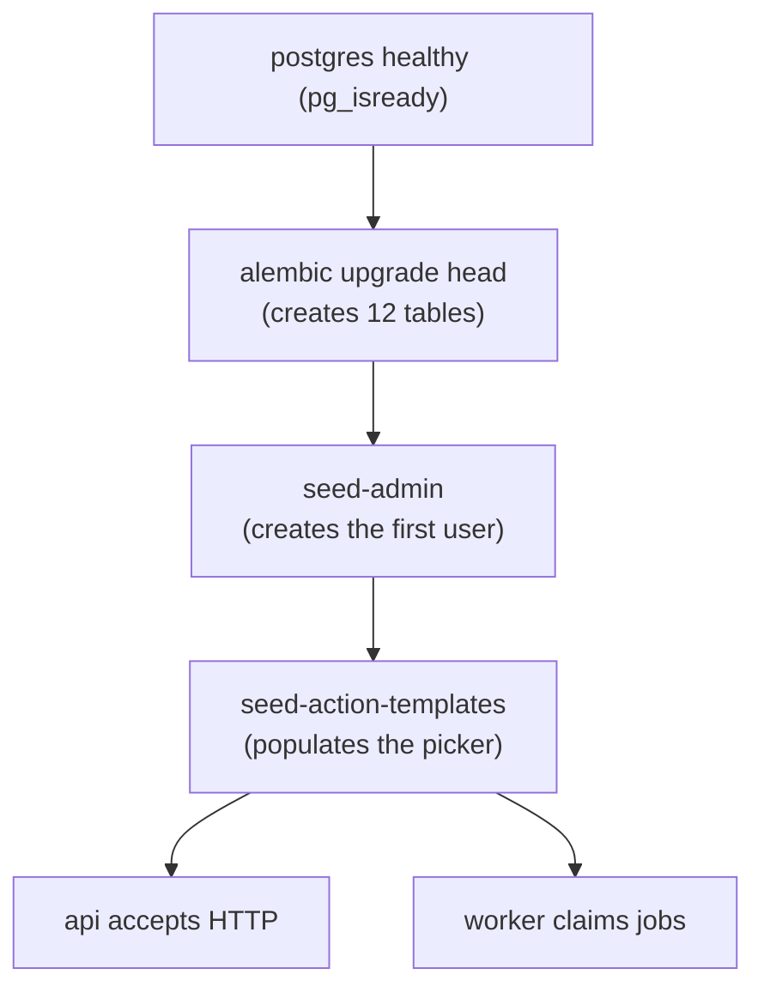
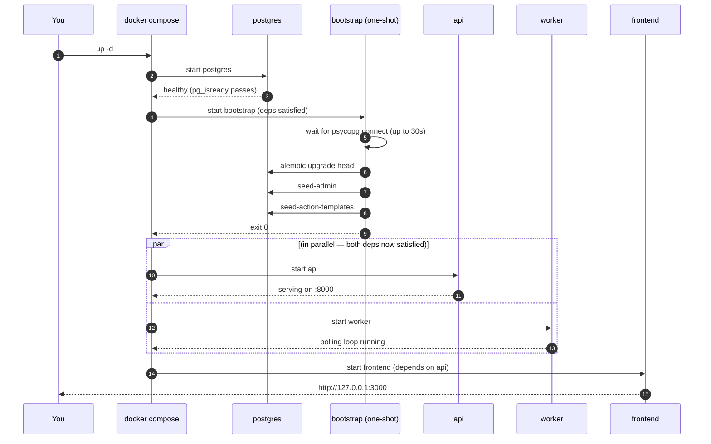

# Bootstrap — how Allotrope sets itself up

A reader-friendly walkthrough of what happens between you typing
`docker compose up -d` and the UI being usable. Written for the
beginner case: you've never touched the repo before, you just want to
get to the login page.

If you only ever read one section, read **§3 The First Up**.

---

## 1 · The shape of the problem

When you start Allotrope on a brand-new machine (or after a wipe),
several things have to happen *in order* before anyone can use it:

1. **Postgres** has to come up and be healthy.
2. The **database schema** has to be created — empty postgres has no
   tables. We use [Alembic](https://alembic.sqlalchemy.org/) to manage
   migrations; the schema's source of truth is the files under
   `backend/alembic/versions/`.
3. An **admin user** has to exist so you can log in. Without one, the
   login page accepts no credentials.
4. **System action templates** (the recipe presets the New Action
   dialog shows) have to be seeded — otherwise the picker is empty.
5. Only THEN should the **api** start accepting HTTP and the **worker**
   start picking up jobs. If they boot before step 2, every request
   crashes with `relation "users" does not exist`.

You can imagine each step as a stack: api + worker sit on top of
seeds, which sit on top of schema, which sit on top of postgres. Each
layer has to be solid before the next one goes on.



Before Step 21, you ran each of those manually. Now a single service
called **bootstrap** does it for you.

---

## 2 · What the bootstrap service is, in one sentence

**Bootstrap is a tiny container that runs once on `docker compose up`,
performs the four setup steps above in order, and then exits.**

It reuses the same image as the `api` service (no second image to
build). It's defined in [`docker/docker-compose.yml`](../docker/docker-compose.yml)
right next to api + worker. Its command is the shell script at
[`backend/bootstrap.sh`](../backend/bootstrap.sh).

Three things make it work cleanly:

| | What | Why |
|---|---|---|
| **A** | `restart: "no"` | We *want* it to exit. A normal long-running service that exits would be considered a crash and restarted. Bootstrap is intentionally one-shot. |
| **B** | `depends_on: postgres { condition: service_healthy }` | Bootstrap doesn't even start until postgres' built-in `pg_isready` healthcheck passes. Avoids "connection refused" on the first try. |
| **C** | `api` and `worker` both `depends_on: bootstrap { condition: service_completed_successfully }` | They block until bootstrap exits with code 0. So api can never start before the schema exists. |

That's the whole mechanism. Three lines of YAML and a 50-line shell
script.

---

## 3 · The first `up`

Cold start on a fresh machine. The fastest path from `git clone` to
the login page:

```bash
# 1. Copy the env template + fill in the three required values.
cd hsi-anomaly-foundations-allotrope
cp docker/.env.example docker/.env

# Open docker/.env in your editor and set these three:
#   POSTGRES_PASSWORD=<anything long and random>
#   ADMIN_PASSWORD=<your-admin-login-password>
#   JWT_SECRET=$(openssl rand -base64 32)   # paste the output
#
# ADMIN_USERNAME / ADMIN_EMAIL also need values; defaults in the file
# are usually fine.

# 2. Bring the stack up. That's it.
docker compose -f docker/docker-compose.yml up -d
```

Behind the scenes:



If you watch `docker compose logs -f bootstrap` you should see:

```
[bootstrap] waiting for postgres at postgres:5432...
[bootstrap] postgres reachable on attempt 1
[bootstrap] running alembic upgrade head...
INFO  [alembic.runtime.migration] Running upgrade  -> 20260510_01, create users table
INFO  [alembic.runtime.migration] Running upgrade 20260510_01 -> 20260510_02, create scenes table
... (9 migrations total) ...
[bootstrap] seeding admin user (idempotent)...
Created admin: admin <admin@allotrope.local> (id=...)
[bootstrap] seeding action templates (idempotent upsert)...
Seeded action templates: 8 new · 0 updated · 0 unchanged
[bootstrap] done. api + worker may now start.
```

Open `http://127.0.0.1:3000`, log in with `ADMIN_USERNAME` /
`ADMIN_PASSWORD` from your `.env`, and you're done.

---

## 4 · Subsequent `up`s

When you bring the stack down and back up later, bootstrap **runs
again** — but does almost nothing:

- `alembic upgrade head` sees the database is already at HEAD and exits
  immediately.
- `seed-admin` sees an admin already exists and prints a YELLOW notice:
  `Admin already exists: admin <...>`. Returns 0.
- `seed-action-templates` is an **upsert** — it walks the registry and
  for each (action_type × sensor) pair, either inserts a new row or
  updates the existing one if the recipe changed. Output looks like:
  ```
  Seeded action templates: 0 new · 0 updated · 8 unchanged
  ```

This is **deliberate**. It means:

- You can `docker compose up -d` after `docker compose down` and
  everything just works.
- If you add a new action type to the registry and rebuild, the next
  bootstrap run will create its system templates automatically — no
  manual step.
- If you tweak the `default_config_per_sensor` block of an existing
  action_type's META, the next bootstrap will update the matching
  template in place. Your user-saved templates stay untouched (they
  have `is_system=False`; the seed only touches `is_system=True`).

The total runtime on a warm volume is ~3 seconds.

---

## 5 · When something goes wrong

### "Bootstrap container exited with code 1"

Most likely cause: required env var missing from `docker/.env`.
Compose itself bails with a `must be set in docker/.env` message
before bootstrap even starts. Check:

```bash
grep -E '^(POSTGRES_PASSWORD|ADMIN_PASSWORD|JWT_SECRET|ADMIN_USERNAME|ADMIN_EMAIL)=' docker/.env
```

All five should have non-empty values.

### "Bootstrap exited code 0 but seed-admin printed a warning"

`seed-admin` prints a RED message + exits non-zero **only** when
`ADMIN_USERNAME` / `ADMIN_EMAIL` / `ADMIN_PASSWORD` are missing. The
bootstrap script catches that, logs a warning, and continues — because
losing admin seeding shouldn't block api/worker startup. Fix the env
vars, then re-run just the bootstrap service:

```bash
docker compose -f docker/docker-compose.yml run --rm bootstrap
```

That picks up the updated env and re-runs the three steps.

### "api crashes with `relation users does not exist`"

This means api somehow started before bootstrap finished — which
should be impossible given the `depends_on` setup. Two known causes:

1. You ran `docker compose up -d api` explicitly (compose still waits
   on the dep, but if you used `--no-deps` you skipped it).
2. You wiped the db volume *without* wiping the api/worker containers,
   so they're still running but their connection now points at an
   empty database.

Fix: stop everything, bring it back up cleanly.

```bash
docker compose -f docker/docker-compose.yml down
docker compose -f docker/docker-compose.yml up -d
```

If a destructive reset is what you actually wanted, use
[`docker/reset-stack.sh`](../docker/reset-stack.sh) — it now relies on
bootstrap, so a single `up -d` after volume removal handles all the
seeding.

### "How do I just re-run bootstrap manually?"

```bash
docker compose -f docker/docker-compose.yml run --rm bootstrap
```

`--rm` removes the container after exit so it doesn't sit around as a
ghost container. Safe to run any number of times; everything is
idempotent.

---

## 6 · Why not just put this in the api Dockerfile's CMD?

Tempting question. Three reasons we picked a separate service:

1. **Separation of concerns.** The api's job is to serve HTTP. The
   worker's job is to claim and run jobs. Migrating the database is
   neither, and it being a different container means it can fail
   independently and you'll see exactly which step blew up.
2. **Race conditions.** If both api containers (now or later, scaled
   horizontally) ran `alembic upgrade head` on startup, you'd get two
   migrations trying to take the same advisory lock. Alembic handles
   this fine, but the logs are awful to read. With bootstrap, exactly
   one container ever runs it.
3. **Worker timing.** The worker also needs the schema. If the api
   migrated on its own CMD, the worker would have to either also
   migrate (race) or wait on something (`exit 0` from api is "still
   serving HTTP", not "migrations done"). With bootstrap, worker just
   waits on the same `service_completed_successfully` condition api
   does.

The cost of all this is one extra container that exists for ~3 seconds
on each `up`. Cheap.

---

## 7 · Files involved

| File | What it does |
|---|---|
| [`backend/bootstrap.sh`](../backend/bootstrap.sh) | The actual script. ~50 lines of POSIX shell. |
| [`backend/Dockerfile`](../backend/Dockerfile) | Copies `bootstrap.sh` into the api image at `/usr/local/bin/allotrope-bootstrap`. |
| [`docker/docker-compose.yml`](../docker/docker-compose.yml) | Defines the `bootstrap` service, the `depends_on` wiring, and `restart: "no"`. |
| [`backend/allotrope/cli.py`](../backend/allotrope/cli.py) | Houses the `seed-admin` and `seed-action-templates` typer commands that bootstrap calls. |
| [`backend/alembic.ini`](../backend/alembic.ini) + [`backend/alembic/`](../backend/alembic/) | Alembic's config + migration files. |
| [`docker/reset-stack.sh`](../docker/reset-stack.sh) | Volume wipe + `up -d`. Trusts bootstrap to handle the post-wipe schema + seeding now. |

---

## 8 · TL;DR

You no longer have to remember any of:

```bash
docker compose exec api alembic upgrade head
docker compose run --rm api python -m allotrope.cli seed-admin
docker compose run --rm api python -m allotrope.cli seed-action-templates
```

`docker compose up -d` does it all.
