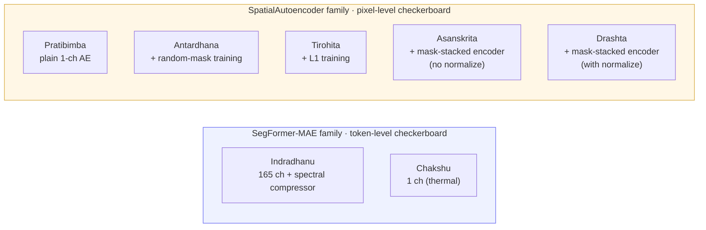

# Per-model inference walkthroughs

One markdown doc per codename in the foundation-model catalog. Each
walks from the `anomaly_scoring._run` worker entry through
`predict_full_scene`, the two-pass MAE / checkerboard loop, the
model's own `forward`, and the scoring step — with mermaid diagrams
and tensor shapes annotated, plus links into
[`app/foundation_models/`](../../../app/foundation_models/) and
[`backend/allotrope/`](../../../backend/allotrope/).

| Codename | Architecture | Sensor | Mask granularity | Where to start |
|---|---|---|---|---|
| **Indradhanu** | `hyperspectral_segformer_mae` | hyperspectral (PRISMA / EnMAP) | token | [indradhanu.md](indradhanu.md) — **canonical doc, all sections expanded** |
| **Chakshu** | `segformer_mae` | thermal | token | [chakshu.md](chakshu.md) — refers back to Indradhanu where the path is identical |
| **Pratibimba** | `spatial_autoencoder` | thermal | pixel | [pratibimba.md](pratibimba.md) — **canonical doc for the SpatialAutoencoder family** |
| **Antardhana** | `spatial_masked_autoencoder` | thermal | pixel | [antardhana.md](antardhana.md) — same arch as Pratibimba, different training |
| **Tirohita** | `spatial_masked_autoencoder_l1` | thermal | pixel | [tirohita.md](tirohita.md) — same arch as Antardhana, L1 training |
| **Asanskrita** | `spatial_masked_autoencoder_l1_unnormalized` | thermal | pixel | [asanskrita.md](asanskrita.md) — mask-stacked, **no PixelNormalize** |
| **Drashta** | `normalized_masked_autoencoder` | thermal | pixel | [drashta.md](drashta.md) — mask-stacked, **with PixelNormalize** |

## Two architectural families

**SegFormer-MAE family** removes prediction-target tokens *before*
encoding (true MAE). The encoder literally processes a shorter
sequence, so the model can't peek at the targets through any layer.

**SpatialAutoencoder family** zeroes prediction-target *pixels* before
forwarding the patch through a plain conv-deconv ladder. Cheaper, and
each variant in the family adds a layer of refinement: random-mask
training (Antardhana), L1 loss (Tirohita), explicit mask channels
into the encoder (Asanskrita), then re-add normalisation buffers
(Drashta).

## Conventions used in these docs

- **Tensor shapes** are written as `(B, C, H, W)` for 4-D / `(C, H, W)`
  for 3-D / `(H, W)` for 2-D maps. Mermaid notes carry shape
  annotations next to the call that produces them.
- **Code blocks** are pulled from the source files verbatim, lightly
  elided where comments distract from the shape arithmetic. Each is
  prefaced with the file path so you can jump in.
- **Cross-doc references** point you at the canonical version of a
  shared concept (e.g. Indradhanu §3 for token-level two-pass MAE,
  Pratibimba §3 for pixel-level two-pass) rather than re-rendering the
  same diagram in every doc.
- **Defer-to-canonical** docs (Antardhana, Tirohita) are deliberately
  short — they re-state only what differs.

## Caller's view (shared across all seven)

Every one of these runs sits inside the worker's per-codename loop in
[`_anomaly_scoring_run.run`](../../../backend/allotrope/action_types/_anomaly_scoring_run.py).
The full anomaly_scoring action recipe — load vendable, optional
keep_mask, optional GT, fan out across N codenames — lives at
[`anomaly-scoring-recipe.drawio`](../anomaly-scoring-recipe.drawio).
