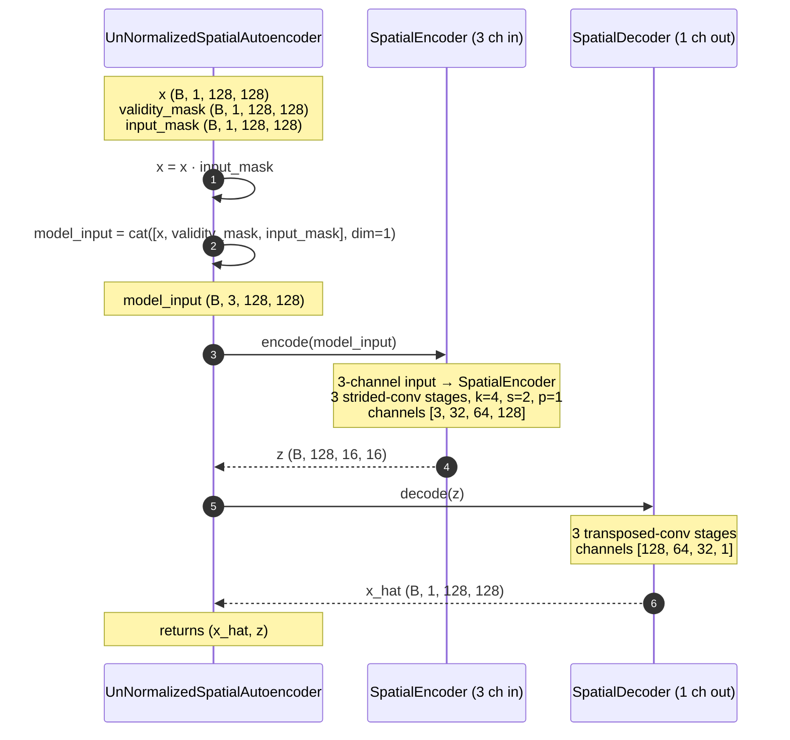

# Asanskrita — `spatial_masked_autoencoder_l1_unnormalized`

> असंस्कृत · *Asanskrita* · **unrefined** — same masking trick, no
> per-pixel normalisation.

Asanskrita is the test of *whether the PixelNormalize buffer is doing
real work* in the SpatialAutoencoder family. It uses the
`UnNormalizedSpatialAutoencoder` class — an architecturally tweaked
SpatialAutoencoder that stacks two extra mask channels into the encoder
input (so the encoder can *see* which pixels are valid and which are
the prediction targets) and **omits PixelNormalize / PixelDenormalize
entirely**. Trained with L1 loss + random masking on raw brightness
temperatures, no z-score.

| | |
|---|---|
| **Architecture** | `spatial_masked_autoencoder_l1_unnormalized` |
| **`foundation_model_name`** | `spatial_masked_autoencoder_l1_unnormalized` *(its own inferencer)* |
| **Sensor family** | thermal |
| **Encoder input channels** | **3** (1 thermal + validity_mask + input_mask) |
| **Default patch / stride / batch** | 128 / 64 / 8 |
| **Default scoring** | `L1` |
| **PixelNormalize buffer** | **none** (raw values in/out) |
| **Inferencer** | [`masked_spatial_autoencoder_inferencer.py`](../../../app/foundation_models/inferencers/masked_spatial_autoencoder_inferencer.py) |
| **Model module** | [`unnormalized_spatial_auto_encoder.py`](../../../app/foundation_models/components/unnormalized_spatial_auto_encoder.py) |

---

## 1 · Caller's view

Same shape as
[Indradhanu §1](indradhanu.md#1--callers-view--one-model-in-the-per-model-loop).
The only resolver subtlety: the
[`backend/allotrope/foundation_models/resolver.py`](../../../backend/allotrope/foundation_models/resolver.py)
entry sets `pixel_stats_relpath=None` so the inferencer's
`InferenceConfig.pixel_stats_path` ends up `None`, and the model
constructor builds *no* `normalize` / `denormalize` layers.

That matters for state-dict load — Asanskrita's checkpoint genuinely
has no `normalize.mean` / `normalize.std` buffers, so trying to load it
into a model that has them (or vice versa) trips a strict-load
mismatch. The resolver gates this:

```python
"spatial_masked_autoencoder_l1_unnormalized": ModelCapabilities(
    architecture="spatial_masked_autoencoder_l1_unnormalized",
    foundation_model_name="spatial_masked_autoencoder_l1_unnormalized",
    scoring_methods=("L1", "MSE"),
    default_scoring_method="L1",
    default_patch_size=128,
    default_stride=64,
    pixel_stats_relpath=None,                       # ← NO normalize buffers
),
```

---

## 2 · `predict_full_scene` — patch loop

Same shape as Pratibimba's. See
[Pratibimba §2](pratibimba.md#2--predict_full_scene--the-patch-loop)
— the only difference is which inferencer instance is dispatched.

---

## 3 · Two-pass — `MaskedSpatialAutoencoderInferencer.infer`

The *machinery* is the same pixel-level checkerboard as Pratibimba, but
the model now takes **two** masks (validity + input) explicitly instead
of folding them. From
[`masked_spatial_autoencoder_inferencer.py:70`](../../../app/foundation_models/inferencers/masked_spatial_autoencoder_inferencer.py):

```python
def infer(self, tensor, mask):
    # tensor: (B, 1, H, W)   mask: (B, 1, H, W)
    _, _, h, w = tensor.shape
    checker     = self._build_checkerboard(h, w, invert=False)   # (1, 1, H, W)
    checker_inv = 1 - checker

    # Pass 1: keep checker=1 cells visible, null checker=0 cells
    x_hat_1, _ = self.model(
        tensor,
        validity_mask=mask,
        input_mask=checker * mask,
    )

    # Pass 2: keep checker=0 cells visible, null checker=1 cells
    x_hat_2, _ = self.model(
        tensor,
        validity_mask=mask,
        input_mask=checker_inv * mask,
    )

    # Each pixel's reconstruction comes from the pass that hid it
    reconstruction = x_hat_1 * checker_inv + x_hat_2 * checker
    return reconstruction * mask
```

The `validity_mask` says "pixel is real / pixel is invalid"; the
`input_mask` says "show this pixel to the encoder / hide it as a
prediction target". Both get stacked as channels into the encoder.

---

## 4 · `forward` — `UnNormalizedSpatialAutoencoder`

Verbatim from
[`unnormalized_spatial_auto_encoder.py`](../../../app/foundation_models/components/unnormalized_spatial_auto_encoder.py):

```python
def forward(self, x, validity_mask=None, input_mask=None):
    # x: (B, 1, H, W)   validity_mask, input_mask: (B, 1, H, W)
    x = x * input_mask                            # zero hidden pixels
    model_input = torch.cat([x, validity_mask, input_mask], dim=1)
    # model_input: (B, 3, H, W)
    z = self.encoder(model_input)                 # (B, 128, H/8, W/8)
    x_hat = self.decoder(z)                        # (B, 1, H, W)
    return x_hat, z
```

Note `self.encoder = SpatialEncoder(in_channels + 2, ...)`. The encoder
gets a 3-channel input by construction, but the decoder still emits 1
channel — only the encoder needs to *read* the masks. **No
PixelNormalize / PixelDenormalize anywhere.**



**Why stack masks instead of multiply-and-pray?** When the encoder sees
the validity mask explicitly, the BatchNorm statistics in the first
stage can stay clean even on patches with tons of invalid pixels.
Multiply-only zeroing forces the encoder to *infer* "is this a real
zero or a mask zero", which is a representation-burning ambiguity.

**Why no normalize?** The architectural test is "does the model still
work without baked-in z-score?" Asanskrita's training pipeline keeps
inputs in the raw brightness-temperature range; the encoder's
BatchNorms are the only normalisation layer in the graph.

---

## 5 · Encoder / decoder structure

Same `SpatialEncoder(3, base=32, stages=3)` block ladder as Pratibimba
— see [Pratibimba §5](pratibimba.md#5--encoder--decoder-structure)
for the full diagram. Only difference:

| Stage | In | Out | Spatial |
|------:|---:|----:|---------|
| input | — | **3** | 128 × 128 |
| 0 | 3 | 32 | 64 × 64 |
| 1 | 32 | 64 | 32 × 32 |
| 2 | 64 | 128 | 16 × 16 |

Decoder is identical to Pratibimba's: `[128 → 64 → 32 → 1]`.

---

## 6 · Scoring

`L1` by default; `{L1, MSE}` available. Same formulas as everywhere else
— see [Pratibimba §6](pratibimba.md#6--scoring) and
[Indradhanu §7](indradhanu.md#7--scoring).

---

## 7 · How Asanskrita differs from Drashta in one table

[Drashta](drashta.md) has the same `(in_channels + 2)` encoder trick,
*and* PixelNormalize. Asanskrita is the same trick *without*
PixelNormalize. Side-by-side:

| | Asanskrita | Drashta |
|---|---|---|
| Encoder input channels | 3 | 3 |
| Mask stacking | yes (validity + input) | yes (validity + input) |
| **PixelNormalize / PixelDenormalize** | **none** | **yes** |
| Inferencer class | `MaskedSpatialAutoencoderInferencer` | `NormalizedMaskedAutoencoderInferencer` |
| Model class | `UnNormalizedSpatialAutoencoder` | `NormalizedMaskedSpatialAutoencoder` |
| `pixel_stats_relpath` (resolver) | `None` | `_THERMAL_STATS` |
| Reconstructions live in | raw brightness temperature | normalised z-score, denormalised at the boundary |

If both produce useful anomaly maps, the normalisation layer was
optional; if Drashta beats Asanskrita, the buffer was load-bearing.

## File map

| Component | Path |
|---|---|
| Architecture | [`unnormalized_spatial_auto_encoder.py`](../../../app/foundation_models/components/unnormalized_spatial_auto_encoder.py) |
| Inferencer | [`masked_spatial_autoencoder_inferencer.py`](../../../app/foundation_models/inferencers/masked_spatial_autoencoder_inferencer.py) |
| Encoder | [`spatial_encoder.py`](../../../app/foundation_models/components/spatial_encoder.py) |
| Decoder | [`spatial_decoder.py`](../../../app/foundation_models/components/spatial_decoder.py) |
| Scoring | [`scoring.py`](../../../app/utils/anomaly_detection/scoring.py) |
| Resolver entry | [`resolver.py`](../../../backend/allotrope/foundation_models/resolver.py) |
| Worker recipe | [`_anomaly_scoring_run.py`](../../../backend/allotrope/action_types/_anomaly_scoring_run.py) |
