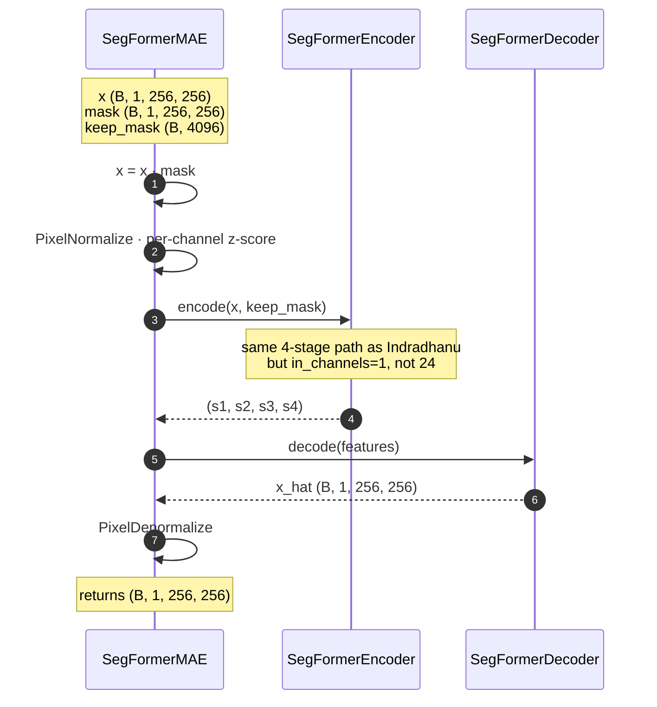

# Chakshu — `segformer_mae`

> चक्षु · *Chakshu* · **eye** — sees long-wave thermal.

The thermal SegFormer-MAE: same 4-stage hierarchical transformer encoder
+ all-MLP decoder as Indradhanu, but operates directly on a single
thermal channel — no spectral compressor / decompressor. Token-level
two-pass checkerboard masking; the residual is the anomaly score.

| | |
|---|---|
| **Architecture** | `segformer_mae` |
| **Sensor family** | thermal (Landsat 9 B10) |
| **Input bands** | 1 (B10 brightness temperature) |
| **Default patch / stride / batch** | 256 / 128 / 8 |
| **Default scoring** | `L1` |
| **Inferencer** | [`segformer_mae_inferencer.py`](../../../app/foundation_models/inferencers/segformer_mae_inferencer.py) |
| **Model module** | [`seg_former_mae.py`](../../../app/foundation_models/components/seg_former_mae.py) |

---

## 1 · Caller's view

Identical to [Indradhanu §1](indradhanu.md#1--callers-view--one-model-in-the-per-model-loop) —
same `_anomaly_scoring_run` per-model loop, same `get_inferencer` →
`predict_full_scene` → `compute_score` → write rasters dance. Only
`m.architecture` and the default knobs differ. See Indradhanu's diagram
for the actor-level call sequence.

---

## 2 · `predict_full_scene` — patch loop

Inherited verbatim from
[`SegFormerMAEInferencer`](../../../app/foundation_models/inferencers/segformer_mae_inferencer.py)
— *exactly* the same code path Indradhanu uses (Indradhanu's HSI inferencer
is a subclass). The only differences are runtime values:

| | Chakshu | Indradhanu |
|---|---|---|
| `patch_size` | 256 | 128 |
| `stride` | 128 | 32 |
| `inference_batch_size` | 8 | 8 |
| `erosion_kernel_size` | 15 | 15 |

Larger patches at thermal because the spatial structure of interest is
coarser (B10 is 100 m natively vs PRISMA's 30 m), so each patch covers
more of the scene per forward.

See [Indradhanu §2](indradhanu.md#2--predict_full_scene--the-patch-loop)
for the diagram and code.

---

## 3 · Two-pass MAE forward

Identical machinery to
[Indradhanu §3](indradhanu.md#3--two-pass-mae--inferencerpredict--inferencerinfer):
token-grid checkerboard, complementary `keep_mask_1` / `keep_mask_2`,
two forward passes, merge by complementary pixel masks. The token
grid math at the Chakshu defaults:

```
H_tokens = patch_size / STAGE1_STRIDE = 256 / 4 = 64
W_tokens = 64
N = 64 × 64 = 4096 tokens per patch
keep_mask shape: (B, 4096) — half are prediction targets per pass
```

(Indradhanu has 32 × 32 = 1024 tokens per patch because its patch is
half the linear size.)

---

## 4 · `forward` — `SegFormerMAE`

The thermal MAE is the same architecture without the spectral
compressor/decompressor. Verbatim from
[`seg_former_mae.py`](../../../app/foundation_models/components/seg_former_mae.py):

```python
def forward(self, x, mask=None, keep_mask=None):
    # x: (B, 1, H, W)   mask: (B, 1, H, W)   keep_mask: (B, N)
    if mask is not None:
        x = x * mask
    if self.normalize is not None:
        x = self.normalize(x)
    features = self.encoder(x, keep_mask=keep_mask)
    x_hat = self.decoder(features)
    if self.denormalize is not None:
        x_hat = self.denormalize(x_hat)
    return x_hat
```



**vs Indradhanu**: no compressor/decompressor (single channel goes
straight into the encoder), no `(165 → 24)` 1×1 conv on the way in,
no `(24 → 165)` on the way out. Everything else — encoder stages,
decoder fuse, PixelShuffle expansion — is identical.

---

## 5 · Encoder stages

Same hierarchical transformer as Indradhanu (4 stages, same
`embed_dims=[32, 64, 160, 256]`, same `num_heads`, same `R`), but the
input is 1-channel and the spatial dims start at 256:

| Stage | OPE (k, s, p) | Spatial | Tokens (N) | embed_dim | heads | R |
|------:|---------------|---------|-----------:|----------:|------:|--:|
| 1 | (7, 4, 3) | 64 × 64 | 4096 | 32 | 1 | 8 |
| 2 | (3, 2, 1) | 32 × 32 | 1024 | 64 | 2 | 4 |
| 3 | (3, 2, 1) | 16 × 16 | 256 | 160 | 5 | 2 |
| 4 | (3, 2, 1) | 8 × 8 | 64 | 256 | 8 | 1 |

For the encoder block flowchart see
[Indradhanu §5](indradhanu.md#5--encoder-stages) — the per-stage
operations are identical; only N and the spatial dims double.

---

## 6 · Decoder fuse

Same fuse-at-stage-1-resolution + PixelShuffle ×4 expansion. Final
output channel count is 1 instead of 24:
`(B, 16, 256, 256) → Conv2d 16 → 1`. See
[Indradhanu §6](indradhanu.md#6--decoder-fuse).

---

## 7 · Scoring

`L1` by default — radians/SAM aren't meaningful on a single channel.
Available methods: `{L1, MSE}` (per the resolver capability table).

```python
# from scoring.py (used branch when method="L1"):
score = np.mean(np.abs(original - reconstruction), axis=0)   # → (H, W)
```

Single-channel `mean(axis=0)` over a `(1, H, W)` cube is just the per-pixel
absolute residual — no spectral averaging.

---

## 8 · Complexity quick-take

For one patch at the defaults (B=1, ps=256):

- **Encoder Stage 1**: 32 × 4096 × 32 with R=8 → attention ≈ 13.4 M MACs, FFN ≈ 33.6 M; ×2 blocks
- **Stage 2**: 64 × 1024 × 64, R=4 → attn ≈ 16.8 M, FFN ≈ 33.6 M
- **Stage 3**: 160 × 256 × 160, R=2 → attn ≈ 16.4 M, FFN ≈ 32.8 M
- **Stage 4**: 256 × 64 × 256, R=1 → attn ≈ 16.8 M, FFN ≈ 33.6 M
- **Decoder fuse**: 1024 → 256 conv at 64×64 ≈ 1.07 G MACs
- **PixelShuffle**: free
- **Out conv**: 16 × 1 × 256² ≈ 1.0 M

The decoder fuse is the real workload — bigger spatial than Indradhanu
(64×64 vs 32×32). Two passes per patch, same as Indradhanu.

## File map

| Component | Path |
|---|---|
| Architecture | [`seg_former_mae.py`](../../../app/foundation_models/components/seg_former_mae.py) |
| Inferencer | [`segformer_mae_inferencer.py`](../../../app/foundation_models/inferencers/segformer_mae_inferencer.py) |
| Encoder | [`seg_former_encoder.py`](../../../app/foundation_models/components/seg_former_encoder.py) |
| Decoder | [`seg_former_decoder.py`](../../../app/foundation_models/components/seg_former_decoder.py) |
| Token masking | [`token_masking.py`](../../../app/foundation_models/components/token_masking.py) |
| Pixel normalize | [`pixel_normalization.py`](../../../app/foundation_models/components/pixel_normalization.py) |
| Scoring | [`scoring.py`](../../../app/utils/anomaly_detection/scoring.py) |
| Worker recipe | [`_anomaly_scoring_run.py`](../../../backend/allotrope/action_types/_anomaly_scoring_run.py) |
