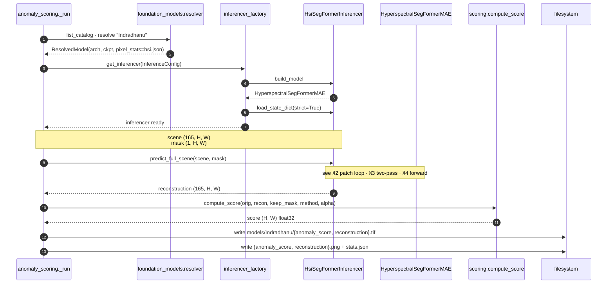
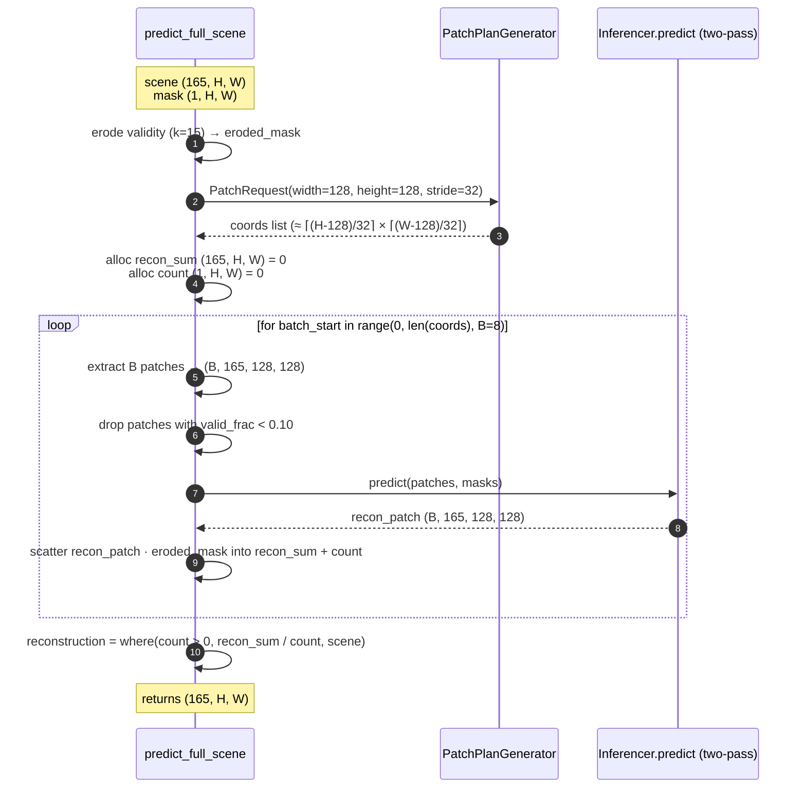
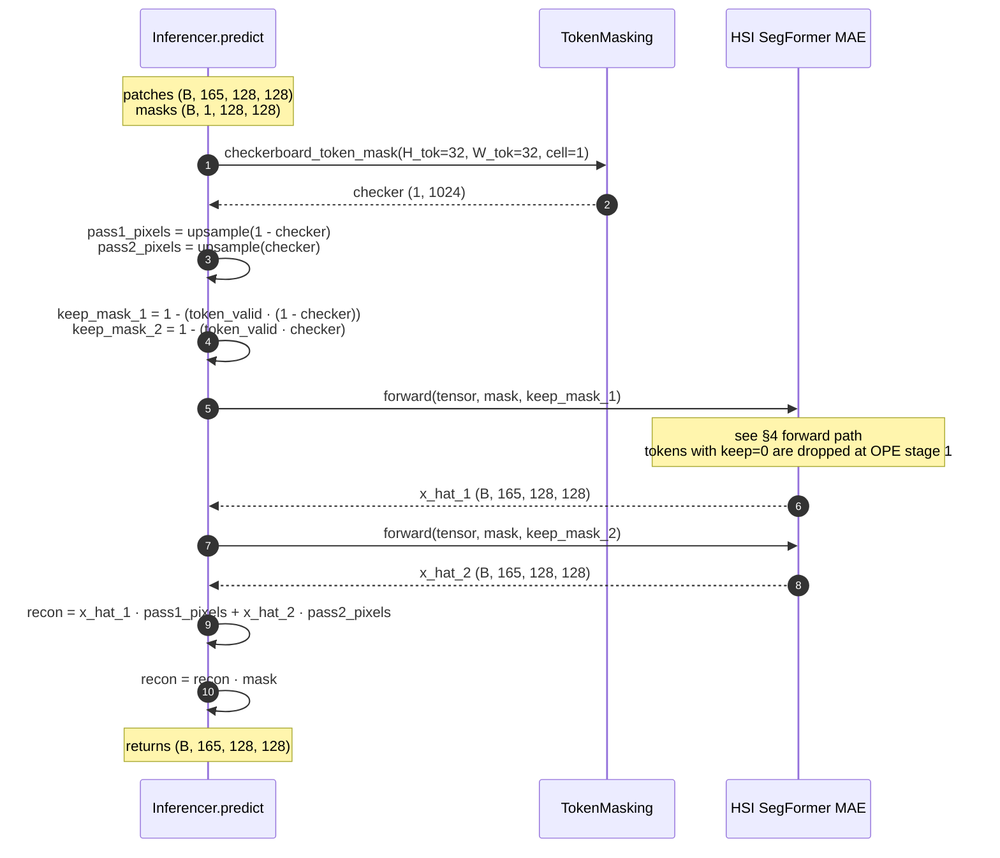
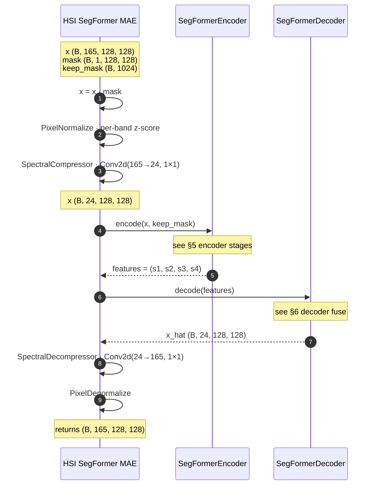
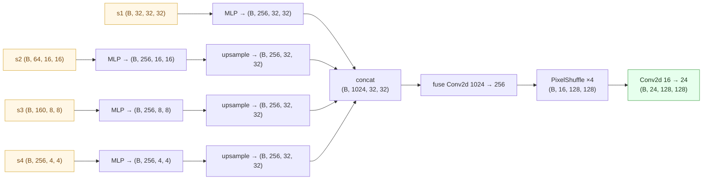

# Indradhanu — `hyperspectral_segformer_mae`

> इन्द्रधनु · *Indradhanu* · **rainbow** — sees the full spectrum.

The hyperspectral SegFormer-MAE: 4-stage transformer encoder + lightweight
PixelShuffle decoder, wrapped in a learned spectral compressor / decompressor
so the encoder runs in a 24-channel bottleneck instead of the full 165-band
PRISMA cube. Two-pass checkerboard masking gives every pixel a context-only
prediction; the residual is the anomaly score.

| | |
|---|---|
| **Architecture** | `hyperspectral_segformer_mae` |
| **Sensor family** | hyperspectral (PRISMA / EnMAP) |
| **Input bands** | 165 (after `band_filter_apply`) |
| **Compressed bottleneck** | 24 |
| **Default patch / stride / batch** | 128 / 32 / 8 |
| **Default scoring** | `combined` (α · L1 + (1-α) · SAM, α=0.5) |
| **Inferencer** | [`hyperspectral_segformer_mae_inferencer.py`](../../../app/foundation_models/inferencers/hyperspectral_segformer_mae_inferencer.py) |
| **Model module** | [`hyperspectral_seg_former_mae.py`](../../../app/foundation_models/components/hyperspectral_seg_former_mae.py) |

---

## 1 · Caller's view — one model in the per-model loop

This is one iteration of the worker's per-model fan-out in
[`_anomaly_scoring_run.run`](../../../backend/allotrope/action_types/_anomaly_scoring_run.py).
The relevant block (line numbers ≈ source):

```python
# backend/allotrope/action_types/_anomaly_scoring_run.py
for codename in cfg["model_codenames"]:
    m = by_codename[codename.lower()]                          # ResolvedModel
    ovr = model_overrides.get(codename, {}) or {}
    method     = ovr.get("scoring_method") or m.default_scoring_method
    patch_size = int(ovr.get("patch_size") or m.default_patch_size)
    stride     = int(ovr.get("stride")     or m.default_stride)
    batch_size = int(ovr.get("batch_size") or m.default_batch_size)

    inference_cfg = InferenceConfig(
        foundation_model_name=m.foundation_model_name,
        model_config=m.model_config,
        checkpoint_path=m.checkpoint_abs_path,
        patch_size=patch_size, stride=stride,
        inference_batch_size=batch_size,
        pixel_stats_path=m.pixel_stats_abs_path,
    )
    inferencer = get_inferencer(inference_cfg)
    with torch.no_grad():
        reconstruction = inferencer.predict_full_scene(scene_tensor, mask_tensor)
    score = compute_score(cube_np, recon_np, keep_mask, method=method, ...)
    # ... write per-model rasters + PNGs + stats ...
```



---

## 2 · `predict_full_scene` — the patch loop

From
[`segformer_mae_inferencer.py`](../../../app/foundation_models/inferencers/segformer_mae_inferencer.py)
(method body, lightly elided):

```python
def predict_full_scene(self, scene, mask):
    # scene: (C, H, W)   mask: (1, H, W)
    c, h, w = scene.shape
    ps      = self.config.patch_size                # 128
    stride  = self.config.stride or ps // 2          # 32
    batch_size = self.config.inference_batch_size    # 8

    eroded_mask = TokenMasking.erode_mask(
        mask.unsqueeze(0), kernel_size=self.config.erosion_kernel_size  # 15
    ).squeeze(0)

    plan = PatchPlanGenerator().generate_patching_plan(
        PatchRequest(input_cube=(c, h, w), width=ps, height=ps, stride=stride)
    )

    recon_sum = torch.zeros(c, h, w, device=self.device)
    count     = torch.zeros(1, h, w, device=self.device)
    MIN_VALID_FRACTION = 0.10

    for batch_start in range(0, len(plan.patch_coordinates), batch_size):
        batch_coords = plan.patch_coordinates[batch_start : batch_start + batch_size]
        all_patches = [scene[:, r:r+ps, c:c+ps] for r, c in batch_coords]
        all_masks   = [mask [:, r:r+ps, c:c+ps] for r, c in batch_coords]

        valid_idx = [i for i, m in enumerate(all_masks)
                     if m.float().mean().item() >= MIN_VALID_FRACTION]
        if not valid_idx:
            continue

        patches      = torch.stack([all_patches[i] for i in valid_idx])    # (B, C, ps, ps)
        patch_masks  = torch.stack([all_masks  [i] for i in valid_idx])    # (B, 1, ps, ps)

        recon = self.predict(patches, patch_masks)                          # → (B, C, ps, ps)

        for j, idx in enumerate(valid_idx):
            r, c = batch_coords[idx]
            patch_eroded = eroded_mask[:, r:r+ps, c:c+ps]
            recon_sum[:, r:r+ps, c:c+ps] += recon[j] * patch_eroded
            count    [:, r:r+ps, c:c+ps] += patch_eroded

    return torch.where(count > 0, recon_sum / count, scene)
```



**Why the 0.10 threshold:** the model never saw mostly-invalid patches
during training; running inference on them produces garbage near scene
edges. Skipping mirrors the training distribution.

**Why fall back to `scene` instead of zeros for uncovered pixels:**
uncovered pixels then get a *zero* residual at score time, which can't
masquerade as anomalies in the score map.

---

## 3 · Two-pass MAE — `Inferencer.predict` → `Inferencer.infer`

Each picked patch is reconstructed twice. Pass 1 masks the "black" tokens
of a token-grid checkerboard; pass 2 masks the "white" tokens. The two
passes' targets are exact complements, so every pixel ends up reconstructed
from context only — never from itself.

The full body of `.infer()` from
[`segformer_mae_inferencer.py:164`](../../../app/foundation_models/inferencers/segformer_mae_inferencer.py):

```python
def infer(self, tensor, mask):
    # tensor: (B, C, H, W)   mask: (B, 1, H, W)
    _, _, H, W = tensor.shape
    H_tokens = H // STAGE1_STRIDE                    # 128 // 4 = 32
    W_tokens = W // STAGE1_STRIDE                    # 32   → N = 1024 tokens

    # Build the deterministic token-grid checkerboard
    checker = TokenMasking.checkerboard_token_mask(
        H_tokens, W_tokens,
        cell_size=self.config.checkerboard_cell_size,   # 1
        device=self.device, invert=False,
    )                                                   # (1, N) — 1=visible

    # Pixel masks marking which pixels each pass is responsible for
    pass1_pixels = self._token_mask_to_pixel_mask(1.0 - checker, H_tokens, W_tokens, H, W)
    pass2_pixels = self._token_mask_to_pixel_mask(checker,        H_tokens, W_tokens, H, W)

    # AND the checkerboard with token validity → the per-pass keep_masks
    keep_mask_1 = self._checkerboard_keep_mask(H, W, mask, invert=False)
    keep_mask_2 = self._checkerboard_keep_mask(H, W, mask, invert=True )

    x_hat_1 = self.model(tensor, mask=mask, keep_mask=keep_mask_1)
    x_hat_2 = self.model(tensor, mask=mask, keep_mask=keep_mask_2)

    # Each pixel from the pass where its token was masked
    reconstruction = x_hat_1 * pass1_pixels + x_hat_2 * pass2_pixels
    return reconstruction * mask
```

And the per-pass `keep_mask` builder (`_checkerboard_keep_mask`):

```python
# Prediction targets: tokens that are both valid AND checkerboard-masked
pred_mask = token_validity * (1.0 - checker)        # (B, N)
keep_mask = 1.0 - pred_mask                          # invert: 1=keep, 0=remove
return keep_mask
```

So the encoder receives `keep_mask = 1` for everything *except* this
pass's prediction targets — the targets are physically removed from
the token sequence before any block runs.



---

## 4 · `forward` — inside `HyperspectralSegFormerMAE`

The full forward from
[`hyperspectral_seg_former_mae.py`](../../../app/foundation_models/components/hyperspectral_seg_former_mae.py),
verbatim (it already carries shape annotations as inline comments):

```python
def forward(self, x, mask=None, keep_mask=None):
    # x: (B, 165, H, W)   mask: (B, 1, H, W)   keep_mask: (B, 1024)
    if mask is not None:
        x = x * mask                            # zero invalid pixels first
    if self.normalize is not None:
        x = self.normalize(x)                   # per-band z-score
    x = self.compressor(x)                      # (B, 24, H, W)  ← Conv2d 1×1
    features = self.encoder(x, keep_mask=keep_mask)
    x_hat = self.decoder(features)              # (B, 24, H, W)
    x_hat = self.decompressor(x_hat)            # (B, 165, H, W) ← Conv2d 1×1
    if self.denormalize is not None:
        x_hat = self.denormalize(x_hat)         # back to physical reflectance
    return x_hat
```



**Why the spectral bottleneck:** the encoder/decoder transformer cost
scales with channel count. Compressing 165 → 24 with a learned 1×1
conv at the front and inverting at the back keeps the heavy lifting
in a 24-channel space; the compressor learns a near-MNF basis end-to-end
(typed as a `SpectralCompressor` for clarity, but it's literally one
1×1 conv).

---

## 5 · Encoder stages

`SegFormerEncoder` is a 4-stage hierarchical transformer. Each stage
is an Overlapping Patch Embedding (OPE) that downsamples spatially
and projects into a higher embed_dim, followed by N transformer
blocks with Efficient Self-Attention (ESA) and a MixFFN.

```mermaid
flowchart TB
    X["x_24<br/>(B, 24, 128, 128)"]:::tensor

    X --> S1OPE["OPE · k=7, s=4, p=3<br/>Conv2d(24 → 32)"]
    S1OPE --> S1["(B, 32, 32, 32)<br/>tokens (B, 1024, 32)"]:::tensor
    S1 --> S1KM{{"apply keep_mask<br/>(B, 1024) — drop targets"}}:::special
    S1KM --> S1B["2× SegFormerBlock<br/>heads=1, R=8, MixFFN×4"]
    S1B --> S1OUT["s1 (B, 32, 32, 32)"]:::tensor

    S1OUT --> S2OPE["OPE · k=3, s=2, p=1<br/>Conv2d(32 → 64)"]
    S2OPE --> S2["(B, 64, 16, 16)<br/>tokens (B, 256, 64)"]:::tensor
    S2 --> S2B["2× SegFormerBlock<br/>heads=2, R=4"]
    S2B --> S2OUT["s2 (B, 64, 16, 16)"]:::tensor

    S2OUT --> S3OPE["OPE · k=3, s=2, p=1<br/>Conv2d(64 → 160)"]
    S3OPE --> S3["(B, 160, 8, 8)<br/>tokens (B, 64, 160)"]:::tensor
    S3 --> S3B["2× SegFormerBlock<br/>heads=5, R=2"]
    S3B --> S3OUT["s3 (B, 160, 8, 8)"]:::tensor

    S3OUT --> S4OPE["OPE · k=3, s=2, p=1<br/>Conv2d(160 → 256)"]
    S4OPE --> S4["(B, 256, 4, 4)<br/>tokens (B, 16, 256)"]:::tensor
    S4 --> S4B["2× SegFormerBlock<br/>heads=8, R=1"]
    S4B --> S4OUT["s4 (B, 256, 4, 4)"]:::tensor

    classDef tensor fill:#fff7e6,stroke:#d6a93b,color:#774913
    classDef special fill:#fbe5ff,stroke:#9673a6,color:#4a2769
```



| Stage | OPE (k, s, p) | Spatial | Tokens (N) | embed_dim | heads | R |
|------:|---------------|---------|-----------:|----------:|------:|--:|
| 1 | (7, 4, 3) | 32 × 32 | 1024 | 32 | 1 | 8 |
| 2 | (3, 2, 1) | 16 × 16 | 256 | 64 | 2 | 4 |
| 3 | (3, 2, 1) | 8 × 8 | 64 | 160 | 5 | 2 |
| 4 | (3, 2, 1) | 4 × 4 | 16 | 256 | 8 | 1 |

**Reduction ratio R** is spatial in the attention. ESA computes
`Q · (K↓R)ᵀ`, dropping cost from `O(N²·D)` to `O(N · N/R² · D)` —
that's why stage 1 (with N=1024) sets R=8 while stage 4 (N=16) sets R=1.

**`keep_mask` only applies at stage 1** — it removes prediction-target
tokens from the very first OPE projection. Removed tokens never pass
through any block in any stage, so the model truly cannot peek at the
targets.

---

## 6 · Decoder fuse

`SegFormerDecoder` is a lightweight all-MLP fusion head plus a
PixelShuffle expansion back to the patch resolution.



**Why fuse at stage-1 resolution (32×32) and PixelShuffle up?**
Bilinear-upsampling a 4×4 stage-4 feature to 128×128 directly would
lose all the fine spatial detail stage 1 already encoded. Fusing at
the *coarsest* stage that still has every position represented
(32×32 = 4× downsampled from input) and then expanding losslessly
via PixelShuffle gives every output pixel a learned mix of every
stage's receptive field.

---

## 7 · Scoring

From [`scoring.py`](../../../app/utils/anomaly_detection/scoring.py):

```python
def compute_score(original, reconstruction, validity, method, *, combined_weight=0.5):
    spatial = validity.astype(bool)
    if method == "L1":
        score = np.mean(np.abs(original - reconstruction), axis=0)
    elif method == "MSE":
        diff  = original - reconstruction
        score = np.mean(diff * diff, axis=0)
    elif method == "SAM":
        score = _sam(original, reconstruction)
    elif method == "combined":
        l1   = np.mean(np.abs(original - reconstruction), axis=0)
        sam  = _sam(original, reconstruction)
        l1n  = _normalise(l1,  spatial)
        samn = _normalise(sam, spatial)
        score = combined_weight * l1n + (1.0 - combined_weight) * samn
    score = score.astype(np.float32)
    score[~spatial] = 0.0
    return score
```

| Method | Formula | Notes |
|---|---|---|
| `L1` | `mean_C(|x - x̂|)` | reflectance units |
| `MSE` | `mean_C((x - x̂)²)` | reflectance² |
| `SAM` | `arccos((x · x̂) / (‖x‖‖x̂‖))` | radians, scale-invariant |
| `combined` | `α · L1_norm + (1-α) · SAM_norm` | **Indradhanu default**, α=0.5 |

`combined` rescales L1 and SAM each to `[0, 1]` over their valid-pixel
range *before* mixing, so the relative weight α is meaningful even
though L1 (reflectance) and SAM (radians) live on different scales.

All scores are zeroed where `keep_mask = 0`.

---

## 8 · Complexity quick-take

For a single patch (B=1) at the defaults:

- **Compressor**: 165·24·128² ≈ 65 M MACs
- **Stage 1**: 32 ch × 1024 tokens × 32 dim, R=8: attention ≈ 3.4 M, FFN ≈ 8.4 M; ×2 blocks
- **Stage 4**: 256 ch × 16 tokens × 256 dim, R=1: attention ≈ 1.0 M, FFN ≈ 2.1 M
- **Decoder fuse**: 1024 → 256 conv at 32×32 ≈ 268 M MACs
- **PixelShuffle**: cost-free (it's a reshape)
- **Decompressor**: 24·165·128² ≈ 65 M MACs

The decoder fuse + spectral (de)compressor dominate — the transformer
is intentionally tiny relative to the convs. Two-pass means everything
above runs twice per patch.

## File map

| Component | Path |
|---|---|
| Architecture | [`hyperspectral_seg_former_mae.py`](../../../app/foundation_models/components/hyperspectral_seg_former_mae.py) |
| Inferencer (HSI subclass) | [`hyperspectral_segformer_mae_inferencer.py`](../../../app/foundation_models/inferencers/hyperspectral_segformer_mae_inferencer.py) |
| Two-pass / patch loop (parent) | [`segformer_mae_inferencer.py`](../../../app/foundation_models/inferencers/segformer_mae_inferencer.py) |
| Encoder | [`seg_former_encoder.py`](../../../app/foundation_models/components/seg_former_encoder.py) |
| Decoder | [`seg_former_decoder.py`](../../../app/foundation_models/components/seg_former_decoder.py) |
| Spectral compressor | [`spectral_compressor.py`](../../../app/foundation_models/components/spectral_compressor.py) |
| Pixel normalize | [`pixel_normalization.py`](../../../app/foundation_models/components/pixel_normalization.py) |
| Token masking | [`token_masking.py`](../../../app/foundation_models/components/token_masking.py) |
| Scoring | [`scoring.py`](../../../app/utils/anomaly_detection/scoring.py) |
| Worker recipe (caller) | [`_anomaly_scoring_run.py`](../../../backend/allotrope/action_types/_anomaly_scoring_run.py) |
