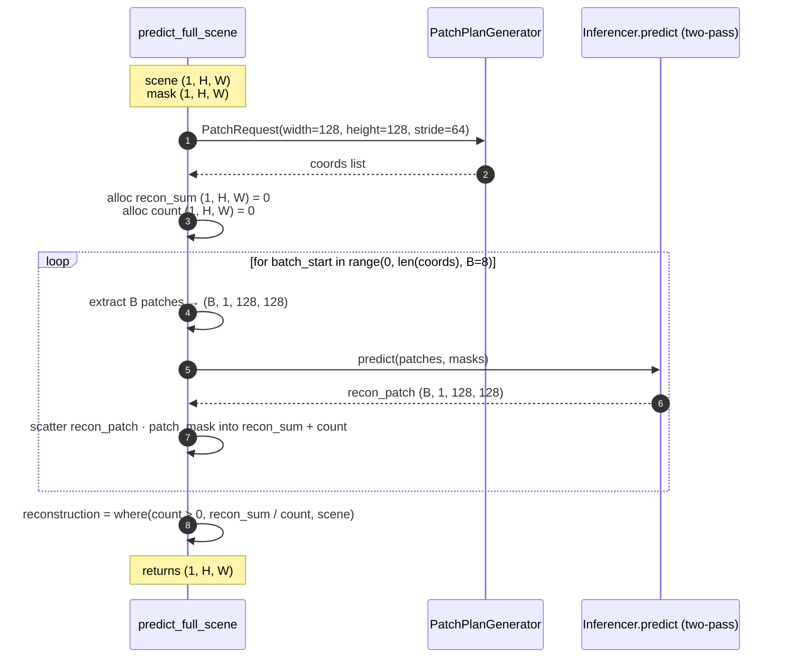
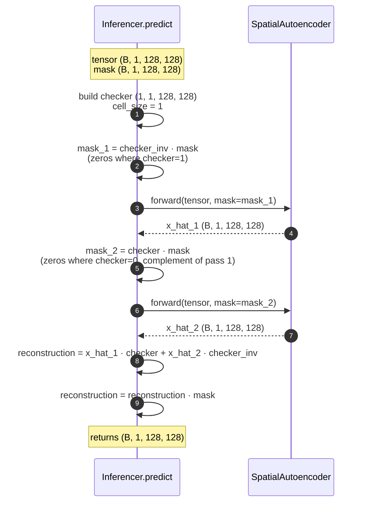
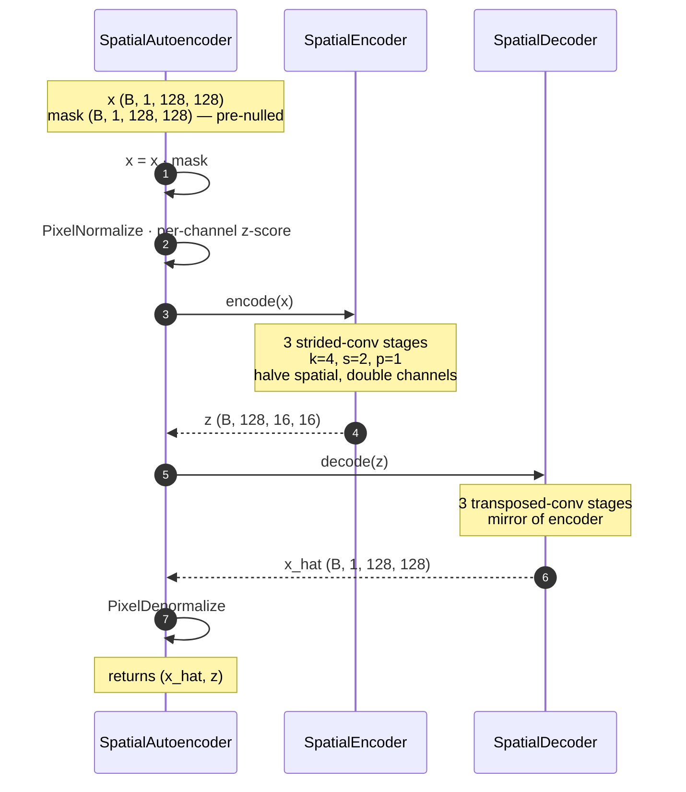

# Pratibimba — `spatial_autoencoder`

> प्रतिबिंब · *Pratibimba* · **reflection** — the simplest mirror.

The plain conv-deconv autoencoder, single thermal channel. No transformer,
no token masking — just a 3-stage strided-conv encoder squeezing
`(1, 128, 128) → (128, 16, 16)` and a transposed-conv decoder expanding it
back. Anomaly comes from a **pixel-level checkerboard**: blank half the
pixels, ask the network to reconstruct them, repeat with the inverted
checkerboard, then for each pixel keep the value from the pass that
blanked it.

| | |
|---|---|
| **Architecture** | `spatial_autoencoder` |
| **Sensor family** | thermal (Landsat 9 B10) |
| **Input bands** | 1 |
| **Default patch / stride / batch** | 128 / 64 / 8 |
| **Default scoring** | `MSE` |
| **Inferencer** | [`spatial_autoencoder_inferencer.py`](../../../app/foundation_models/inferencers/spatial_autoencoder_inferencer.py) |
| **Model module** | [`spatial_auto_encoder.py`](../../../app/foundation_models/components/spatial_auto_encoder.py) |

---

## 1 · Caller's view

Same shape as [Indradhanu §1](indradhanu.md#1--callers-view--one-model-in-the-per-model-loop).
The worker resolves the codename, builds an `InferenceConfig` with the
Pratibimba defaults, gets the inferencer, calls `predict_full_scene`,
scores, and writes per-model artifacts.

---

## 2 · `predict_full_scene` — the patch loop

Pratibimba uses its own `predict_full_scene` (not the SegFormer one).
The shape is similar — sliding window, batched patches, overlap-average
into `recon_sum / count` — but it does **not** erode the validity mask
because the `SpatialAutoencoderInferencer` doesn't have token-grid border
artifacts to defend against. From
[`spatial_autoencoder_inferencer.py`](../../../app/foundation_models/inferencers/spatial_autoencoder_inferencer.py):

```python
def predict_full_scene(self, scene, mask):
    # scene: (1, H, W)   mask: (1, H, W)
    c, h, w = scene.shape
    ps      = self.config.patch_size                 # 128
    stride  = self.config.stride or ps // 2           # 64
    batch_size = self.config.inference_batch_size     # 8

    plan = PatchPlanGenerator().generate_patching_plan(
        PatchRequest(input_cube=(c, h, w), width=ps, height=ps, stride=stride)
    )

    recon_sum = torch.zeros(c, h, w, device=self.device)
    count     = torch.zeros(1, h, w, device=self.device)

    for batch_start in range(0, len(plan.patch_coordinates), batch_size):
        batch_coords = plan.patch_coordinates[batch_start : batch_start + batch_size]
        all_patches  = [scene[:, r:r+ps, c:c+ps] for r, c in batch_coords]
        all_masks    = [mask [:, r:r+ps, c:c+ps] for r, c in batch_coords]

        # No min-valid-fraction filter for Pratibimba — the convnet handles
        # mostly-invalid patches gracefully (no token-grid artifacts).
        patches      = torch.stack(all_patches)
        patch_masks  = torch.stack(all_masks)

        recon = self.predict(patches, patch_masks)            # → (B, 1, ps, ps)

        for j, (r, c) in enumerate(batch_coords):
            patch_mask = patch_masks[j]
            recon_sum[:, r:r+ps, c:c+ps] += recon[j] * patch_mask
            count    [:, r:r+ps, c:c+ps] += patch_mask

    return torch.where(count > 0, recon_sum / count, scene)
```



---

## 3 · Two-pass — `Inferencer.infer` (pixel-level checkerboard)

This is where Pratibimba diverges sharply from the SegFormer family:
the checkerboard is at the **pixel** level, not the token level. Verbatim
from
[`spatial_autoencoder_inferencer.py:81`](../../../app/foundation_models/inferencers/spatial_autoencoder_inferencer.py):

```python
def infer(self, tensor, mask):
    # tensor: (B, 1, H, W)   mask: (B, 1, H, W)
    _, _, h, w = tensor.shape

    checker = self._build_checkerboard(h, w, invert=False)   # (1, 1, H, W)
    checker_inv = 1 - checker

    # Pass 1: null where checker=1 (black squares); reconstruct those cells
    mask_1 = checker_inv * mask
    x_hat_1, _ = self.model(tensor, mask=mask_1)

    # Pass 2: null where checker=0 (white squares); reconstruct those
    mask_2 = checker * mask
    x_hat_2, _ = self.model(tensor, mask=mask_2)

    # Each pixel's reconstruction comes from the pass where it was nulled
    reconstruction = x_hat_1 * checker + x_hat_2 * checker_inv

    # Zero invalid
    return reconstruction * mask
```

The forward sees a partially-zeroed input cube — the network's job is to
in-paint the zeroed pixels from their visible neighbours. With the default
`checkerboard_cell_size=1`, every other pixel is zeroed in pass 1 and the
opposite half in pass 2, so each pixel ends up reconstructed from the
pass that hid it.



**Pixel-level vs token-level:** SegFormer-MAE removes prediction targets
*before* the encoder runs (the encoder literally sees a shorter token
sequence). Pratibimba just zeroes the input pixels and lets the convnet
fill them in. Cheaper, but the network does see the zero-pattern in its
own activation maps, which is why training must include similar masking
for the model to learn anything useful.

---

## 4 · `forward` — `SpatialAutoencoder`

Verbatim from
[`spatial_auto_encoder.py`](../../../app/foundation_models/components/spatial_auto_encoder.py):

```python
def forward(self, x, mask=None):
    # x: (B, 1, H, W)   mask: (B, 1, H, W) — already zeroed by the inferencer
    if mask is not None:
        x = x * mask
    if self.normalize is not None:
        x = self.normalize(x)             # per-channel z-score
    z = self.encoder(x)                    # (B, 128, 16, 16) bottleneck
    x_hat = self.decoder(z)
    if self.denormalize is not None:
        x_hat = self.denormalize(x_hat)
    return x_hat, z
```



---

## 5 · Encoder / decoder structure

`SpatialEncoder(in_channels=1, base_channels=32, num_stages=3)` builds
3 strided-conv blocks, each:
`Conv2d(in, out, kernel_size=4, stride=2, padding=1) → BatchNorm2d → ReLU`.

Channel progression for `base_channels=32, num_stages=3`:

| Stage | In | Out | Spatial |
|------:|---:|----:|---------|
| input | — | 1 | 128 × 128 |
| 0 | 1 | 32 | 64 × 64 |
| 1 | 32 | 64 | 32 × 32 |
| 2 | 64 | 128 | 16 × 16 |

So the bottleneck is `z: (B, 128, 16, 16)` — **131,072 floats per patch**,
8× compression vs the raw 16,384-pixel input. Total info capacity
`C × H × W` is approximately constant across stages by design.

`SpatialDecoder` mirrors the encoder with `ConvTranspose2d(k=4, s=2, p=1)`,
which is the learnable inverse of the strided conv:

| Stage | In | Out | Spatial |
|------:|---:|----:|---------|
| input | — | 128 | 16 × 16 |
| 0 | 128 | 64 | 32 × 32 |
| 1 | 64 | 32 | 64 × 64 |
| 2 (final) | 32 | 1 | 128 × 128 |

```mermaid
flowchart LR
    X["x (B, 1, 128, 128)"]:::tensor

    X --> E0["Conv2d 1→32, k=4, s=2, p=1<br/>BN · ReLU"]
    E0 --> Z0["(B, 32, 64, 64)"]:::tensor
    Z0 --> E1["Conv2d 32→64, k=4, s=2, p=1<br/>BN · ReLU"]
    E1 --> Z1["(B, 64, 32, 32)"]:::tensor
    Z1 --> E2["Conv2d 64→128, k=4, s=2, p=1<br/>BN · ReLU"]
    E2 --> Z["z (B, 128, 16, 16)<br/>bottleneck"]:::bottleneck

    Z --> D0["ConvTranspose2d 128→64, k=4, s=2, p=1<br/>BN · ReLU"]
    D0 --> Y0["(B, 64, 32, 32)"]:::tensor
    Y0 --> D1["ConvTranspose2d 64→32, k=4, s=2, p=1<br/>BN · ReLU"]
    D1 --> Y1["(B, 32, 64, 64)"]:::tensor
    Y1 --> D2["ConvTranspose2d 32→1, k=4, s=2, p=1<br/>(no BN/ReLU on final)"]
    D2 --> Y["x_hat (B, 1, 128, 128)"]:::out

    classDef tensor fill:#fff7e6,stroke:#d6a93b,color:#774913
    classDef bottleneck fill:#fbe5ff,stroke:#9673a6,color:#4a2769
    classDef out fill:#e6ffed,stroke:#48a14d,color:#1f3a1f
```



The "final" decoder block omits BatchNorm + ReLU because we want a real-valued reconstruction in normalized space (the denormalize layer will multiply by σ and add μ to get back to brightness temperature).

---

## 6 · Scoring

`MSE` by default — Pratibimba was trained with MSE loss, so reconstruction
error in MSE is the most calibrated signal. Available methods: `{L1, MSE}`.

```python
# scoring.py · method="MSE":
diff  = original - reconstruction
score = np.mean(diff * diff, axis=0)         # → (H, W) for single-channel
score[~validity] = 0.0
```

---

## 7 · Complexity quick-take

For one patch (B=1, ps=128) — much lighter than the SegFormer family:

- **Encoder stage 0**: 1 × 32 × 4² × 64² = ~2.1 M MACs
- **Encoder stage 1**: 32 × 64 × 4² × 32² = ~33.6 M
- **Encoder stage 2**: 64 × 128 × 4² × 16² = ~33.6 M
- **Decoder stages**: mirror — same totals
- **Total per pass**: ~140 M MACs · two passes per patch · 8 batch
- No attention, no fusion conv, no PixelShuffle — pure conv ladder

By far the cheapest model in the family. Indradhanu's decoder fuse
alone (~268 M MACs per patch) is bigger than Pratibimba end-to-end.

## File map

| Component | Path |
|---|---|
| Architecture | [`spatial_auto_encoder.py`](../../../app/foundation_models/components/spatial_auto_encoder.py) |
| Encoder | [`spatial_encoder.py`](../../../app/foundation_models/components/spatial_encoder.py) |
| Decoder | [`spatial_decoder.py`](../../../app/foundation_models/components/spatial_decoder.py) |
| Inferencer | [`spatial_autoencoder_inferencer.py`](../../../app/foundation_models/inferencers/spatial_autoencoder_inferencer.py) |
| Pixel normalize | [`pixel_normalization.py`](../../../app/foundation_models/components/pixel_normalization.py) |
| Scoring | [`scoring.py`](../../../app/utils/anomaly_detection/scoring.py) |
| Worker recipe | [`_anomaly_scoring_run.py`](../../../backend/allotrope/action_types/_anomaly_scoring_run.py) |
