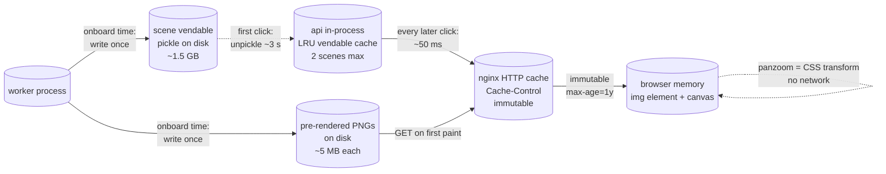
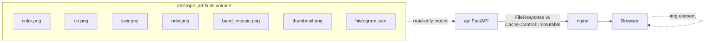
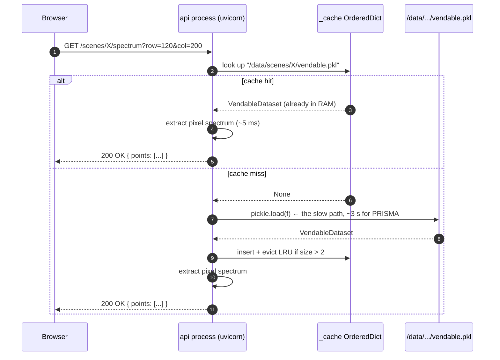
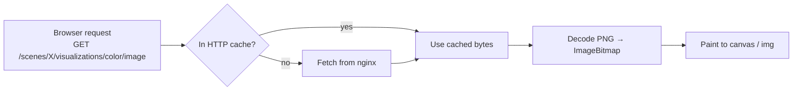
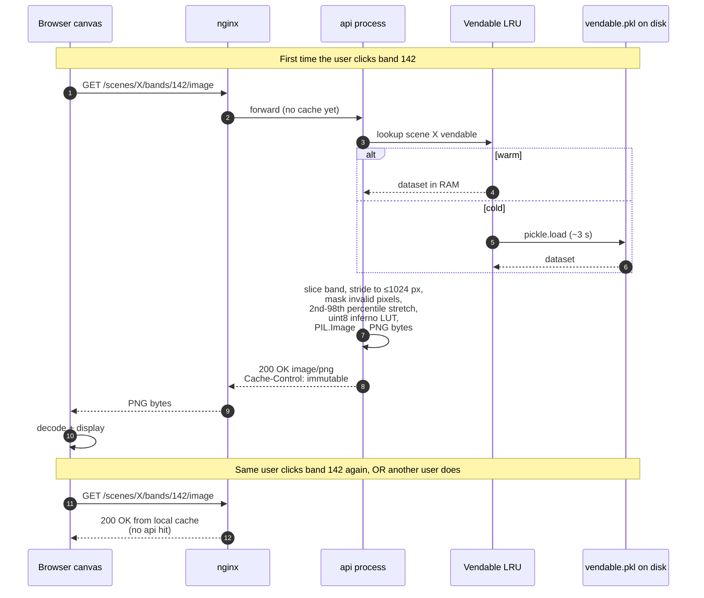
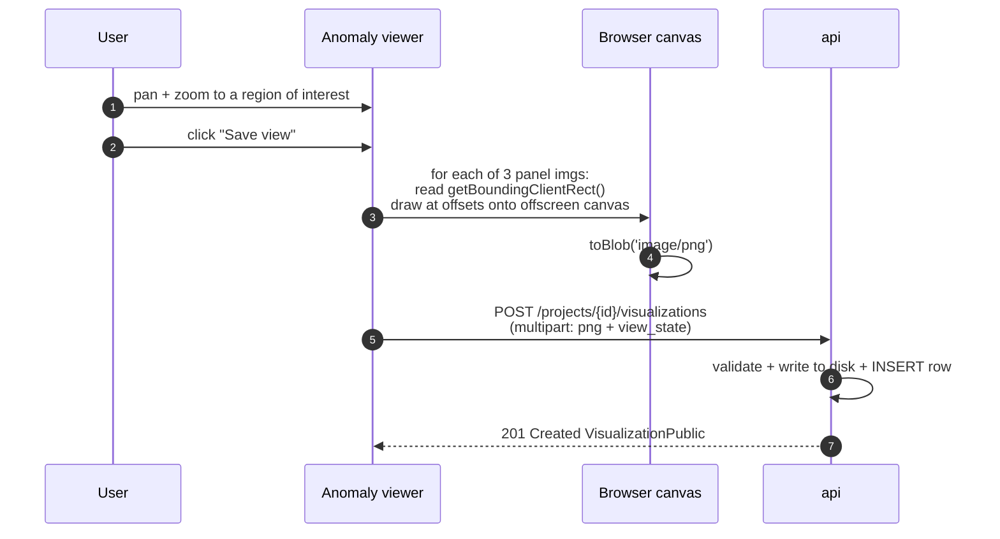
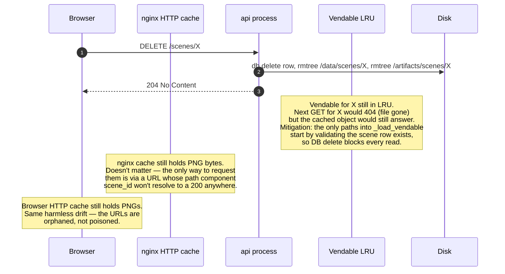

# How the visuals work, end to end

A reader-friendly tour of every image and every cache between the
worker that produces them and the canvas in your browser. Starts from
"what's a hyperspectral cube" and gets concrete about the three caches
that make the UI feel snappy.

---

## 1 · The thing we're rendering

A **hyperspectral scene** is a 3-D array — picture a stack of grayscale
photos, one per wavelength of light, perfectly aligned. PRISMA delivers
~250 bands from 400 nm to 2500 nm at ~30 m resolution. The raw cube is
on the order of:

```
1000 rows × 1000 columns × 250 bands × 4 bytes ≈ 1 GB per scene
```

You cannot ship a gigabyte to the browser for every click. So the
question is **what to compute server-side, what to ship, and what to
cache where**.

The good news: a human looking at a scene doesn't *want* the whole
cube. They want a few specific views (true-colour, NIR composite,
NDVI), one or two bands at a time, and the spectrum at a single pixel.
Each of those is small. The architecture is built around delivering
exactly those, then caching them aggressively.

---

## 2 · The three caches at a glance



Three caches, three lifetimes:

| Cache | Where it lives | Lifetime | What it holds |
|---|---|---|---|
| Pre-rendered PNGs | `allotrope_artifacts` volume | Until the Scene is deleted | One PNG per "kind" (color/nir/swir/ndvi/band_mosaic) + thumbnail |
| Vendable LRU | inside the api Python process | Until the api restarts, capped at 2 entries | Unpickled `VendableDataset` objects (~1.5 GB each for PRISMA) |
| Browser HTTP cache | Each user's browser | Forever, immutable headers | Every PNG byte ever fetched, keyed by URL |

The trick is matching cost to lifetime: the expensive thing
(unpickling) lives the longest in-process; the medium thing
(rendering) lives forever on disk; the cheap thing (transferring
bytes) is cached at every hop.

---

## 3 · Onboarding — write everything once

When you ingest a Scene the worker runs once, eagerly producing every
artifact a future viewer might want. Think of it as the **bakery** —
do the slow oven work overnight; what's left for the day is reaching
into the case.

```mermaid
sequenceDiagram
  autonumber
  participant U as Browser (IngestPanel)
  participant A as api
  participant Q as postgres jobs
  participant W as worker (scene_onboard)
  participant D as /data/scenes/&lt;id&gt;
  participant T as /artifacts/scenes/&lt;id&gt;

  U->>A: POST /scenes/onboard (multipart)
  A->>D: stage upload → /data/staging/&lt;job&gt;/
  A->>Q: INSERT Job(scene_onboard, queued)
  A-->>U: 202 { job_id, staged_count, staged_bytes }
  Q->>W: claim via SKIP LOCKED
  W->>W: parse HE5/TIFF/EnMAP folder
  W->>W: build VendableDataset (in-memory numpy)
  W->>D: pickle.dump(vendable) → /data/scenes/&lt;id&gt;/vendable.pkl
  W->>T: render color.png, nir.png, swir.png, ndvi.png, band_mosaic.png
  W->>T: write thumbnail.png, histogram.json
  W->>Q: INSERT Scene; UPDATE Job complete
  W-->>U: (polled) status=complete
```

By the time the job is `complete`, every static viewer asset already
exists on disk. The Scene Detail page can render in two round trips:
one for the JSON metadata, one for the thumbnail.

**Why pre-rendering?** Matplotlib + reading a 250-band cube to compose
an RGB takes 1–3 seconds. The browser asking for it on every page
load would feel awful. We pay that cost once, write the PNG, and serve
it forever.

---

## 4 · The first cache: pre-rendered PNGs

Imagine a museum that prints postcards of its biggest paintings at the
gift shop. Anyone can grab one without the curator having to unlock
the vault.



The `Cache-Control: public, max-age=31536000, immutable` header is the
load-bearing piece: a year + the `immutable` directive tells browsers
they're allowed to skip the conditional GET entirely. The same image
URL will never serve different bytes — the worker would write to a
new URL if it re-rendered.

What this means in practice: the first paint of Scene Detail makes
~6 HTTP requests; every paint after that is **zero** network traffic
for those images, even across tabs.

---

## 5 · The second cache: the vendable LRU

The PNGs above cover the *common* views. For everything dynamic — a
single band rendered on demand, a spectrum at one pixel — the api needs
the actual numpy array. The cost of reading it is:

```
unpickle PRISMA vendable  ≈  3 seconds
unpickle Landsat 9 vendable ≈  0.3 seconds
```

Three seconds is a forever-eternity for a UI click. So the api keeps a
tiny **LRU cache** of unpickled vendables in the Python process —
`OrderedDict[str → VendableDataset]` with a hard cap of 2 entries. Code
lives in [backend/allotrope/api/visualizations.py](backend/allotrope/api/visualizations.py).



**Why 2 entries?** Each PRISMA vendable is ~1.5 GB resident. Two scenes
≈ 3 GB of api RAM. That's the budget we picked because:

- One scene = the one you're looking at.
- A second scene = the one you switched away from a second ago, so
  switching back is free.
- A third would push us over 4.5 GB of resident memory in the api
  process, which gets uncomfortable inside Docker Desktop's 16 GB VM
  when worker + postgres + frontend are also running.

The thread lock around the dict is fine-grained: lookup and insert are
under it, **but the slow `pickle.load` is not**. Two clients asking
for different scenes don't serialize on a 3-second I/O.

Code highlights:

```python
# backend/allotrope/api/visualizations.py
_VENDABLE_CACHE_SIZE = 2
_cache_lock = threading.Lock()
_cache: "OrderedDict[str, Any]" = OrderedDict()

def _load_vendable(vendable_abs: Path) -> Any:
    key = str(vendable_abs)
    with _cache_lock:
        hit = _cache.get(key)
        if hit is not None:
            _cache.move_to_end(key)   # mark as most-recently-used
            return hit
    # Heavy work outside the lock — concurrent requests for DIFFERENT
    # scenes don't serialise.
    with vendable_abs.open("rb") as f:
        obj = pickle.load(f)
    with _cache_lock:
        _cache[key] = obj
        _cache.move_to_end(key)
        while len(_cache) > _VENDABLE_CACHE_SIZE:
            _cache.popitem(last=False)   # evict the least-recently-used
    return obj
```

Analogy: a **librarian's cart**. The two books most recently asked for
sit on the cart by the desk; everything else stays on the shelf. When
a third book is requested, the oldest one on the cart goes back to the
shelf to make room.

---

## 6 · The third cache: your browser

Once a PNG has left nginx with the `immutable` header, the browser
treats that URL as a frozen artifact. The same image cannot mean two
different things, ever — the rule the architecture enforces is *if the
bytes change, the URL changes*. Scene PNGs are written once per
onboarding; band PNGs are deterministic given `(scene_id, band_index)`.



The interesting consequence: **panning and zooming are pure CSS**. The
panzoom library sets `transform: matrix(a, b, c, d, tx, ty)` on the
`` element. The browser's compositor handles the redraw on the
GPU. **No image data flows over the network during interaction.** Once
you've loaded a band's PNG you can scrub it for an hour at 60 fps
with zero load on the api.

---

## 7 · The on-demand path — single band rendering

Tying it all together with the band browser:



The two parts to notice:
- **First-time-on-this-tab** but warm-vendable: ~80 ms (no network, no
  unpickle, just slice + render + PNG-encode).
- **First-time-after-api-restart** and cold vendable: ~3 s for PRISMA.

We chose this trade because the typical user clicks 5–20 different
bands while exploring a scene. The first click pays for the unpickle;
the next 19 are sub-100 ms each.

---

## 8 · The action-output path — different shape, same cache philosophy

Action outputs (anomaly_scoring's score raster, band_filter_apply's
filtered cube, etc.) are also rendered once at the worker and written
as PNG + GeoTIFF pairs into:

```
/artifacts/projects/<pid>/actions/<aid>/output/
├── rgb.png
├── models/
│   ├── chakshu/
│   │   ├── reconstruction.png
│   │   ├── reconstruction.tif
│   │   ├── anomaly_score.png
│   │   └── anomaly_score.tif
│   └── indradhanu/
│       └── ...
├── stats.json
├── diagnostics.json
└── thumbnail.png
```

The browser fetches PNGs directly via `/api/actions/{action_id}/files/{filename}`,
which streams the file with the same immutable cache header. The
anomaly viewer's linked panzoom never hits the api after first load —
all three panels manipulate the same already-cached PNGs in the
browser.

---

## 9 · Visualization save — the screenshot path

When a user clicks "Save view" in the anomaly viewer, we *don't* ask
the server to re-render. We use the canvas API client-side to
**screenshot the currently-displayed pixels** of all three panzoom
panels and upload that flat PNG. Code in
[components/ActionDetailPane.tsx · composeTriPanelBlob](../frontend/src/components/ActionDetailPane.tsx).



The saved frame is a faithful snapshot of what the user was looking at
— the same vertical-line marker pattern as the original, but **frozen
pixels**. Re-opening it later loads from `/visualizations/{id}/image`
with the same immutable cache header.

---

## 10 · Closing the loop — what happens during delete

The caching machinery has one operational hazard: **stale cache after
the source disappears**. Three places have to coordinate:



The invariant we maintain: a 200 response is always **bytes the worker
authored**. Stale entries in the cache may persist for a while but
they're unreachable because the DB row is the entry point to every
URL.

---

## 11 · Putting it all together — a click-by-click trace

You open Scene Detail for the first time after the api just restarted:

| Step | What you see | Behind the scenes |
|---|---|---|
| 1 | Metadata loads instantly | `GET /scenes/{id}` — single Postgres row |
| 2 | Thumbnail appears | nginx-cached PNG, ~5 ms |
| 3 | Color composite loads | Disk PNG via nginx, ~30 ms |
| 4 | You click band 142 in the carousel | api: cold vendable, `pickle.load` 3 s + render + PNG encode → ~3.1 s total |
| 5 | You click band 143 | api: warm vendable cache hit + render → ~80 ms |
| 6 | You click pixel (120, 200) for spectrum | api: warm vendable hit, slice one pixel → ~30 ms |
| 7 | You scroll the band carousel | All thumbnails already in browser HTTP cache → 0 ms |
| 8 | You drag-zoom on the panzoom view | Pure CSS transform on the `` → no network |

The first slow click pays for everything after. The architecture is
designed around making sure that first click is the only slow one.

---

## 12 · Memory budget cheat sheet

| Process | Steady state | Peak (during inference) |
|---|---|---|
| api | 400–600 MB baseline + ~1.5 GB per cached vendable | up to 4 GB with 2 PRISMA vendables loaded |
| worker | 400 MB at idle (post `malloc_trim`) | 5–8 GB during anomaly_scoring with model + cube loaded |
| postgres | ~30 MB | rarely above 100 MB |
| frontend nginx | <10 MB | <10 MB |
| Your browser tab | 30–50 MB | 50–80 MB with band browser open |

The post-job `gc.collect() + libc.malloc_trim(0)` shipped in
`backend/allotrope_worker/cleanup.py` is what keeps the worker number
from creeping up to 8 GB and staying there.

---

## 13 · Where things live

| What | Where | When written | When read |
|---|---|---|---|
| Raw scene files | `/data/scenes/<id>/raw/` | scene_onboard | scene_onboard re-runs only |
| Vendable pickle | `/data/scenes/<id>/vendable.pkl` | scene_onboard | api spectrum + bands endpoints |
| Scene PNGs | `/artifacts/scenes/<id>/visualizations/*.png` | scene_onboard | api FileResponse |
| Scene thumbnail | `/artifacts/scenes/<id>/thumbnail.png` | scene_onboard | api thumbnail endpoint |
| Action outputs | `/artifacts/projects/<pid>/actions/<aid>/output/` | action_run | api action-file endpoint |
| Visualization saves | `/artifacts/projects/<pid>/visualizations/<vid>/image.png` | api on POST | api viz-image endpoint |
| Export bundles | `/artifacts/projects/<pid>/exports/<eid>/<name>.zip` | project_export worker | api export-download endpoint |

The path is the contract: anything under `/artifacts/scenes/` is
scene-scoped and survives until the scene is deleted; anything under
`/artifacts/projects/` is project-scoped and dies with the project's
`rmtree`. The api never invents paths; it composes them from DB
columns and a small set of root directories from `settings`.
