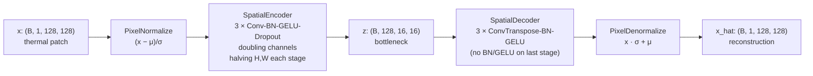
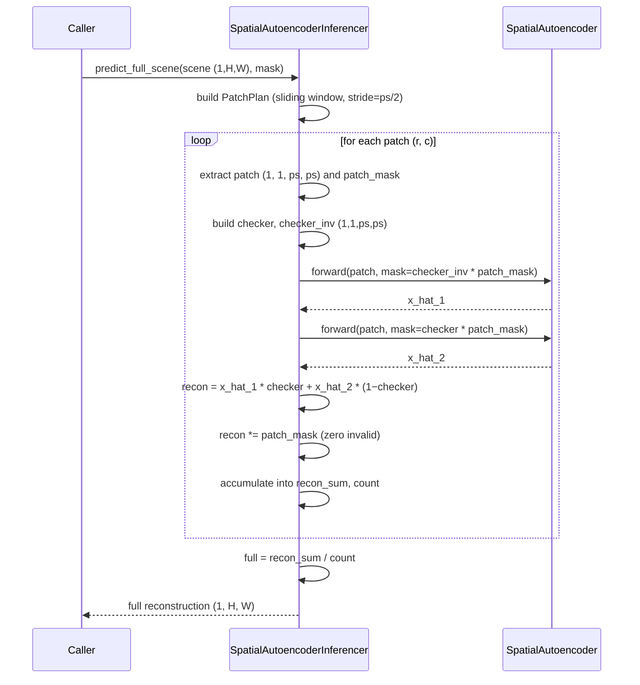

# 01 · Spatial Autoencoder (thermal)

**Sensor:** Landsat 9 B10 thermal (single-band brightness temperature in °C)
**Input shape:** `(B, 1, H, W)` — typically `(B, 1, 128, 128)` patches
**Output shape:** `(B, 1, H, W)` — same shape, reconstructed pixel values

## What it solves and why

A spatial autoencoder asks: "if I squeeze a thermal patch through a tiny information bottleneck and then expand it back, what comes out?" A normal-looking forest reconstructs cleanly. A wildfire — never seen at training time — does not.

This is the simplest reconstruction-based anomaly detector in the repo. No transformers, no attention, just convolutions arranged in an encoder-decoder.

## Architecture



The number of stages and base channels are configurable. With `base_channels=32, num_stages=3`:

| Tensor | Shape | What it represents |
|---|---|---|
| Input `x` | `(B, 1, 128, 128)` | Thermal °C |
| After normalise | `(B, 1, 128, 128)` | z-score units |
| After encoder stage 0 | `(B, 32, 64, 64)` | Local edge / gradient features |
| After encoder stage 1 | `(B, 64, 32, 32)` | Coarser thermal blobs |
| After encoder stage 2 (= `z`) | `(B, 128, 16, 16)` | Compressed scene gist |
| After decoder stage 0 | `(B, 64, 32, 32)` | Re-expanded mid-scale features |
| After decoder stage 1 | `(B, 32, 64, 64)` | Filling in fine detail |
| After decoder stage 2 | `(B, 1, 128, 128)` | Raw temperature in normalised space |
| After denormalise | `(B, 1, 128, 128)` | Reconstructed °C |

### Why exactly half / exactly double?

Each encoder block uses `Conv2d(kernel=4, stride=2, padding=1)`. Plug into the stride formula `H_out = (H + 2P − K)/S + 1`:

```
H_out = (H + 2·1 − 4)/2 + 1 = H/2
```

Each decoder block uses `ConvTranspose2d(kernel=4, stride=2, padding=1)`, which exactly inverts that — `H_out = 2·H_in`. Picking `(K=4, S=2, P=1)` is the cleanest choice that doesn't require `output_padding`. Other combos like `(K=3, S=2, P=1)` would.

### Why no BatchNorm or GELU on the final decoder block?

BatchNorm normalises per channel to zero-mean unit-variance across the batch. The final decoder layer is supposed to output **real temperatures** — say 290 K. If you BN it, the mean snaps to 0, and you can never produce 290. GELU would also clip negative reconstructions in normalised space. The last layer must be unconstrained.

### Why a `Dropout2d(0.3)`?

Drops entire channel maps at random — it isn't dropping pixels, it's dropping **whole feature channels**. This is a strong regulariser for conv stacks: the network can't lean on any one channel to carry the signal.

## Methods and classes used

| Symbol | File | Job |
|---|---|---|
| `SpatialAutoencoder` | [app/foundation_models/components/spatial_auto_encoder.py](../app/foundation_models/components/spatial_auto_encoder.py) | Wires the four pieces together: normalise → encoder → decoder → denormalise. |
| `SpatialEncoder` | [components/spatial_encoder.py](../app/foundation_models/components/spatial_encoder.py) | `nn.Sequential` stack of `SpatialEncoderBlock`. |
| `SpatialEncoderBlock` | same file | `Conv2d(K=4,S=2,P=1) → BatchNorm2d → GELU → Dropout2d(0.3)`. Halves H/W, doubles C. |
| `SpatialDecoder` | [components/spatial_decoder.py](../app/foundation_models/components/spatial_decoder.py) | Mirror stack of `SpatialDecoderBlock` ending with `final=True` (no BN/GELU). |
| `SpatialDecoderBlock` | same file | `ConvTranspose2d(K=4,S=2,P=1)` (+ optional BN+GELU+Dropout). Doubles H/W. |
| `PixelNormalize` / `PixelDenormalize` | [components/pixel_normalization.py](../app/foundation_models/components/pixel_normalization.py) | Per-band z-score and its inverse. Stats stored as `register_buffer` so they save with the checkpoint but don't get gradients. |
| `SpatialAutoencoderTrainer` | [trainers/spatial_autoencoder_trainer.py](../app/foundation_models/trainers/spatial_autoencoder_trainer.py) | Concrete trainer. |
| `SpatialAutoencoderInferencer` | [inferencers/spatial_autoencoder_inferencer.py](../app/foundation_models/inferencers/spatial_autoencoder_inferencer.py) | Concrete inferencer with checkerboard masking + sliding window. |

## Training

```mermaid
sequenceDiagram
    participant Loop as FoundationTrainer.train()
    participant Loader as WebDataset (S3 shards)
    participant T as SpatialAutoencoderTrainer
    participant M as SpatialAutoencoder
    participant Opt as Adam optimizer

    Loop->>Loader: pull next batch
    Loader-->>T: pixels.npy (B,1,H,W)<br/>+ pure_validity_mask, predicted_cloud_mask
    T->>T: _build_mask = pure_validity * predicted_cloud_mask
    T->>T: _filter_batch (drop patches with <40% valid)
    T->>M: forward(pixels, mask)
    M->>M: x = x * mask  (zero invalid)
    M->>M: normalize → encoder → decoder → denormalize
    M-->>T: x_hat, z
    T->>T: loss = sum((x_hat-x)² · mask) / sum(mask)
    T->>Opt: loss.backward(); step(); zero_grad()
    Loop->>Loop: scheduler.step(); checkpoint
```

### Loss function

```
L = Σ (x_hat − x)² · mask
    ─────────────────────
        Σ mask
```

That's a **masked MSE**: only valid pixels (mask = 1) contribute. The denominator is the count of valid pixels so the loss is comparable across batches with different validity fractions.

### What the trainer does step-by-step

1. **Compose the validity mask** — `pure_validity_mask × predicted_cloud_mask`. Pure validity = "the satellite saw something here" (i.e. not nodata). Predicted cloud mask = the B10 adaptive cloud masker's verdict (1 = clear, 0 = cloud). Multiplying them = "valid AND clear".
2. **Filter the batch** — drop entire patches whose mask is less than 40 % ones. Almost-empty patches are mostly cloud or nodata; training on them would teach the network to reconstruct zeros.
3. **Zero invalid pixels** — `x = x * mask` *before* normalisation, so BatchNorm doesn't see fake values.
4. **Forward → MSE**.
5. **Adam (lr from config), CosineAnnealingLR scheduler over `T_max` epochs with `eta_min=1e-6`** — these come from `FoundationTrainer.__init__`.

### Configuration knobs (`SpatialAutoencoderConfig`)

| Field | Typical | Effect |
|---|---|---|
| `in_channels` | 1 | Set to the input band count. |
| `base_channels` | 32 or 64 | First-stage channel count. Doubles per stage. Bigger = more capacity. |
| `num_stages` | 3 or 4 | Each stage halves H/W. `H/W` must be divisible by `2^num_stages`. |
| `kernel_size` | 4 | Even kernel keeps the spatial-arithmetic clean. |
| `pixel_stats_path` | `…/stats.json` | Path to a JSON containing `{"mean": [...], "std": [...]}`. If `None`, `PixelNormalize` is skipped entirely. |

## Inference

The training loss is computed against the **same** pixels the network saw, so it can in principle "cheat" by copying the input through. To force the model to genuinely *reconstruct from context*, inference uses a **two-pass checkerboard mask**.



### Checkerboard masking

A checkerboard with cell size `c` partitions the patch into alternating "black" and "white" cells. Pass 1 hides the black cells, lets the model see the white cells, and reads off the predictions at the black positions. Pass 2 swaps. Combined, every pixel was reconstructed from neighbours — never from itself.

```
Cell size 1, 4x4 patch:
  white black white black                pass1 mask    pass2 mask
  black white black white                  1 0 1 0       0 1 0 1
  white black white black     ──►          0 1 0 1       1 0 1 0
  black white black white                  1 0 1 0       0 1 0 1
                                           0 1 0 1       1 0 1 0
```

### Sliding-window full-scene reconstruction

Patches overlap (`stride = patch_size // 2` by default). The reconstructions are summed into `recon_sum` and the contribution counts into `count`; the final per-pixel value is `recon_sum / count`. Pixels with `count == 0` keep their original value.

### Anomaly score

```
A(i, j) = (x(i, j) − x_hat(i, j))²
```

Squared error per pixel. Higher = more anomalous. A normal forest pixel reconstructs to ~itself → low score. A wildfire pixel cannot be inferred from its non-fire neighbourhood → high reconstruction error → flagged.

## Analogies and gotchas

- **The encoder is a sieve.** It throws information away on purpose. A 128×128×1 patch has 16 384 numbers; the bottleneck `(128, 16, 16)` has 32 768. So the bottleneck is *bigger* than the input. The "compression" here is conceptual (semantic / spatial), not literal information-theoretic. Real bottlenecking is the receptive-field expansion + dropout, not raw element count.
- **Batch normalisation versus checkerboard.** At inference we evaluate `eval()` mode so BN uses its tracked running stats, not the per-batch ones. If you accidentally leave the model in training mode you'll get correlated batches making the BN stats jitter — reconstructions will look weird.
- **Padding by zeros vs by validity.** When the patch sliding window hits the scene edge, the patch can extend beyond the image. The pre-existing data pipeline pads with zero and marks those pixels invalid. The trainer then drops the patch via the 40 %-valid filter; the inferencer skips it via a 10 %-valid filter. Without these filters the model would "learn" to reconstruct giant black squares.
- **Why MSE not L1?** MSE is the loss this variant uses. The L1 variant lives in `02_spatial_masked_autoencoder.md`. Squared error penalises large outliers harder; for thermal where outliers are exactly what we want to *catch at inference*, this aligns nicely — at training time it pushes the network to nail the bulk distribution.
- **The `z` returned from `forward()` is unused at inference.** It's there for diagnostics (visualise the bottleneck) and for downstream projects that might want a representation. Most codepaths discard it.

## Checkpoints in this repo

See [docs/model_designs/checkpoint_inventory.md](../docs/model_designs/checkpoint_inventory.md) for the full list. The relevant ones for this model:

| Checkpoint | Stages | Params |
|---|---|---:|
| `spatial_autoencoder_v6.1.0_epoch58.pt` | 1 → 32 → 64 → 128 | 330 K |
| `spatial_autoencoder_v8.1.0_epoch29.pt` | 1 → 32 → 64 → 128 → 256 | 1.38 M |
| `spatial_autoencoder_v9.1.0_epoch7.pt` | 1 → 64 → 128 → 256 | 1.32 M |

Plus the seven legacy variants under `checkpoints/spatial_ae/`.
